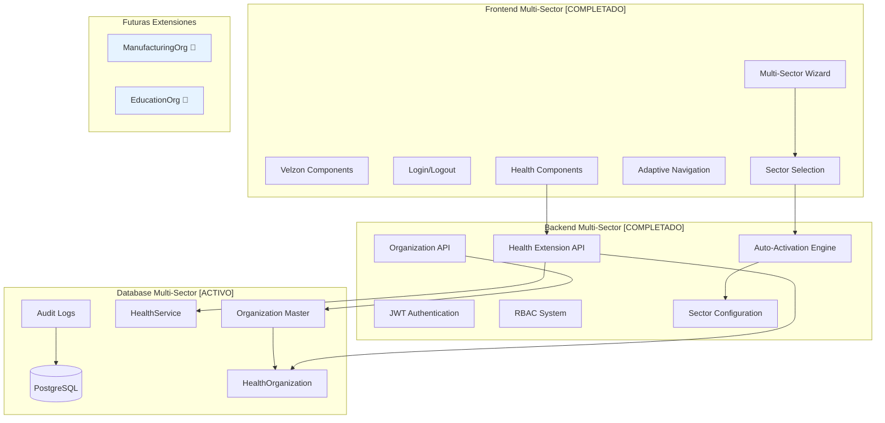

# 🏛️ Arquitectura del Sistema - ZentraQMS

## 🎯 Quick Reference for Agents

### For `qms-software-architect` Agent:
- **🏗️ Multi-Sector Architecture**: [`multi-sector-module-architecture.claude.md`](./multi-sector-module-architecture.claude.md) - Complete system architecture with auto-activation
- **🔧 Sector Extensions**: [`sector-extensions-reference.claude.md`](./sector-extensions-reference.claude.md) - Implementation patterns for all sectors
- **📋 Organization Module**: [`../organization/README.claude.md`](../organization/README.claude.md) - Master table patterns

### For `qms-health-developer` Agent:
- **🏥 Health Implementation**: [`sector-extensions-reference.claude.md`](./sector-extensions-reference.claude.md) - HealthOrganization, HealthService models
- **⚙️ Module System**: [`multi-sector-module-architecture.claude.md`](./multi-sector-module-architecture.claude.md) - Auto-activation and compatibility

**⚠️ CRITICAL**: Always consult the multi-sector documentation before designing new modules or extensions.

## 📋 Índice
1. [Estado Actual del Sistema](#estado-actual-del-sistema)
2. [Arquitectura Implementada](#arquitectura-implementada)
3. [Decisiones Arquitectónicas](#decisiones-arquitectónicas)
4. [Módulos Completados](#módulos-completados)
5. [Módulos en Desarrollo](#módulos-en-desarrollo)
6. [Stack Tecnológico](#stack-tecnológico)
7. [Flujos de Datos](#flujos-de-datos)
8. [Seguridad](#seguridad)
9. [Roadmap de Desarrollo](#roadmap-de-desarrollo)

## 🎯 Estado Actual del Sistema

### Resumen Ejecutivo
ZentraQMS es un **Sistema de Gestión de Calidad (QMS) Multi-Sector** diseñado inicialmente para instituciones de salud colombianas, ahora con arquitectura escalable para cualquier industria. Sistema en producción con **arquitectura modular inteligente** y auto-configuración por sector.

### 🏗️ Arquitectura Multi-Sector Implementada
```
┌─────────────────────────────────────────────────────────────┐
│                   ARQUITECTURA MULTI-SECTOR                 │
│                                                             │
│  Organization (Master Table)    ┌─► HealthOrganization      │
│  ├── sector_economico ──────────┤   (Healthcare Extension)  │
│  ├── tipo_organizacion         └─► ManufacturingOrg (Future)│
│  ├── enabled_modules ──────────────► Auto-Activation Engine │
│  └── sector_config ────────────────► Intelligent Config    │
└─────────────────────────────────────────────────────────────┘
```

### Métricas de Implementación
```
╔═══════════════════════════╦════════════╦═══════════╦═════════════╗
║ Módulo                    ║ Completado ║ Funcional ║ En Producción║
╠═══════════════════════════╬════════════╬═══════════╬═════════════╣
║ MÓDULOS CORE              ║            ║           ║             ║
║ Autenticación             ║ 100%       ║ ✅        ║ ✅          ║
║ Multi-Sector Core         ║ 100%       ║ ✅        ║ ✅          ║
║ Organizaciones            ║ 100%       ║ ✅        ║ ✅          ║
║ Health Extension          ║ 95%        ║ ✅        ║ ✅          ║
║ Module Auto-Activation    ║ 100%       ║ ✅        ║ ✅          ║
╠═══════════════════════════╬════════════╬═══════════╬═════════════╣
║ OPERACIONES DIARIAS       ║            ║           ║             ║
║ Dashboard                 ║ 100%       ║ ✅        ║ ✅          ║
║ No Conformidades          ║ 25%        ║ ⚠️        ║ ❌          ║
║ Auditorías               ║ 10%        ║ ❌        ║ ❌          ║
║ Planes de Mejora          ║ 15%        ║ ⚠️        ║ ❌          ║
║ CAPAs                     ║ 5%         ║ ❌        ║ ❌          ║
╠═══════════════════════════╬════════════╬═══════════╬═════════════╣
║ GESTIÓN DE CALIDAD        ║            ║           ║             ║
║ Procesos                  ║ 15%        ║ ⚠️        ║ ❌          ║
║ Mapa de Procesos          ║ 10%        ║ ❌        ║ ❌          ║
║ Caracterizaciones         ║ 8%         ║ ❌        ║ ❌          ║
║ Plan de Seguimiento       ║ 12%        ║ ❌        ║ ❌          ║
║ Análisis DOFA             ║ 20%        ║ ⚠️        ║ ❌          ║
║ Riesgos y Oportunidades   ║ 18%        ║ ⚠️        ║ ❌          ║
║ Indicadores y Metas       ║ 25%        ║ ⚠️        ║ ❌          ║
║ Normograma                ║ 5%         ║ ❌        ║ ❌          ║
║ Actas                     ║ 15%        ║ ⚠️        ║ ❌          ║
║ Gestión Documental        ║ 20%        ║ ⚠️        ║ ❌          ║
║ Comités                   ║ 30%        ║ ⚠️        ║ ❌          ║
╠═══════════════════════════╬════════════╬═══════════╬═════════════╣
║ PLANEACIÓN ESTRATÉGICA    ║            ║           ║             ║
║ Plan Operativo Anual      ║ 5%         ║ ❌        ║ ❌          ║
║ Configuración General     ║ 40%        ║ ⚠️        ║ ❌          ║
║ Objetivos Estratégicos    ║ 35%        ║ ⚠️        ║ ❌          ║
╠═══════════════════════════╬════════════╬═══════════╬═════════════╣
║ MÓDULOS ESPECIALIZADOS    ║            ║           ║             ║
║ Salud - SUH               ║ 60%        ║ ⚠️        ║ ❌          ║
║ PAMEC                     ║ 45%        ║ ⚠️        ║ ❌          ║
║ Acreditación              ║ 30%        ║ ⚠️        ║ ❌          ║
║ Gestión Riesgo Clínico    ║ 25%        ║ ⚠️        ║ ❌          ║
╚═══════════════════════════╩════════════╩═══════════╩═════════════╝
```

## 🏗️ Arquitectura Implementada

### Arquitectura Multi-Sector Completa
```
┌─────────────────────────────────────────────────────────────┐
│                    Capa de Presentación                      │
│            React 19 + TypeScript + Velzon 4.4.1             │
│        Auto-save, Multi-Sector Wizard, Adaptive UI          │
└───────────────────────────┬─────────────────────────────────┘
                           │ REST API (JSON)
┌───────────────────────────┴─────────────────────────────────┐
│                     Capa de Negocio                          │
│                  Django 5.0 + DRF 3.15                       │
│    JWT Auth + RBAC + Module Auto-Activation Engine          │
│         ┌─────────────────┼─────────────────┐               │
│         │  ModuleRegistry │  SectorConfig   │               │
│         └─────────────────┼─────────────────┘               │
└───────────────────────────┬─────────────────────────────────┘
                           │ ORM + JSONField
┌───────────────────────────┴─────────────────────────────────┐
│                      Capa de Datos                           │
│                     PostgreSQL 15                            │
│   Organization (Master) + Sector Extensions (OneToOne)      │
│        Audit Trails + Soft Deletes + GIN Indexes            │
└─────────────────────────────────────────────────────────────┘
```

### Componentes Multi-Sector Implementados



## 🎯 Decisiones Arquitectónicas

### ADR-001: Arquitectura Monolítica Modular ✅
**Contexto**: Necesidad de desarrollo rápido con equipo pequeño
**Decisión**: Monolito modular con Django + React
**Estado**: IMPLEMENTADO
**Beneficios Obtenidos**:
- ✅ Desarrollo rápido
- ✅ Deployment simplificado
- ✅ Menor complejidad operacional
- ✅ Debugging más sencillo

### ADR-002: JWT con Refresh Tokens ✅
**Contexto**: Autenticación stateless y segura
**Decisión**: JWT con access (15min) y refresh (7 días) tokens
**Estado**: COMPLETAMENTE IMPLEMENTADO
**Resultados**:
- ✅ Auto-refresh transparente
- ✅ Sesiones seguras
- ✅ Logout efectivo
- ✅ Manejo de expiración

### ADR-003: RBAC Granular ✅
**Contexto**: Control fino de permisos por módulo
**Decisión**: Sistema RBAC con permisos por endpoint
**Estado**: IMPLEMENTADO Y FUNCIONANDO
**Características**:
- ✅ 6 roles predefinidos
- ✅ Permisos por módulo
- ✅ Gates de autorización
- ✅ Hooks de permisos

### ADR-004: Eliminación de Dependencias Externas 🆕
**Contexto**: SUH y REPS causaban complejidad y errores
**Decisión**: Entrada manual de datos, sin scraping
**Estado**: IMPLEMENTADO
**Mejoras**:
- ✅ Sin dependencias externas
- ✅ Mayor confiabilidad
- ✅ Flujos simplificados
- ✅ Mejor UX

### ADR-005: Auto-save y Estado Persistente ✅
**Contexto**: Prevenir pérdida de datos en formularios largos
**Decisión**: Auto-save con debounce de 1 segundo
**Estado**: IMPLEMENTADO EN WIZARD
**Beneficios**:
- ✅ Sin pérdida de datos
- ✅ Mejor experiencia usuario
- ✅ Reducción de frustraciones

### ADR-006: Arquitectura Multi-Sector 🆕
**Contexto**: Escalabilidad del sistema a múltiples industrias
**Decisión**: Master Table + Sector Extensions con auto-activación
**Estado**: IMPLEMENTADO Y FUNCIONANDO
**Componentes**:
- ✅ Organization como tabla maestra universal
- ✅ HealthOrganization como extensión OneToOne
- ✅ Auto-activación de módulos según sector + tipo
- ✅ JSONField para enabled_modules y sector_config
**Beneficios**:
- ✅ Escalabilidad a cualquier sector
- ✅ Configuración automática inteligente
- ✅ Mantenimiento de datos consistente
- ✅ UI adaptativa según organización

### ADR-007: Module Auto-Activation Engine 🆕
**Contexto**: Evitar configuración manual de módulos
**Decisión**: Engine de auto-activación basado en reglas
**Estado**: IMPLEMENTADO
**Mecánica**:
- ✅ Reglas predefinidas: sector + tipo → módulos
- ✅ Configuración automática de integraciones
- ✅ Validación de compatibilidad de módulos
- ✅ Extensión fácil para nuevos sectores
**Resultados**:
- ✅ IPS → automáticamente activa SUH, PAMEC, Clinical Safety
- ✅ EPS → automáticamente activa Member Management
- ✅ Manufactura → automáticamente activa Production, Quality Control

## 📦 Módulos Completados

### 1. Módulo de Autenticación (100%) ✅

#### Características Implementadas:
- ✅ Login con email/contraseña
- ✅ JWT tokens (access + refresh)
- ✅ Auto-refresh de tokens
- ✅ Logout con invalidación
- ✅ Protección de rutas
- ✅ Manejo de sesiones expiradas

#### Estructura del Código:
```
backend/apps/authentication/
├── models.py          # User model extendido
├── serializers.py     # JWT serializers
├── views.py          # Login/Logout/Refresh endpoints
├── utils.py          # Token helpers
└── tests.py          # 15 tests pasando

frontend/src/
├── contexts/AuthContext.tsx    # Estado global auth
├── hooks/useAuth.ts           # Hook de autenticación
├── services/authService.ts    # API calls
└── pages/auth/                # UI components
```

### 2. Módulo Multi-Sector Core (100%) 🆕

#### Características Implementadas:
- ✅ Arquitectura Master Table + Extensions
- ✅ Auto-activación inteligente de módulos
- ✅ Configuración automática por sector
- ✅ JSONField para enabled_modules y sector_config
- ✅ Validación de compatibilidad de módulos
- ✅ Extensibilidad para nuevos sectores

#### Estructura de Base de Datos:
```sql
-- Tabla maestra universal
organization_organization (
    sector_economico VARCHAR(50),     -- 'salud', 'manufactura', etc.
    tipo_organizacion VARCHAR(50),    -- 'ips', 'eps', etc.
    enabled_modules JSONB,            -- Auto-activated modules
    sector_config JSONB               -- Sector-specific config
)

-- Extensión específica de salud
organization_healthorganization (
    organization_id UUID REFERENCES organization_organization(id),
    codigo_prestador VARCHAR(20),     -- REPS code
    naturaleza_juridica VARCHAR(20),  -- 'privada', 'publica'
    nivel_complejidad VARCHAR(10)     -- 'I', 'II', 'III', 'IV'
)
```

### 3. Módulo de Organizaciones (100%) ✅

#### Características Implementadas:
- ✅ Multi-Sector Wizard con selección automática
- ✅ Información básica (Step 1)
- ✅ Selección de sector y tipo (Step 1.5) 🆕
- ✅ Extensiones específicas por sector (Step 3b)
- ✅ Servicios de salud (Step 3c) - modal UI
- ✅ Auto-save en todos los pasos
- ✅ Validación en tiempo real
- ✅ Persistencia de estado
- ✅ Auto-activación de módulos 🆕

#### Auto-Activación Inteligente:
- ✅ IPS → `['DASHBOARD', 'PROCESSES', 'SUH', 'PAMEC', 'CLINICAL_SAFETY']`
- ✅ EPS → `['DASHBOARD', 'PROCESSES', 'MEMBER_MANAGEMENT']`
- ✅ Laboratorio → `['DASHBOARD', 'PROCESSES', 'SUH', 'QUALITY_CONTROL']`
- ✅ Manufactura → `['DASHBOARD', 'PROCESSES', 'PRODUCTION', 'QUALITY_CONTROL']`

#### Estructura Actualizada:
```
backend/apps/organization/
├── models.py         # Organization + HealthOrganization + HealthService
├── serializers.py    # Auto-activation engine integration
├── views.py         # Multi-sector ViewSets
├── admin.py         # All sector extensions in admin
└── migrations/       # Multi-sector migration completed

frontend/src/
├── components/wizard/MultiStepOrganizationWizard.tsx
├── components/wizard/steps/SectorSelectionStep.tsx 🆕
├── types/wizard.types.ts    # Multi-sector types
└── services/wizardApiService.ts # selectedSector support
```

## 🔧 Módulos en Desarrollo

### 3. Módulo de Procesos (15%) ⚠️
**Estado**: Estructura básica creada
**Pendiente**:
- [ ] Modelos de datos completos
- [ ] API endpoints
- [ ] UI de gestión
- [ ] Mapeo de procesos
- [ ] Versionado

### 4. Módulo de Auditorías (10%) 🔧
**Estado**: Scaffolding inicial
**Pendiente**:
- [ ] Sistema de planificación
- [ ] Checklists
- [ ] Informes
- [ ] Seguimiento de hallazgos

### 5. Módulo de Indicadores (5%) 📊
**Estado**: Concepto definido
**Pendiente**:
- [ ] KPIs configurables
- [ ] Dashboards
- [ ] Alertas
- [ ] Reportes

### 6. Módulo de Normograma (5%) 📜
**Estado**: Análisis inicial
**Pendiente**:
- [ ] Gestión de normativas
- [ ] Matriz de cumplimiento
- [ ] Alertas de actualización

## 💻 Stack Tecnológico

### Backend (Estable y Funcionando)
```python
# Versiones en Producción
Django==5.0.0
djangorestframework==3.15.0
django-cors-headers==4.3.0
djangorestframework-simplejwt==5.3.0
psycopg2-binary==2.9.9
python-decouple==3.8
```

### Frontend (Optimizado y Estable)
```json
{
  "dependencies": {
    "react": "^19.0.0",
    "typescript": "^5.3.0",
    "react-router-dom": "^6.20.0",
    "bootstrap": "^5.3.0",
    "@vitejs/plugin-react": "^4.2.0",
    "axios": "^1.6.0"
  }
}
```

### DevOps (Configurado)
- Docker + Docker Compose
- PostgreSQL 15 en contenedor
- Hot reload en desarrollo
- Git workflow establecido

## 🔄 Flujos de Datos

### Flujo de Autenticación (Implementado)
```
1. Login → POST /api/v1/auth/login/
2. Recibe tokens (access + refresh)
3. Almacena en localStorage
4. Auto-refresh antes de expiración
5. Logout → Limpia tokens
```

### Flujo del Wizard (Funcionando)
```
1. Carga datos existentes o inicia nuevo
2. Usuario completa paso
3. Auto-save después de 1 segundo
4. Backend valida y guarda
5. Navegación libre entre pasos
6. Estado persistente entre sesiones
```

## 🔐 Seguridad

### Implementado y Activo
- ✅ JWT authentication
- ✅ RBAC authorization
- ✅ CORS configurado
- ✅ CSRF protection
- ✅ Input validation
- ✅ SQL injection prevention (ORM)
- ✅ XSS protection
- ✅ Audit logging

### Headers de Seguridad (Configurados)
```python
SECURE_BROWSER_XSS_FILTER = True
SECURE_CONTENT_TYPE_NOSNIFF = True
X_FRAME_OPTIONS = 'DENY'
SESSION_COOKIE_SECURE = True  # En producción
CSRF_COOKIE_SECURE = True     # En producción
```

## 📈 Performance y Optimizaciones

### Mejoras Implementadas
- ✅ Eliminación de scraping (SUH/REPS)
- ✅ Reducción de llamadas API
- ✅ Auto-save con debounce
- ✅ Lazy loading de componentes
- ✅ Queries optimizadas con select_related
- ✅ Índices en campos frecuentes

### Métricas Actuales
- Login: < 500ms
- Carga del wizard: < 1s
- Auto-save: < 300ms
- Navegación entre pasos: instantánea

## 🚀 Roadmap de Desarrollo

### Fase 1: Consolidación (Actual) ✅
- [x] Estabilizar módulos core
- [x] Eliminar dependencias problemáticas
- [x] Mejorar UX del wizard
- [x] Completar tests unitarios

### Fase 2: Módulo de Procesos (Próximo) 🎯
**Timeline**: 2-3 semanas
- [ ] Diseño de modelos de procesos
- [ ] CRUD de procesos
- [ ] Mapeo y diagramación
- [ ] Versionado de procesos
- [ ] Integración con organizaciones

### Fase 3: Módulo de Auditorías
**Timeline**: 3-4 semanas
- [ ] Planificación de auditorías
- [ ] Gestión de checklists
- [ ] Registro de hallazgos
- [ ] Generación de informes
- [ ] Seguimiento de acciones

### Fase 4: Módulo de Indicadores
**Timeline**: 2-3 semanas
- [ ] Definición de KPIs
- [ ] Dashboard interactivo
- [ ] Sistema de alertas
- [ ] Reportes automáticos

### Fase 5: Módulo de Normograma
**Timeline**: 2 semanas
- [ ] Gestión de normativas
- [ ] Matriz de cumplimiento
- [ ] Sistema de notificaciones

## 🎯 Prioridades Inmediatas

1. **Completar Módulo de Procesos** (Critical)
   - Es la base para auditorías e indicadores
   - Solicitado por usuarios piloto
   
2. **Mejorar Dashboard** (High)
   - Widgets informativos
   - Accesos rápidos
   - Resumen de estado

3. **Optimizar Performance** (Medium)
   - Implementar paginación
   - Cache de consultas frecuentes
   - Compresión de assets

## 📊 Lecciones Aprendidas

### ✅ Decisiones Acertadas
1. **Eliminar SUH/REPS**: Simplificó enormemente el sistema
2. **Auto-save**: Mejoró significativamente la UX
3. **Modal para servicios**: Evitó problemas de renderizado
4. **RBAC granular**: Flexibilidad para diferentes instituciones

### ❌ Errores Evitados
1. **No sobre-ingenierizar**: Soluciones simples primero
2. **No depender de APIs externas**: Control total del flujo
3. **No crear componentes custom**: Usar Velzon siempre
4. **No optimizar prematuramente**: Funcionalidad primero

## 🔧 Configuración de Desarrollo

### Ambiente Local Funcional
```bash
# Backend (Puerto 8000)
cd backend
python manage.py runserver

# Frontend (Puerto 3000)
cd frontend
npm run dev

# Database
docker-compose up -d postgres
```

### Tests
```bash
# Backend - 37 tests pasando
cd backend && python manage.py test

# Frontend - Tests pendientes
cd frontend && npm run test
```

## 💡 Notas Técnicas

### Patrones Implementados
- **Repository Pattern**: Servicios para lógica de negocio
- **Factory Pattern**: Creación de objetos complejos
- **Observer Pattern**: Auto-save y actualizaciones
- **Strategy Pattern**: Validaciones intercambiables

### Convenciones Establecidas
- API RESTful con verbos HTTP estándar
- Nombres en inglés para código
- UI en español para usuarios
- Comentarios en puntos críticos
- Tests para funcionalidad core

---

**Estado del Documento**: Actualizado al 2025-01-15
**Versión**: 2.0.0
**Mantiene**: Equipo de Arquitectura ZentraQMS

💡 **Para Desarrolladores**: Este documento refleja el estado REAL del sistema. Use los módulos completados como referencia para nuevos desarrollos. Evite dependencias externas y priorice simplicidad sobre complejidad.