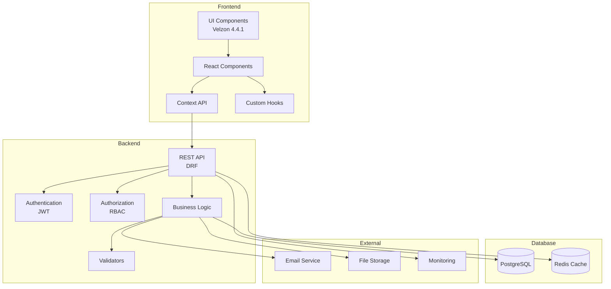

# 🏛️ Arquitectura del Sistema - ZentraQMS

## 📋 Índice
1. [Visión General](#visión-general)
2. [Arquitectura de Alto Nivel](#arquitectura-de-alto-nivel)
3. [Decisiones Arquitectónicas](#decisiones-arquitectónicas)
4. [Componentes del Sistema](#componentes-del-sistema)
5. [Flujos de Datos](#flujos-de-datos)
6. [Seguridad](#seguridad)
7. [Escalabilidad](#escalabilidad)

## 🎯 Visión General

ZentraQMS implementa una arquitectura de tres capas con separación clara de responsabilidades:

```
┌─────────────────────────────────────────────────────────────┐
│                    Capa de Presentación                      │
│                   React 19 + TypeScript                      │
│                    Velzon 4.4.1 Template                     │
└───────────────────────────┬─────────────────────────────────┘
                            │ REST API (JSON)
┌───────────────────────────┴─────────────────────────────────┐
│                     Capa de Negocio                          │
│                  Django 5.0 + DRF 3.15                       │
│              JWT Auth + RBAC + Business Logic                │
└───────────────────────────┬─────────────────────────────────┘
                            │ ORM
┌───────────────────────────┴─────────────────────────────────┐
│                      Capa de Datos                           │
│                     PostgreSQL 15                            │
│              Audit Trails + Soft Deletes                     │
└─────────────────────────────────────────────────────────────┘
```

## 🏗️ Arquitectura de Alto Nivel

### Componentes Principales



## 🎯 Decisiones Arquitectónicas

### ADR-001: Uso de Django + React
**Contexto**: Necesidad de un backend robusto con frontend moderno.
**Decisión**: Django para backend, React para frontend.
**Consecuencias**: 
- ✅ Ecosistema maduro
- ✅ Amplia documentación
- ✅ Comunidad activa
- ❌ Dos tecnologías para mantener

### ADR-002: JWT para Autenticación
**Contexto**: Sistema stateless y escalable.
**Decisión**: JWT con refresh tokens.
**Consecuencias**:
- ✅ Stateless
- ✅ Escalable horizontalmente
- ✅ Compatible con microservicios
- ❌ Complejidad en revocación

### ADR-003: RBAC Personalizado
**Contexto**: Control granular de permisos por módulo.
**Decisión**: Sistema RBAC propio con permisos modulares.
**Consecuencias**:
- ✅ Control total sobre permisos
- ✅ Adaptado a necesidades específicas
- ❌ Mayor complejidad de desarrollo

### ADR-004: Soft Deletes + Audit Trails
**Contexto**: Requisitos de auditoría para sector salud.
**Decisión**: Todos los modelos con soft delete y audit trail.
**Consecuencias**:
- ✅ Trazabilidad completa
- ✅ Cumplimiento normativo
- ❌ Mayor uso de almacenamiento

### ADR-005: Plantilla Velzon 4.4.1
**Contexto**: Acelerar desarrollo de UI profesional.
**Decisión**: Usar plantilla comercial Velzon.
**Consecuencias**:
- ✅ UI profesional inmediata
- ✅ Componentes probados
- ✅ Ahorro de tiempo
- ❌ Dependencia de terceros

## 🔧 Componentes del Sistema

### Backend Components

#### 1. Authentication Module
```python
apps/authentication/
├── models.py       # User model extendido
├── serializers.py  # JWT serializers
├── views.py        # Login/Logout/Refresh
├── middleware.py   # JWT validation
└── utils.py        # Token helpers
```

#### 2. Authorization Module
```python
apps/authorization/
├── models.py       # Role, Permission
├── permissions.py  # Permission classes
├── decorators.py   # @permission_required
├── services.py     # RBAC logic
└── mixins.py       # Permission mixins
```

#### 3. Organization Module
```python
apps/organization/
├── models.py       # Organization, Location, Template
├── serializers.py  # Nested serializers
├── views.py        # CRUD + Wizard
├── signals.py      # Post-save actions
└── validators.py   # NIT validation
```

### Frontend Components

#### 1. Context Providers
```typescript
contexts/
├── AuthContext.tsx      // Authentication state
├── PermissionContext.tsx // RBAC state
├── OrganizationContext.tsx // Org data
└── ThemeContext.tsx     // UI theme
```

#### 2. Custom Hooks
```typescript
hooks/
├── useAuth.ts          // Auth operations
├── usePermissions.ts   // Permission checks
├── useApi.ts          // API calls
├── useToast.ts        // Notifications
└── useWizard.ts       // Wizard navigation
```

#### 3. UI Components
```typescript
components/
├── common/            // Shared components
├── forms/            // Form components
├── layout/           // Layout components
├── wizard/           // Wizard steps
└── dashboard/        // Dashboard widgets
```

## 🔄 Flujos de Datos

### Flujo de Autenticación
```
1. Usuario ingresa credenciales
2. Frontend → POST /api/v1/auth/login/
3. Backend valida credenciales
4. Backend genera JWT tokens (access + refresh)
5. Frontend almacena tokens en localStorage
6. Frontend incluye token en headers subsecuentes
7. Backend valida token en cada request
8. Token expira → Auto-refresh con refresh token
```

### Flujo de Autorización
```
1. Usuario intenta acceder a recurso
2. Frontend verifica permiso local (optimista)
3. Request incluye JWT token
4. Backend extrae usuario del token
5. Backend verifica permisos RBAC
6. Permitir/Denegar basado en permisos
7. Log de auditoría de la acción
```

### Flujo de Datos CRUD
```
1. Usuario inicia operación CRUD
2. Frontend valida datos localmente
3. Frontend → API request con datos
4. Backend valida permisos
5. Backend valida datos (serializers)
6. Backend ejecuta operación DB
7. Backend registra audit trail
8. Backend → Response con datos actualizados
9. Frontend actualiza estado local
10. Frontend muestra feedback al usuario
```

## 🔐 Seguridad

### Capas de Seguridad

1. **Frontend**
   - Sanitización de inputs
   - Validación de formularios
   - HTTPS only
   - Content Security Policy

2. **API**
   - JWT Authentication
   - RBAC Authorization
   - Rate limiting
   - CORS configuration
   - CSRF protection

3. **Backend**
   - Input validation
   - SQL injection prevention (ORM)
   - XSS protection
   - Password hashing (bcrypt)
   - Audit logging

4. **Database**
   - Encrypted connections
   - Row-level security
   - Backup encryption
   - Access control

### Headers de Seguridad
```python
SECURE_BROWSER_XSS_FILTER = True
SECURE_CONTENT_TYPE_NOSNIFF = True
X_FRAME_OPTIONS = 'DENY'
SECURE_SSL_REDIRECT = True
SESSION_COOKIE_SECURE = True
CSRF_COOKIE_SECURE = True
```

## 📈 Escalabilidad

### Estrategias de Escalamiento

#### Horizontal Scaling
```
┌──────────┐     ┌──────────┐     ┌──────────┐
│  App 1   │     │  App 2   │     │  App 3   │
└────┬─────┘     └────┬─────┘     └────┬─────┘
     │                │                │
     └────────────────┼────────────────┘
                      │
              ┌───────┴────────┐
              │  Load Balancer │
              └───────┬────────┘
                      │
              ┌───────┴────────┐
              │   PostgreSQL   │
              │   (Primary)    │
              └───────┬────────┘
                      │
        ┌─────────────┼─────────────┐
        │                           │
┌───────┴────────┐         ┌───────┴────────┐
│  PG Replica 1  │         │  PG Replica 2  │
└────────────────┘         └────────────────┘
```

#### Caching Strategy
1. **Redis Cache**: Session data, frequently accessed data
2. **CDN**: Static assets (JS, CSS, images)
3. **Database Query Cache**: Complex queries
4. **Application Cache**: Computed results

#### Performance Optimizations
- Database indexing on frequently queried fields
- Lazy loading for large datasets
- Pagination for lists
- Async task processing (Celery)
- Connection pooling
- Query optimization (select_related, prefetch_related)

## 🔄 Patrones de Integración

### API REST Patterns
```
GET    /api/v1/resources/          # List
POST   /api/v1/resources/          # Create
GET    /api/v1/resources/{id}/     # Retrieve
PUT    /api/v1/resources/{id}/     # Update
PATCH  /api/v1/resources/{id}/     # Partial update
DELETE /api/v1/resources/{id}/     # Delete

# Custom actions
POST   /api/v1/resources/{id}/approve/
POST   /api/v1/resources/{id}/reject/
GET    /api/v1/resources/{id}/audit-trail/
```

### WebSocket (Futuro)
```
ws://api.zentraqms.com/ws/notifications/
ws://api.zentraqms.com/ws/real-time-updates/
```

## 📊 Monitoreo y Observabilidad

### Logging
```python
LOGGING = {
    'version': 1,
    'handlers': {
        'file': {
            'class': 'logging.FileHandler',
            'filename': 'logs/django.log',
        },
        'audit': {
            'class': 'logging.FileHandler',
            'filename': 'logs/audit.log',
        },
    },
    'loggers': {
        'django': {
            'handlers': ['file'],
            'level': 'INFO',
        },
        'audit': {
            'handlers': ['audit'],
            'level': 'INFO',
        },
    },
}
```

### Métricas Clave
- Response time (P50, P95, P99)
- Error rate
- Active users
- API calls per minute
- Database query time
- Cache hit ratio

## 🚀 Deployment Architecture

### Producción
```
┌─────────────────┐
│   CloudFlare    │
│      (CDN)      │
└────────┬────────┘
         │
┌────────┴────────┐
│   Nginx        │
│ (Load Balancer) │
└────────┬────────┘
         │
    ┌────┴────┐
    │         │
┌───┴──┐  ┌──┴───┐
│ App1 │  │ App2 │
└───┬──┘  └──┬───┘
    │         │
    └────┬────┘
         │
┌────────┴────────┐
│   PostgreSQL    │
│   (Primary)     │
└─────────────────┘
```

### Desarrollo
```
┌─────────────────┐
│  Docker Compose │
├─────────────────┤
│  - Frontend     │
│  - Backend      │
│  - PostgreSQL   │
│  - Redis        │
└─────────────────┘
```

## 🔄 Ciclo de Vida de Datos

### Creación
1. Validación en frontend
2. Validación en backend
3. Guardado en DB con audit trail
4. Notificación a usuarios relevantes

### Actualización
1. Verificación de permisos
2. Validación de cambios
3. Registro de versión anterior
4. Actualización con timestamp
5. Notificación de cambios

### Eliminación (Soft Delete)
1. Verificación de permisos especiales
2. Marcado como eliminado
3. Registro de quién y cuándo
4. Datos permanecen para auditoría

### Archivado
1. Datos antiguos movidos a tablas de archivo
2. Disponibles para consulta histórica
3. No afectan performance de producción

---

💡 **Nota**: Esta arquitectura está diseñada para soportar el crecimiento esperado del sistema y cumplir con los requisitos regulatorios del sector salud colombiano.