# 🏗️ ZentraQMS Multi-Sector Module Architecture

## 📋 Overview

ZentraQMS implements a **modular multi-sector architecture** that automatically configures itself based on organization type. This document serves as the **definitive reference** for the `qms-software-architect` agent when designing new modules or extending existing functionality.

## 🏛️ Core Architecture Principles

### 1. **Master Table + Sector Extensions Pattern**

```python
# Master table - Universal data for ALL organizations
Organization (Master)
├── id: UUID (Primary Key)
├── razon_social: CharField
├── sector_economico: CharField ← Determines which extension to use
├── tipo_organizacion: CharField ← Determines specific configuration
├── enabled_modules: JSONField ← Auto-activated modules list
└── sector_config: JSONField ← Sector-specific configuration

# Sector-specific extensions - OneToOne relationships
HealthOrganization (Extension for health sector)
├── organization: OneToOneField(Organization)
├── codigo_prestador: CharField (REPS code)
├── naturaleza_juridica: CharField
├── nivel_complejidad: CharField
└── verificado_reps: BooleanField

ManufacturingOrganization (Future extension)
├── organization: OneToOneField(Organization)  
├── industry_type: CharField
├── iso_certifications: JSONField
└── production_capacity: CharField
```

### 2. **Auto-Activation Rules Engine**

```python
# In OrganizationWizardCreateSerializer._get_modules_for_sector()
AUTO_ACTIVATION_RULES = {
    'salud': {
        'ips': ['DASHBOARD', 'PROCESSES', 'SUH', 'PAMEC', 'CLINICAL_SAFETY', 'REPS_INTEGRATION'],
        'eps': ['DASHBOARD', 'PROCESSES', 'MEMBER_MANAGEMENT', 'CLAIMS_PROCESSING'],
        'laboratorio': ['DASHBOARD', 'PROCESSES', 'SUH', 'QUALITY_CONTROL'],
        'hospital': ['DASHBOARD', 'PROCESSES', 'SUH', 'PAMEC', 'CLINICAL_SAFETY'],
        'clinica': ['DASHBOARD', 'PROCESSES', 'SUH', 'PAMEC', 'CLINICAL_SAFETY']
    },
    'manufactura': {
        'industria_alimentaria': ['DASHBOARD', 'PROCESSES', 'PRODUCTION', 'QUALITY_CONTROL', 'FOOD_SAFETY'],
        'industria_farmaceutica': ['DASHBOARD', 'PROCESSES', 'PRODUCTION', 'GMP', 'QUALITY_CONTROL']
    },
    'educacion': {
        'universidad': ['DASHBOARD', 'PROCESSES', 'ACADEMIC', 'RESEARCH', 'ACCREDITATION']
    }
}
```

### 3. **Sector Configuration Engine**

```python
# Auto-generated sector_config based on organization type
SECTOR_CONFIGURATIONS = {
    'salud': {
        'integrations': ['REPS', 'SISPRO', 'ADRES'],
        'compliance': ['SOGCS', 'ISO_9001', 'ISO_15189'],
        'sector_features': {
            'reps_validation': True,
            'health_services': True,
            'clinical_safety': True,
            'accreditation_tracking': True
        }
    },
    'manufactura': {
        'integrations': ['ERP', 'MRP'],
        'compliance': ['ISO_9001', 'ISO_14001', 'HACCP'],
        'sector_features': {
            'production_tracking': True,
            'quality_control': True,
            'inventory_management': True
        }
    }
}
```

## 🧩 Module System Architecture

### 1. **Module Definition Pattern**

Every module follows this standardized pattern:

```python
class BaseModule:
    """Base class for all QMS modules."""
    name = ""
    code = ""
    sector_compatibility = []
    org_type_compatibility = []
    dependencies = []
    
    def is_compatible(self, organization):
        """Check if module is compatible with organization."""
        return (
            organization.sector_economico in self.sector_compatibility and
            organization.tipo_organizacion in self.org_type_compatibility
        )
    
    def on_activate(self, organization):
        """Called when module is activated."""
        pass
    
    def on_deactivate(self, organization):
        """Called when module is deactivated."""
        pass

class SUHModule(BaseModule):
    name = "Sistema Único de Habilitación"
    code = "SUH"
    sector_compatibility = ['salud']
    org_type_compatibility = ['ips', 'ese', 'hospital', 'clinica', 'laboratorio']
    dependencies = ['DASHBOARD', 'PROCESSES']
    
    def on_activate(self, organization):
        # Auto-create HealthOrganization if doesn't exist
        health_org, created = HealthOrganization.objects.get_or_create(
            organization=organization,
            defaults={'naturaleza_juridica': 'privada'}
        )
```

### 2. **Module Registry Pattern**

```python
class ModuleRegistry:
    """Central registry for all QMS modules."""
    
    modules = {
        # Core modules - Always active
        'DASHBOARD': DashboardModule(),
        'PROCESSES': ProcessModule(),
        'DOCUMENTS': DocumentModule(),
        
        # Healthcare modules
        'SUH': SUHModule(),
        'PAMEC': PAMECModule(),
        'CLINICAL_SAFETY': ClinicalSafetyModule(),
        'REPS_INTEGRATION': REPSIntegrationModule(),
        
        # Manufacturing modules (future)
        'PRODUCTION': ProductionModule(),
        'QUALITY_CONTROL': QualityControlModule(),
        'FOOD_SAFETY': FoodSafetyModule(),
        
        # Education modules (future)
        'ACADEMIC': AcademicModule(),
        'RESEARCH': ResearchModule(),
        'ACCREDITATION': AccreditationModule(),
    }
    
    @classmethod
    def get_available_modules(cls, organization):
        """Return modules available for an organization."""
        available = []
        for code in organization.enabled_modules:
            if code in cls.modules:
                module = cls.modules[code]
                if module.is_compatible(organization):
                    available.append(module)
        return available
```

## 🔄 Data Flow Architecture

### 1. **Organization Creation Flow**

```mermaid
graph TD
    A[User selects HEALTHCARE + IPS] --> B[Frontend: selectedSector=HEALTHCARE, selectedOrgType=IPS]
    B --> C[API: OrganizationWizardCreateSerializer]
    C --> D[Map: HEALTHCARE→salud, IPS→ips]
    D --> E[Auto-activate modules: SUH, PAMEC, CLINICAL_SAFETY]
    E --> F[Generate sector_config: REPS, SISPRO integrations]
    F --> G[Create Organization record]
    G --> H[Auto-create HealthOrganization extension]
    H --> I[Return organization with enabled_modules]
```



### 2. **Module Access Pattern**

```python
# From any part of the system:
organization = Organization.objects.get(id=org_id)

# Access basic data (always available)
organization.razon_social
organization.enabled_modules
organization.sector_config

# Access sector-specific data (conditional)
if organization.sector_economico == 'salud':
    health_data = organization.healthorganization
    services = health_data.healthservice_set.all()
    reps_code = health_data.codigo_prestador

if organization.sector_economico == 'manufactura':
    manufacturing_data = organization.manufacturingorganization
    production_lines = manufacturing_data.production_lines.all()
```

### 3. **UI Adaptation Pattern**

```typescript
// Frontend automatically adapts based on enabled_modules
const useDynamicNavigation = () => {
  const { organization } = useOrganization();
  
  return useMemo(() => {
    const navigation = [
      { id: 'dashboard', label: 'Dashboard', icon: 'ri-dashboard-line' }
    ];
    
    // Add items based on enabled modules
    if (organization.enabled_modules.includes('SUH')) {
      navigation.push({
        id: 'suh',
        label: 'Sistema de Habilitación',
        icon: 'ri-hospital-line',
        badge: { color: 'success', text: 'Salud' }
      });
    }
    
    if (organization.enabled_modules.includes('PRODUCTION')) {
      navigation.push({
        id: 'production',
        label: 'Producción',
        icon: 'ri-settings-3-line',
        badge: { color: 'info', text: 'Manufactura' }
      });
    }
    
    return navigation;
  }, [organization.enabled_modules]);
};
```

## 📊 Database Schema Architecture

### 1. **Core Tables**

```sql
-- Master table for all organizations
organization_organization (
    id UUID PRIMARY KEY,
    razon_social VARCHAR(200) NOT NULL,
    nit VARCHAR(15) UNIQUE NOT NULL,
    sector_economico VARCHAR(50) NOT NULL,  -- 'salud', 'manufactura', etc.
    tipo_organizacion VARCHAR(50) NOT NULL, -- 'ips', 'eps', etc.
    enabled_modules JSONB DEFAULT '[]',     -- Auto-activated modules
    sector_config JSONB DEFAULT '{}',      -- Sector-specific config
    created_at TIMESTAMP,
    updated_at TIMESTAMP
);

-- Healthcare extension (OneToOne)
organization_healthorganization (
    id UUID PRIMARY KEY,
    organization_id UUID REFERENCES organization_organization(id),
    codigo_prestador VARCHAR(20),
    naturaleza_juridica VARCHAR(20),
    nivel_complejidad VARCHAR(10),
    verificado_reps BOOLEAN DEFAULT FALSE,
    datos_reps JSONB DEFAULT '{}',
    created_at TIMESTAMP,
    updated_at TIMESTAMP
);

-- Healthcare services (OneToMany)
organization_healthservice (
    id UUID PRIMARY KEY,
    health_organization_id UUID REFERENCES organization_healthorganization(id),
    codigo_servicio VARCHAR(20),
    nombre_servicio VARCHAR(200),
    estado VARCHAR(20),
    fecha_habilitacion DATE,
    fecha_vencimiento DATE,
    created_at TIMESTAMP,
    updated_at TIMESTAMP
);
```

### 2. **Indexing Strategy**

```sql
-- Performance indexes for multi-sector queries
CREATE INDEX idx_org_sector_tipo ON organization_organization(sector_economico, tipo_organizacion);
CREATE INDEX idx_org_enabled_modules ON organization_organization USING GIN(enabled_modules);
CREATE INDEX idx_org_sector_config ON organization_organization USING GIN(sector_config);

-- Healthcare-specific indexes
CREATE INDEX idx_health_codigo_prestador ON organization_healthorganization(codigo_prestador);
CREATE INDEX idx_health_verificado ON organization_healthorganization(verificado_reps);

-- Service-specific indexes
CREATE INDEX idx_service_codigo ON organization_healthservice(codigo_servicio);
CREATE INDEX idx_service_estado ON organization_healthservice(estado);
```

## 🚀 Extension Patterns for New Sectors

### 1. **Adding a New Sector (Manufacturing Example)**

```python
# Step 1: Create sector extension model
class ManufacturingOrganization(FullBaseModel):
    organization = models.OneToOneField(Organization, on_delete=models.CASCADE)
    industry_type = models.CharField(max_length=50, choices=INDUSTRY_CHOICES)
    iso_certifications = models.JSONField(default=list)
    production_capacity = models.CharField(max_length=20)
    erp_system = models.CharField(max_length=100, blank=True)
    
    class Meta:
        verbose_name = "Manufacturing Organization"
        indexes = [
            models.Index(fields=['industry_type']),
            models.Index(fields=['production_capacity']),
        ]

# Step 2: Add to auto-activation rules
def _get_modules_for_sector(self, sector, org_type):
    # ... existing health rules ...
    elif sector == 'manufactura':
        if org_type in ['industria_alimentaria', 'industria_farmaceutica']:
            return base_modules + ['PRODUCTION', 'QUALITY_CONTROL', 'FOOD_SAFETY', 'GMP']
        else:
            return base_modules + ['PRODUCTION', 'QUALITY_CONTROL', 'ISO_MANAGEMENT']

# Step 3: Create module definitions
class ProductionModule(BaseModule):
    name = "Gestión de Producción"
    code = "PRODUCTION"
    sector_compatibility = ['manufactura']
    org_type_compatibility = ['industria_alimentaria', 'industria_farmaceutica', 'industria_textil']
    
    def on_activate(self, organization):
        manufacturing_org, created = ManufacturingOrganization.objects.get_or_create(
            organization=organization,
            defaults={'industry_type': 'general'}
        )
```

### 2. **Frontend Component Mapping**

```typescript
// Velzon component mapping for new sectors
const SECTOR_COMPONENTS = {
  'salud': {
    dashboardTemplate: '/healthcare/dashboard',
    primaryColor: 'success',
    iconSet: 'medical',
    velzonComponents: ['medical-cards', 'health-charts', 'patient-tables']
  },
  'manufactura': {
    dashboardTemplate: '/manufacturing/dashboard', 
    primaryColor: 'info',
    iconSet: 'industrial',
    velzonComponents: ['production-cards', 'quality-charts', 'inventory-tables']
  },
  'educacion': {
    dashboardTemplate: '/education/dashboard',
    primaryColor: 'warning', 
    iconSet: 'academic',
    velzonComponents: ['academic-cards', 'student-charts', 'course-tables']
  }
};
```

## 🔒 Security and Permissions Architecture

### 1. **Module-Based Permissions**

```python
# Permissions are scoped by organization and modules
class ModulePermission(models.Model):
    organization = models.ForeignKey(Organization, on_delete=models.CASCADE)
    module_code = models.CharField(max_length=50)
    role = models.ForeignKey(Role, on_delete=models.CASCADE)
    can_view = models.BooleanField(default=False)
    can_edit = models.BooleanField(default=False)
    can_admin = models.BooleanField(default=False)

# Permission checking in views
@permission_required('suh.view_healthservice')
def health_services_view(request):
    organization = request.user.organization
    
    # Verify module is enabled for organization
    if 'SUH' not in organization.enabled_modules:
        return HttpResponseForbidden("SUH module not enabled")
    
    # Proceed with view logic
    services = organization.healthorganization.healthservice_set.all()
    return render(request, 'suh/services.html', {'services': services})
```

### 2. **API Security Pattern**

```python
class HealthServiceViewSet(viewsets.ModelViewSet):
    serializer_class = HealthServiceSerializer
    permission_classes = [IsAuthenticated, HasModuleAccess]
    required_module = 'SUH'
    
    def get_queryset(self):
        organization = self.request.user.organization
        return HealthService.objects.filter(
            health_organization__organization=organization
        )
    
    def perform_create(self, serializer):
        organization = self.request.user.organization
        if not hasattr(organization, 'healthorganization'):
            raise ValidationError("Health organization not configured")
        serializer.save(health_organization=organization.healthorganization)
```

## 📈 Performance Considerations

### 1. **Query Optimization Patterns**

```python
# Efficient multi-sector queries
def get_organization_with_extensions(org_id):
    """Get organization with all applicable extensions in single query."""
    organization = Organization.objects.select_related().get(id=org_id)
    
    # Conditionally load extensions based on sector
    if organization.sector_economico == 'salud':
        organization = Organization.objects.select_related(
            'healthorganization'
        ).prefetch_related(
            'healthorganization__healthservice_set'
        ).get(id=org_id)
    elif organization.sector_economico == 'manufactura':
        organization = Organization.objects.select_related(
            'manufacturingorganization'
        ).get(id=org_id)
    
    return organization
```

### 2. **Caching Strategy**

```python
# Module-aware caching
def get_organization_navigation(organization_id):
    cache_key = f"nav:{organization_id}:{get_modules_hash(organization_id)}"
    navigation = cache.get(cache_key)
    
    if navigation is None:
        organization = Organization.objects.get(id=organization_id)
        navigation = build_navigation_for_modules(organization.enabled_modules)
        cache.set(cache_key, navigation, timeout=3600)
    
    return navigation
```

## 🧪 Testing Architecture

### 1. **Module Testing Pattern**

```python
class ModuleTestCase(TestCase):
    """Base test case for module testing."""
    
    def setUp(self):
        self.organization = Organization.objects.create(
            razon_social="Test Clinic",
            sector_economico="salud",
            tipo_organizacion="ips",
            enabled_modules=["DASHBOARD", "SUH", "PAMEC"]
        )
        self.health_org = HealthOrganization.objects.create(
            organization=self.organization,
            codigo_prestador="1234567890123"
        )
    
    def test_module_compatibility(self):
        suh_module = SUHModule()
        self.assertTrue(suh_module.is_compatible(self.organization))
        
        # Test incompatible organization
        manufacturing_org = Organization(
            sector_economico="manufactura",
            tipo_organizacion="industria_alimentaria"
        )
        self.assertFalse(suh_module.is_compatible(manufacturing_org))
```

### 2. **Integration Testing Pattern**

```python
class MultiSectorIntegrationTest(TestCase):
    """Test integration between different sectors and modules."""
    
    def test_organization_creation_flow(self):
        # Test healthcare organization creation
        data = {
            'selectedSector': 'HEALTHCARE',
            'selectedOrgType': 'IPS',
            'razon_social': 'Test IPS',
            'nit': '123456789'
        }
        
        response = self.client.post('/api/v1/wizard/', data)
        self.assertEqual(response.status_code, 201)
        
        organization = Organization.objects.get(nit='123456789')
        self.assertEqual(organization.sector_economico, 'salud')
        self.assertEqual(organization.tipo_organizacion, 'ips')
        self.assertIn('SUH', organization.enabled_modules)
        self.assertTrue(hasattr(organization, 'healthorganization'))
```

## 📚 Reference Documentation

For implementing new modules or extending existing functionality, always refer to:

1. **This document** for architectural patterns
2. **`claude-modules/organization/README.claude.md`** for Organization module specifics
3. **`claude-modules/frontend/velzon-guide.claude.md`** for UI component mapping
4. **`claude-modules/backend/README.claude.md`** for Django implementation patterns

## 🎯 Implementation Checklist

When creating new modules or sectors, ensure:

- [ ] Model extends FullBaseModel for audit trails
- [ ] OneToOne relationship with Organization established
- [ ] Auto-activation rules defined in serializer
- [ ] Module compatibility rules implemented
- [ ] Frontend component mapping defined
- [ ] Velzon components identified and mapped
- [ ] Permissions and security implemented
- [ ] Tests for compatibility and integration
- [ ] Database indexes for performance
- [ ] Documentation updated

This architecture ensures ZentraQMS remains scalable, maintainable, and easily extensible to new sectors while maintaining consistency and performance across all implementations.