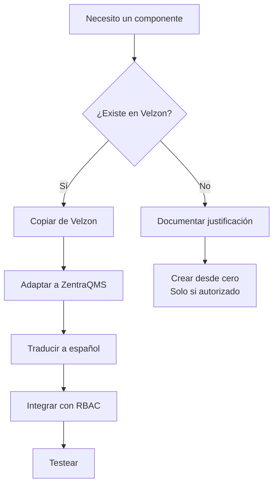

# 🎨 Velzon 4.4.1 Integration Guide - ZentraQMS

## 🚨 DIRECTIVA CRÍTICA

**OBLIGATORIO**: SIEMPRE usar componentes de Velzon antes de crear nuevos.
**Ubicación**: `/Users/juan.bustamante/personal/Velzon_4.4.1/React-TS/Master/`

## 📋 Índice
1. [Flujo de Trabajo](#flujo-de-trabajo)
2. [Componentes Disponibles](#componentes-disponibles)
3. [Mapeo de Componentes](#mapeo-de-componentes)
4. [Proceso de Adaptación](#proceso-de-adaptación)
5. [Recursos y Assets](#recursos-y-assets)
6. [Ejemplos Prácticos](#ejemplos-prácticos)

## 🔄 Flujo de Trabajo

### Proceso Obligatorio para Nuevos Componentes



## 📦 Componentes Disponibles

### Estructura de Velzon
```
Velzon_4.4.1/React-TS/Master/
├── src/
│   ├── Components/
│   │   ├── Common/          # Componentes reutilizables
│   │   │   ├── BreadCrumb.tsx
│   │   │   ├── DeleteModal.tsx
│   │   │   ├── Loader.tsx
│   │   │   ├── ProfileDropdown.tsx
│   │   │   ├── SearchOption.tsx
│   │   │   ├── TableContainer.tsx
│   │   │   └── ToastContainer.tsx
│   │   ├── Forms/           # Componentes de formulario
│   │   │   ├── FormInput.tsx
│   │   │   ├── FormSelect.tsx
│   │   │   ├── FormTextarea.tsx
│   │   │   ├── FormValidation.tsx
│   │   │   └── Wizard/
│   │   ├── Tables/          # Tablas y grids
│   │   │   ├── DataTable.tsx
│   │   │   ├── GridJS.tsx
│   │   │   └── ReactTable.tsx
│   │   └── Charts/          # Gráficos
│   │       ├── ApexCharts/
│   │       └── ChartJS/
│   ├── pages/               # Páginas completas
│   │   ├── Authentication/
│   │   ├── Dashboard/
│   │   ├── Forms/
│   │   └── Tables/
│   └── assets/              # Recursos
│       ├── images/
│       ├── scss/
│       └── fonts/
```

## 🗺️ Mapeo de Componentes

### Componentes QMS → Velzon

| Necesidad en QMS | Componente Velzon | Ubicación |
|-----------------|-------------------|-----------|
| Login | SignIn | `/pages/Authentication/SignIn.tsx` |
| Dashboard | Dashboard Analytics | `/pages/Dashboard/Analytics/` |
| Tabla de datos | ReactTable | `/Components/Tables/ReactTable.tsx` |
| Wizard configuración | Form Wizard | `/pages/Forms/FormWizard/` |
| Modal confirmación | DeleteModal | `/Components/Common/DeleteModal.tsx` |
| Breadcrumbs | BreadCrumb | `/Components/Common/BreadCrumb.tsx` |
| Profile menu | ProfileDropdown | `/Components/Common/ProfileDropdown.tsx` |
| Notificaciones | ToastContainer | `/Components/Common/ToastContainer.tsx` |
| Cards | Card Components | `/pages/BaseUI/UiCards/` |
| Forms | Form Components | `/pages/Forms/BasicElements/` |
| Tablas | DataTables | `/pages/Tables/DataTables/` |
| Charts | ApexCharts | `/pages/Charts/ApexCharts/` |
| File Upload | Dropzone | `/pages/Forms/FileUpload/` |
| Calendar | FullCalendar | `/pages/Calendar/` |
| Kanban | Tasks Kanban | `/pages/Tasks/KanbanBoard/` |

## 🔧 Proceso de Adaptación

### Paso 1: Copiar Componente

```bash
# Desde la raíz del proyecto
cp -r /Users/juan.bustamante/personal/Velzon_4.4.1/React-TS/Master/src/Components/Common/TableContainer.tsx \
      ./frontend/src/components/common/

# Copiar también estilos si existen
cp -r /Users/juan.bustamante/personal/Velzon_4.4.1/React-TS/Master/src/assets/scss/components/_table.scss \
      ./frontend/src/assets/scss/components/
```

### Paso 2: Adaptar Imports

```typescript
// Original Velzon
import { Card, CardBody } from "reactstrap";
import BreadCrumb from "../../Components/Common/BreadCrumb";

// Adaptado para ZentraQMS
import { Card, CardBody } from "reactstrap";
import BreadCrumb from "@/components/common/BreadCrumb";
```

### Paso 3: Traducir a Español

```typescript
// Original Velzon
const columns = [
  { Header: "Name", accessor: "name" },
  { Header: "Position", accessor: "position" },
  { Header: "Office", accessor: "office" },
];

// Adaptado ZentraQMS
const columns = [
  { Header: "Nombre", accessor: "name" },
  { Header: "Cargo", accessor: "position" },
  { Header: "Sede", accessor: "office" },
];
```

### Paso 4: Integrar RBAC

```typescript
// Componente adaptado con permisos
import { usePermissions } from '@/hooks/usePermissions';

const TableWithPermissions: React.FC = ({ data }) => {
  const { hasPermission } = usePermissions();
  
  const columns = [
    { Header: "Nombre", accessor: "name" },
    { Header: "Estado", accessor: "status" },
    {
      Header: "Acciones",
      Cell: ({ row }) => (
        <>
          {hasPermission('view') && (
            <Button size="sm" onClick={() => handleView(row)}>Ver</Button>
          )}
          {hasPermission('edit') && (
            <Button size="sm" onClick={() => handleEdit(row)}>Editar</Button>
          )}
          {hasPermission('delete') && (
            <Button size="sm" onClick={() => handleDelete(row)}>Eliminar</Button>
          )}
        </>
      )
    }
  ];
  
  return <ReactTable columns={columns} data={data} />;
};
```

## 🖼️ Recursos y Assets

### NUNCA Usar CDNs Externos

```typescript
// ❌ INCORRECTO


// ✅ CORRECTO


```

### Copiar Assets Necesarios

```bash
# Copiar avatares
cp -r /Users/juan.bustamante/personal/Velzon_4.4.1/React-TS/Master/src/assets/images/users/* \
      ./frontend/src/assets/images/users/

# Copiar banderas
cp -r /Users/juan.bustamante/personal/Velzon_4.4.1/React-TS/Master/src/assets/images/flags/* \
      ./frontend/src/assets/images/flags/

# Copiar íconos
cp -r /Users/juan.bustamante/personal/Velzon_4.4.1/React-TS/Master/src/assets/images/svg/* \
      ./frontend/src/assets/images/svg/
```

## 💡 Ejemplos Prácticos

### Ejemplo 1: Adaptando el Dashboard

```typescript
// 1. Copiar Dashboard de Velzon
// Velzon: /pages/Dashboard/Analytics/index.tsx

// 2. Adaptarlo para QMS
import React from 'react';
import { Container, Row, Col } from 'reactstrap';
import BreadCrumb from '@/components/common/BreadCrumb';
import { useAuth } from '@/hooks/useAuth';
import { usePermissions } from '@/hooks/usePermissions';

// Widgets del dashboard
import RevenueWidget from './RevenueWidget';
import UsersWidget from './UsersWidget';
import SessionsWidget from './SessionsWidget';

const DashboardQMS: React.FC = () => {
  const { user } = useAuth();
  const { hasPermission } = usePermissions();
  
  return (
    <React.Fragment>
      <div className="page-content">
        <Container fluid>
          <BreadCrumb title="Dashboard" pageTitle="Inicio" />
          
          <Row>
            <Col xl={3} md={6}>
              <RevenueWidget 
                title="Organizaciones"
                counter="28"
                icon="ri-building-line"
                color="success"
              />
            </Col>
            
            {hasPermission('dashboard.view_users') && (
              <Col xl={3} md={6}>
                <UsersWidget 
                  title="Usuarios"
                  counter="152"
                  icon="ri-user-line"
                  color="info"
                />
              </Col>
            )}
            
            {hasPermission('dashboard.view_audits') && (
              <Col xl={3} md={6}>
                <SessionsWidget 
                  title="Auditorías"
                  counter="45"
                  icon="ri-file-list-line"
                  color="warning"
                />
              </Col>
            )}
          </Row>
          
          {/* Más widgets según permisos */}
        </Container>
      </div>
    </React.Fragment>
  );
};

export default DashboardQMS;
```

### Ejemplo 2: Wizard de Configuración

```typescript
// Basado en Velzon FormWizard
// Original: /pages/Forms/FormWizard/index.tsx

import React, { useState } from 'react';
import { Card, CardBody, Nav, NavItem, NavLink, TabContent, TabPane } from 'reactstrap';
import classnames from 'classnames';

const OrganizationWizard: React.FC = () => {
  const [activeTab, setActiveTab] = useState(1);
  
  const toggleTab = (tab: number) => {
    if (activeTab !== tab) {
      if (tab >= 1 && tab <= 5) {
        setActiveTab(tab);
      }
    }
  };
  
  return (
    <Card>
      <CardBody>
        <div className="wizard-nav mb-4">
          <Nav pills className="nav-justified">
            <NavItem>
              <NavLink
                className={classnames({ active: activeTab === 1 })}
                onClick={() => toggleTab(1)}
              >
                <span className="d-none d-sm-block">Datos Básicos</span>
              </NavLink>
            </NavItem>
            <NavItem>
              <NavLink
                className={classnames({ active: activeTab === 2 })}
                onClick={() => toggleTab(2)}
              >
                <span className="d-none d-sm-block">Ubicación</span>
              </NavLink>
            </NavItem>
            <NavItem>
              <NavLink
                className={classnames({ active: activeTab === 3 })}
                onClick={() => toggleTab(3)}
              >
                <span className="d-none d-sm-block">Plantilla</span>
              </NavLink>
            </NavItem>
          </Nav>
        </div>
        
        <TabContent activeTab={activeTab}>
          <TabPane tabId={1}>
            <Step1OrganizationData onNext={() => toggleTab(2)} />
          </TabPane>
          <TabPane tabId={2}>
            <Step2LocationData 
              onPrevious={() => toggleTab(1)}
              onNext={() => toggleTab(3)} 
            />
          </TabPane>
          <TabPane tabId={3}>
            <Step3Template 
              onPrevious={() => toggleTab(2)}
              onComplete={handleComplete}
            />
          </TabPane>
        </TabContent>
      </CardBody>
    </Card>
  );
};
```

### Ejemplo 3: Tabla con Acciones

```typescript
// Basado en ReactTable de Velzon
import React from 'react';
import DataTable from '@/components/common/DataTable'; // Copiado de Velzon
import { Button, UncontrolledDropdown, DropdownToggle, DropdownMenu, DropdownItem } from 'reactstrap';

const OrganizationTable: React.FC = () => {
  const columns = React.useMemo(
    () => [
      {
        Header: 'Nombre',
        accessor: 'name',
        Cell: ({ value, row }) => (
          <div className="d-flex align-items-center">
            
            <div>
              <h5 className="fs-14 mb-0">{value}</h5>
              <p className="text-muted mb-0">{row.original.email}</p>
            </div>
          </div>
        )
      },
      {
        Header: 'NIT',
        accessor: 'nit',
      },
      {
        Header: 'Sector',
        accessor: 'sector',
        Cell: ({ value }) => (
          <span className={`badge bg-${getSectorColor(value)}-subtle text-${getSectorColor(value)}`}>
            {value}
          </span>
        )
      },
      {
        Header: 'Estado',
        accessor: 'is_configured',
        Cell: ({ value }) => (
          <span className={`badge bg-${value ? 'success' : 'warning'}`}>
            {value ? 'Configurado' : 'Pendiente'}
          </span>
        )
      },
      {
        Header: 'Acciones',
        Cell: ({ row }) => (
          <UncontrolledDropdown>
            <DropdownToggle tag="button" className="btn btn-soft-secondary btn-sm">
              <i className="ri-more-fill align-middle"></i>
            </DropdownToggle>
            <DropdownMenu className="dropdown-menu-end">
              <DropdownItem onClick={() => handleView(row.original)}>
                <i className="ri-eye-fill align-bottom me-2 text-muted"></i> Ver
              </DropdownItem>
              <DropdownItem onClick={() => handleEdit(row.original)}>
                <i className="ri-pencil-fill align-bottom me-2 text-muted"></i> Editar
              </DropdownItem>
              <DropdownItem divider />
              <DropdownItem onClick={() => handleDelete(row.original)} className="text-danger">
                <i className="ri-delete-bin-fill align-bottom me-2"></i> Eliminar
              </DropdownItem>
            </DropdownMenu>
          </UncontrolledDropdown>
        )
      }
    ],
    []
  );
  
  return (
    <DataTable
      columns={columns}
      data={organizations}
      isGlobalFilter={true}
      customPageSize={10}
      searchPlaceholder="Buscar organizaciones..."
    />
  );
};
```

## 📝 Checklist de Adaptación

Antes de considerar un componente Velzon como adaptado:

- [ ] Copiado desde Velzon al proyecto
- [ ] Imports actualizados a la estructura QMS
- [ ] Textos traducidos al español
- [ ] Integración con sistema de permisos
- [ ] Assets locales (no CDNs)
- [ ] Estilos adaptados si necesario
- [ ] Props tipadas con TypeScript
- [ ] Tests agregados
- [ ] Documentación de uso

## 🚨 Errores Comunes a Evitar

1. **NO crear componentes desde cero** si existen en Velzon
2. **NO usar CDNs externos** para imágenes o recursos
3. **NO dejar textos en inglés** sin traducir
4. **NO ignorar el sistema de permisos** al adaptar
5. **NO modificar directamente** en la carpeta de Velzon

---

💡 **Recuerda**: La plantilla Velzon costó dinero y debe aprovecharse al máximo. Siempre busca primero antes de crear.