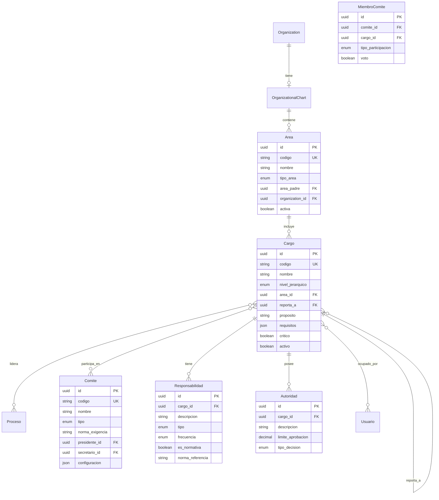

# 📊 Módulo de Organigrama Multi-Sector - Análisis de Requerimientos para ZentraQMS

## 📋 Resumen Ejecutivo

### Propósito del Módulo
El módulo de Organigrama establece la estructura organizacional de instituciones multi-sector (salud, educación, manufactura, servicios, sector público), definiendo jerarquías, responsabilidades y autoridades conforme a la norma ISO 9001:2015 como estándar universal, con especializaciones profundas por sector. Para el cliente piloto (IPS), incluye cumplimiento total del Sistema Obligatorio de Garantía de Calidad en Salud (SOGCS) colombiano.

### Arquitectura Multi-Sector
- **Núcleo Universal**: ISO 9001:2015 aplicable a todos los sectores
- **Especializaciones por Sector**: Plugins con requisitos normativos específicos
- **Cliente Piloto**: IPS (Institución Prestadora de Servicios de Salud) con normativa SOGCS completa
- **Escalabilidad**: Diseño preparado para agregar nuevos sectores sin refactoring

### Alcance
- Definición de estructura jerárquica universal y especializada
- Asignación de responsabilidades con validaciones por sector
- Mapeo de relaciones adaptable a diferentes industrias
- Integración con procesos según tipo de organización
- Cumplimiento normativo dinámico por sector
- Configuración flexible de comités y cargos obligatorios

### Sectores Soportados
1. **🏥 Salud (IPS/EPS/ESE)** - SOGCS, habilitación, acreditación
2. **🎓 Educación** - MEN, consejos académicos, acreditación institucional
3. **🏭 Manufactura** - ISO 14001, OHSAS 18001, SST
4. **🏢 Servicios** - Estructura comercial, atención al cliente
5. **🏛️ Sector Público** - MIPG, control interno, veeduría

### Estado Propuesto
- **Versión**: 2.0 (Multi-sector)
- **Prioridad**: CRÍTICA (Pre-requisito para Mapa de Procesos)
- **Plazo de Implementación**: 5 semanas (incluye multi-sector)
- **Dependencias**: Módulo Organization (implementado)

---

## 🏛️ DIAGNÓSTICO INSTITUCIONAL MULTI-SECTOR

### Arquitectura Base Universal (ISO 9001:2015)

#### Requisitos Aplicables a Todos los Sectores
1. **Cláusula 5.3 - Roles, responsabilidades y autoridades**
   - Definición clara de estructura organizacional
   - Asignación documentada de responsabilidades
   - Comunicación efectiva de autoridades
   - Designación de responsables del SGC

2. **Elementos Universales**
   - Representante legal o equivalente
   - Responsable de calidad/mejora continua
   - Estructura jerárquica definida
   - Matriz de responsabilidades
   - Comité directivo o equivalente

### Especializaciones por Sector

#### 🏥 SECTOR SALUD (Cliente Piloto - IPS)

##### Marco Regulatorio Específico
1. **Sistema Obligatorio de Garantía de Calidad (SOGCS)**
   - Decreto 1011 de 2006
   - Resolución 2003 de 2014 (Acreditación)
   - Resolución 3100 de 2019 (Habilitación)
   - Resolución 0112 de 2012 (Seguridad del Paciente)
   - Decreto 2200 de 2005 (Servicio Farmacéutico)

2. **Cargos Obligatorios IPS**
   - Director Médico/Científico
   - Responsable de Calidad
   - Líder de Seguridad del Paciente
   - Coordinador de PAMEC
   - Responsable de Farmacia (si aplica)

3. **Comités Obligatorios IPS**
   - Comité de Calidad
   - Comité de Seguridad del Paciente
   - Comité de Historias Clínicas
   - Comité de Farmacia y Terapéutica
   - COPASST

#### 🎓 SECTOR EDUCACIÓN

##### Marco Regulatorio
1. **Normativa MEN**
   - Ley 30 de 1992 (Educación Superior)
   - Decreto 1075 de 2015 (Único Reglamentario)
   - Acuerdos CNA para acreditación

2. **Estructura Típica**
   - Rector/Director
   - Vicerrectorías/Subdirecciones
   - Decanos/Coordinadores Académicos
   - Consejos Académicos
   - Comités Curriculares

#### 🏭 SECTOR MANUFACTURA

##### Normativa Aplicable
1. **Estándares de Gestión**
   - ISO 14001 (Ambiental)
   - ISO 45001 (SST)
   - ISO 22000 (Inocuidad alimentaria, si aplica)

2. **Cargos Típicos**
   - Gerente de Planta
   - Jefe de Producción
   - Coordinador SST
   - Responsable Ambiental
   - Control de Calidad

#### 🏢 SECTOR SERVICIOS

##### Estructura Comercial
1. **Áreas Típicas**
   - Dirección General
   - Comercial/Ventas
   - Operaciones
   - Servicio al Cliente
   - Administrativa/Financiera

2. **Enfoque**
   - Orientación al cliente
   - Gestión de experiencia
   - Métricas de satisfacción

#### 🏛️ SECTOR PÚBLICO

##### Marco Normativo
1. **MIPG (Modelo Integrado de Planeación y Gestión)**
   - Decreto 1499 de 2017
   - Manual Operativo MIPG

2. **Estructura Obligatoria**
   - Control Interno
   - Planeación
   - Comités institucionales MIPG
   - Oficina de Control Disciplinario

### Necesidades Identificadas Multi-Sector

#### Requisitos Universales
- Definición clara del representante legal
- Sistema de gestión de calidad funcional
- Estructura jerárquica documentada
- Asignación de responsabilidades

#### Requisitos Específicos por Sector
- **Salud**: Cumplimiento SOGCS completo
- **Educación**: Estructura académica y administrativa
- **Manufactura**: Gestión SST y ambiental
- **Servicios**: Orientación comercial y al cliente
- **Público**: Cumplimiento MIPG y transparencia

### Gaps Actuales
- Sin estructura organizacional digitalizada multi-sector
- Ausencia de configuración dinámica por industria
- Falta de validaciones específicas por sector
- No hay plantillas predefinidas por tipo de organización

---

## 📐 ESPECIFICACIONES TÉCNICAS

### 1. ANÁLISIS NORMATIVO DETALLADO

#### ISO 9001:2015 - Cláusula 5.3: Roles, responsabilidades y autoridades
**Requisitos Específicos:**
- La alta dirección debe asegurar que las responsabilidades y autoridades sean:
  - Asignadas claramente
  - Comunicadas efectivamente
  - Entendidas dentro de la organización
- Debe designarse responsables para:
  - Asegurar conformidad del SGC con ISO 9001
  - Informar sobre desempeño del SGC
  - Promover enfoque al cliente
  - Mantener integridad del SGC durante cambios

**Evidencias Requeridas:**
```
- Organigrama documentado y actualizado
- Perfiles de cargo con responsabilidades
- Matriz de responsabilidades y autoridades
- Actas de comunicación de estructura
- Registros de cambios organizacionales
```

#### Resolución 2003 de 2014 - Estándares de Acreditación

**Grupo de Estándares: Direccionamiento (Estándares 1-24)**

**Estándar 5 - Estructura Organizacional:**
> "La organización tiene definida y documentada su estructura organizacional, líneas de autoridad, responsabilidad y comunicación"

**Criterios Evaluables:**
- Organigrama coherente con la misión institucional
- Líneas de autoridad claramente definidas
- Mecanismos de coordinación inter-áreas
- Comités institucionales constituidos y operando
- Responsables de procesos identificados

**Estándar 8 - Liderazgo:**
> "Existe un proceso de desarrollo y fortalecimiento del liderazgo de los colaboradores de la organización"

**Implicaciones para el Organigrama:**
- Identificación de líderes por nivel
- Rutas de sucesión definidas
- Responsabilidades de desarrollo del talento humano

#### Decreto 1011 de 2006 - SOGCS Artículos Relevantes

**Artículo 6 - Características del SOGCS:**
El organigrama debe reflejar capacidad para:
- Accesibilidad en la prestación de servicios
- Oportunidad en la atención
- Seguridad del paciente
- Pertinencia y continuidad

**Artículo 7 - Componentes del SOGCS:**
Estructura debe soportar:
1. Sistema Único de Habilitación (responsables de estándares)
2. Auditoría para el Mejoramiento (líderes PAMEC)
3. Sistema Único de Acreditación (coordinadores por grupo)
4. Sistema de Información (responsables de indicadores)

#### Resolución 3100 de 2019 - Habilitación de Servicios

**Estándar de Talento Humano:**
- Director o gerente identificado
- Responsable de cada servicio habilitado
- Coordinadores por área asistencial
- Líderes de procesos de apoyo

**Estándar de Procesos Prioritarios:**
- Responsable de seguridad del paciente
- Líder de gestión de medicamentos
- Coordinador de referencia y contrarreferencia
- Responsable de historia clínica

#### Circular 008 de 2018 - SuperSalud

**Requisitos de Gobierno Corporativo:**
- Junta Directiva o equivalente
- Comité de Auditoría
- Comité de Calidad
- Responsable de Control Interno
- Oficial de Cumplimiento (cuando aplique)

**Estructura para Gestión del Riesgo:**
- Líder de gestión del riesgo
- Responsables por tipo de riesgo:
  - Riesgo clínico
  - Riesgo administrativo
  - Riesgo financiero
  - Riesgo legal

### 2. ESPECIFICACIONES FUNCIONALES

#### 2.1 Gestión de Estructura Jerárquica

**Funcionalidad Principal:**
Sistema de definición y gestión de la estructura organizacional con soporte para múltiples tipos de organizaciones de salud.

**Características Clave:**
```yaml
Niveles Jerárquicos:
  - Nivel Directivo: Junta, Gerencia, Direcciones
  - Nivel Ejecutivo: Subdirecciones, Coordinaciones
  - Nivel Operativo: Jefaturas, Profesionales, Auxiliares
  
Tipos de Relación:
  - Línea de Autoridad Directa
  - Línea de Coordinación
  - Línea de Asesoría
  - Línea Funcional

Configuración por Tipo de Institución:
  - IPS Básica: 3-4 niveles
  - IPS Media: 4-5 niveles  
  - IPS Alta: 5-7 niveles
  - EPS: 6-8 niveles
  - ESE: Según categoría
```

#### 2.2 Definición de Cargos y Responsabilidades

**Modelo de Cargo:**
```typescript
interface Cargo {
  // Identificación
  codigo: string;           // Único en la organización
  nombre: string;           // Ej: "Director Médico"
  nivel: NivelJerarquico;  // Directivo|Ejecutivo|Operativo
  
  // Ubicación Organizacional
  area: Area;               // Área o departamento
  dependenciaDirecta: Cargo; // Jefe inmediato
  
  // Responsabilidades
  propositoPrincipal: string;
  responsabilidades: Responsabilidad[];
  autoridades: Autoridad[];
  
  // Requisitos del Cargo
  educacion: RequisitoEducacion;
  experiencia: RequisitoExperiencia;
  competencias: Competencia[];
  
  // Relaciones
  supervisa: Cargo[];       // Cargos subordinados
  coordina: Cargo[];        // Coordinación horizontal
  
  // Comités y Grupos
  comites: Comite[];        // Participación en comités
  esLiderDe: Proceso[];     // Procesos que lidera
  
  // Cumplimiento Normativo
  requisitoNormativo: RequisitoNormativo[];
  registrosProfesionales: RegistroProfesional[];
}
```

**Matriz RACI para Procesos:**
```typescript
interface MatrizRACI {
  proceso: Proceso;
  actividades: {
    actividad: string;
    responsable: Cargo;    // R - Responsible
    aprobador: Cargo;      // A - Accountable
    consultados: Cargo[];  // C - Consulted
    informados: Cargo[];   // I - Informed
  }[];
}
```

#### 2.3 Gestión de Comités Institucionales

**Comités Obligatorios según Normativa:**

1. **Comité de Calidad** (Res. 2003/2014)
   - Presidente: Gerente/Director
   - Secretario: Coordinador de Calidad
   - Miembros: Líderes de proceso

2. **Comité de Seguridad del Paciente** (Res. 0112/2012)
   - Líder: Subdirector Científico
   - Miembros: Jefes de servicios asistenciales
   - Invitado: Representante de usuarios

3. **Comité de Historias Clínicas** (Res. 1995/1999)
   - Presidente: Director Médico
   - Miembros: Auditor médico, Sistemas, Archivo

4. **Comité de Farmacia y Terapéutica** (Decreto 2200/2005)
   - Presidente: Director Científico
   - Miembros: Químico Farmacéutico, Médicos

5. **Comité Paritario de SST - COPASST** (Res. 2013/1986)
   - Representantes del empleador
   - Representantes de trabajadores

**Modelo de Comité:**
```typescript
interface Comite {
  codigo: string;
  nombre: string;
  tipo: TipoComite;         // Obligatorio|Voluntario
  normaQueLoExige: string;
  
  // Composición
  presidente: Cargo;
  secretario: Cargo;
  miembros: MiembroComite[];
  
  // Funcionamiento
  frecuenciaReunion: Periodicidad;
  quorum: number;           // Mínimo para sesionar
  
  // Responsabilidades
  funciones: string[];
  decisiones: TipoDecision[];
  informesAGenerar: InformeComite[];
  
  // Trazabilidad
  actasReunion: ActaComite[];
  seguimientoCompromisos: Compromiso[];
}
```

#### 2.4 Integración con Módulos Existentes

**Con Módulo Organization:**
```python
class OrganizationalChart(models.Model):
    organization = models.OneToOneField(
        'organization.Organization',
        on_delete=models.CASCADE,
        related_name='organigrama'
    )
    
    # Versionado del organigrama
    version = models.CharField(max_length=10)
    fecha_vigencia = models.DateField()
    aprobado_por = models.ForeignKey('Cargo', ...)
    
    # Configuración
    niveles_jerarquicos = models.IntegerField(
        validators=[MinValueValidator(3), MaxValueValidator(10)]
    )
    permite_cargos_temporales = models.BooleanField(default=True)
    usa_matriz_raci = models.BooleanField(default=True)
```

**Con Módulo de Sedes:**
```python
class CargoSede(models.Model):
    """Distribución de cargos por sede"""
    cargo = models.ForeignKey('Cargo', ...)
    sede = models.ForeignKey('organization.Sede', ...)
    cantidad_plazas = models.IntegerField(default=1)
    titular_actual = models.ForeignKey('auth.User', null=True, ...)
```

**Con Módulo de Servicios:**
```python
class ResponsableServicio(models.Model):
    """Responsables por servicio habilitado"""
    servicio = models.ForeignKey('organization.HealthService', ...)
    cargo_responsable = models.ForeignKey('Cargo', ...)
    tipo_responsabilidad = models.CharField(
        choices=[
            ('LIDER', 'Líder del Servicio'),
            ('COORDINADOR', 'Coordinador'),
            ('SUPERVISOR', 'Supervisor'),
        ]
    )
```

### 3. MODELO DE DATOS MULTI-SECTOR

#### 3.0 Arquitectura de Datos Multi-Sector

```python
# models/sector_config.py
from django.db import models
from django.contrib.postgres.fields import JSONField

class Sector(models.Model):
    """
    Define sectores disponibles y su configuración base
    """
    SECTOR_CHOICES = [
        ('SALUD', 'Sector Salud'),
        ('EDUCACION', 'Sector Educación'),
        ('MANUFACTURA', 'Sector Manufactura'),
        ('SERVICIOS', 'Sector Servicios'),
        ('PUBLICO', 'Sector Público'),
        ('OTRO', 'Otro Sector'),
    ]
    
    codigo = models.CharField(
        max_length=20,
        choices=SECTOR_CHOICES,
        unique=True
    )
    
    nombre = models.CharField(max_length=100)
    descripcion = models.TextField()
    
    # Configuración del sector
    configuracion = JSONField(
        default=dict,
        help_text="""{
            'niveles_jerarquicos_default': 5,
            'requiere_comites_obligatorios': true,
            'validaciones_normativas': [],
            'cargos_obligatorios': [],
            'comites_obligatorios': [],
            'normativas_aplicables': []
        }"""
    )
    
    # Plantillas predefinidas
    tiene_plantillas = models.BooleanField(default=True)
    activo = models.BooleanField(default=True)
    
    class Meta:
        db_table = 'sector'
        verbose_name = "Sector"
        verbose_name_plural = "Sectores"


class SectorNormativa(models.Model):
    """
    Normativas específicas por sector
    """
    sector = models.ForeignKey(
        Sector,
        on_delete=models.CASCADE,
        related_name='normativas'
    )
    
    codigo = models.CharField(max_length=50)
    nombre = models.CharField(max_length=200)
    descripcion = models.TextField()
    
    tipo = models.CharField(
        max_length=30,
        choices=[
            ('LEY', 'Ley'),
            ('DECRETO', 'Decreto'),
            ('RESOLUCION', 'Resolución'),
            ('CIRCULAR', 'Circular'),
            ('NORMA_ISO', 'Norma ISO'),
            ('ESTANDAR', 'Estándar'),
            ('OTRO', 'Otro'),
        ]
    )
    
    obligatoria = models.BooleanField(default=True)
    vigente = models.BooleanField(default=True)
    
    # Requisitos específicos
    requisitos = JSONField(
        default=list,
        help_text="Lista de requisitos específicos de esta normativa"
    )
    
    class Meta:
        db_table = 'sector_normativa'
        unique_together = [['sector', 'codigo']]


class PlantillaOrganigrama(models.Model):
    """
    Plantillas predefinidas de organigrama por sector y tipo
    """
    sector = models.ForeignKey(
        Sector,
        on_delete=models.CASCADE,
        related_name='plantillas'
    )
    
    tipo_organizacion = models.CharField(
        max_length=50,
        help_text="Tipo específico dentro del sector (ej: IPS, Hospital, Clínica)"
    )
    
    nombre = models.CharField(max_length=200)
    descripcion = models.TextField()
    
    # Estructura predefinida
    estructura = JSONField(
        help_text="""{
            'areas': [],
            'cargos': [],
            'comites': [],
            'niveles': 5
        }"""
    )
    
    complejidad = models.CharField(
        max_length=20,
        choices=[
            ('BASICA', 'Básica'),
            ('MEDIA', 'Media'),
            ('ALTA', 'Alta'),
        ],
        default='MEDIA'
    )
    
    activa = models.BooleanField(default=True)
    
    class Meta:
        db_table = 'plantilla_organigrama'
        unique_together = [['sector', 'tipo_organizacion', 'complejidad']]
```

### 3. MODELO DE DATOS

#### 3.1 Diagrama Entidad-Relación



#### 3.2 Modelos Django Detallados

```python
# models.py
from django.db import models
from django.core.validators import MinValueValidator, MaxValueValidator
from django.contrib.postgres.fields import JSONField
from apps.common.models import FullBaseModel
from apps.organization.models import Organization, Sede, HealthService

class OrganizationalChart(FullBaseModel):
    """
    Organigrama institucional versionado multi-sector.
    Base: ISO 9001:2015 Cláusula 5.3
    Especializaciones: Por sector configurado
    """
    
    organization = models.OneToOneField(
        Organization,
        on_delete=models.CASCADE,
        related_name='organigrama',
        verbose_name="Organización"
    )
    
    # Configuración sectorial
    sector = models.ForeignKey(
        'Sector',
        on_delete=models.PROTECT,
        help_text="Sector al que pertenece la organización"
    )
    
    tipo_especifico = models.CharField(
        max_length=50,
        help_text="Tipo específico dentro del sector (ej: IPS, Universidad, Fábrica)"
    )
    
    plantilla_base = models.ForeignKey(
        'PlantillaOrganigrama',
        null=True,
        blank=True,
        on_delete=models.SET_NULL,
        help_text="Plantilla utilizada como base"
    )
    
    # Versionado
    version = models.CharField(
        max_length=10,
        help_text="Versión del organigrama (ej: 1.0, 2.1)"
    )
    fecha_vigencia = models.DateField(
        help_text="Fecha desde la cual este organigrama está vigente"
    )
    fecha_fin_vigencia = models.DateField(
        null=True, blank=True,
        help_text="Fecha hasta la cual estuvo vigente (null = vigente actual)"
    )
    
    # Aprobación
    aprobado_por = models.ForeignKey(
        'auth.User',
        on_delete=models.PROTECT,
        related_name='organigramas_aprobados'
    )
    fecha_aprobacion = models.DateTimeField()
    documento_aprobacion = models.FileField(
        upload_to='organigramas/aprobaciones/',
        help_text="Acta o resolución de aprobación"
    )
    
    # Configuración
    niveles_jerarquicos = models.IntegerField(
        validators=[MinValueValidator(3), MaxValueValidator(10)],
        default=5,
        help_text="Número de niveles jerárquicos"
    )
    
    permite_cargos_temporales = models.BooleanField(
        default=True,
        help_text="Permite definir cargos temporales o encargos"
    )
    
    usa_matriz_raci = models.BooleanField(
        default=True,
        help_text="Utiliza matriz RACI para responsabilidades"
    )
    
    configuracion_adicional = JSONField(
        default=dict,
        blank=True,
        help_text="""Configuración específica por sector:
        {
            'validaciones_activas': [],  # Validaciones del sector
            'comites_adicionales': [],   # Además de los obligatorios
            'cargos_especiales': [],     # Específicos del sector
            'normativas_aplicadas': [],  # Normativas que cumple
            'personalizaciones': {}       # Config específica
        }"""
    )
    
    class Meta:
        db_table = 'organizational_chart'
        ordering = ['-fecha_vigencia', '-version']
        constraints = [
            models.UniqueConstraint(
                fields=['organization', 'version'],
                name='unique_org_version'
            )
        ]
        verbose_name = "Organigrama"
        verbose_name_plural = "Organigramas"
    
    def __str__(self):
        return f"{self.organization.nombre_comercial} - v{self.version}"
    
    def save(self, *args, **kwargs):
        # Marcar versiones anteriores como no vigentes
        if not self.fecha_fin_vigencia and self.fecha_vigencia:
            OrganizationalChart.objects.filter(
                organization=self.organization,
                fecha_fin_vigencia__isnull=True
            ).exclude(id=self.id).update(
                fecha_fin_vigencia=self.fecha_vigencia
            )
        super().save(*args, **kwargs)


class Area(FullBaseModel):
    """
    Área o departamento organizacional.
    Puede ser jerárquica (áreas dentro de áreas).
    """
    
    TIPO_AREA_CHOICES = [
        ('DIRECCION', 'Dirección'),
        ('SUBDIRECCION', 'Subdirección'),
        ('DEPARTAMENTO', 'Departamento'),
        ('UNIDAD', 'Unidad'),
        ('SERVICIO', 'Servicio'),
        ('SECCION', 'Sección'),
        ('OFICINA', 'Oficina'),
        ('COMITE', 'Comité'),
        ('GRUPO', 'Grupo de Trabajo'),
    ]
    
    organigrama = models.ForeignKey(
        OrganizationalChart,
        on_delete=models.CASCADE,
        related_name='areas'
    )
    
    codigo = models.CharField(
        max_length=20,
        help_text="Código único del área (ej: DIR-MED, SUB-ADM)"
    )
    
    nombre = models.CharField(
        max_length=200,
        help_text="Nombre completo del área"
    )
    
    tipo_area = models.CharField(
        max_length=20,
        choices=TIPO_AREA_CHOICES,
        help_text="Tipo de área organizacional"
    )
    
    area_padre = models.ForeignKey(
        'self',
        null=True,
        blank=True,
        on_delete=models.CASCADE,
        related_name='areas_hijas',
        help_text="Área superior en la jerarquía"
    )
    
    nivel_jerarquico = models.IntegerField(
        validators=[MinValueValidator(1), MaxValueValidator(10)],
        help_text="Nivel en la jerarquía organizacional"
    )
    
    descripcion = models.TextField(
        blank=True,
        help_text="Descripción del propósito y funciones del área"
    )
    
    sede = models.ForeignKey(
        'organization.Sede',
        null=True,
        blank=True,
        on_delete=models.SET_NULL,
        related_name='areas',
        help_text="Sede donde opera principalmente esta área"
    )
    
    servicios_relacionados = models.ManyToManyField(
        'organization.HealthService',
        blank=True,
        related_name='areas_responsables',
        help_text="Servicios de salud bajo responsabilidad del área"
    )
    
    activa = models.BooleanField(
        default=True,
        help_text="Indica si el área está activa"
    )
    
    class Meta:
        db_table = 'area'
        ordering = ['nivel_jerarquico', 'codigo']
        constraints = [
            models.UniqueConstraint(
                fields=['organigrama', 'codigo'],
                name='unique_area_codigo'
            )
        ]
        verbose_name = "Área Organizacional"
        verbose_name_plural = "Áreas Organizacionales"
    
    def __str__(self):
        return f"{self.codigo} - {self.nombre}"


class Cargo(FullBaseModel):
    """
    Cargo dentro de la estructura organizacional.
    Define responsabilidades, autoridades y requisitos.
    """
    
    NIVEL_JERARQUICO_CHOICES = [
        ('ALTA_DIRECCION', 'Alta Dirección'),
        ('DIRECTIVO', 'Nivel Directivo'),
        ('EJECUTIVO', 'Nivel Ejecutivo'),
        ('PROFESIONAL', 'Nivel Profesional'),
        ('TECNICO', 'Nivel Técnico'),
        ('AUXILIAR', 'Nivel Auxiliar'),
        ('OPERATIVO', 'Nivel Operativo'),
    ]
    
    area = models.ForeignKey(
        Area,
        on_delete=models.CASCADE,
        related_name='cargos'
    )
    
    codigo = models.CharField(
        max_length=30,
        help_text="Código único del cargo (ej: GER-001, COORD-MED-001)"
    )
    
    nombre = models.CharField(
        max_length=200,
        help_text="Nombre del cargo"
    )
    
    nivel_jerarquico = models.CharField(
        max_length=20,
        choices=NIVEL_JERARQUICO_CHOICES,
        help_text="Nivel jerárquico del cargo"
    )
    
    reporta_a = models.ForeignKey(
        'self',
        null=True,
        blank=True,
        on_delete=models.SET_NULL,
        related_name='cargos_supervisados',
        help_text="Cargo al cual reporta directamente"
    )
    
    # Propósito y responsabilidades
    proposito_principal = models.TextField(
        help_text="Propósito o misión principal del cargo"
    )
    
    # Requisitos del cargo
    requisitos = JSONField(
        default=dict,
        help_text="""Requisitos del cargo: {
            'educacion': {'titulo': '', 'nivel': ''},
            'experiencia': {'años': 0, 'especifica': ''},
            'competencias': [],
            'licencias': [],
            'otros': []
        }"""
    )
    
    # Configuración
    es_cargo_critico = models.BooleanField(
        default=False,
        help_text="Indica si es un cargo crítico para la operación"
    )
    
    requiere_licencia_sst = models.BooleanField(
        default=False,
        help_text="Requiere licencia en Seguridad y Salud en el Trabajo"
    )
    
    es_responsable_proceso = models.BooleanField(
        default=False,
        help_text="Indica si es responsable de algún proceso"
    )
    
    numero_plazas = models.IntegerField(
        default=1,
        validators=[MinValueValidator(1)],
        help_text="Número de plazas autorizadas para este cargo"
    )
    
    # Estado
    activo = models.BooleanField(
        default=True,
        help_text="Indica si el cargo está activo"
    )
    
    class Meta:
        db_table = 'cargo'
        ordering = ['area__nivel_jerarquico', 'codigo']
        constraints = [
            models.UniqueConstraint(
                fields=['area__organigrama', 'codigo'],
                name='unique_cargo_codigo'
            )
        ]
        verbose_name = "Cargo"
        verbose_name_plural = "Cargos"
    
    def __str__(self):
        return f"{self.codigo} - {self.nombre}"
    
    @property
    def tiene_subordinados(self):
        return self.cargos_supervisados.exists()
    
    def get_cadena_mando(self):
        """Retorna la cadena de mando hasta la alta dirección"""
        cadena = []
        cargo_actual = self.reporta_a
        while cargo_actual:
            cadena.append(cargo_actual)
            cargo_actual = cargo_actual.reporta_a
        return cadena


class Responsabilidad(FullBaseModel):
    """
    Responsabilidades específicas de un cargo.
    Cumple con matriz de responsabilidades ISO 9001.
    """
    
    TIPO_RESPONSABILIDAD_CHOICES = [
        ('NORMATIVA', 'Normativa/Legal'),
        ('OPERATIVA', 'Operativa'),
        ('ADMINISTRATIVA', 'Administrativa'),
        ('CALIDAD', 'Calidad'),
        ('SEGURIDAD', 'Seguridad del Paciente'),
        ('FINANCIERA', 'Financiera'),
        ('TALENTO_HUMANO', 'Talento Humano'),
        ('TECNOLOGICA', 'Tecnológica'),
    ]
    
    FRECUENCIA_CHOICES = [
        ('DIARIA', 'Diaria'),
        ('SEMANAL', 'Semanal'),
        ('QUINCENAL', 'Quincenal'),
        ('MENSUAL', 'Mensual'),
        ('TRIMESTRAL', 'Trimestral'),
        ('SEMESTRAL', 'Semestral'),
        ('ANUAL', 'Anual'),
        ('OCASIONAL', 'Ocasional'),
        ('PERMANENTE', 'Permanente'),
    ]
    
    cargo = models.ForeignKey(
        Cargo,
        on_delete=models.CASCADE,
        related_name='responsabilidades'
    )
    
    descripcion = models.TextField(
        help_text="Descripción detallada de la responsabilidad"
    )
    
    tipo = models.CharField(
        max_length=20,
        choices=TIPO_RESPONSABILIDAD_CHOICES,
        help_text="Tipo de responsabilidad"
    )
    
    frecuencia = models.CharField(
        max_length=20,
        choices=FRECUENCIA_CHOICES,
        help_text="Frecuencia de ejecución"
    )
    
    es_responsabilidad_normativa = models.BooleanField(
        default=False,
        help_text="Indica si es requerida por normativa"
    )
    
    norma_referencia = models.CharField(
        max_length=200,
        blank=True,
        help_text="Norma que exige esta responsabilidad"
    )
    
    indicador_asociado = models.CharField(
        max_length=200,
        blank=True,
        help_text="Indicador para medir cumplimiento"
    )
    
    proceso_relacionado = models.ForeignKey(
        'processes.Process',
        null=True,
        blank=True,
        on_delete=models.SET_NULL,
        help_text="Proceso al cual está asociada"
    )
    
    class Meta:
        db_table = 'responsabilidad'
        ordering = ['cargo', 'tipo']
        verbose_name = "Responsabilidad"
        verbose_name_plural = "Responsabilidades"
    
    def __str__(self):
        return f"{self.cargo.nombre} - {self.get_tipo_display()}"


class Autoridad(FullBaseModel):
    """
    Autoridades y límites de decisión de un cargo.
    """
    
    TIPO_DECISION_CHOICES = [
        ('FINANCIERA', 'Decisión Financiera'),
        ('OPERATIVA', 'Decisión Operativa'),
        ('PERSONAL', 'Decisión de Personal'),
        ('CLINICA', 'Decisión Clínica'),
        ('ADMINISTRATIVA', 'Decisión Administrativa'),
        ('ESTRATEGICA', 'Decisión Estratégica'),
    ]
    
    cargo = models.ForeignKey(
        Cargo,
        on_delete=models.CASCADE,
        related_name='autoridades'
    )
    
    descripcion = models.TextField(
        help_text="Descripción de la autoridad"
    )
    
    tipo_decision = models.CharField(
        max_length=20,
        choices=TIPO_DECISION_CHOICES,
        help_text="Tipo de decisión que puede tomar"
    )
    
    limite_aprobacion = models.DecimalField(
        max_digits=15,
        decimal_places=2,
        null=True,
        blank=True,
        help_text="Límite monetario de aprobación (si aplica)"
    )
    
    requiere_validacion_superior = models.BooleanField(
        default=False,
        help_text="Requiere validación del superior"
    )
    
    alcance = models.TextField(
        blank=True,
        help_text="Alcance específico de la autoridad"
    )
    
    class Meta:
        db_table = 'autoridad'
        verbose_name = "Autoridad"
        verbose_name_plural = "Autoridades"
    
    def __str__(self):
        return f"{self.cargo.nombre} - {self.get_tipo_decision_display()}"


class Comite(FullBaseModel):
    """
    Comités institucionales obligatorios y voluntarios.
    """
    
    TIPO_COMITE_CHOICES = [
        ('OBLIGATORIO', 'Obligatorio por Normativa'),
        ('VOLUNTARIO', 'Voluntario'),
        ('SECTORIAL', 'Requerido por Sector'),
    ]
    
    PERIODICIDAD_CHOICES = [
        ('SEMANAL', 'Semanal'),
        ('QUINCENAL', 'Quincenal'),
        ('MENSUAL', 'Mensual'),
        ('BIMESTRAL', 'Bimestral'),
        ('TRIMESTRAL', 'Trimestral'),
        ('SEMESTRAL', 'Semestral'),
        ('ANUAL', 'Anual'),
        ('EXTRAORDINARIA', 'Extraordinaria'),
    ]
    
    organigrama = models.ForeignKey(
        OrganizationalChart,
        on_delete=models.CASCADE,
        related_name='comites'
    )
    
    codigo = models.CharField(
        max_length=30,
        help_text="Código único del comité"
    )
    
    nombre = models.CharField(
        max_length=200,
        help_text="Nombre completo del comité"
    )
    
    tipo = models.CharField(
        max_length=20,
        choices=TIPO_COMITE_CHOICES,
        help_text="Tipo de comité"
    )
    
    norma_que_lo_exige = models.CharField(
        max_length=200,
        blank=True,
        help_text="Normativa que exige este comité"
    )
    
    # Composición
    presidente = models.ForeignKey(
        Cargo,
        on_delete=models.PROTECT,
        related_name='comites_que_preside',
        help_text="Cargo que preside el comité"
    )
    
    secretario = models.ForeignKey(
        Cargo,
        on_delete=models.PROTECT,
        related_name='comites_como_secretario',
        help_text="Cargo que ejerce como secretario"
    )
    
    # Funcionamiento
    frecuencia_reunion = models.CharField(
        max_length=20,
        choices=PERIODICIDAD_CHOICES,
        help_text="Frecuencia de reuniones ordinarias"
    )
    
    quorum_minimo = models.IntegerField(
        validators=[MinValueValidator(2)],
        help_text="Número mínimo de miembros para sesionar"
    )
    
    # Responsabilidades
    funciones = JSONField(
        default=list,
        help_text="Lista de funciones del comité"
    )
    
    # Configuración
    genera_actas = models.BooleanField(
        default=True,
        help_text="Indica si debe generar actas"
    )
    
    reporta_a_junta = models.BooleanField(
        default=False,
        help_text="Indica si reporta directamente a junta directiva"
    )
    
    activo = models.BooleanField(
        default=True,
        help_text="Indica si el comité está activo"
    )
    
    class Meta:
        db_table = 'comite'
        ordering = ['tipo', 'codigo']
        constraints = [
            models.UniqueConstraint(
                fields=['organigrama', 'codigo'],
                name='unique_comite_codigo'
            )
        ]
        verbose_name = "Comité Institucional"
        verbose_name_plural = "Comités Institucionales"
    
    def __str__(self):
        return f"{self.codigo} - {self.nombre}"


class MiembroComite(FullBaseModel):
    """
    Miembros de un comité institucional.
    """
    
    TIPO_PARTICIPACION_CHOICES = [
        ('PERMANENTE', 'Miembro Permanente'),
        ('INVITADO', 'Invitado'),
        ('ASESOR', 'Asesor'),
        ('OBSERVADOR', 'Observador'),
    ]
    
    comite = models.ForeignKey(
        Comite,
        on_delete=models.CASCADE,
        related_name='miembros'
    )
    
    cargo = models.ForeignKey(
        Cargo,
        on_delete=models.CASCADE,
        related_name='participacion_comites'
    )
    
    tipo_participacion = models.CharField(
        max_length=20,
        choices=TIPO_PARTICIPACION_CHOICES,
        default='PERMANENTE',
        help_text="Tipo de participación en el comité"
    )
    
    tiene_voto = models.BooleanField(
        default=True,
        help_text="Indica si tiene derecho a voto"
    )
    
    fecha_vinculacion = models.DateField(
        help_text="Fecha de vinculación al comité"
    )
    
    fecha_desvinculacion = models.DateField(
        null=True,
        blank=True,
        help_text="Fecha de desvinculación del comité"
    )
    
    class Meta:
        db_table = 'miembro_comite'
        ordering = ['comite', 'tipo_participacion']
        constraints = [
            models.UniqueConstraint(
                fields=['comite', 'cargo'],
                name='unique_miembro_comite',
                condition=models.Q(fecha_desvinculacion__isnull=True)
            )
        ]
        verbose_name = "Miembro de Comité"
        verbose_name_plural = "Miembros de Comité"
    
    def __str__(self):
        return f"{self.comite.nombre} - {self.cargo.nombre}"


class AsignacionCargo(FullBaseModel):
    """
    Asignación de usuarios a cargos.
    Permite histórico y encargos temporales.
    """
    
    TIPO_ASIGNACION_CHOICES = [
        ('TITULAR', 'Titular'),
        ('ENCARGO', 'Encargo'),
        ('TEMPORAL', 'Temporal'),
        ('SUPLENTE', 'Suplente'),
    ]
    
    cargo = models.ForeignKey(
        Cargo,
        on_delete=models.CASCADE,
        related_name='asignaciones'
    )
    
    usuario = models.ForeignKey(
        'auth.User',
        on_delete=models.CASCADE,
        related_name='cargos_asignados'
    )
    
    tipo_asignacion = models.CharField(
        max_length=20,
        choices=TIPO_ASIGNACION_CHOICES,
        default='TITULAR',
        help_text="Tipo de asignación al cargo"
    )
    
    fecha_inicio = models.DateField(
        help_text="Fecha de inicio en el cargo"
    )
    
    fecha_fin = models.DateField(
        null=True,
        blank=True,
        help_text="Fecha de fin en el cargo (null = activo)"
    )
    
    documento_nombramiento = models.FileField(
        upload_to='nombramientos/',
        null=True,
        blank=True,
        help_text="Documento de nombramiento o asignación"
    )
    
    observaciones = models.TextField(
        blank=True,
        help_text="Observaciones sobre la asignación"
    )
    
    class Meta:
        db_table = 'asignacion_cargo'
        ordering = ['-fecha_inicio']
        constraints = [
            # Solo una asignación activa como titular por cargo
            models.UniqueConstraint(
                fields=['cargo', 'tipo_asignacion'],
                name='unique_titular_activo',
                condition=models.Q(
                    fecha_fin__isnull=True,
                    tipo_asignacion='TITULAR'
                )
            )
        ]
        verbose_name = "Asignación de Cargo"
        verbose_name_plural = "Asignaciones de Cargo"
    
    def __str__(self):
        return f"{self.usuario.get_full_name()} - {self.cargo.nombre}"
```

### 4. CASOS DE USO CRÍTICOS

#### CU001: Creación de Estructura Organizacional

**Actor Principal:** Administrador del Sistema / Gerente

**Precondiciones:**
- Organización creada y configurada
- Usuario con permisos de gestión organizacional
- Servicios habilitados definidos

**Flujo Principal:**
1. Usuario accede al módulo de organigrama
2. Sistema valida si existe organigrama vigente
3. Usuario selecciona "Crear Nueva Estructura"
4. Sistema presenta wizard de configuración:
   - Paso 1: Definir niveles jerárquicos
   - Paso 2: Crear áreas principales
   - Paso 3: Definir cargos por área
   - Paso 4: Establecer líneas de reporte
   - Paso 5: Asignar responsabilidades normativas
5. Usuario completa información requerida
6. Sistema valida cumplimiento normativo:
   - Cargos obligatorios según servicios habilitados
   - Comités requeridos por normativa
   - Responsables de procesos prioritarios
7. Usuario confirma estructura
8. Sistema genera organigrama y lo marca como vigente
9. Sistema notifica a usuarios relevantes

**Flujos Alternativos:**

**3a. Existe organigrama vigente:**
- Sistema ofrece opciones:
  - Crear nueva versión
  - Modificar estructura actual
  - Clonar y ajustar

**6a. No cumple requisitos normativos:**
- Sistema muestra gaps identificados
- Lista cargos/comités faltantes
- Permite completar información

**Postcondiciones:**
- Organigrama creado y vigente
- Histórico de versiones mantenido
- Notificaciones enviadas
- Audit trail registrado

**Criterios de Aceptación:**
- ✓ Valida cargos obligatorios según normativa
- ✓ Genera alertas por incumplimientos
- ✓ Mantiene versionado de estructuras
- ✓ Permite exportar organigrama

#### CU002: Asignación de Responsabilidades por Proceso

**Actor Principal:** Líder de Calidad / Coordinador de Proceso

**Precondiciones:**
- Organigrama definido
- Procesos institucionales creados
- Matriz RACI configurada

**Flujo Principal:**
1. Usuario accede a gestión de procesos
2. Selecciona proceso a configurar
3. Sistema muestra actividades del proceso
4. Para cada actividad, usuario define:
   - Responsable (R): Quien ejecuta
   - Aprobador (A): Quien rinde cuentas
   - Consultados (C): A quienes consultar
   - Informados (I): A quienes informar
5. Sistema valida:
   - Un solo responsable por actividad
   - Un solo aprobador por actividad
   - Coherencia con organigrama
6. Usuario confirma asignaciones
7. Sistema actualiza matriz de responsabilidades
8. Sistema genera notificaciones a involucrados

**Flujos Alternativos:**

**5a. Cargo no tiene autoridad requerida:**
- Sistema alerta sobre limitación
- Sugiere cargos con autoridad apropiada
- Permite escalar a superior

**Postcondiciones:**
- Responsabilidades asignadas
- Matriz RACI actualizada
- Notificaciones enviadas
- Trazabilidad mantenida

**Criterios de Aceptación:**
- ✓ Valida autoridades según cargo
- ✓ Impide duplicidad de responsables
- ✓ Genera matriz RACI exportable
- ✓ Notifica cambios automáticamente

#### CU003: Consulta Jerárquica

**Actor Principal:** Cualquier Usuario del Sistema

**Precondiciones:**
- Usuario autenticado
- Organigrama vigente

**Flujo Principal:**
1. Usuario accede a visualización de organigrama
2. Sistema presenta vista gráfica interactiva
3. Usuario puede:
   - Navegar por niveles jerárquicos
   - Buscar cargo/persona específica
   - Ver detalles de cada posición
   - Consultar líneas de reporte
4. Al seleccionar un cargo, sistema muestra:
   - Información del cargo
   - Titular actual
   - Responsabilidades principales
   - Comités en que participa
   - Procesos que lidera
5. Usuario puede exportar vista o información

**Flujos Alternativos:**

**3a. Usuario busca persona específica:**
- Sistema localiza todos los cargos de la persona
- Muestra si tiene múltiples asignaciones
- Resalta cargo principal

**Postcondiciones:**
- Consulta realizada
- Registro de acceso en log
- Información exportada (si aplica)

**Criterios de Aceptación:**
- ✓ Vista responsiva y navegable
- ✓ Búsqueda por múltiples criterios
- ✓ Exportación en múltiples formatos
- ✓ Respeta permisos de visualización

#### CU004: Gestión de Comités Institucionales

**Actor Principal:** Secretario de Comité / Administrador

**Precondiciones:**
- Organigrama definido
- Cargos con autoridad asignados

**Flujo Principal:**
1. Usuario accede a gestión de comités
2. Sistema lista comités existentes y requeridos
3. Usuario selecciona crear/editar comité
4. Define información del comité:
   - Tipo (obligatorio/voluntario)
   - Normativa que lo exige
   - Presidente y secretario
   - Miembros permanentes
   - Frecuencia de reuniones
   - Funciones principales
5. Sistema valida:
   - Comités obligatorios según normativa
   - Cargos apropiados para roles
   - Quorum mínimo viable
6. Usuario confirma configuración
7. Sistema activa comité y notifica miembros

**Flujos Alternativos:**

**2a. Faltan comités obligatorios:**
- Sistema alerta comités faltantes
- Muestra normativa que los exige
- Permite creación guiada

**5a. Cargo no puede presidir:**
- Sistema indica restricción
- Sugiere cargos apropiados
- Permite justificar excepción

**Postcondiciones:**
- Comité configurado
- Miembros notificados
- Calendario de reuniones generado
- Cumplimiento normativo validado

**Criterios de Aceptación:**
- ✓ Valida comités obligatorios
- ✓ Genera alertas de reuniones
- ✓ Permite gestión de actas
- ✓ Rastrea asistencia y quorum

### 5. VALIDACIONES DE NEGOCIO MULTI-SECTOR

#### 5.1 Sistema de Validación Dinámico

```python
from abc import ABC, abstractmethod
from typing import List, Dict, Any

class BaseValidator(ABC):
    """Validador base para todos los sectores"""
    
    @abstractmethod
    def validate_estructura_minima(self, chart: OrganizationalChart) -> List[Dict]:
        pass
    
    @abstractmethod
    def validate_comites_obligatorios(self, chart: OrganizationalChart) -> List[Dict]:
        pass
    
    @abstractmethod
    def validate_cargos_criticos(self, chart: OrganizationalChart) -> List[Dict]:
        pass


class UniversalValidator(BaseValidator):
    """Validador universal ISO 9001:2015"""
    
    def validate_estructura_minima(self, chart: OrganizationalChart):
        """Valida requisitos universales ISO 9001"""
        errors = []
        
        # Validar representante legal (universal)
        if not chart.get_cargo_by_tipo('REPRESENTANTE_LEGAL'):
            errors.append({
                'codigo': 'ISO-001',
                'mensaje': 'Debe existir un Representante Legal o equivalente',
                'normativa': 'ISO 9001:2015 - Cláusula 5.3',
                'severidad': 'CRITICA'
            })
        
        # Responsable de calidad (universal)
        if not chart.get_cargo_by_tipo('RESPONSABLE_CALIDAD'):
            errors.append({
                'codigo': 'ISO-002',
                'mensaje': 'Debe designarse un Responsable del SGC',
                'normativa': 'ISO 9001:2015 - Cláusula 5.3',
                'severidad': 'CRITICA'
            })
        
        return errors
    
    def validate_comites_obligatorios(self, chart: OrganizationalChart):
        """Valida comités universales"""
        errors = []
        
        # Comité directivo o equivalente
        if not chart.comites.filter(tipo__in=['DIRECTIVO', 'GERENCIAL']).exists():
            errors.append({
                'codigo': 'ISO-003',
                'mensaje': 'Debe existir un Comité Directivo o equivalente',
                'normativa': 'ISO 9001:2015 - Liderazgo',
                'severidad': 'ALTA'
            })
        
        return errors
    
    def validate_cargos_criticos(self, chart: OrganizationalChart):
        """Valida cargos críticos universales"""
        return []  # No hay cargos críticos universales adicionales


class SaludValidator(BaseValidator):
    """Validador específico para sector salud - SOGCS Colombia"""
    
    def validate_estructura_minima(self, chart: OrganizationalChart):
        """Valida estructura según SOGCS"""
        errors = []
        
        # Primero aplicar validaciones universales
        universal = UniversalValidator()
        errors.extend(universal.validate_estructura_minima(chart))
        
        # Validaciones específicas de salud
        tipo_org = chart.tipo_especifico.upper()
        
        if tipo_org in ['IPS', 'HOSPITAL', 'CLINICA']:
            # Director médico obligatorio
            if not chart.get_cargo_by_tipo('DIRECTOR_MEDICO'):
                errors.append({
                    'codigo': 'SALUD-001',
                    'mensaje': 'IPS debe tener Director Médico o Científico',
                    'normativa': 'Resolución 2003/2014',
                    'severidad': 'CRITICA'
                })
            
            # Líder de seguridad del paciente
            if not chart.get_cargo_by_tipo('LIDER_SEGURIDAD_PACIENTE'):
                errors.append({
                    'codigo': 'SALUD-002',
                    'mensaje': 'Debe designarse Líder de Seguridad del Paciente',
                    'normativa': 'Resolución 0112/2012',
                    'severidad': 'CRITICA'
                })
            
            # Coordinador PAMEC
            if not chart.get_cargo_by_tipo('COORDINADOR_PAMEC'):
                errors.append({
                    'codigo': 'SALUD-003',
                    'mensaje': 'Debe existir Coordinador PAMEC',
                    'normativa': 'Decreto 1011/2006',
                    'severidad': 'ALTA'
                })
        
        return errors
    
    def validate_comites_obligatorios(self, chart: OrganizationalChart):
        """Valida comités obligatorios SOGCS"""
        errors = []
        servicios = chart.organization.servicios_habilitados.all()
        
        # Comités obligatorios para todas las IPS
        comites_requeridos = [
            ('SEGURIDAD_PACIENTE', 'Comité de Seguridad del Paciente', 'Res. 0112/2012'),
            ('HISTORIAS_CLINICAS', 'Comité de Historias Clínicas', 'Res. 1995/1999'),
            ('CALIDAD', 'Comité de Calidad', 'Res. 2003/2014'),
            ('COPASST', 'COPASST', 'Res. 2013/1986'),
        ]
        
        for codigo, nombre, normativa in comites_requeridos:
            if not chart.comites.filter(tipo=codigo).exists():
                errors.append({
                    'codigo': f'COM-{codigo}',
                    'mensaje': f'{nombre} es obligatorio',
                    'normativa': normativa,
                    'severidad': 'CRITICA'
                })
        
        # Comité de farmacia si hay servicio farmacéutico
        if servicios.filter(codigo__in=['701', '702', '703']).exists():
            if not chart.comites.filter(tipo='FARMACIA_TERAPEUTICA').exists():
                errors.append({
                    'codigo': 'COM-FARMACIA',
                    'mensaje': 'Servicio farmacéutico requiere Comité de Farmacia',
                    'normativa': 'Decreto 2200/2005',
                    'severidad': 'CRITICA'
                })
        
        return errors
    
    def validate_cargos_criticos(self, chart: OrganizationalChart):
        """Valida cargos críticos por servicios habilitados"""
        errors = []
        servicios = chart.organization.servicios_habilitados.all()
        
        # Mapeo de servicios a cargos requeridos
        servicio_cargo_map = {
            '501': ('JEFE_URGENCIAS', 'Jefe de Urgencias'),
            '301': ('JEFE_HOSPITALIZACION', 'Jefe de Hospitalización'),
            '701': ('QUIMICO_FARMACEUTICO', 'Químico Farmacéutico'),
            '601': ('JEFE_LABORATORIO', 'Jefe de Laboratorio'),
        }
        
        for servicio in servicios:
            if servicio.codigo in servicio_cargo_map:
                cargo_tipo, cargo_nombre = servicio_cargo_map[servicio.codigo]
                if not chart.get_cargo_by_tipo(cargo_tipo):
                    errors.append({
                        'codigo': f'CARGO-{cargo_tipo}',
                        'mensaje': f'Servicio {servicio.nombre} requiere {cargo_nombre}',
                        'normativa': 'Resolución 3100/2019',
                        'severidad': 'ALTA'
                    })
        
        return errors


class EducacionValidator(BaseValidator):
    """Validador para sector educación"""
    
    def validate_estructura_minima(self, chart: OrganizationalChart):
        errors = []
        universal = UniversalValidator()
        errors.extend(universal.validate_estructura_minima(chart))
        
        tipo_institucion = chart.tipo_especifico.upper()
        
        if tipo_institucion in ['UNIVERSIDAD', 'INSTITUCION_UNIVERSITARIA']:
            # Rector obligatorio
            if not chart.get_cargo_by_tipo('RECTOR'):
                errors.append({
                    'codigo': 'EDU-001',
                    'mensaje': 'Institución de educación superior requiere Rector',
                    'normativa': 'Ley 30/1992',
                    'severidad': 'CRITICA'
                })
            
            # Vicerrector académico
            if not chart.get_cargo_by_tipo('VICERRECTOR_ACADEMICO'):
                errors.append({
                    'codigo': 'EDU-002',
                    'mensaje': 'Debe existir Vicerrector Académico o equivalente',
                    'normativa': 'Decreto 1075/2015',
                    'severidad': 'ALTA'
                })
        
        return errors
    
    def validate_comites_obligatorios(self, chart: OrganizationalChart):
        errors = []
        
        comites_educacion = [
            ('CONSEJO_ACADEMICO', 'Consejo Académico', 'Ley 30/1992'),
            ('COMITE_CURRICULA', 'Comité Curricular', 'Decreto 1075/2015'),
        ]
        
        for codigo, nombre, normativa in comites_educacion:
            if not chart.comites.filter(tipo=codigo).exists():
                errors.append({
                    'codigo': f'COM-{codigo}',
                    'mensaje': f'{nombre} es obligatorio',
                    'normativa': normativa,
                    'severidad': 'ALTA'
                })
        
        return errors
    
    def validate_cargos_criticos(self, chart: OrganizationalChart):
        return []  # Implementar según necesidad


class ManufacturaValidator(BaseValidator):
    """Validador para sector manufactura"""
    
    def validate_estructura_minima(self, chart: OrganizationalChart):
        errors = []
        universal = UniversalValidator()
        errors.extend(universal.validate_estructura_minima(chart))
        
        # Coordinador SST obligatorio
        if not chart.get_cargo_by_tipo('COORDINADOR_SST'):
            errors.append({
                'codigo': 'MAN-001',
                'mensaje': 'Debe existir Coordinador SST',
                'normativa': 'Decreto 1072/2015',
                'severidad': 'CRITICA'
            })
        
        # Responsable ambiental si aplica
        if chart.configuracion_adicional.get('gestion_ambiental', False):
            if not chart.get_cargo_by_tipo('RESPONSABLE_AMBIENTAL'):
                errors.append({
                    'codigo': 'MAN-002',
                    'mensaje': 'Gestión ambiental requiere Responsable Ambiental',
                    'normativa': 'ISO 14001:2015',
                    'severidad': 'ALTA'
                })
        
        return errors
    
    def validate_comites_obligatorios(self, chart: OrganizationalChart):
        errors = []
        
        # COPASST obligatorio
        if not chart.comites.filter(tipo='COPASST').exists():
            errors.append({
                'codigo': 'COM-COPASST',
                'mensaje': 'COPASST es obligatorio',
                'normativa': 'Resolución 2013/1986',
                'severidad': 'CRITICA'
            })
        
        # Comité de convivencia
        if not chart.comites.filter(tipo='CONVIVENCIA').exists():
            errors.append({
                'codigo': 'COM-CONVIVENCIA',
                'mensaje': 'Comité de Convivencia Laboral obligatorio',
                'normativa': 'Resolución 652/2012',
                'severidad': 'ALTA'
            })
        
        return errors
    
    def validate_cargos_criticos(self, chart: OrganizationalChart):
        return []


class ValidatorFactory:
    """Factory para obtener el validador correcto por sector"""
    
    @staticmethod
    def get_validator(sector: str) -> BaseValidator:
        validators = {
            'SALUD': SaludValidator(),
            'EDUCACION': EducacionValidator(),
            'MANUFACTURA': ManufacturaValidator(),
            # Agregar más validadores según se implementen
        }
        
        return validators.get(sector, UniversalValidator())


class OrganizationalChartValidator:
    """Validador principal que orquesta validaciones multi-sector"""
    
    def validate(self, chart: OrganizationalChart) -> Dict[str, List[Dict]]:
        """Ejecuta todas las validaciones según el sector"""
        
        # Obtener validador específico del sector
        validator = ValidatorFactory.get_validator(chart.sector.codigo)
        
        # Ejecutar todas las validaciones
        results = {
            'estructura': validator.validate_estructura_minima(chart),
            'comites': validator.validate_comites_obligatorios(chart),
            'cargos_criticos': validator.validate_cargos_criticos(chart),
        }
        
        # Agregar resumen
        all_errors = results['estructura'] + results['comites'] + results['cargos_criticos']
        results['resumen'] = {
            'total_errores': len(all_errors),
            'criticos': len([e for e in all_errors if e.get('severidad') == 'CRITICA']),
            'altos': len([e for e in all_errors if e.get('severidad') == 'ALTA']),
            'medios': len([e for e in all_errors if e.get('severidad') == 'MEDIA']),
            'cumple_normativa': len([e for e in all_errors if e.get('severidad') == 'CRITICA']) == 0
        }
        
        return results
    
    def validate_comites_obligatorios(self, chart: OrganizationalChart):
        """Valida existencia de comités obligatorios"""
        
        errors = []
        servicios = chart.organization.servicios_habilitados.all()
        
        # Comité de Seguridad del Paciente (obligatorio para todos)
        if not chart.comites.filter(tipo='SEGURIDAD_PACIENTE').exists():
            errors.append({
                'codigo': 'COM-001',
                'mensaje': 'Comité de Seguridad del Paciente es obligatorio',
                'normativa': 'Resolución 0112/2012'
            })
        
        # Comité de Historias Clínicas
        if servicios.exists():
            if not chart.comites.filter(tipo='HISTORIAS_CLINICAS').exists():
                errors.append({
                    'codigo': 'COM-002',
                    'mensaje': 'Comité de Historias Clínicas requerido',
                    'normativa': 'Resolución 1995/1999'
                })
        
        # Comité de Farmacia si hay servicio farmacéutico
        if servicios.filter(codigo__in=['701', '702', '703']).exists():
            if not chart.comites.filter(tipo='FARMACIA_TERAPEUTICA').exists():
                errors.append({
                    'codigo': 'COM-003',
                    'mensaje': 'Servicio farmacéutico requiere Comité de Farmacia',
                    'normativa': 'Decreto 2200/2005'
                })
        
        return errors
    
    def validate_responsables_procesos(self, chart: OrganizationalChart):
        """Valida asignación de responsables a procesos prioritarios"""
        
        errors = []
        
        # Procesos prioritarios según Res. 3100/2019
        procesos_prioritarios = [
            'GESTION_MEDICAMENTOS',
            'GESTION_INFECCIONES',
            'REFERENCIA_CONTRARREFERENCIA',
            'GESTION_TECNOLOGIA',
            'IDENTIFICACION_PACIENTES'
        ]
        
        for proceso_codigo in procesos_prioritarios:
            if not chart.tiene_responsable_proceso(proceso_codigo):
                errors.append({
                    'codigo': f'PROC-{proceso_codigo}',
                    'mensaje': f'Proceso {proceso_codigo} requiere responsable',
                    'normativa': 'Resolución 3100/2019'
                })
        
        return errors
```

#### 5.2 Validaciones de Autoridad

```python
class AutoridadValidator:
    """Validador de autoridades y límites de decisión"""
    
    def validate_cadena_mando(self, cargo: Cargo):
        """Valida integridad de cadena de mando"""
        
        # Evitar ciclos en jerarquía
        visitados = set()
        actual = cargo
        
        while actual.reporta_a:
            if actual.id in visitados:
                raise ValidationError("Ciclo detectado en cadena de mando")
            visitados.add(actual.id)
            actual = actual.reporta_a
        
        # Validar niveles coherentes
        if cargo.reporta_a:
            if cargo.nivel_jerarquico <= cargo.reporta_a.nivel_jerarquico:
                raise ValidationError(
                    "Nivel jerárquico debe ser menor que el del superior"
                )
        
        return True
    
    def validate_autoridad_financiera(self, cargo: Cargo, monto: Decimal):
        """Valida autoridad para aprobación financiera"""
        
        autoridad = cargo.autoridades.filter(
            tipo_decision='FINANCIERA'
        ).first()
        
        if not autoridad:
            return False, "Cargo sin autoridad financiera"
        
        if autoridad.limite_aprobacion and monto > autoridad.limite_aprobacion:
            return False, f"Monto excede límite de {autoridad.limite_aprobacion}"
        
        if autoridad.requiere_validacion_superior:
            return False, "Requiere validación del superior"
        
        return True, "Autorizado"
```

### 6. INTEGRACIÓN CON FUTUROS MÓDULOS

#### 6.1 Integración con Mapa de Procesos

```python
# models/process_integration.py

class ProcesoResponsable(models.Model):
    """Vinculación entre procesos y responsables"""
    
    proceso = models.ForeignKey(
        'processes.Process',
        on_delete=models.CASCADE
    )
    
    cargo_lider = models.ForeignKey(
        'organization.Cargo',
        on_delete=models.PROTECT,
        related_name='procesos_liderados'
    )
    
    cargos_equipo = models.ManyToManyField(
        'organization.Cargo',
        related_name='procesos_participacion'
    )
    
    fecha_asignacion = models.DateField()
    
    class Meta:
        db_table = 'proceso_responsable'
        unique_together = [['proceso', 'cargo_lider']]
```

#### 6.2 Integración con Sistema de Indicadores

```python
# models/indicator_integration.py

class IndicadorResponsable(models.Model):
    """Responsables de indicadores de gestión"""
    
    indicador = models.ForeignKey(
        'indicators.Indicator',
        on_delete=models.CASCADE
    )
    
    cargo_responsable = models.ForeignKey(
        'organization.Cargo',
        on_delete=models.PROTECT,
        related_name='indicadores_responsable'
    )
    
    cargo_analisis = models.ForeignKey(
        'organization.Cargo',
        on_delete=models.SET_NULL,
        null=True,
        related_name='indicadores_analiza'
    )
    
    comite_reporte = models.ForeignKey(
        'organization.Comite',
        on_delete=models.SET_NULL,
        null=True
    )
    
    frecuencia_reporte = models.CharField(max_length=20)
    
    class Meta:
        db_table = 'indicador_responsable'
```

---

## 📋 PLAN DE IMPLEMENTACIÓN MULTI-SECTOR

### Fase 0: Arquitectura Multi-Sector (Semana 1)

**Objetivos:**
- Diseñar arquitectura de plugins por sector
- Crear sistema de configuración dinámica
- Establecer framework de validaciones

**Entregables:**
1. Modelos de Sector y configuración
2. Sistema de validación pluggable
3. Plantillas base por sector
4. Factory de validadores

**Criterios de Éxito:**
- Arquitectura extensible documentada
- Sistema de plugins funcional
- Validadores base implementados

### Fase 1: Implementación Cliente Piloto - IPS (Semana 2)

**Objetivos:**
- Implementar completamente sector salud
- Crear todas las validaciones SOGCS
- Desarrollar plantillas para IPS

**Entregables:**
1. Validador completo sector salud
2. Plantillas IPS (básica, media, alta complejidad)
3. Configuración de comités obligatorios
4. Tests completos para SOGCS

**Criterios de Éxito:**
- 100% normativa SOGCS cubierta
- Validaciones automáticas funcionando
- Tests de cumplimiento pasando

### Fase 2: Infraestructura Base Universal (Semana 3)

**Objetivos:**
- Desarrollar API REST completa
- Implementar validaciones normativas
- Crear servicios de negocio

**Entregables:**
1. ViewSets y Serializers
2. Validadores personalizados
3. Servicios de cálculo de jerarquía
4. Tests de integración API

**Criterios de Éxito:**
- Endpoints funcionando
- Validaciones activas
- Coverage > 80%

### Fase 3: Interfaz de Usuario Multi-Sector (Semana 4)

**Objetivos:**
- Crear componentes React adaptables
- Implementar selector de sector/tipo
- Desarrollar UI específica por industria
- Sistema de onboarding por sector

**Entregables:**
1. Componente OrgChart interactivo
2. CRUD de cargos y áreas
3. Gestión de comités
4. Asignación de responsabilidades

**Criterios de Éxito:**
- UI responsiva
- Navegación intuitiva
- Validación en tiempo real

### Fase 4: Expansión a Otros Sectores (Semana 5)

**Objetivos:**
- Implementar al menos 2 sectores adicionales
- Crear plantillas para cada sector
- Validar arquitectura multi-sector

**Entregables:**
1. Sector Educación implementado
2. Sector Manufactura implementado
3. Plantillas y validadores
4. Documentación por sector

### Fase 5: Integración y Testing Final (Semana 6)

**Entregables:**
1. Integración con Organization
2. Suite de tests E2E
3. Documentación de usuario
4. Material de capacitación

**Criterios de Éxito:**
- Zero bugs críticos
- Documentación completa
- Usuarios capacitados

---

## 🎯 MÉTRICAS DE ÉXITO MULTI-SECTOR

### KPIs Universales

1. **Cumplimiento ISO 9001:2015**
   - Meta: 100% requisitos ISO cubiertos para todos los sectores
   - Medición: Checklist de validación universal

2. **Adopción Multi-Sector**
   - Meta: 5 sectores configurados en 6 meses
   - Medición: Número de sectores activos

### KPIs por Sector

#### Sector Salud (Cliente Piloto)
1. **Cumplimiento SOGCS**
   - Meta: 100% requisitos normativos SOGCS
   - Medición: Validador automático sin errores críticos

2. **Comités Obligatorios**
   - Meta: 100% comités obligatorios configurados
   - Medición: Checklist normativo

3. **Tiempo de Configuración IPS**
   - Meta: < 2 horas para IPS nueva
   - Medición: Tiempo desde inicio hasta validación completa

#### Sector Educación
1. **Estructura Académica**
   - Meta: 100% consejos y comités académicos
   - Medición: Validación MEN

#### Sector Manufactura
1. **Cumplimiento SST**
   - Meta: 100% requisitos Decreto 1072/2015
   - Medición: Checklist SST

### Métricas de Plataforma

1. **Flexibilidad**
   - Meta: Nuevo sector agregable en < 1 semana
   - Medición: Tiempo de implementación nuevo validador

2. **Reutilización**
   - Meta: > 70% código compartido entre sectores
   - Medición: Análisis de código base vs específico

3. **Configurabilidad**
   - Meta: 0 código para cambios de configuración
   - Medición: Cambios vía UI/configuración únicamente

### Indicadores de Monitoreo

```python
# Queries de monitoreo
indicators = {
    'cargos_sin_asignar': Cargo.objects.filter(
        asignaciones__fecha_fin__isnull=True
    ).count(),
    
    'comites_sin_quorum': Comite.objects.annotate(
        miembros_activos=Count('miembros', filter=Q(
            miembros__fecha_desvinculacion__isnull=True
        ))
    ).filter(miembros_activos__lt=F('quorum_minimo')),
    
    'procesos_sin_responsable': Process.objects.filter(
        responsable__isnull=True
    ).count(),
    
    'cumplimiento_reuniones': ComiteActa.objects.filter(
        fecha__month=current_month
    ).values('comite').annotate(
        reuniones=Count('id')
    )
}
```

---

## 🔒 CONSIDERACIONES DE SEGURIDAD

### Control de Acceso

```python
# Permisos requeridos
ORGANIGRAMA_PERMISSIONS = {
    'organigrama.view': 'Ver estructura organizacional',
    'organigrama.create': 'Crear organigrama',
    'organigrama.edit': 'Editar estructura',
    'organigrama.delete': 'Eliminar elementos',
    'organigrama.approve': 'Aprobar cambios',
    'cargo.assign': 'Asignar personas a cargos',
    'comite.manage': 'Gestionar comités',
    'responsabilidad.assign': 'Asignar responsabilidades'
}
```

### Auditoría

- Todos los cambios en estructura registrados
- Histórico de asignaciones mantenido
- Trazabilidad de aprobaciones
- Log de accesos a información sensible

---

## 📚 REFERENCIAS NORMATIVAS MULTI-SECTOR

### Normativa Universal
1. **ISO 9001:2015** - Sistemas de gestión de la calidad (Todos los sectores)
2. **ISO 31000:2018** - Gestión del riesgo (Todos los sectores)

### Sector Salud - Colombia
1. **Decreto 1011/2006** - Sistema Obligatorio de Garantía de Calidad
2. **Resolución 2003/2014** - Procedimientos y condiciones de inscripción
3. **Resolución 3100/2019** - Procedimientos y condiciones de inscripción
4. **Resolución 0112/2012** - Documentación del Sistema de Seguridad del Paciente
5. **Decreto 2200/2005** - Servicio farmacéutico
6. **Resolución 1995/1999** - Historias Clínicas
7. **Circular 008/2018** - Instrucciones gobierno corporativo SuperSalud
8. **Ley 1438/2011** - Reforma del sistema de salud
9. **Decreto 780/2016** - Decreto Único Reglamentario del Sector Salud

### Sector Educación - Colombia
1. **Ley 30/1992** - Educación Superior
2. **Decreto 1075/2015** - Decreto Único Reglamentario Sector Educación
3. **Acuerdo 02/2020** - CESU - Actualización Modelo de Acreditación

### Sector Manufactura - Colombia
1. **Decreto 1072/2015** - Decreto Único Reglamentario Sector Trabajo
2. **ISO 14001:2015** - Sistemas de gestión ambiental
3. **ISO 45001:2018** - Sistemas de gestión SST
4. **Resolución 2013/1986** - COPASST
5. **Resolución 652/2012** - Comité de Convivencia Laboral

### Sector Público - Colombia
1. **Decreto 1499/2017** - MIPG
2. **Ley 1474/2011** - Estatuto Anticorrupción
3. **Decreto 1083/2015** - Decreto Único Función Pública

---

## 🚀 ROADMAP DE EXPANSIÓN SECTORIAL

### Año 1 - Fundación
- **Q1**: Sector Salud (IPS) - Cliente Piloto ✅
- **Q2**: Sector Educación (Universidades)
- **Q3**: Sector Manufactura (Industria)
- **Q4**: Sector Servicios (Empresas comerciales)

### Año 2 - Expansión
- **Q1**: Sector Público (Entidades gubernamentales)
- **Q2**: Sector Financiero (Bancos, aseguradoras)
- **Q3**: Sector Tecnología (Software, IT)
- **Q4**: Sector Construcción

### Características Futuras
1. **Inteligencia Artificial**
   - Sugerencias automáticas de estructura según sector
   - Detección de anomalías organizacionales
   - Optimización de jerarquías

2. **Benchmarking Sectorial**
   - Comparación con mejores prácticas del sector
   - Métricas de madurez organizacional
   - Recomendaciones de mejora

3. **Integración con HR**
   - Sincronización con sistemas de nómina
   - Gestión de talento integrada
   - Planes de sucesión automatizados

---

💡 **Nota Final**: Este documento constituye la base para el desarrollo del módulo de Organigrama Multi-Sector de ZentraQMS, proporcionando una arquitectura escalable que permite comenzar con el sector salud (IPS) como cliente piloto, mientras mantiene la flexibilidad para expandirse a cualquier sector industrial. La profundidad del análisis normativo para el sector salud sirve como modelo de implementación para futuros sectores, asegurando el mismo nivel de rigurosidad y cumplimiento normativo en cada especialización sectorial.