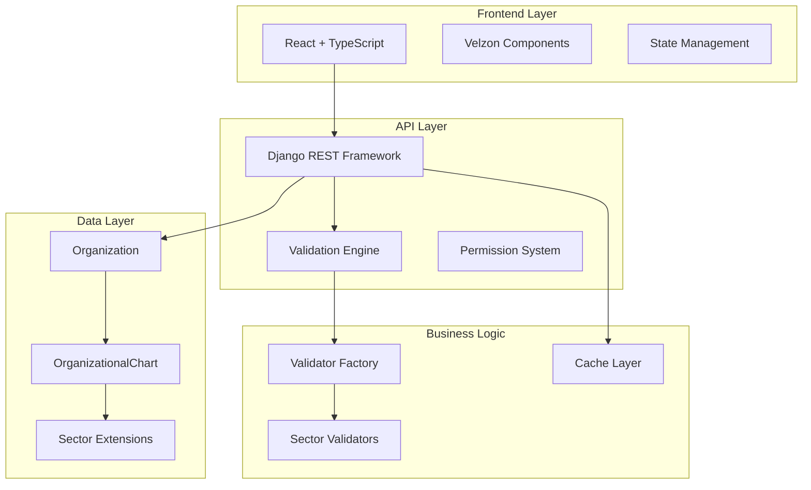
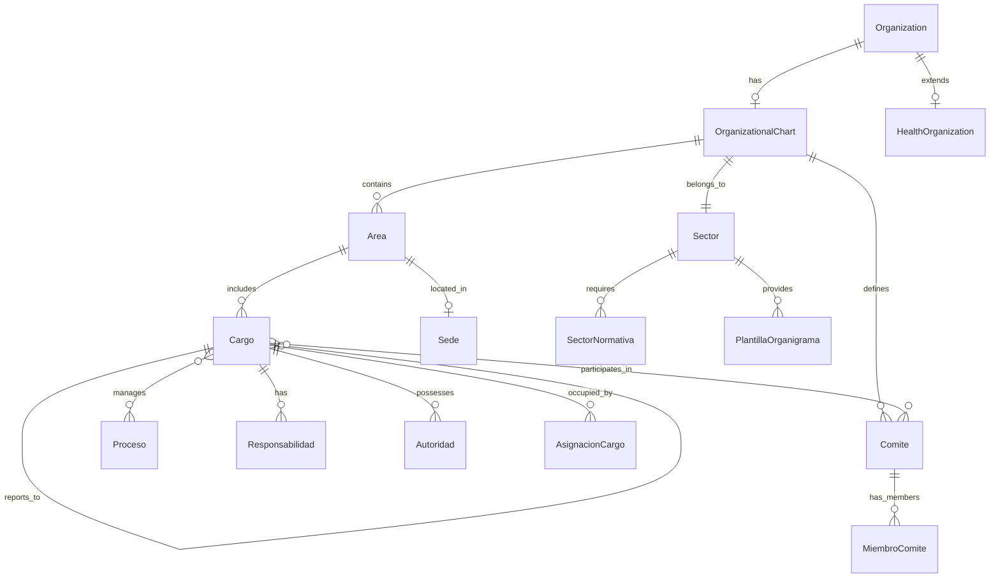

# 🏗️ Organizational Chart Module - Technical Architecture

## 📋 Executive Summary

The Organizational Chart module provides a **multi-sector, fully customizable** organizational structure management system for ZentraQMS. Built on ISO 9001:2015 as the universal foundation with sector-specific specializations, it enables organizations to define hierarchies, responsibilities, and authorities while ensuring regulatory compliance.

**Key Principles:**
- ✅ **Multi-Sector by Design**: Factory pattern for sector-specific validations
- ✅ **Zero Hardcoding**: Fully configurable and customizable
- ✅ **Compliance-First**: Automatic validation against sector regulations
- ✅ **Performance Optimized**: Efficient for 1000+ employee organizations
- ✅ **Integration Ready**: Seamless connection with existing and future modules

---

## 🎯 System Architecture Overview



---

## 🗄️ Data Model Architecture

### Core Entity Relationships



### Django Model Implementation

```python
# apps/organization/models/organizational_chart.py

from django.db import models
from django.contrib.postgres.fields import JSONField
from apps.common.models import FullBaseModel
from apps.organization.models import Organization

class OrganizationalChart(FullBaseModel):
    """
    Versioned multi-sector organizational chart.
    Implements ISO 9001:2015 Clause 5.3 with sector specializations.
    """
    
    # Core relationships
    organization = models.OneToOneField(
        Organization,
        on_delete=models.CASCADE,
        related_name='organizational_chart'
    )
    
    sector = models.ForeignKey(
        'Sector',
        on_delete=models.PROTECT,
        help_text="Organization sector for specialized validations"
    )
    
    # Versioning
    version = models.CharField(max_length=10)
    effective_date = models.DateField()
    end_date = models.DateField(null=True, blank=True)
    is_current = models.BooleanField(default=True)
    
    # Approval tracking
    approved_by = models.ForeignKey(
        settings.AUTH_USER_MODEL,
        on_delete=models.PROTECT,
        related_name='approved_charts'
    )
    approval_date = models.DateTimeField()
    approval_document = models.FileField(
        upload_to='orgcharts/approvals/%Y/%m/'
    )
    
    # Configuration
    hierarchy_levels = models.IntegerField(
        validators=[MinValueValidator(3), MaxValueValidator(10)],
        default=5
    )
    allows_temporary_positions = models.BooleanField(default=True)
    uses_raci_matrix = models.BooleanField(default=True)
    
    # Sector-specific configuration
    sector_config = JSONField(
        default=dict,
        help_text="""
        {
            'validations': [],      # Active sector validations
            'required_committees': [], # Mandatory committees
            'required_positions': [],  # Critical positions
            'compliance_standards': [] # Applied regulations
        }
        """
    )
    
    class Meta:
        db_table = 'org_chart'
        ordering = ['-effective_date', '-version']
        indexes = [
            models.Index(fields=['organization', 'is_current']),
            models.Index(fields=['sector', 'effective_date']),
        ]
        constraints = [
            models.UniqueConstraint(
                fields=['organization', 'version'],
                name='unique_org_version'
            ),
            models.CheckConstraint(
                check=models.Q(hierarchy_levels__gte=3) & 
                      models.Q(hierarchy_levels__lte=10),
                name='valid_hierarchy_levels'
            )
        ]
```

### Multi-Sector Support Models

```python
# apps/organization/models/sector.py

class Sector(FullBaseModel):
    """Sector definitions with specific requirements."""
    
    SECTOR_CODES = [
        ('HEALTH', 'Healthcare'),
        ('EDUCATION', 'Education'),
        ('MANUFACTURING', 'Manufacturing'),
        ('SERVICES', 'Services'),
        ('PUBLIC', 'Public Sector'),
    ]
    
    code = models.CharField(
        max_length=20,
        choices=SECTOR_CODES,
        unique=True
    )
    name = models.CharField(max_length=100)
    description = models.TextField()
    
    # Configuration
    default_config = JSONField(
        default=dict,
        help_text="Default configuration for organizations in this sector"
    )
    
    validation_rules = JSONField(
        default=list,
        help_text="List of validation rules to apply"
    )
    
    is_active = models.BooleanField(default=True)
    
    class Meta:
        db_table = 'sector'
        verbose_name = "Sector"
        verbose_name_plural = "Sectors"


class PlantillaOrganigrama(FullBaseModel):
    """Pre-defined organizational chart templates by sector."""
    
    sector = models.ForeignKey(
        Sector,
        on_delete=models.CASCADE,
        related_name='templates'
    )
    
    organization_type = models.CharField(
        max_length=50,
        help_text="Specific type within sector (e.g., IPS, Hospital)"
    )
    
    complexity = models.CharField(
        max_length=20,
        choices=[
            ('BASIC', 'Basic'),
            ('MEDIUM', 'Medium'),
            ('HIGH', 'High'),
        ]
    )
    
    name = models.CharField(max_length=200)
    description = models.TextField()
    
    # Template structure
    structure = JSONField(
        help_text="""
        {
            'areas': [...],
            'positions': [...],
            'committees': [...],
            'reporting_lines': [...]
        }
        """
    )
    
    is_active = models.BooleanField(default=True)
    
    class Meta:
        db_table = 'org_chart_template'
        unique_together = [['sector', 'organization_type', 'complexity']]
```

### Position and Responsibility Models

```python
# apps/organization/models/position.py

class Area(FullBaseModel):
    """Organizational area or department."""
    
    AREA_TYPES = [
        ('DIRECTION', 'Direction'),
        ('DEPARTMENT', 'Department'),
        ('UNIT', 'Unit'),
        ('SERVICE', 'Service'),
        ('COMMITTEE', 'Committee'),
    ]
    
    organizational_chart = models.ForeignKey(
        OrganizationalChart,
        on_delete=models.CASCADE,
        related_name='areas'
    )
    
    code = models.CharField(max_length=20)
    name = models.CharField(max_length=200)
    area_type = models.CharField(max_length=20, choices=AREA_TYPES)
    
    parent_area = models.ForeignKey(
        'self',
        null=True,
        blank=True,
        on_delete=models.CASCADE,
        related_name='child_areas'
    )
    
    hierarchy_level = models.IntegerField(
        validators=[MinValueValidator(1), MaxValueValidator(10)]
    )
    
    # Location
    sede = models.ForeignKey(
        'organization.Sede',
        null=True,
        blank=True,
        on_delete=models.SET_NULL
    )
    
    # Health services relationship (for healthcare sector)
    health_services = models.ManyToManyField(
        'organization.HealthService',
        blank=True,
        related_name='responsible_areas'
    )
    
    is_active = models.BooleanField(default=True)
    
    class Meta:
        db_table = 'org_area'
        ordering = ['hierarchy_level', 'code']
        indexes = [
            models.Index(fields=['organizational_chart', 'hierarchy_level']),
            models.Index(fields=['parent_area', 'is_active']),
        ]


class Cargo(FullBaseModel):
    """Position within organizational structure."""
    
    HIERARCHY_LEVELS = [
        ('EXECUTIVE', 'Executive Level'),
        ('MANAGEMENT', 'Management Level'),
        ('PROFESSIONAL', 'Professional Level'),
        ('TECHNICAL', 'Technical Level'),
        ('OPERATIONAL', 'Operational Level'),
    ]
    
    area = models.ForeignKey(
        Area,
        on_delete=models.CASCADE,
        related_name='positions'
    )
    
    code = models.CharField(max_length=30)
    name = models.CharField(max_length=200)
    hierarchy_level = models.CharField(max_length=20, choices=HIERARCHY_LEVELS)
    
    reports_to = models.ForeignKey(
        'self',
        null=True,
        blank=True,
        on_delete=models.SET_NULL,
        related_name='subordinates'
    )
    
    # Service relationships (multi-sector support)
    generic_service = models.ForeignKey(
        'Service',
        null=True,
        blank=True,
        on_delete=models.SET_NULL,
        related_name='positions',
        help_text="Generic service this position supports"
    )
    
    # Health service relationship (backward compatibility)
    health_services = models.ManyToManyField(
        'HealthService',
        blank=True,
        related_name='responsible_positions',
        help_text="Health services this position manages (health sector only)"
    )
    
    # Purpose and requirements
    main_purpose = models.TextField()
    requirements = JSONField(
        default=dict,
        help_text="""
        {
            'education': {...},
            'experience': {...},
            'competencies': [...],
            'licenses': [...],
            'service_specific': {...}
        }
        """
    )
    
    # Configuration
    is_critical = models.BooleanField(default=False)
    is_process_owner = models.BooleanField(default=False)
    is_service_leader = models.BooleanField(
        default=False,
        help_text="Is this position a service leader?"
    )
    authorized_positions = models.IntegerField(default=1)
    
    is_active = models.BooleanField(default=True)
    
    class Meta:
        db_table = 'org_position'
        ordering = ['area__hierarchy_level', 'code']
        indexes = [
            models.Index(fields=['area', 'is_active']),
            models.Index(fields=['reports_to', 'hierarchy_level']),
            models.Index(fields=['generic_service', 'is_service_leader']),
        ]
    
    def get_managed_service(self):
        """Get the service this position manages (generic or health)."""
        if self.generic_service:
            return self.generic_service
        elif self.health_services.exists():
            return self.health_services.first()
        return None
    
    def is_sector_specific(self):
        """Check if position is sector-specific."""
        return self.generic_service is not None or self.health_services.exists()
```

---

## 🔌 API Design (Django REST Framework)

### ViewSets Implementation

```python
# apps/organization/views/organizational_chart_views.py

from rest_framework import viewsets, status
from rest_framework.decorators import action
from rest_framework.response import Response
from apps.authorization.drf_permissions import ModularPermission
from apps.organization.models import OrganizationalChart, Service, ServiceIntegration
from apps.organization.serializers import (
    OrganizationalChartSerializer,
    ServiceSerializer,
    ServiceIntegrationSerializer
)
from apps.organization.validators import OrganizationalChartValidator

class OrganizationalChartViewSet(viewsets.ModelViewSet):
    """
    ViewSet for organizational chart management.
    Implements multi-sector validation and versioning.
    """
    
    permission_classes = [ModularPermission]
    serializer_class = OrganizationalChartSerializer
    queryset = OrganizationalChart.objects.all()
    
    def get_queryset(self):
        """Filter by organization and include related data."""
        queryset = super().get_queryset()
        
        # Optimize queries with select_related and prefetch_related
        queryset = queryset.select_related(
            'organization',
            'sector',
            'approved_by'
        ).prefetch_related(
            'areas__positions__responsibilities',
            'areas__positions__authorities',
            'committees__members'
        )
        
        # Filter by user's organization
        if hasattr(self.request.user, 'organization'):
            queryset = queryset.filter(
                organization=self.request.user.organization
            )
        
        return queryset
    
    @action(detail=False, methods=['get'])
    def current(self, request):
        """Get current active organizational chart."""
        try:
            chart = self.get_queryset().filter(is_current=True).first()
            if not chart:
                return Response(
                    {'detail': 'No active organizational chart found'},
                    status=status.HTTP_404_NOT_FOUND
                )
            serializer = self.get_serializer(chart)
            return Response(serializer.data)
        except Exception as e:
            return Response(
                {'detail': str(e)},
                status=status.HTTP_500_INTERNAL_SERVER_ERROR
            )
    
    @action(detail=True, methods=['post'])
    def validate_compliance(self, request, pk=None):
        """Validate organizational chart against sector requirements."""
        chart = self.get_object()
        validator = OrganizationalChartValidator()
        
        results = validator.validate(chart)
        
        return Response({
            'compliance': results['summary']['complies_with_regulations'],
            'critical_errors': results['summary']['critical_errors'],
            'warnings': results['summary']['warnings'],
            'details': results
        })
    
    @action(detail=False, methods=['post'])
    def create_from_template(self, request):
        """Create organizational chart from sector template."""
        template_id = request.data.get('template_id')
        
        try:
            template = PlantillaOrganigrama.objects.get(id=template_id)
            
            # Create chart from template
            service = OrganizationalChartService()
            chart = service.create_from_template(
                organization=request.user.organization,
                template=template
            )
            
            serializer = self.get_serializer(chart)
            return Response(
                serializer.data,
                status=status.HTTP_201_CREATED
            )
        except PlantillaOrganigrama.DoesNotExist:
            return Response(
                {'detail': 'Template not found'},
                status=status.HTTP_404_NOT_FOUND
            )
    
    @action(detail=True, methods=['post'])
    def approve(self, request, pk=None):
        """Approve organizational chart and make it current."""
        chart = self.get_object()
        
        # Validate user has approval permissions
        if not request.user.has_perm('organization.approve_chart'):
            return Response(
                {'detail': 'You do not have permission to approve charts'},
                status=status.HTTP_403_FORBIDDEN
            )
        
        # Mark previous versions as non-current
        OrganizationalChart.objects.filter(
            organization=chart.organization,
            is_current=True
        ).update(is_current=False, end_date=timezone.now().date())
        
        # Approve current chart
        chart.is_current = True
        chart.approved_by = request.user
        chart.approval_date = timezone.now()
        chart.save()
        
        return Response({'detail': 'Chart approved successfully'})


class ServiceViewSet(viewsets.ModelViewSet):
    """
    ViewSet for multi-sector service management.
    """
    
    permission_classes = [ModularPermission]
    serializer_class = ServiceSerializer
    queryset = Service.objects.all()
    
    def get_queryset(self):
        """Filter services by sector and organization."""
        queryset = super().get_queryset()
        
        # Filter by sector if provided
        sector_code = self.request.query_params.get('sector')
        if sector_code:
            queryset = queryset.filter(sector__code=sector_code)
        
        # Filter by category
        category = self.request.query_params.get('category')
        if category:
            queryset = queryset.filter(category=category)
        
        # Filter mandatory services
        is_mandatory = self.request.query_params.get('is_mandatory')
        if is_mandatory is not None:
            queryset = queryset.filter(is_mandatory=is_mandatory == 'true')
        
        return queryset.select_related('sector', 'parent_service')
    
    @action(detail=False, methods=['get'])
    def by_sector(self, request):
        """Get services grouped by sector."""
        services_by_sector = {}
        
        for sector in Sector.objects.filter(is_active=True):
            services = Service.objects.filter(
                sector=sector,
                is_active=True
            ).values('id', 'code', 'name', 'category', 'is_mandatory')
            
            services_by_sector[sector.code] = {
                'sector_name': sector.name,
                'services': list(services)
            }
        
        return Response(services_by_sector)
    
    @action(detail=False, methods=['get'])
    def mandatory(self, request):
        """Get mandatory services for user's organization sector."""
        if not hasattr(request.user, 'organization'):
            return Response(
                {'detail': 'User has no organization'},
                status=status.HTTP_400_BAD_REQUEST
            )
        
        sector = request.user.organization.sector
        mandatory_services = Service.objects.filter(
            sector=sector,
            is_mandatory=True,
            is_active=True
        )
        
        serializer = self.get_serializer(mandatory_services, many=True)
        return Response(serializer.data)
    
    @action(detail=True, methods=['get'])
    def positions(self, request, pk=None):
        """Get required positions for a service."""
        service = self.get_object()
        return Response({
            'service': service.name,
            'required_positions': service.required_positions,
            'minimum_staff': service.get_minimum_staff()
        })


class ServiceIntegrationViewSet(viewsets.ModelViewSet):
    """
    ViewSet for service integration management.
    """
    
    permission_classes = [ModularPermission]
    serializer_class = ServiceIntegrationSerializer
    
    def get_queryset(self):
        """Filter integrations by user's organization."""
        queryset = ServiceIntegration.objects.all()
        
        if hasattr(self.request.user, 'organization'):
            queryset = queryset.filter(
                organization=self.request.user.organization
            )
        
        return queryset.select_related(
            'organization',
            'service',
            'health_service',
            'responsible_area',
            'responsible_position'
        )
    
    @action(detail=False, methods=['post'])
    def validate(self, request):
        """Validate service coverage for organization."""
        organization = request.user.organization
        
        # Get mandatory services for sector
        mandatory_services = Service.objects.filter(
            sector=organization.sector,
            is_mandatory=True,
            is_active=True
        )
        
        # Get current integrations
        current_integrations = ServiceIntegration.objects.filter(
            organization=organization,
            is_active=True
        ).values_list('service_id', flat=True)
        
        # Find missing services
        missing_services = []
        for service in mandatory_services:
            if service.id not in current_integrations:
                missing_services.append({
                    'id': service.id,
                    'code': service.code,
                    'name': service.name,
                    'required_positions': service.required_positions
                })
        
        return Response({
            'is_compliant': len(missing_services) == 0,
            'missing_services': missing_services,
            'coverage_percentage': (
                (len(current_integrations) / len(mandatory_services) * 100)
                if mandatory_services else 100
            )
        })
    
    @action(detail=False, methods=['post'])
    def auto_create(self, request):
        """Auto-create positions for selected services."""
        service_ids = request.data.get('service_ids', [])
        
        if not service_ids:
            return Response(
                {'detail': 'No services provided'},
                status=status.HTTP_400_BAD_REQUEST
            )
        
        organization = request.user.organization
        chart = OrganizationalChart.objects.filter(
            organization=organization,
            is_current=True
        ).first()
        
        if not chart:
            return Response(
                {'detail': 'No active organizational chart found'},
                status=status.HTTP_400_BAD_REQUEST
            )
        
        created_positions = []
        
        for service_id in service_ids:
            try:
                service = Service.objects.get(id=service_id)
                
                # Use ServiceIntegrationManager to create positions
                ServiceIntegrationManager._create_service_integration(
                    organization, chart, service
                )
                
                created_positions.append(service.name)
                
            except Service.DoesNotExist:
                continue
        
        return Response({
            'detail': f'Created positions for {len(created_positions)} services',
            'services': created_positions
        })
```

### Serializers with Dynamic Validation

```python
# apps/organization/serializers/organizational_chart_serializers.py

from rest_framework import serializers
from apps.organization.models import OrganizationalChart, Area, Cargo
from apps.organization.validators import ValidatorFactory

class CargoSerializer(serializers.ModelSerializer):
    """Serializer for positions with nested relationships."""
    
    reports_to_name = serializers.CharField(
        source='reports_to.name',
        read_only=True
    )
    subordinates_count = serializers.IntegerField(
        source='subordinates.count',
        read_only=True
    )
    
    class Meta:
        model = Cargo
        fields = [
            'id', 'code', 'name', 'hierarchy_level',
            'main_purpose', 'requirements', 'is_critical',
            'reports_to', 'reports_to_name', 'subordinates_count',
            'authorized_positions', 'is_active'
        ]
    
    def validate(self, attrs):
        """Validate position based on sector requirements."""
        if self.instance:
            chart = self.instance.area.organizational_chart
            validator = ValidatorFactory.get_validator(chart.sector.code)
            
            # Run sector-specific position validations
            errors = validator.validate_position(attrs)
            if errors:
                raise serializers.ValidationError(errors)
        
        return attrs


class AreaSerializer(serializers.ModelSerializer):
    """Serializer for organizational areas."""
    
    positions = CargoSerializer(many=True, read_only=True)
    position_count = serializers.IntegerField(
        source='positions.count',
        read_only=True
    )
    
    class Meta:
        model = Area
        fields = [
            'id', 'code', 'name', 'area_type',
            'parent_area', 'hierarchy_level',
            'positions', 'position_count',
            'sede', 'health_services', 'is_active'
        ]


class OrganizationalChartSerializer(serializers.ModelSerializer):
    """Main serializer for organizational chart."""
    
    areas = AreaSerializer(many=True, read_only=True)
    compliance_status = serializers.SerializerMethodField()
    total_positions = serializers.IntegerField(read_only=True)
    filled_positions = serializers.IntegerField(read_only=True)
    
    class Meta:
        model = OrganizationalChart
        fields = [
            'id', 'organization', 'sector', 'version',
            'effective_date', 'end_date', 'is_current',
            'approved_by', 'approval_date',
            'hierarchy_levels', 'sector_config',
            'areas', 'compliance_status',
            'total_positions', 'filled_positions'
        ]
    
    def get_compliance_status(self, obj):
        """Calculate compliance status dynamically."""
        validator = ValidatorFactory.get_validator(obj.sector.code)
        results = validator.validate(obj)
        return {
            'compliant': results['summary']['complies_with_regulations'],
            'critical_issues': results['summary']['critical_errors']
        }
    
    def create(self, validated_data):
        """Create organizational chart with automatic versioning."""
        organization = validated_data['organization']
        
        # Generate next version
        last_version = OrganizationalChart.objects.filter(
            organization=organization
        ).order_by('-version').first()
        
        if last_version:
            version_parts = last_version.version.split('.')
            major = int(version_parts[0])
            minor = int(version_parts[1]) if len(version_parts) > 1 else 0
            validated_data['version'] = f"{major}.{minor + 1}"
        else:
            validated_data['version'] = "1.0"
        
        return super().create(validated_data)


class ServiceSerializer(serializers.ModelSerializer):
    """Serializer for multi-sector services."""
    
    sector_name = serializers.CharField(
        source='sector.name',
        read_only=True
    )
    minimum_staff = serializers.SerializerMethodField()
    sub_services = serializers.PrimaryKeyRelatedField(
        many=True,
        read_only=True
    )
    
    class Meta:
        model = Service
        fields = [
            'id', 'code', 'name', 'sector', 'sector_name',
            'category', 'description', 'is_mandatory',
            'required_positions', 'regulatory_requirements',
            'parent_service', 'sub_services', 'minimum_staff',
            'is_active'
        ]
    
    def get_minimum_staff(self, obj):
        """Calculate minimum staff required."""
        return obj.get_minimum_staff()
    
    def validate_required_positions(self, value):
        """Validate required positions structure."""
        for position in value:
            if 'position_type' not in position:
                raise serializers.ValidationError(
                    "Each position must have a position_type"
                )
            if 'name' not in position:
                raise serializers.ValidationError(
                    "Each position must have a name"
                )
        return value


class ServiceIntegrationSerializer(serializers.ModelSerializer):
    """Serializer for service integrations."""
    
    service_name = serializers.CharField(
        source='service.name',
        read_only=True
    )
    organization_name = serializers.CharField(
        source='organization.razon_social',
        read_only=True
    )
    area_name = serializers.CharField(
        source='responsible_area.name',
        read_only=True,
        allow_null=True
    )
    position_name = serializers.CharField(
        source='responsible_position.name',
        read_only=True,
        allow_null=True
    )
    health_service_name = serializers.CharField(
        source='health_service.nombre_servicio',
        read_only=True,
        allow_null=True
    )
    
    class Meta:
        model = ServiceIntegration
        fields = [
            'id', 'organization', 'organization_name',
            'service', 'service_name',
            'health_service', 'health_service_name',
            'responsible_area', 'area_name',
            'responsible_position', 'position_name',
            'is_active', 'start_date', 'end_date',
            'service_config'
        ]
    
    def validate(self, attrs):
        """Validate service integration."""
        organization = attrs.get('organization')
        service = attrs.get('service')
        
        # Check if service is valid for organization's sector
        if service and organization:
            if service.sector != organization.sector:
                raise serializers.ValidationError(
                    "Service must belong to organization's sector"
                )
        
        # Check for duplicate active integration
        if self.instance is None:  # Creating new
            existing = ServiceIntegration.objects.filter(
                organization=organization,
                service=service,
                is_active=True
            ).exists()
            
            if existing:
                raise serializers.ValidationError(
                    "An active integration already exists for this service"
                )
        
        return attrs
```

### API Endpoints Structure

```yaml
# API Routes Configuration

# Organizational Chart Endpoints
/api/v1/organizational-chart/:
  GET: List all organizational charts for organization
  POST: Create new organizational chart
  
/api/v1/organizational-chart/current/:
  GET: Get current active chart
  
/api/v1/organizational-chart/{id}/:
  GET: Retrieve specific chart
  PUT: Update chart (if not approved)
  DELETE: Delete chart (if not current)
  
/api/v1/organizational-chart/{id}/validate-compliance/:
  POST: Validate against sector requirements
  
/api/v1/organizational-chart/{id}/approve/:
  POST: Approve and activate chart
  
/api/v1/organizational-chart/create-from-template/:
  POST: Create from sector template

# Areas Endpoints  
/api/v1/areas/:
  GET: List all areas in current chart
  POST: Create new area
  
/api/v1/areas/{id}/:
  GET: Retrieve area details
  PUT: Update area
  DELETE: Delete area (if no positions)

# Positions Endpoints  
/api/v1/positions/:
  GET: List all positions
  POST: Create new position
  
/api/v1/positions/{id}/:
  GET: Retrieve position details
  PUT: Update position
  DELETE: Delete position (if not assigned)
  
/api/v1/positions/{id}/assign-service/:
  POST: Assign generic service to position
  DELETE: Remove service assignment

# Committees Endpoints  
/api/v1/committees/:
  GET: List all committees
  POST: Create new committee
  
/api/v1/committees/{id}/members/:
  GET: List committee members
  POST: Add member
  DELETE: Remove member

# Multi-Sector Services Endpoints (NEW)
/api/v1/services/:
  GET: List all services (filter by sector)
  POST: Create new service
  
/api/v1/services/by-sector/{sector_code}/:
  GET: Get services for specific sector
  
/api/v1/services/{id}/:
  GET: Retrieve service details
  PUT: Update service
  DELETE: Delete service (if not in use)
  
/api/v1/services/{id}/positions/:
  GET: List required positions for service
  
/api/v1/services/mandatory/:
  GET: List mandatory services for organization sector

# Service Integration Endpoints (NEW)  
/api/v1/service-integrations/:
  GET: List organization's service integrations
  POST: Create service integration
  
/api/v1/service-integrations/{id}/:
  GET: Retrieve integration details
  PUT: Update integration
  DELETE: Remove integration
  
/api/v1/service-integrations/validate/:
  POST: Validate service coverage for organization
  
/api/v1/service-integrations/auto-create/:
  POST: Auto-create positions for selected services

# Sector Services Templates (NEW)
/api/v1/sector-services/initialize/:
  POST: Initialize services for a sector
  
/api/v1/sector-services/health/migrate/:
  POST: Migrate existing health services to generic model
```

---

## ✅ Multi-Sector Validation System

### Validation Factory Pattern

```python
# apps/organization/validators/base.py

from abc import ABC, abstractmethod
from typing import List, Dict, Any

class BaseValidator(ABC):
    """Abstract base validator for all sectors."""
    
    @abstractmethod
    def validate_minimum_structure(self, chart: OrganizationalChart) -> List[Dict]:
        """Validate minimum organizational structure requirements."""
        pass
    
    @abstractmethod
    def validate_mandatory_committees(self, chart: OrganizationalChart) -> List[Dict]:
        """Validate required committees for the sector."""
        pass
    
    @abstractmethod
    def validate_critical_positions(self, chart: OrganizationalChart) -> List[Dict]:
        """Validate critical positions are defined."""
        pass
    
    @abstractmethod
    def validate_reporting_lines(self, chart: OrganizationalChart) -> List[Dict]:
        """Validate reporting structure integrity."""
        pass


# apps/organization/validators/universal.py

class UniversalValidator(BaseValidator):
    """ISO 9001:2015 universal validator for all sectors."""
    
    def validate_minimum_structure(self, chart):
        errors = []
        
        # Check for legal representative
        if not self._has_position_type(chart, 'LEGAL_REPRESENTATIVE'):
            errors.append({
                'code': 'ISO-001',
                'message': 'Legal representative position is required',
                'standard': 'ISO 9001:2015 - Clause 5.3',
                'severity': 'CRITICAL'
            })
        
        # Check for quality manager
        if not self._has_position_type(chart, 'QUALITY_MANAGER'):
            errors.append({
                'code': 'ISO-002',
                'message': 'Quality management system leader is required',
                'standard': 'ISO 9001:2015 - Clause 5.3',
                'severity': 'CRITICAL'
            })
        
        # Check minimum hierarchy levels
        if chart.hierarchy_levels < 3:
            errors.append({
                'code': 'ISO-003',
                'message': 'Minimum 3 hierarchy levels required',
                'standard': 'ISO 9001:2015 - Organizational Context',
                'severity': 'WARNING'
            })
        
        return errors
    
    def validate_mandatory_committees(self, chart):
        errors = []
        
        # Management committee is universal
        if not chart.committees.filter(type='MANAGEMENT').exists():
            errors.append({
                'code': 'ISO-004',
                'message': 'Management committee is required',
                'standard': 'ISO 9001:2015 - Management Review',
                'severity': 'HIGH'
            })
        
        return errors
    
    def validate_critical_positions(self, chart):
        # No additional critical positions for universal
        return []
    
    def validate_reporting_lines(self, chart):
        errors = []
        
        # Check for orphaned positions
        orphaned = Cargo.objects.filter(
            area__organizational_chart=chart,
            reports_to__isnull=True
        ).exclude(hierarchy_level='EXECUTIVE')
        
        for position in orphaned:
            errors.append({
                'code': 'STRUCT-001',
                'message': f'Position {position.name} has no reporting line',
                'severity': 'WARNING'
            })
        
        # Check for circular references
        if self._has_circular_reporting(chart):
            errors.append({
                'code': 'STRUCT-002',
                'message': 'Circular reporting structure detected',
                'severity': 'CRITICAL'
            })
        
        return errors


# apps/organization/validators/health.py

class HealthValidator(BaseValidator):
    """Healthcare sector validator (SOGCS Colombia)."""
    
    def __init__(self):
        self.universal = UniversalValidator()
    
    def validate_minimum_structure(self, chart):
        # Start with universal validations
        errors = self.universal.validate_minimum_structure(chart)
        
        org_type = chart.organization.tipo_organizacion
        
        if org_type in ['ips', 'hospital', 'clinica']:
            # Medical director required
            if not self._has_position_type(chart, 'MEDICAL_DIRECTOR'):
                errors.append({
                    'code': 'HEALTH-001',
                    'message': 'Medical or Scientific Director required',
                    'standard': 'Resolution 2003/2014',
                    'severity': 'CRITICAL'
                })
            
            # Patient safety leader
            if not self._has_position_type(chart, 'PATIENT_SAFETY_LEADER'):
                errors.append({
                    'code': 'HEALTH-002',
                    'message': 'Patient Safety Leader required',
                    'standard': 'Resolution 0112/2012',
                    'severity': 'CRITICAL'
                })
            
            # PAMEC coordinator
            if not self._has_position_type(chart, 'PAMEC_COORDINATOR'):
                errors.append({
                    'code': 'HEALTH-003',
                    'message': 'PAMEC Coordinator required',
                    'standard': 'Decree 1011/2006',
                    'severity': 'HIGH'
                })
        
        return errors
    
    def validate_mandatory_committees(self, chart):
        errors = self.universal.validate_mandatory_committees(chart)
        
        # Healthcare-specific committees
        required_committees = [
            ('PATIENT_SAFETY', 'Patient Safety Committee', 'Res. 0112/2012'),
            ('MEDICAL_RECORDS', 'Medical Records Committee', 'Res. 1995/1999'),
            ('QUALITY', 'Quality Committee', 'Res. 2003/2014'),
            ('COPASST', 'COPASST', 'Res. 2013/1986'),
        ]
        
        for code, name, standard in required_committees:
            if not chart.committees.filter(type=code).exists():
                errors.append({
                    'code': f'COM-{code}',
                    'message': f'{name} is mandatory',
                    'standard': standard,
                    'severity': 'CRITICAL'
                })
        
        # Pharmacy committee if pharmaceutical service exists
        if self._has_pharmaceutical_service(chart):
            if not chart.committees.filter(type='PHARMACY').exists():
                errors.append({
                    'code': 'COM-PHARMACY',
                    'message': 'Pharmacy and Therapeutics Committee required',
                    'standard': 'Decree 2200/2005',
                    'severity': 'CRITICAL'
                })
        
        return errors
    
    def validate_critical_positions(self, chart):
        errors = []
        services = chart.organization.healthorganization.healthservice_set.all()
        
        # Map services to required positions
        service_position_map = {
            '501': ('EMERGENCY_CHIEF', 'Emergency Department Chief'),
            '301': ('HOSPITALIZATION_CHIEF', 'Hospitalization Chief'),
            '701': ('PHARMACEUTICAL_CHEMIST', 'Pharmaceutical Chemist'),
            '601': ('LAB_CHIEF', 'Laboratory Chief'),
        }
        
        for service in services:
            if service.codigo_servicio in service_position_map:
                position_type, position_name = service_position_map[service.codigo_servicio]
                if not self._has_position_type(chart, position_type):
                    errors.append({
                        'code': f'POS-{position_type}',
                        'message': f'{service.nombre_servicio} requires {position_name}',
                        'standard': 'Resolution 3100/2019',
                        'severity': 'HIGH'
                    })
        
        return errors
```

### Validator Factory Implementation

```python
# apps/organization/validators/factory.py

from apps.organization.validators.universal import UniversalValidator
from apps.organization.validators.health import HealthValidator
from apps.organization.validators.education import EducationValidator
from apps.organization.validators.manufacturing import ManufacturingValidator

class ValidatorFactory:
    """Factory to get appropriate validator by sector."""
    
    _validators = {
        'HEALTH': HealthValidator,
        'EDUCATION': EducationValidator,
        'MANUFACTURING': ManufacturingValidator,
        'SERVICES': UniversalValidator,  # Default to universal
        'PUBLIC': UniversalValidator,     # Default to universal
    }
    
    @classmethod
    def get_validator(cls, sector_code: str):
        """Get validator instance for sector."""
        validator_class = cls._validators.get(
            sector_code,
            UniversalValidator
        )
        return validator_class()
    
    @classmethod
    def register_validator(cls, sector_code: str, validator_class):
        """Register new validator for a sector."""
        cls._validators[sector_code] = validator_class


class OrganizationalChartValidator:
    """Main validator orchestrating all validations."""
    
    def validate(self, chart: OrganizationalChart) -> Dict:
        """Execute all validations for the chart."""
        
        # Get sector-specific validator
        validator = ValidatorFactory.get_validator(chart.sector.code)
        
        # Run all validations
        results = {
            'structure': validator.validate_minimum_structure(chart),
            'committees': validator.validate_mandatory_committees(chart),
            'positions': validator.validate_critical_positions(chart),
            'reporting': validator.validate_reporting_lines(chart),
        }
        
        # Calculate summary
        all_errors = []
        for category in results.values():
            all_errors.extend(category)
        
        results['summary'] = {
            'total_errors': len(all_errors),
            'critical_errors': len([e for e in all_errors if e.get('severity') == 'CRITICAL']),
            'high_priority': len([e for e in all_errors if e.get('severity') == 'HIGH']),
            'warnings': len([e for e in all_errors if e.get('severity') == 'WARNING']),
            'complies_with_regulations': len([e for e in all_errors if e.get('severity') == 'CRITICAL']) == 0
        }
        
        return results
```

---

## 🎨 Frontend Architecture (React + TypeScript)

### Component Structure with Velzon Integration

```typescript
// frontend/src/modules/organizational-chart/types/index.ts

export interface OrganizationalChart {
  id: string;
  organization: string;
  sector: Sector;
  version: string;
  effectiveDate: string;
  endDate?: string;
  isCurrent: boolean;
  approvedBy?: User;
  approvalDate?: string;
  hierarchyLevels: number;
  sectorConfig: SectorConfig;
  areas: Area[];
  complianceStatus: ComplianceStatus;
}

export interface Area {
  id: string;
  code: string;
  name: string;
  areaType: AreaType;
  parentArea?: string;
  hierarchyLevel: number;
  positions: Position[];
  sede?: Sede;
  healthServices?: string[];
  isActive: boolean;
}

export interface Position {
  id: string;
  code: string;
  name: string;
  hierarchyLevel: HierarchyLevel;
  mainPurpose: string;
  requirements: PositionRequirements;
  reportsTo?: string;
  isCritical: boolean;
  authorizedPositions: number;
  isActive: boolean;
}

export interface ComplianceStatus {
  compliant: boolean;
  criticalIssues: number;
  warnings: number;
  details?: ValidationResult[];
}
```

### Main Component Layout Architecture

```typescript
// frontend/src/modules/organizational-chart/components/OrganizationalChartModule.tsx

import React from 'react';
import { LayoutWithBreadcrumb } from '@/components/layout/LayoutWithBreadcrumb';
import { useModuleConfig } from '@/config/moduleConfigs';
import { OrganizationalChartProvider } from '../context/OrganizationalChartContext';
import { ChartVisualization } from './ChartVisualization';
import { ChartToolbar } from './ChartToolbar';

export const OrganizationalChartModule: React.FC = () => {
  const moduleConfig = useModuleConfig('organizational-chart');
  
  return (
    <LayoutWithBreadcrumb moduleConfig={moduleConfig}>
      <OrganizationalChartProvider>
        <div className="organizational-chart-module">
          <ChartToolbar />
          <ChartVisualization />
        </div>
      </OrganizationalChartProvider>
    </LayoutWithBreadcrumb>
  );
};
```

### Velzon Component Mapping

```typescript
// frontend/src/modules/organizational-chart/config/velzonMapping.ts

export const VELZON_COMPONENTS = {
  // Cards from Velzon template
  cards: {
    positionCard: 'components/Cards/CardWithImage',
    areaCard: 'components/Cards/StatisticsCard',
    complianceCard: 'components/Cards/ProgressCard',
    committeeCard: 'components/Cards/TeamCard'
  },
  
  // Forms from Velzon
  forms: {
    positionForm: 'components/Forms/FormLayouts/VerticalForm',
    areaForm: 'components/Forms/FormLayouts/HorizontalForm',
    committeeForm: 'components/Forms/FormLayouts/MultiColumnForm'
  },
  
  // Tables from Velzon
  tables: {
    positionsTable: 'components/Tables/DataTable',
    areasTable: 'components/Tables/ResponsiveTable',
    committeesTable: 'components/Tables/TableWithActions'
  },
  
  // Charts from Velzon
  charts: {
    hierarchyChart: 'components/Charts/TreemapChart',
    complianceChart: 'components/Charts/RadialChart',
    distributionChart: 'components/Charts/PieChart'
  },
  
  // Modals from Velzon
  modals: {
    positionModal: 'components/Modals/FullscreenModal',
    areaModal: 'components/Modals/LargeModal',
    validationModal: 'components/Modals/ScrollableModal'
  }
};
```

### State Management with Zustand

```typescript
// frontend/src/modules/organizational-chart/stores/organizationalChartStore.ts

import { create } from 'zustand';
import { devtools } from 'zustand/middleware';
import { OrganizationalChartService } from '../services/organizationalChartService';

interface OrganizationalChartState {
  // State
  currentChart: OrganizationalChart | null;
  charts: OrganizationalChart[];
  selectedArea: Area | null;
  selectedPosition: Position | null;
  complianceResults: ComplianceResults | null;
  isLoading: boolean;
  error: string | null;
  
  // Actions
  loadCurrentChart: () => Promise<void>;
  loadCharts: () => Promise<void>;
  createChart: (data: CreateChartDTO) => Promise<void>;
  updateChart: (id: string, data: UpdateChartDTO) => Promise<void>;
  validateCompliance: (chartId: string) => Promise<void>;
  approveChart: (chartId: string) => Promise<void>;
  createFromTemplate: (templateId: string) => Promise<void>;
  
  // Area management
  createArea: (data: CreateAreaDTO) => Promise<void>;
  updateArea: (id: string, data: UpdateAreaDTO) => Promise<void>;
  deleteArea: (id: string) => Promise<void>;
  
  // Position management
  createPosition: (data: CreatePositionDTO) => Promise<void>;
  updatePosition: (id: string, data: UpdatePositionDTO) => Promise<void>;
  deletePosition: (id: string) => Promise<void>;
  assignToPosition: (positionId: string, userId: string) => Promise<void>;
  
  // UI State
  selectArea: (area: Area | null) => void;
  selectPosition: (position: Position | null) => void;
  clearError: () => void;
}

export const useOrganizationalChartStore = create<OrganizationalChartState>()(
  devtools(
    (set, get) => ({
      // Initial state
      currentChart: null,
      charts: [],
      selectedArea: null,
      selectedPosition: null,
      complianceResults: null,
      isLoading: false,
      error: null,
      
      // Implementation of actions
      loadCurrentChart: async () => {
        set({ isLoading: true, error: null });
        try {
          const chart = await OrganizationalChartService.getCurrentChart();
          set({ currentChart: chart, isLoading: false });
        } catch (error) {
          set({ error: error.message, isLoading: false });
        }
      },
      
      validateCompliance: async (chartId: string) => {
        set({ isLoading: true });
        try {
          const results = await OrganizationalChartService.validateCompliance(chartId);
          set({ complianceResults: results, isLoading: false });
        } catch (error) {
          set({ error: error.message, isLoading: false });
        }
      },
      
      // ... other action implementations
    }),
    {
      name: 'organizational-chart-store',
    }
  )
);
```

### Chart Visualization Component

```typescript
// frontend/src/modules/organizational-chart/components/ChartVisualization.tsx

import React, { useMemo } from 'react';
import { Card, CardBody } from 'reactstrap';
import { TreemapChart } from '@/components/Charts';
import { useOrganizationalChartStore } from '../stores/organizationalChartStore';

export const ChartVisualization: React.FC = () => {
  const { currentChart, selectedArea, selectArea } = useOrganizationalChartStore();
  
  const chartData = useMemo(() => {
    if (!currentChart) return null;
    
    // Transform organizational data to treemap format
    return transformToTreemap(currentChart.areas);
  }, [currentChart]);
  
  const handleNodeClick = (node: any) => {
    const area = currentChart?.areas.find(a => a.id === node.id);
    if (area) {
      selectArea(area);
    }
  };
  
  if (!currentChart) {
    return <EmptyState message="No organizational chart available" />;
  }
  
  return (
    <Card>
      <CardBody>
        <div className="d-flex justify-content-between align-items-center mb-4">
          <h4 className="card-title">Estructura Organizacional</h4>
          <ComplianceIndicator chart={currentChart} />
        </div>
        
        <div className="organizational-chart-container">
          <TreemapChart
            data={chartData}
            onNodeClick={handleNodeClick}
            height={600}
            colors={['#4b38b3', '#0ab39c', '#405189']}
          />
        </div>
        
        {selectedArea && (
          <AreaDetailPanel area={selectedArea} />
        )}
      </CardBody>
    </Card>
  );
};
```

---

## 🔄 Integration Architecture

### Integration with Existing Modules

```python
# apps/organization/integrations/process_integration.py

class ProcessIntegration:
    """Integration between Organizational Chart and Process modules."""
    
    @staticmethod
    def assign_process_owners(chart: OrganizationalChart):
        """Automatically assign process owners based on positions."""
        
        # Map position types to process categories
        position_process_map = {
            'QUALITY_MANAGER': ['quality_management', 'continuous_improvement'],
            'MEDICAL_DIRECTOR': ['clinical_processes', 'patient_care'],
            'OPERATIONS_MANAGER': ['operational_processes', 'logistics'],
        }
        
        for position_type, process_categories in position_process_map.items():
            position = Cargo.objects.filter(
                area__organizational_chart=chart,
                position_type=position_type,
                is_active=True
            ).first()
            
            if position:
                Process.objects.filter(
                    organization=chart.organization,
                    category__in=process_categories,
                    owner__isnull=True
                ).update(owner=position)
    
    @staticmethod
    def create_raci_matrix(process: Process, chart: OrganizationalChart):
        """Generate RACI matrix for process activities."""
        
        activities = process.activities.all()
        positions = Cargo.objects.filter(
            area__organizational_chart=chart,
            is_process_participant=True
        )
        
        matrix = []
        for activity in activities:
            # Determine RACI roles based on position hierarchy
            responsible = positions.filter(
                hierarchy_level='OPERATIONAL'
            ).first()
            
            accountable = positions.filter(
                hierarchy_level='MANAGEMENT'
            ).first()
            
            consulted = positions.filter(
                hierarchy_level='PROFESSIONAL'
            )
            
            informed = positions.filter(
                hierarchy_level='EXECUTIVE'
            )
            
            matrix.append({
                'activity': activity,
                'responsible': responsible,
                'accountable': accountable,
                'consulted': list(consulted),
                'informed': list(informed)
            })
        
        return matrix
```

### Integration with Sede Module

```python
# apps/organization/integrations/sede_integration.py

class SedeIntegration:
    """Integration between Organizational Chart and Sede modules."""
    
    @staticmethod
    def distribute_positions_by_sede(chart: OrganizationalChart):
        """Distribute positions across organization locations."""
        
        sedes = chart.organization.sedes.all()
        main_sede = sedes.filter(es_principal=True).first()
        
        for area in chart.areas.all():
            if area.sede is None:
                # Assign main sede by default
                area.sede = main_sede
                area.save()
            
            # Distribute positions based on sede capacity
            for position in area.positions.all():
                CargoSede.objects.get_or_create(
                    cargo=position,
                    sede=area.sede,
                    defaults={'cantidad_plazas': position.authorized_positions}
                )
    
    @staticmethod
    def get_sede_organizational_structure(sede: Sede):
        """Get organizational structure for specific sede."""
        
        areas = Area.objects.filter(
            sede=sede,
            organizational_chart__is_current=True
        ).prefetch_related('positions')
        
        structure = {
            'sede': sede,
            'areas': areas,
            'total_positions': sum(
                area.positions.count() for area in areas
            ),
            'hierarchy_tree': build_hierarchy_tree(areas)
        }
        
        return structure
```

### Multi-Sector Service Models

```python
# apps/organization/models/services.py

class Service(FullBaseModel):
    """Generic services model for all sectors."""
    
    SERVICE_CATEGORIES = [
        ('CORE', 'Core Service'),
        ('SUPPORT', 'Support Service'),
        ('ADMINISTRATIVE', 'Administrative Service'),
        ('SPECIALIZED', 'Specialized Service'),
    ]
    
    # Basic fields
    code = models.CharField(
        max_length=50,
        help_text="Unique service code within sector"
    )
    name = models.CharField(max_length=200)
    sector = models.ForeignKey(
        'Sector',
        on_delete=models.CASCADE,
        related_name='services'
    )
    category = models.CharField(
        max_length=20,
        choices=SERVICE_CATEGORIES,
        default='CORE'
    )
    
    # Configuration
    description = models.TextField()
    is_mandatory = models.BooleanField(
        default=False,
        help_text="Is this service mandatory for organizations in this sector?"
    )
    
    # Position requirements
    required_positions = JSONField(
        default=list,
        help_text="""
        [
            {
                'position_type': 'SERVICE_CHIEF',
                'name': 'Service Chief',
                'is_critical': true,
                'min_quantity': 1
            },
            {
                'position_type': 'SPECIALIST',
                'name': 'Specialist',
                'is_critical': false,
                'min_quantity': 2
            }
        ]
        """
    )
    
    # Regulatory requirements
    regulatory_requirements = JSONField(
        default=dict,
        help_text="""
        {
            'standards': ['ISO_9001', 'SECTOR_SPECIFIC'],
            'licenses': ['LICENSE_TYPE_1'],
            'certifications': ['CERT_1', 'CERT_2']
        }
        """
    )
    
    # Hierarchical organization
    parent_service = models.ForeignKey(
        'self',
        null=True,
        blank=True,
        on_delete=models.SET_NULL,
        related_name='sub_services'
    )
    
    is_active = models.BooleanField(default=True)
    
    class Meta:
        db_table = 'org_service'
        unique_together = [['code', 'sector']]
        ordering = ['sector', 'category', 'name']
        indexes = [
            models.Index(fields=['sector', 'is_active']),
            models.Index(fields=['category', 'is_mandatory']),
        ]
    
    def get_required_positions(self):
        """Return list of required position types."""
        return [pos['position_type'] for pos in self.required_positions]
    
    def get_minimum_staff(self):
        """Calculate minimum staff required."""
        return sum(pos.get('min_quantity', 1) for pos in self.required_positions)


class ServiceIntegration(FullBaseModel):
    """Link between organization services and organizational chart."""
    
    organization = models.ForeignKey(
        'Organization',
        on_delete=models.CASCADE,
        related_name='service_integrations'
    )
    
    service = models.ForeignKey(
        Service,
        on_delete=models.CASCADE,
        related_name='integrations'
    )
    
    # Health service compatibility (for backward compatibility)
    health_service = models.ForeignKey(
        'HealthService',
        null=True,
        blank=True,
        on_delete=models.SET_NULL,
        help_text="Link to health service if applicable"
    )
    
    # Organizational assignment
    responsible_area = models.ForeignKey(
        'Area',
        on_delete=models.SET_NULL,
        null=True,
        related_name='managed_services'
    )
    
    responsible_position = models.ForeignKey(
        'Cargo',
        on_delete=models.SET_NULL,
        null=True,
        related_name='managed_services'
    )
    
    # Service configuration
    is_active = models.BooleanField(default=True)
    start_date = models.DateField()
    end_date = models.DateField(null=True, blank=True)
    
    # Service-specific configuration
    service_config = JSONField(
        default=dict,
        help_text="Sector-specific service configuration"
    )
    
    class Meta:
        db_table = 'org_service_integration'
        unique_together = [['organization', 'service']]
        indexes = [
            models.Index(fields=['organization', 'is_active']),
            models.Index(fields=['service', 'responsible_area']),
        ]
```

### Sector-Specific Service Configurations

```python
# apps/organization/services/sector_services.py

class SectorServiceFactory:
    """Factory for creating sector-specific services."""
    
    @staticmethod
    def create_health_services():
        """Create standard health sector services."""
        health_sector = Sector.objects.get(code='HEALTH')
        
        services = [
            {
                'code': 'EMERGENCY',
                'name': 'Emergency Services',
                'category': 'CORE',
                'is_mandatory': True,
                'required_positions': [
                    {'position_type': 'EMERGENCY_CHIEF', 'name': 'Emergency Chief', 'is_critical': True, 'min_quantity': 1},
                    {'position_type': 'EMERGENCY_PHYSICIAN', 'name': 'Emergency Physician', 'is_critical': True, 'min_quantity': 3},
                    {'position_type': 'EMERGENCY_NURSE', 'name': 'Emergency Nurse', 'is_critical': True, 'min_quantity': 6},
                ],
                'regulatory_requirements': {
                    'standards': ['Resolution_3100_2019'],
                    'licenses': ['EMERGENCY_LICENSE'],
                }
            },
            {
                'code': 'HOSPITALIZATION',
                'name': 'Hospitalization Services',
                'category': 'CORE',
                'is_mandatory': False,
                'required_positions': [
                    {'position_type': 'HOSP_CHIEF', 'name': 'Hospitalization Chief', 'is_critical': True, 'min_quantity': 1},
                    {'position_type': 'FLOOR_NURSE', 'name': 'Floor Nurse', 'is_critical': True, 'min_quantity': 4},
                ],
            },
            # More health services...
        ]
        
        for service_data in services:
            Service.objects.create(sector=health_sector, **service_data)
    
    @staticmethod
    def create_education_services():
        """Create standard education sector services."""
        education_sector = Sector.objects.get(code='EDUCATION')
        
        services = [
            {
                'code': 'UNDERGRADUATE',
                'name': 'Undergraduate Programs',
                'category': 'CORE',
                'is_mandatory': True,
                'required_positions': [
                    {'position_type': 'ACADEMIC_DEAN', 'name': 'Academic Dean', 'is_critical': True, 'min_quantity': 1},
                    {'position_type': 'PROGRAM_DIRECTOR', 'name': 'Program Director', 'is_critical': True, 'min_quantity': 2},
                    {'position_type': 'PROFESSOR', 'name': 'Professor', 'is_critical': False, 'min_quantity': 10},
                ],
            },
            {
                'code': 'POSTGRADUATE',
                'name': 'Postgraduate Programs',
                'category': 'SPECIALIZED',
                'is_mandatory': False,
                'required_positions': [
                    {'position_type': 'POSTGRAD_DIRECTOR', 'name': 'Postgraduate Director', 'is_critical': True, 'min_quantity': 1},
                    {'position_type': 'RESEARCH_ADVISOR', 'name': 'Research Advisor', 'is_critical': False, 'min_quantity': 3},
                ],
            },
            {
                'code': 'RESEARCH',
                'name': 'Research Services',
                'category': 'SPECIALIZED',
                'is_mandatory': False,
                'required_positions': [
                    {'position_type': 'RESEARCH_DIRECTOR', 'name': 'Research Director', 'is_critical': True, 'min_quantity': 1},
                    {'position_type': 'SENIOR_RESEARCHER', 'name': 'Senior Researcher', 'is_critical': False, 'min_quantity': 2},
                ],
            },
            {
                'code': 'EXTENSION',
                'name': 'Extension Services',
                'category': 'SUPPORT',
                'is_mandatory': True,
                'required_positions': [
                    {'position_type': 'EXTENSION_COORD', 'name': 'Extension Coordinator', 'is_critical': False, 'min_quantity': 1},
                ],
            },
        ]
        
        for service_data in services:
            Service.objects.create(sector=education_sector, **service_data)
    
    @staticmethod
    def create_manufacturing_services():
        """Create standard manufacturing sector services."""
        manufacturing_sector = Sector.objects.get(code='MANUFACTURING')
        
        services = [
            {
                'code': 'PRODUCTION',
                'name': 'Production Services',
                'category': 'CORE',
                'is_mandatory': True,
                'required_positions': [
                    {'position_type': 'PRODUCTION_MANAGER', 'name': 'Production Manager', 'is_critical': True, 'min_quantity': 1},
                    {'position_type': 'SHIFT_SUPERVISOR', 'name': 'Shift Supervisor', 'is_critical': True, 'min_quantity': 3},
                    {'position_type': 'LINE_OPERATOR', 'name': 'Line Operator', 'is_critical': False, 'min_quantity': 10},
                ],
            },
            {
                'code': 'QUALITY_CONTROL',
                'name': 'Quality Control',
                'category': 'CORE',
                'is_mandatory': True,
                'required_positions': [
                    {'position_type': 'QC_MANAGER', 'name': 'QC Manager', 'is_critical': True, 'min_quantity': 1},
                    {'position_type': 'QC_INSPECTOR', 'name': 'Quality Inspector', 'is_critical': False, 'min_quantity': 3},
                ],
            },
            {
                'code': 'MAINTENANCE',
                'name': 'Maintenance Services',
                'category': 'SUPPORT',
                'is_mandatory': True,
                'required_positions': [
                    {'position_type': 'MAINTENANCE_CHIEF', 'name': 'Maintenance Chief', 'is_critical': True, 'min_quantity': 1},
                    {'position_type': 'TECHNICIAN', 'name': 'Maintenance Technician', 'is_critical': False, 'min_quantity': 4},
                ],
            },
            {
                'code': 'LOGISTICS',
                'name': 'Logistics Services',
                'category': 'SUPPORT',
                'is_mandatory': False,
                'required_positions': [
                    {'position_type': 'LOGISTICS_COORD', 'name': 'Logistics Coordinator', 'is_critical': False, 'min_quantity': 1},
                    {'position_type': 'WAREHOUSE_OPERATOR', 'name': 'Warehouse Operator', 'is_critical': False, 'min_quantity': 2},
                ],
            },
        ]
        
        for service_data in services:
            Service.objects.create(sector=manufacturing_sector, **service_data)
    
    @staticmethod
    def create_services_sector_services():
        """Create standard services sector services."""
        services_sector = Sector.objects.get(code='SERVICES')
        
        services = [
            {
                'code': 'CUSTOMER_SERVICE',
                'name': 'Customer Service',
                'category': 'CORE',
                'is_mandatory': True,
                'required_positions': [
                    {'position_type': 'CS_MANAGER', 'name': 'Customer Service Manager', 'is_critical': True, 'min_quantity': 1},
                    {'position_type': 'CS_AGENT', 'name': 'Customer Service Agent', 'is_critical': False, 'min_quantity': 5},
                ],
            },
            {
                'code': 'SALES',
                'name': 'Sales Services',
                'category': 'CORE',
                'is_mandatory': True,
                'required_positions': [
                    {'position_type': 'SALES_MANAGER', 'name': 'Sales Manager', 'is_critical': True, 'min_quantity': 1},
                    {'position_type': 'SALES_EXECUTIVE', 'name': 'Sales Executive', 'is_critical': False, 'min_quantity': 3},
                ],
            },
            {
                'code': 'MARKETING',
                'name': 'Marketing Services',
                'category': 'SUPPORT',
                'is_mandatory': False,
                'required_positions': [
                    {'position_type': 'MARKETING_MANAGER', 'name': 'Marketing Manager', 'is_critical': False, 'min_quantity': 1},
                    {'position_type': 'MARKETING_ANALYST', 'name': 'Marketing Analyst', 'is_critical': False, 'min_quantity': 2},
                ],
            },
            {
                'code': 'TECHNICAL_SUPPORT',
                'name': 'Technical Support',
                'category': 'SPECIALIZED',
                'is_mandatory': False,
                'required_positions': [
                    {'position_type': 'TECH_SUPPORT_LEAD', 'name': 'Tech Support Lead', 'is_critical': False, 'min_quantity': 1},
                    {'position_type': 'TECH_SUPPORT_AGENT', 'name': 'Tech Support Agent', 'is_critical': False, 'min_quantity': 3},
                ],
            },
        ]
        
        for service_data in services:
            Service.objects.create(sector=services_sector, **service_data)
    
    @staticmethod
    def create_public_services():
        """Create standard public sector services."""
        public_sector = Sector.objects.get(code='PUBLIC')
        
        services = [
            {
                'code': 'CITIZEN_SERVICE',
                'name': 'Citizen Service',
                'category': 'CORE',
                'is_mandatory': True,
                'required_positions': [
                    {'position_type': 'SERVICE_DIRECTOR', 'name': 'Service Director', 'is_critical': True, 'min_quantity': 1},
                    {'position_type': 'SERVICE_OFFICER', 'name': 'Service Officer', 'is_critical': False, 'min_quantity': 4},
                ],
            },
            {
                'code': 'INTERNAL_CONTROL',
                'name': 'Internal Control',
                'category': 'ADMINISTRATIVE',
                'is_mandatory': True,
                'required_positions': [
                    {'position_type': 'INTERNAL_AUDITOR', 'name': 'Internal Auditor', 'is_critical': True, 'min_quantity': 1},
                    {'position_type': 'CONTROL_ANALYST', 'name': 'Control Analyst', 'is_critical': False, 'min_quantity': 2},
                ],
            },
            {
                'code': 'PLANNING',
                'name': 'Planning Services',
                'category': 'ADMINISTRATIVE',
                'is_mandatory': True,
                'required_positions': [
                    {'position_type': 'PLANNING_DIRECTOR', 'name': 'Planning Director', 'is_critical': True, 'min_quantity': 1},
                    {'position_type': 'PLANNING_ANALYST', 'name': 'Planning Analyst', 'is_critical': False, 'min_quantity': 2},
                ],
            },
        ]
        
        for service_data in services:
            Service.objects.create(sector=public_sector, **service_data)


class ServiceIntegrationManager:
    """Manages integration between services and organizational chart."""
    
    @staticmethod
    def integrate_services(organization: Organization, chart: OrganizationalChart):
        """Integrate services with organizational structure."""
        
        # Get sector-specific services
        sector_services = Service.objects.filter(
            sector=organization.sector,
            is_active=True
        )
        
        # Special handling for health sector (backward compatibility)
        if organization.sector_economico == 'salud':
            ServiceIntegrationManager._integrate_health_services(organization, chart)
        
        # Generic service integration
        for service in sector_services:
            ServiceIntegrationManager._create_service_integration(
                organization, chart, service
            )
    
    @staticmethod
    def _integrate_health_services(organization: Organization, chart: OrganizationalChart):
        """Special integration for health services (backward compatibility)."""
        
        if not hasattr(organization, 'healthorganization'):
            return
        
        health_org = organization.healthorganization
        health_services = health_org.healthservice_set.filter(estado='activo')
        
        # Map health services to generic services
        service_mapping = {
            '501': 'EMERGENCY',  # Urgencias
            '301': 'HOSPITALIZATION',  # Hospitalización
            '701': 'PHARMACY',  # Farmacia
            '601': 'LABORATORY',  # Laboratorio
        }
        
        for health_service in health_services:
            service_code = service_mapping.get(health_service.codigo_servicio)
            if service_code:
                generic_service = Service.objects.filter(
                    sector__code='HEALTH',
                    code=service_code
                ).first()
                
                if generic_service:
                    ServiceIntegration.objects.update_or_create(
                        organization=organization,
                        service=generic_service,
                        defaults={
                            'health_service': health_service,
                            'is_active': True,
                            'start_date': timezone.now().date(),
                        }
                    )
    
    @staticmethod
    def _create_service_integration(
        organization: Organization,
        chart: OrganizationalChart,
        service: Service
    ):
        """Create integration between service and organizational structure."""
        
        # Create positions required by service
        for position_req in service.required_positions:
            area = ServiceIntegrationManager._find_or_create_area_for_service(
                chart, service
            )
            
            for i in range(position_req.get('min_quantity', 1)):
                Cargo.objects.get_or_create(
                    area=area,
                    code=f"{service.code}_{position_req['position_type']}_{i+1}",
                    defaults={
                        'name': position_req['name'],
                        'hierarchy_level': 'PROFESSIONAL',
                        'is_critical': position_req.get('is_critical', False),
                        'main_purpose': f"Manage {service.name}",
                        'requirements': {
                            'service_specific': True,
                            'service_code': service.code,
                        }
                    }
                )
        
        # Create service integration record
        ServiceIntegration.objects.update_or_create(
            organization=organization,
            service=service,
            defaults={
                'responsible_area': area,
                'is_active': True,
                'start_date': timezone.now().date(),
            }
        )
    
    @staticmethod
    def _find_or_create_area_for_service(
        chart: OrganizationalChart,
        service: Service
    ) -> Area:
        """Find or create appropriate area for service."""
        
        # Try to find existing area
        area = Area.objects.filter(
            organizational_chart=chart,
            name__icontains=service.name.split()[0]
        ).first()
        
        if not area:
            # Create new area for service
            area = Area.objects.create(
                organizational_chart=chart,
                code=f"AREA_{service.code}",
                name=f"{service.name} Department",
                area_type='DEPARTMENT',
                hierarchy_level=3,
                is_active=True
            )
        
        return area
```

### Integration with Health Services (Enhanced)

```python
# apps/organization/integrations/health_integration.py

class HealthServicesIntegration:
    """Enhanced integration for healthcare organizations with backward compatibility."""
    
    @staticmethod
    def assign_service_responsibilities(chart: OrganizationalChart):
        """Assign health services to organizational areas."""
        
        if chart.organization.sector_economico != 'salud':
            return
        
        health_org = chart.organization.healthorganization
        services = health_org.healthservice_set.filter(estado='activo')
        
        # Map services to areas based on service type
        service_area_map = {
            'urgencias': 'emergency_department',
            'hospitalizacion': 'inpatient_department',
            'consulta_externa': 'outpatient_department',
            'cirugia': 'surgical_department',
            'laboratorio': 'laboratory_department',
            'farmacia': 'pharmacy_department',
        }
        
        for service in services:
            service_type = service.get_service_type()
            area_code = service_area_map.get(service_type)
            
            if area_code:
                area = Area.objects.filter(
                    organizational_chart=chart,
                    code=area_code
                ).first()
                
                if area:
                    area.health_services.add(service)
                    
                    # Create responsible position if not exists
                    ResponsableServicio.objects.get_or_create(
                        servicio=service,
                        area=area,
                        defaults={
                            'tipo_responsabilidad': 'LIDER'
                        }
                    )
                    
                    # Also create generic service integration
                    generic_service = Service.objects.filter(
                        sector__code='HEALTH',
                        code=service_type.upper()
                    ).first()
                    
                    if generic_service:
                        ServiceIntegration.objects.update_or_create(
                            organization=chart.organization,
                            service=generic_service,
                            defaults={
                                'health_service': service,
                                'responsible_area': area,
                                'is_active': True,
                                'start_date': timezone.now().date(),
                            }
                        )
```

---

## 🚀 Performance Optimization

### Database Optimization

```sql
-- Indexes for performance
CREATE INDEX idx_chart_org_current ON org_chart(organization_id, is_current) WHERE is_current = true;
CREATE INDEX idx_area_chart_level ON org_area(organizational_chart_id, hierarchy_level);
CREATE INDEX idx_position_area_active ON org_position(area_id, is_active) WHERE is_active = true;
CREATE INDEX idx_position_reports ON org_position(reports_to_id) WHERE reports_to_id IS NOT NULL;

-- Materialized view for org structure
CREATE MATERIALIZED VIEW mv_current_org_structure AS
SELECT 
    o.id as org_id,
    o.razon_social,
    oc.id as chart_id,
    oc.version,
    COUNT(DISTINCT a.id) as total_areas,
    COUNT(DISTINCT p.id) as total_positions,
    COUNT(DISTINCT ap.user_id) as filled_positions
FROM organization_organization o
JOIN org_chart oc ON o.id = oc.organization_id AND oc.is_current = true
LEFT JOIN org_area a ON oc.id = a.organizational_chart_id
LEFT JOIN org_position p ON a.id = p.area_id
LEFT JOIN org_assignment ap ON p.id = ap.position_id AND ap.end_date IS NULL
GROUP BY o.id, o.razon_social, oc.id, oc.version;

-- Refresh strategy
CREATE OR REPLACE FUNCTION refresh_org_structure()
RETURNS trigger AS $$
BEGIN
    REFRESH MATERIALIZED VIEW CONCURRENTLY mv_current_org_structure;
    RETURN NULL;
END;
$$ LANGUAGE plpgsql;

CREATE TRIGGER refresh_org_structure_trigger
AFTER INSERT OR UPDATE OR DELETE ON org_chart
FOR EACH STATEMENT EXECUTE FUNCTION refresh_org_structure();
```

### Caching Strategy

```python
# apps/organization/cache/chart_cache.py

from django.core.cache import cache
from django.db.models.signals import post_save, post_delete
from django.dispatch import receiver

class OrganizationalChartCache:
    """Cache management for organizational charts."""
    
    CACHE_TTL = 3600  # 1 hour
    
    @classmethod
    def get_current_chart(cls, organization_id: str):
        """Get current chart from cache or database."""
        cache_key = f"org_chart:current:{organization_id}"
        chart = cache.get(cache_key)
        
        if chart is None:
            chart = OrganizationalChart.objects.filter(
                organization_id=organization_id,
                is_current=True
            ).select_related(
                'sector',
                'approved_by'
            ).prefetch_related(
                'areas__positions__responsibilities',
                'committees__members'
            ).first()
            
            if chart:
                cache.set(cache_key, chart, cls.CACHE_TTL)
        
        return chart
    
    @classmethod
    def invalidate_chart_cache(cls, organization_id: str):
        """Invalidate all chart-related caches."""
        patterns = [
            f"org_chart:current:{organization_id}",
            f"org_chart:compliance:{organization_id}",
            f"org_chart:structure:{organization_id}",
        ]
        
        for pattern in patterns:
            cache.delete(pattern)
    
    @classmethod
    def cache_compliance_results(cls, chart_id: str, results: dict):
        """Cache compliance validation results."""
        cache_key = f"org_chart:compliance:{chart_id}"
        cache.set(cache_key, results, 300)  # 5 minutes
        return results


# Signal handlers for cache invalidation
@receiver([post_save, post_delete], sender=OrganizationalChart)
def invalidate_chart_cache(sender, instance, **kwargs):
    OrganizationalChartCache.invalidate_chart_cache(instance.organization_id)
```

### Query Optimization

```python
# apps/organization/managers/chart_manager.py

class OrganizationalChartQuerySet(models.QuerySet):
    """Optimized queryset for organizational charts."""
    
    def with_full_structure(self):
        """Load chart with complete structure."""
        return self.select_related(
            'organization',
            'sector',
            'approved_by'
        ).prefetch_related(
            'areas__positions__responsibilities',
            'areas__positions__authorities',
            'areas__positions__assignments',
            'committees__members__position'
        )
    
    def current_charts(self):
        """Get only current active charts."""
        return self.filter(is_current=True)
    
    def by_organization(self, organization):
        """Filter by organization."""
        return self.filter(organization=organization)
    
    def with_compliance_status(self):
        """Annotate with compliance information."""
        return self.annotate(
            total_positions=Count('areas__positions'),
            filled_positions=Count(
                'areas__positions__assignments',
                filter=Q(areas__positions__assignments__end_date__isnull=True)
            ),
            committee_count=Count('committees'),
            critical_positions=Count(
                'areas__positions',
                filter=Q(areas__positions__is_critical=True)
            )
        )


class OrganizationalChartManager(models.Manager):
    """Custom manager for organizational charts."""
    
    def get_queryset(self):
        return OrganizationalChartQuerySet(self.model, using=self._db)
    
    def current_charts(self):
        return self.get_queryset().current_charts()
    
    def with_full_structure(self):
        return self.get_queryset().with_full_structure()
```

---

## 🧪 Testing Strategy

### Unit Tests

```python
# tests/test_organizational_chart.py

from django.test import TestCase
from apps.organization.models import OrganizationalChart, Sector
from apps.organization.validators import ValidatorFactory

class OrganizationalChartTestCase(TestCase):
    """Test cases for organizational chart functionality."""
    
    def setUp(self):
        self.sector = Sector.objects.create(
            code='HEALTH',
            name='Healthcare'
        )
        
        self.organization = Organization.objects.create(
            razon_social='Test Hospital',
            sector_economico='salud',
            tipo_organizacion='hospital'
        )
        
        self.chart = OrganizationalChart.objects.create(
            organization=self.organization,
            sector=self.sector,
            version='1.0',
            effective_date=timezone.now().date(),
            hierarchy_levels=5
        )
    
    def test_chart_versioning(self):
        """Test automatic versioning of charts."""
        new_chart = OrganizationalChart.objects.create(
            organization=self.organization,
            sector=self.sector,
            effective_date=timezone.now().date(),
            hierarchy_levels=5
        )
        
        self.assertEqual(new_chart.version, '1.1')
        self.assertFalse(self.chart.is_current)
        self.assertTrue(new_chart.is_current)
    
    def test_sector_validation(self):
        """Test sector-specific validations."""
        validator = ValidatorFactory.get_validator('HEALTH')
        results = validator.validate_minimum_structure(self.chart)
        
        # Should have errors for missing required positions
        self.assertTrue(len(results) > 0)
        
        # Check for specific required positions
        error_codes = [e['code'] for e in results]
        self.assertIn('HEALTH-001', error_codes)  # Medical Director
        self.assertIn('HEALTH-002', error_codes)  # Patient Safety Leader
    
    def test_reporting_structure_integrity(self):
        """Test reporting line validations."""
        area = Area.objects.create(
            organizational_chart=self.chart,
            code='MEDICAL',
            name='Medical Department',
            hierarchy_level=2
        )
        
        position1 = Cargo.objects.create(
            area=area,
            code='DIR-001',
            name='Medical Director',
            hierarchy_level='EXECUTIVE'
        )
        
        position2 = Cargo.objects.create(
            area=area,
            code='COORD-001',
            name='Coordinator',
            hierarchy_level='MANAGEMENT',
            reports_to=position1
        )
        
        # Test circular reference detection
        position1.reports_to = position2
        with self.assertRaises(ValidationError):
            position1.save()
```

### Integration Tests

```python
# tests/test_chart_integration.py

from rest_framework.test import APITestCase
from django.contrib.auth import get_user_model

class OrganizationalChartAPITestCase(APITestCase):
    """Test API endpoints for organizational chart."""
    
    def setUp(self):
        self.user = get_user_model().objects.create_user(
            username='admin',
            password='admin123'
        )
        self.client.force_authenticate(user=self.user)
        
        # Create test organization
        self.organization = Organization.objects.create(
            razon_social='Test Clinic',
            sector_economico='salud',
            tipo_organizacion='clinica'
        )
        
        self.user.organization = self.organization
        self.user.save()
    
    def test_create_chart_from_template(self):
        """Test creating chart from template."""
        template = PlantillaOrganigrama.objects.create(
            sector=Sector.objects.get(code='HEALTH'),
            organization_type='clinica',
            complexity='MEDIUM',
            name='Medium Clinic Template',
            structure={
                'areas': [...],
                'positions': [...],
                'committees': [...]
            }
        )
        
        response = self.client.post(
            '/api/v1/organizational-chart/create-from-template/',
            {'template_id': template.id}
        )
        
        self.assertEqual(response.status_code, 201)
        self.assertIn('id', response.data)
        
        # Verify structure was created
        chart = OrganizationalChart.objects.get(id=response.data['id'])
        self.assertTrue(chart.areas.exists())
        self.assertTrue(chart.committees.exists())
    
    def test_compliance_validation(self):
        """Test compliance validation endpoint."""
        chart = OrganizationalChart.objects.create(
            organization=self.organization,
            sector=Sector.objects.get(code='HEALTH'),
            version='1.0',
            effective_date=timezone.now().date()
        )
        
        response = self.client.post(
            f'/api/v1/organizational-chart/{chart.id}/validate-compliance/'
        )
        
        self.assertEqual(response.status_code, 200)
        self.assertIn('compliance', response.data)
        self.assertIn('critical_errors', response.data)
        
        # Should not be compliant without required positions
        self.assertFalse(response.data['compliance'])
```

---

## 📦 Deployment Configuration

### Docker Setup

```dockerfile
# Dockerfile additions for organizational chart module

# Install additional dependencies for chart visualization
RUN apt-get update && apt-get install -y \
    graphviz \
    libgraphviz-dev \
    && rm -rf /var/lib/apt/lists/*

# Python dependencies
RUN pip install \
    pygraphviz==1.9 \
    networkx==3.1 \
    django-mptt==0.14.0
```

### Environment Variables

```bash
# .env configuration for organizational chart

# Chart configuration
ORG_CHART_MAX_HIERARCHY_LEVELS=10
ORG_CHART_MIN_HIERARCHY_LEVELS=3
ORG_CHART_CACHE_TTL=3600
ORG_CHART_ENABLE_VERSIONING=true

# Validation settings
ORG_CHART_STRICT_VALIDATION=true
ORG_CHART_ALLOW_DRAFT_MODE=true

# Performance settings
ORG_CHART_USE_CACHE=true
ORG_CHART_PREFETCH_DEPTH=3
```

### Migration Strategy

```python
# migrations/0001_initial_organizational_chart.py

from django.db import migrations

def create_default_sectors(apps, schema_editor):
    """Create default sectors for multi-sector support."""
    Sector = apps.get_model('organization', 'Sector')
    
    sectors = [
        {
            'code': 'HEALTH',
            'name': 'Healthcare',
            'description': 'Healthcare organizations including hospitals, clinics, IPS',
            'default_config': {
                'validations': ['SOGCS', 'ISO_9001'],
                'required_committees': ['PATIENT_SAFETY', 'QUALITY', 'MEDICAL_RECORDS'],
            }
        },
        {
            'code': 'EDUCATION',
            'name': 'Education',
            'description': 'Educational institutions',
            'default_config': {
                'validations': ['MEN', 'ISO_9001'],
                'required_committees': ['ACADEMIC_COUNCIL', 'CURRICULUM'],
            }
        },
        # ... other sectors
    ]
    
    for sector_data in sectors:
        Sector.objects.create(**sector_data)

def create_health_templates(apps, schema_editor):
    """Create templates for healthcare organizations."""
    PlantillaOrganigrama = apps.get_model('organization', 'PlantillaOrganigrama')
    Sector = apps.get_model('organization', 'Sector')
    
    health_sector = Sector.objects.get(code='HEALTH')
    
    templates = [
        {
            'sector': health_sector,
            'organization_type': 'ips',
            'complexity': 'BASIC',
            'name': 'Basic IPS Structure',
            'structure': {
                # Template structure definition
            }
        },
        # ... other templates
    ]
    
    for template_data in templates:
        PlantillaOrganigrama.objects.create(**template_data)

class Migration(migrations.Migration):
    
    dependencies = [
        ('organization', '0001_initial'),
    ]
    
    operations = [
        migrations.RunPython(create_default_sectors),
        migrations.RunPython(create_health_templates),
    ]
```

---

## 📊 Monitoring and Analytics

### Performance Metrics

```python
# apps/organization/monitoring/metrics.py

from django.core.management.base import BaseCommand
from django.db.models import Count, Q, F
from apps.organization.models import OrganizationalChart

class ChartMetrics:
    """Metrics collection for organizational charts."""
    
    @staticmethod
    def get_organization_metrics(organization):
        """Get comprehensive metrics for an organization."""
        
        chart = OrganizationalChart.objects.filter(
            organization=organization,
            is_current=True
        ).with_compliance_status().first()
        
        if not chart:
            return None
        
        return {
            'structure': {
                'total_areas': chart.areas.count(),
                'total_positions': chart.total_positions,
                'filled_positions': chart.filled_positions,
                'vacancy_rate': (
                    (chart.total_positions - chart.filled_positions) / 
                    chart.total_positions * 100
                ) if chart.total_positions > 0 else 0,
                'hierarchy_levels': chart.hierarchy_levels,
                'committees': chart.committee_count,
                'critical_positions': chart.critical_positions,
            },
            'compliance': {
                'status': chart.complianceStatus,
                'last_validation': chart.last_validation_date,
                'critical_issues': chart.critical_issues_count,
            },
            'efficiency': {
                'span_of_control': calculate_span_of_control(chart),
                'reporting_ratio': calculate_reporting_ratio(chart),
                'committee_participation': calculate_committee_participation(chart),
            }
        }
```

---

## 🎯 Implementation Roadmap

### Phase 1: Core Infrastructure (Week 1)
- [ ] Create Django models for multi-sector support
- [ ] Implement validator factory pattern
- [ ] Set up database indexes and constraints
- [ ] Create base API endpoints

### Phase 2: Healthcare Sector Implementation (Week 2)
- [ ] Implement SOGCS validators
- [ ] Create healthcare-specific templates
- [ ] Build committee management system
- [ ] Test compliance validations

### Phase 3: Frontend Development (Week 3)
- [ ] Implement React components with Velzon
- [ ] Create organizational chart visualization
- [ ] Build CRUD interfaces for positions/areas
- [ ] Implement real-time validation feedback

### Phase 4: Integration & Testing (Week 4)
- [ ] Integrate with existing modules
- [ ] Implement caching strategy
- [ ] Create comprehensive test suite
- [ ] Performance optimization

### Phase 5: Additional Sectors & Polish (Week 5)
- [ ] Add education and manufacturing sectors
- [ ] Create sector-specific templates
- [ ] Documentation and training materials
- [ ] Final testing and deployment

---

## 📚 Technical Documentation References

- **Django Models**: See `apps/organization/models/organizational_chart.py`
- **API Endpoints**: See `apps/organization/urls.py`
- **Frontend Components**: See `frontend/src/modules/organizational-chart/`
- **Validators**: See `apps/organization/validators/`
- **Integration Points**: See `apps/organization/integrations/`

This architecture provides a robust, scalable, and maintainable foundation for the Organizational Chart module that can grow with ZentraQMS's multi-sector requirements while maintaining high performance and compliance standards.