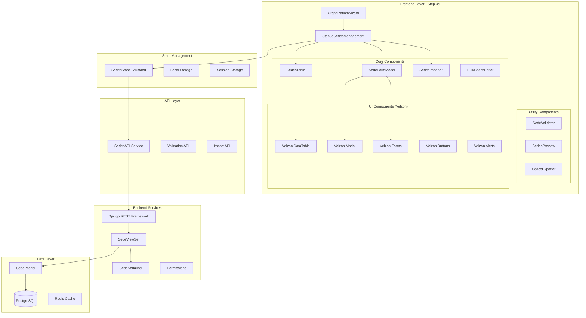
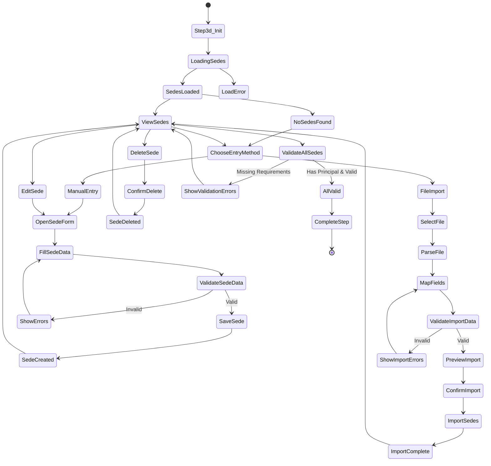

# 🏗️ ARQUITECTURA TÉCNICA - STEP 3D: GESTIÓN DE SEDES PRESTADORAS
## Sistema Completo de Gestión de Sedes para Organizaciones de Salud en ZentraQMS

---

## 📐 1. DIAGRAMA DE ARQUITECTURA DE COMPONENTES



---

## 🗄️ 2. MODELOS DE DATOS

### 2.1 Modelo Django - Sede Prestadora

```python
# backend/apps/organization/models.py

class SedePrestadora(FullBaseModel):
    """
    Modelo para gestionar las sedes prestadoras de servicios de salud.
    Cada organización de salud puede tener múltiples sedes.
    """
    
    # Estados de la sede
    ESTADO_SEDE_CHOICES = [
        ('activa', 'Activa'),
        ('inactiva', 'Inactiva'),
        ('suspendida', 'Suspendida'),
        ('en_proceso', 'En Proceso de Habilitación'),
        ('cerrada', 'Cerrada Permanentemente'),
    ]
    
    # Tipos de sede
    TIPO_SEDE_CHOICES = [
        ('principal', 'Sede Principal'),
        ('sucursal', 'Sucursal'),
        ('ambulatoria', 'Sede Ambulatoria'),
        ('hospitalaria', 'Sede Hospitalaria'),
        ('administrativa', 'Sede Administrativa'),
        ('diagnostico', 'Centro de Diagnóstico'),
        ('urgencias', 'Centro de Urgencias'),
    ]
    
    # Relación con organización de salud
    health_organization = models.ForeignKey(
        'HealthOrganization',
        on_delete=models.CASCADE,
        related_name='sedes',
        verbose_name='Organización de Salud'
    )
    
    # Identificación de la sede
    numero_sede = models.CharField(
        max_length=10,
        verbose_name='Número de Sede',
        help_text='Número único de identificación de la sede (ej: 01, 02, 03)'
    )
    
    codigo_prestador = models.CharField(
        max_length=20,
        verbose_name='Código de Prestador',
        help_text='Código de habilitación del prestador para esta sede'
    )
    
    # Información básica
    nombre_sede = models.CharField(
        max_length=200,
        verbose_name='Nombre de la Sede'
    )
    
    tipo_sede = models.CharField(
        max_length=20,
        choices=TIPO_SEDE_CHOICES,
        default='sucursal',
        verbose_name='Tipo de Sede'
    )
    
    es_sede_principal = models.BooleanField(
        default=False,
        verbose_name='Es Sede Principal',
        help_text='Indica si es la sede principal de la organización'
    )
    
    # Ubicación
    direccion = models.CharField(
        max_length=255,
        verbose_name='Dirección'
    )
    
    departamento = models.CharField(
        max_length=100,
        verbose_name='Departamento'
    )
    
    municipio = models.CharField(
        max_length=100,
        verbose_name='Municipio'
    )
    
    barrio = models.CharField(
        max_length=100,
        blank=True,
        verbose_name='Barrio'
    )
    
    codigo_postal = models.CharField(
        max_length=10,
        blank=True,
        verbose_name='Código Postal'
    )
    
    # Georeferenciación
    latitud = models.DecimalField(
        max_digits=10,
        decimal_places=7,
        null=True,
        blank=True,
        verbose_name='Latitud'
    )
    
    longitud = models.DecimalField(
        max_digits=10,
        decimal_places=7,
        null=True,
        blank=True,
        verbose_name='Longitud'
    )
    
    # Contacto
    telefono_principal = models.CharField(
        max_length=20,
        verbose_name='Teléfono Principal'
    )
    
    telefono_secundario = models.CharField(
        max_length=20,
        blank=True,
        verbose_name='Teléfono Secundario'
    )
    
    email = models.EmailField(
        verbose_name='Email de Contacto'
    )
    
    # Responsable de la sede
    nombre_responsable = models.CharField(
        max_length=200,
        verbose_name='Nombre del Responsable'
    )
    
    cargo_responsable = models.CharField(
        max_length=100,
        verbose_name='Cargo del Responsable'
    )
    
    telefono_responsable = models.CharField(
        max_length=20,
        blank=True,
        verbose_name='Teléfono del Responsable'
    )
    
    email_responsable = models.EmailField(
        blank=True,
        verbose_name='Email del Responsable'
    )
    
    # Estado y habilitación
    estado = models.CharField(
        max_length=20,
        choices=ESTADO_SEDE_CHOICES,
        default='activa',
        verbose_name='Estado'
    )
    
    fecha_habilitacion = models.DateField(
        null=True,
        blank=True,
        verbose_name='Fecha de Habilitación'
    )
    
    fecha_renovacion = models.DateField(
        null=True,
        blank=True,
        verbose_name='Fecha de Renovación'
    )
    
    # Capacidad instalada
    numero_camas = models.IntegerField(
        default=0,
        verbose_name='Número de Camas'
    )
    
    numero_consultorios = models.IntegerField(
        default=0,
        verbose_name='Número de Consultorios'
    )
    
    numero_quirofanos = models.IntegerField(
        default=0,
        verbose_name='Número de Quirófanos'
    )
    
    # Horarios de atención
    horario_atencion = models.JSONField(
        default=dict,
        verbose_name='Horario de Atención',
        help_text='Horarios de atención por día de la semana'
    )
    
    atencion_24_horas = models.BooleanField(
        default=False,
        verbose_name='Atención 24 Horas'
    )
    
    # Servicios habilitados (relación con servicios)
    servicios_habilitados = models.ManyToManyField(
        'HealthService',
        through='SedeServicio',
        related_name='sedes_prestadoras',
        verbose_name='Servicios Habilitados'
    )
    
    # Metadata
    observaciones = models.TextField(
        blank=True,
        verbose_name='Observaciones'
    )
    
    # Datos de importación
    imported_from_file = models.BooleanField(
        default=False,
        verbose_name='Importado desde archivo'
    )
    
    import_date = models.DateTimeField(
        null=True,
        blank=True,
        verbose_name='Fecha de importación'
    )
    
    class Meta:
        verbose_name = 'Sede Prestadora'
        verbose_name_plural = 'Sedes Prestadoras'
        unique_together = [
            ['health_organization', 'numero_sede'],
            ['health_organization', 'codigo_prestador']
        ]
        ordering = ['numero_sede']
        indexes = [
            models.Index(fields=['health_organization', 'estado']),
            models.Index(fields=['departamento', 'municipio']),
            models.Index(fields=['codigo_prestador']),
        ]
    
    def clean(self):
        """Validaciones del modelo"""
        super().clean()
        
        # Solo puede haber una sede principal por organización
        if self.es_sede_principal:
            existing_principal = SedePrestadora.objects.filter(
                health_organization=self.health_organization,
                es_sede_principal=True
            ).exclude(pk=self.pk)
            
            if existing_principal.exists():
                raise ValidationError({
                    'es_sede_principal': 'Ya existe una sede principal para esta organización'
                })
        
        # Validar formato de número de sede
        if not self.numero_sede.isdigit() or len(self.numero_sede) > 3:
            raise ValidationError({
                'numero_sede': 'El número de sede debe ser numérico y máximo 3 dígitos'
            })
    
    def __str__(self):
        return f"{self.nombre_sede} - Sede {self.numero_sede}"


class SedeServicio(FullBaseModel):
    """
    Modelo intermedio para la relación entre Sede y Servicio.
    Permite agregar información adicional sobre el servicio en cada sede.
    """
    
    sede = models.ForeignKey(
        'SedePrestadora',
        on_delete=models.CASCADE,
        related_name='sede_servicios'
    )
    
    servicio = models.ForeignKey(
        'HealthService',
        on_delete=models.CASCADE,
        related_name='servicio_sedes'
    )
    
    # Información adicional del servicio en la sede
    distintivo = models.CharField(
        max_length=50,
        verbose_name='Código Distintivo',
        help_text='Código distintivo del servicio en esta sede'
    )
    
    capacidad_instalada = models.IntegerField(
        default=0,
        verbose_name='Capacidad Instalada'
    )
    
    fecha_habilitacion = models.DateField(
        null=True,
        blank=True,
        verbose_name='Fecha de Habilitación del Servicio'
    )
    
    estado_servicio = models.CharField(
        max_length=20,
        choices=[
            ('activo', 'Activo'),
            ('inactivo', 'Inactivo'),
            ('suspendido', 'Suspendido'),
        ],
        default='activo',
        verbose_name='Estado del Servicio'
    )
    
    observaciones = models.TextField(
        blank=True,
        verbose_name='Observaciones'
    )
    
    class Meta:
        verbose_name = 'Servicio por Sede'
        verbose_name_plural = 'Servicios por Sede'
        unique_together = [
            ['sede', 'servicio'],
            ['sede', 'distintivo']
        ]
```

### 2.2 Interfaces TypeScript

```typescript
// frontend/src/types/sede.types.ts

export interface SedePrestadora {
  id?: string;
  health_organization_id: string;
  
  // Identificación
  numero_sede: string;
  codigo_prestador: string;
  nombre_sede: string;
  tipo_sede: TipoSede;
  es_sede_principal: boolean;
  
  // Ubicación
  direccion: string;
  departamento: string;
  municipio: string;
  barrio?: string;
  codigo_postal?: string;
  latitud?: number;
  longitud?: number;
  
  // Contacto
  telefono_principal: string;
  telefono_secundario?: string;
  email: string;
  
  // Responsable
  nombre_responsable: string;
  cargo_responsable: string;
  telefono_responsable?: string;
  email_responsable?: string;
  
  // Estado
  estado: EstadoSede;
  fecha_habilitacion?: Date;
  fecha_renovacion?: Date;
  
  // Capacidad
  numero_camas: number;
  numero_consultorios: number;
  numero_quirofanos: number;
  
  // Horarios
  horario_atencion: HorarioAtencion;
  atencion_24_horas: boolean;
  
  // Servicios
  servicios_habilitados?: ServicioHabilitado[];
  total_servicios?: number;
  
  // Metadata
  observaciones?: string;
  imported_from_file?: boolean;
  import_date?: Date;
  created_at?: Date;
  updated_at?: Date;
}

export type TipoSede = 
  | 'principal' 
  | 'sucursal' 
  | 'ambulatoria' 
  | 'hospitalaria'
  | 'administrativa'
  | 'diagnostico'
  | 'urgencias';

export type EstadoSede = 
  | 'activa' 
  | 'inactiva' 
  | 'suspendida' 
  | 'en_proceso' 
  | 'cerrada';

export interface HorarioAtencion {
  lunes?: { apertura: string; cierre: string; cerrado?: boolean };
  martes?: { apertura: string; cierre: string; cerrado?: boolean };
  miercoles?: { apertura: string; cierre: string; cerrado?: boolean };
  jueves?: { apertura: string; cierre: string; cerrado?: boolean };
  viernes?: { apertura: string; cierre: string; cerrado?: boolean };
  sabado?: { apertura: string; cierre: string; cerrado?: boolean };
  domingo?: { apertura: string; cierre: string; cerrado?: boolean };
}

export interface ServicioHabilitado {
  servicio_id: string;
  codigo_servicio: string;
  nombre_servicio: string;
  distintivo: string;
  capacidad_instalada?: number;
  fecha_habilitacion?: Date;
  estado_servicio: 'activo' | 'inactivo' | 'suspendido';
  observaciones?: string;
}

export interface SedeFormData extends Partial<SedePrestadora> {
  // Datos para el formulario
}

export interface SedeImportData {
  file: File;
  format: 'csv' | 'excel' | 'json';
  mapping?: Record<string, string>;
  validate_only?: boolean;
}

export interface SedeValidationResult {
  is_valid: boolean;
  errors: ValidationError[];
  warnings: ValidationWarning[];
  sede_data?: SedePrestadora;
}

export interface ValidationError {
  field: string;
  message: string;
  type: 'required' | 'format' | 'duplicate' | 'invalid';
}

export interface ValidationWarning {
  field: string;
  message: string;
  type: 'missing_optional' | 'deprecated' | 'suggestion';
}
```

---

## 🔌 3. DISEÑO DE API REST

### 3.1 Endpoints de Sedes

```python
# backend/apps/organization/urls.py

from django.urls import path, include
from rest_framework.routers import DefaultRouter
from .views import SedeViewSet

router = DefaultRouter()
router.register(r'sedes', SedeViewSet, basename='sede')

urlpatterns = [
    path('api/v1/organization/', include(router.urls)),
    
    # Endpoints específicos
    path('api/v1/organization/<uuid:org_id>/sedes/', 
         SedeViewSet.as_view({'get': 'list', 'post': 'create'})),
    path('api/v1/organization/<uuid:org_id>/sedes/<uuid:sede_id>/', 
         SedeViewSet.as_view({'get': 'retrieve', 'put': 'update', 'delete': 'destroy'})),
    path('api/v1/organization/<uuid:org_id>/sedes/import/', 
         SedeViewSet.as_view({'post': 'import_sedes'})),
    path('api/v1/organization/<uuid:org_id>/sedes/export/', 
         SedeViewSet.as_view({'get': 'export_sedes'})),
    path('api/v1/organization/<uuid:org_id>/sedes/validate/', 
         SedeViewSet.as_view({'post': 'validate_sede'})),
    path('api/v1/organization/<uuid:org_id>/sedes/bulk/', 
         SedeViewSet.as_view({'post': 'bulk_create', 'put': 'bulk_update', 'delete': 'bulk_delete'})),
]
```

### 3.2 ViewSet y Serializers

```python
# backend/apps/organization/views.py

from rest_framework import viewsets, status
from rest_framework.decorators import action
from rest_framework.response import Response
from rest_framework.permissions import IsAuthenticated
from django.db import transaction
from .models import SedePrestadora
from .serializers import SedeSerializer, SedeImportSerializer
from .permissions import CanManageSedes

class SedeViewSet(viewsets.ModelViewSet):
    """
    ViewSet para gestión de sedes prestadoras.
    Incluye CRUD completo, importación, exportación y validación.
    """
    
    serializer_class = SedeSerializer
    permission_classes = [IsAuthenticated, CanManageSedes]
    lookup_field = 'id'
    
    def get_queryset(self):
        """Filtrar sedes por organización del usuario"""
        org_id = self.kwargs.get('org_id')
        if org_id:
            return SedePrestadora.objects.filter(
                health_organization__organization_id=org_id
            ).select_related(
                'health_organization'
            ).prefetch_related(
                'servicios_habilitados'
            )
        return SedePrestadora.objects.none()
    
    @action(detail=False, methods=['post'])
    @transaction.atomic
    def import_sedes(self, request, org_id=None):
        """
        Importar sedes desde archivo CSV/Excel.
        Soporta validación previa y mapeo de campos.
        """
        serializer = SedeImportSerializer(data=request.data)
        serializer.is_valid(raise_exception=True)
        
        file = serializer.validated_data['file']
        format = serializer.validated_data['format']
        validate_only = serializer.validated_data.get('validate_only', False)
        
        # Procesar archivo
        importer = SedeImporter(
            file=file,
            format=format,
            organization_id=org_id
        )
        
        # Validar datos
        validation_results = importer.validate()
        
        if validate_only:
            return Response({
                'validation_results': validation_results,
                'total_rows': len(validation_results),
                'valid_rows': sum(1 for r in validation_results if r['is_valid']),
                'invalid_rows': sum(1 for r in validation_results if not r['is_valid'])
            })
        
        # Importar sedes válidas
        if all(r['is_valid'] for r in validation_results):
            imported_sedes = importer.import_sedes()
            return Response({
                'success': True,
                'imported_count': len(imported_sedes),
                'sedes': SedeSerializer(imported_sedes, many=True).data
            }, status=status.HTTP_201_CREATED)
        else:
            return Response({
                'success': False,
                'validation_errors': [
                    r for r in validation_results if not r['is_valid']
                ]
            }, status=status.HTTP_400_BAD_REQUEST)
    
    @action(detail=False, methods=['get'])
    def export_sedes(self, request, org_id=None):
        """
        Exportar sedes a CSV/Excel.
        """
        format = request.query_params.get('format', 'csv')
        include_services = request.query_params.get('include_services', 'false') == 'true'
        
        sedes = self.get_queryset()
        
        exporter = SedeExporter(
            sedes=sedes,
            format=format,
            include_services=include_services
        )
        
        file_content = exporter.export()
        
        response = HttpResponse(
            file_content,
            content_type=exporter.get_content_type()
        )
        response['Content-Disposition'] = f'attachment; filename="sedes_{org_id}.{format}"'
        
        return response
    
    @action(detail=False, methods=['post'])
    def validate_sede(self, request, org_id=None):
        """
        Validar datos de una sede sin guardarla.
        """
        serializer = SedeSerializer(data=request.data, context={'request': request})
        
        try:
            serializer.is_valid(raise_exception=True)
            return Response({
                'is_valid': True,
                'data': serializer.validated_data
            })
        except serializers.ValidationError as e:
            return Response({
                'is_valid': False,
                'errors': e.detail
            }, status=status.HTTP_400_BAD_REQUEST)
    
    @action(detail=False, methods=['post'])
    @transaction.atomic
    def bulk_create(self, request, org_id=None):
        """
        Crear múltiples sedes en una sola operación.
        """
        sedes_data = request.data.get('sedes', [])
        
        if not sedes_data:
            return Response({
                'error': 'No se proporcionaron sedes para crear'
            }, status=status.HTTP_400_BAD_REQUEST)
        
        created_sedes = []
        errors = []
        
        for idx, sede_data in enumerate(sedes_data):
            sede_data['health_organization_id'] = org_id
            serializer = SedeSerializer(data=sede_data)
            
            if serializer.is_valid():
                sede = serializer.save()
                created_sedes.append(sede)
            else:
                errors.append({
                    'index': idx,
                    'errors': serializer.errors
                })
        
        if errors:
            transaction.set_rollback(True)
            return Response({
                'success': False,
                'errors': errors
            }, status=status.HTTP_400_BAD_REQUEST)
        
        return Response({
            'success': True,
            'created_count': len(created_sedes),
            'sedes': SedeSerializer(created_sedes, many=True).data
        }, status=status.HTTP_201_CREATED)


# backend/apps/organization/serializers.py

from rest_framework import serializers
from .models import SedePrestadora, SedeServicio

class SedeServicioSerializer(serializers.ModelSerializer):
    """Serializer para servicios en una sede"""
    
    nombre_servicio = serializers.CharField(source='servicio.nombre', read_only=True)
    codigo_servicio = serializers.CharField(source='servicio.codigo', read_only=True)
    
    class Meta:
        model = SedeServicio
        fields = [
            'servicio_id', 'codigo_servicio', 'nombre_servicio',
            'distintivo', 'capacidad_instalada', 'fecha_habilitacion',
            'estado_servicio', 'observaciones'
        ]


class SedeSerializer(serializers.ModelSerializer):
    """Serializer principal para sedes prestadoras"""
    
    servicios_habilitados = SedeServicioSerializer(
        source='sede_servicios',
        many=True,
        read_only=True
    )
    total_servicios = serializers.SerializerMethodField()
    
    class Meta:
        model = SedePrestadora
        fields = '__all__'
        read_only_fields = ['id', 'created_at', 'updated_at', 'created_by', 'updated_by']
    
    def get_total_servicios(self, obj):
        return obj.sede_servicios.count()
    
    def validate_numero_sede(self, value):
        """Validar formato de número de sede"""
        if not value.isdigit() or len(value) > 3:
            raise serializers.ValidationError(
                "El número de sede debe ser numérico y máximo 3 dígitos"
            )
        return value.zfill(2)  # Formatear con ceros a la izquierda
    
    def validate(self, data):
        """Validaciones cruzadas"""
        # Validar sede principal única
        if data.get('es_sede_principal'):
            org = data.get('health_organization') or self.instance.health_organization
            existing = SedePrestadora.objects.filter(
                health_organization=org,
                es_sede_principal=True
            ).exclude(pk=self.instance.pk if self.instance else None)
            
            if existing.exists():
                raise serializers.ValidationError({
                    'es_sede_principal': 'Ya existe una sede principal para esta organización'
                })
        
        return data


class SedeImportSerializer(serializers.Serializer):
    """Serializer para importación de sedes"""
    
    file = serializers.FileField()
    format = serializers.ChoiceField(choices=['csv', 'excel', 'json'])
    mapping = serializers.JSONField(required=False)
    validate_only = serializers.BooleanField(default=False)
    
    def validate_file(self, value):
        """Validar archivo de importación"""
        # Validar tamaño máximo (10 MB)
        if value.size > 10 * 1024 * 1024:
            raise serializers.ValidationError(
                "El archivo no debe superar los 10 MB"
            )
        
        # Validar extensión
        ext = value.name.split('.')[-1].lower()
        valid_extensions = {
            'csv': ['csv'],
            'excel': ['xlsx', 'xls'],
            'json': ['json']
        }
        
        format = self.initial_data.get('format')
        if format and ext not in valid_extensions.get(format, []):
            raise serializers.ValidationError(
                f"Extensión inválida para formato {format}"
            )
        
        return value
```

---

## 🎨 4. COMPONENTES REACT - ARQUITECTURA DETALLADA

### 4.1 Componente Principal - Step3dSedesManagement

```typescript
// frontend/src/components/wizard/steps/Step3dSedesManagement.tsx

import React, { useState, useEffect, useCallback } from 'react';
import { Card, CardBody, Row, Col, Button, Alert, Nav, NavItem, NavLink, TabContent, TabPane } from 'reactstrap';
import { toast } from 'react-toastify';
import classnames from 'classnames';

// Componentes internos
import SedesTable from '../../tables/SedesTable';
import SedeFormModal from '../../modals/SedeFormModal';
import SedesImporter from '../../importers/SedesImporter';
import SedesPreview from '../../preview/SedesPreview';

// Servicios y tipos
import { sedesService } from '../../../services/sedesService';
import { SedePrestadora, SedeFormData } from '../../../types/sede.types';

// Store
import { useSedesStore } from '../../../stores/sedesStore';

// Iconos de Velzon
import { Plus, Upload, Download, Edit, Trash2, CheckCircle, AlertCircle } from 'lucide-react';

interface Step3dSedesManagementProps {
  organizationId: string;
  healthOrganizationId: string;
  onComplete: (data: any) => void;
  onBack?: () => void;
  isActive: boolean;
}

const Step3dSedesManagement: React.FC<Step3dSedesManagementProps> = ({
  organizationId,
  healthOrganizationId,
  onComplete,
  onBack,
  isActive
}) => {
  // Estado local
  const [activeTab, setActiveTab] = useState('manual');
  const [isModalOpen, setIsModalOpen] = useState(false);
  const [selectedSede, setSelectedSede] = useState<SedePrestadora | null>(null);
  const [isLoading, setIsLoading] = useState(false);
  const [validationErrors, setValidationErrors] = useState<any[]>([]);
  
  // Store global
  const { 
    sedes, 
    loadSedes, 
    addSede, 
    updateSede, 
    deleteSede,
    setSelectedSedes,
    selectedSedes 
  } = useSedesStore();
  
  // Cargar sedes al montar
  useEffect(() => {
    if (isActive && healthOrganizationId) {
      loadSedesData();
    }
  }, [isActive, healthOrganizationId]);
  
  /**
   * Cargar sedes desde el backend
   */
  const loadSedesData = async () => {
    setIsLoading(true);
    try {
      const response = await sedesService.getSedesByOrganization(healthOrganizationId);
      loadSedes(response.data);
    } catch (error) {
      console.error('Error cargando sedes:', error);
      toast.error('Error al cargar las sedes');
    } finally {
      setIsLoading(false);
    }
  };
  
  /**
   * Manejar creación/edición de sede
   */
  const handleSaveSede = async (sedeData: SedeFormData) => {
    setIsLoading(true);
    try {
      if (selectedSede) {
        // Actualizar sede existente
        const response = await sedesService.updateSede(selectedSede.id!, sedeData);
        updateSede(response.data);
        toast.success('Sede actualizada exitosamente');
      } else {
        // Crear nueva sede
        const response = await sedesService.createSede({
          ...sedeData,
          health_organization_id: healthOrganizationId
        });
        addSede(response.data);
        toast.success('Sede creada exitosamente');
      }
      
      setIsModalOpen(false);
      setSelectedSede(null);
    } catch (error: any) {
      console.error('Error guardando sede:', error);
      toast.error(error.response?.data?.message || 'Error al guardar la sede');
    } finally {
      setIsLoading(false);
    }
  };
  
  /**
   * Manejar eliminación de sede
   */
  const handleDeleteSede = async (sedeId: string) => {
    if (!window.confirm('¿Está seguro de eliminar esta sede?')) {
      return;
    }
    
    setIsLoading(true);
    try {
      await sedesService.deleteSede(sedeId);
      deleteSede(sedeId);
      toast.success('Sede eliminada exitosamente');
    } catch (error) {
      console.error('Error eliminando sede:', error);
      toast.error('Error al eliminar la sede');
    } finally {
      setIsLoading(false);
    }
  };
  
  /**
   * Manejar importación de sedes
   */
  const handleImportComplete = (importedSedes: SedePrestadora[]) => {
    loadSedes([...sedes, ...importedSedes]);
    toast.success(`${importedSedes.length} sedes importadas exitosamente`);
    setActiveTab('manual');
  };
  
  /**
   * Exportar sedes
   */
  const handleExportSedes = async () => {
    try {
      const response = await sedesService.exportSedes(healthOrganizationId, 'excel');
      // Descargar archivo
      const url = window.URL.createObjectURL(new Blob([response.data]));
      const link = document.createElement('a');
      link.href = url;
      link.setAttribute('download', `sedes_${healthOrganizationId}.xlsx`);
      document.body.appendChild(link);
      link.click();
      link.remove();
      
      toast.success('Sedes exportadas exitosamente');
    } catch (error) {
      console.error('Error exportando sedes:', error);
      toast.error('Error al exportar las sedes');
    }
  };
  
  /**
   * Validar y continuar
   */
  const handleContinue = () => {
    // Validar que haya al menos una sede
    if (sedes.length === 0) {
      toast.error('Debe registrar al menos una sede');
      return;
    }
    
    // Validar que haya una sede principal
    const hasPrincipal = sedes.some(s => s.es_sede_principal);
    if (!hasPrincipal) {
      toast.error('Debe definir una sede principal');
      return;
    }
    
    // Continuar al siguiente paso
    onComplete({
      sedes: sedes,
      total_sedes: sedes.length
    });
  };
  
  return (
    <Card className="border-0 shadow-sm">
      <CardBody className="p-4">
        {/* Header */}
        <div className="d-flex justify-content-between align-items-center mb-4">
          <div>
            <h4 className="card-title mb-1">Gestión de Sedes Prestadoras</h4>
            <p className="text-muted">
              Registre las sedes donde su organización presta servicios de salud
            </p>
          </div>
          <div className="d-flex gap-2">
            <Button
              color="light"
              size="sm"
              onClick={handleExportSedes}
              disabled={sedes.length === 0}
            >
              <Download className="me-1" size={16} />
              Exportar
            </Button>
            <Button
              color="primary"
              size="sm"
              onClick={() => {
                setSelectedSede(null);
                setIsModalOpen(true);
              }}
            >
              <Plus className="me-1" size={16} />
              Nueva Sede
            </Button>
          </div>
        </div>
        
        {/* Estadísticas */}
        <Row className="mb-4">
          <Col md={3}>
            <div className="border rounded p-3 text-center">
              <h5 className="mb-1">{sedes.length}</h5>
              <p className="text-muted mb-0">Total Sedes</p>
            </div>
          </Col>
          <Col md={3}>
            <div className="border rounded p-3 text-center">
              <h5 className="mb-1">
                {sedes.filter(s => s.estado === 'activa').length}
              </h5>
              <p className="text-muted mb-0">Sedes Activas</p>
            </div>
          </Col>
          <Col md={3}>
            <div className="border rounded p-3 text-center">
              <h5 className="mb-1">
                {sedes.reduce((acc, s) => acc + (s.total_servicios || 0), 0)}
              </h5>
              <p className="text-muted mb-0">Servicios Totales</p>
            </div>
          </Col>
          <Col md={3}>
            <div className="border rounded p-3 text-center">
              <h5 className="mb-1">
                {sedes.filter(s => s.atencion_24_horas).length}
              </h5>
              <p className="text-muted mb-0">Atención 24h</p>
            </div>
          </Col>
        </Row>
        
        {/* Tabs para entrada manual e importación */}
        <Nav tabs className="nav-tabs-custom mb-3">
          <NavItem>
            <NavLink
              className={classnames({ active: activeTab === 'manual' })}
              onClick={() => setActiveTab('manual')}
            >
              <i className="ri-edit-line me-1"></i>
              Entrada Manual
            </NavLink>
          </NavItem>
          <NavItem>
            <NavLink
              className={classnames({ active: activeTab === 'import' })}
              onClick={() => setActiveTab('import')}
            >
              <i className="ri-upload-line me-1"></i>
              Importar desde Archivo
            </NavLink>
          </NavItem>
          <NavItem>
            <NavLink
              className={classnames({ active: activeTab === 'preview' })}
              onClick={() => setActiveTab('preview')}
              disabled={sedes.length === 0}
            >
              <i className="ri-eye-line me-1"></i>
              Vista Previa
            </NavLink>
          </NavItem>
        </Nav>
        
        <TabContent activeTab={activeTab}>
          {/* Tab de entrada manual */}
          <TabPane tabId="manual">
            {sedes.length > 0 ? (
              <SedesTable
                sedes={sedes}
                onEdit={(sede) => {
                  setSelectedSede(sede);
                  setIsModalOpen(true);
                }}
                onDelete={handleDeleteSede}
                onSelect={setSelectedSedes}
                selectedSedes={selectedSedes}
                isLoading={isLoading}
              />
            ) : (
              <Alert color="info" className="text-center">
                <AlertCircle className="me-2" size={20} />
                No hay sedes registradas. Haga clic en "Nueva Sede" para agregar la primera.
              </Alert>
            )}
          </TabPane>
          
          {/* Tab de importación */}
          <TabPane tabId="import">
            <SedesImporter
              organizationId={healthOrganizationId}
              onImportComplete={handleImportComplete}
              existingSedes={sedes}
            />
          </TabPane>
          
          {/* Tab de vista previa */}
          <TabPane tabId="preview">
            <SedesPreview
              sedes={sedes}
              organizationName={''} // Obtener de props
            />
          </TabPane>
        </TabContent>
        
        {/* Validación de errores */}
        {validationErrors.length > 0 && (
          <Alert color="danger" className="mt-3">
            <h6 className="alert-heading">Errores de Validación:</h6>
            <ul className="mb-0">
              {validationErrors.map((error, idx) => (
                <li key={idx}>{error.message}</li>
              ))}
            </ul>
          </Alert>
        )}
        
        {/* Botones de navegación */}
        <div className="d-flex justify-content-between mt-4">
          <Button
            color="light"
            onClick={onBack}
            disabled={isLoading}
          >
            <i className="ri-arrow-left-line me-1"></i>
            Anterior
          </Button>
          <Button
            color="primary"
            onClick={handleContinue}
            disabled={isLoading || sedes.length === 0}
          >
            Continuar
            <i className="ri-arrow-right-line ms-1"></i>
          </Button>
        </div>
      </CardBody>
      
      {/* Modal de formulario */}
      <SedeFormModal
        isOpen={isModalOpen}
        toggle={() => {
          setIsModalOpen(false);
          setSelectedSede(null);
        }}
        sede={selectedSede}
        onSave={handleSaveSede}
        organizationId={healthOrganizationId}
      />
    </Card>
  );
};

export default Step3dSedesManagement;
```

---

## 🔄 5. FLUJO DE USUARIO Y ESTADOS

### 5.1 Diagrama de Flujo Principal



### 5.2 Estados del Store (Zustand)

```typescript
// frontend/src/stores/sedesStore.ts

import { create } from 'zustand';
import { devtools, persist } from 'zustand/middleware';
import { SedePrestadora } from '../types/sede.types';

interface SedesState {
  // Estado de datos
  sedes: SedePrestadora[];
  selectedSedes: string[];
  currentSede: SedePrestadora | null;
  
  // Estado de UI
  isLoading: boolean;
  isImporting: boolean;
  validationErrors: any[];
  importProgress: number;
  
  // Filtros y búsqueda
  searchTerm: string;
  filterBy: {
    estado?: string;
    tipo?: string;
    departamento?: string;
    municipio?: string;
  };
  
  // Acciones de datos
  loadSedes: (sedes: SedePrestadora[]) => void;
  addSede: (sede: SedePrestadora) => void;
  updateSede: (sede: SedePrestadora) => void;
  deleteSede: (sedeId: string) => void;
  
  // Acciones de selección
  setSelectedSedes: (sedeIds: string[]) => void;
  selectAllSedes: () => void;
  clearSelection: () => void;
  
  // Acciones de UI
  setLoading: (loading: boolean) => void;
  setImporting: (importing: boolean) => void;
  setImportProgress: (progress: number) => void;
  setValidationErrors: (errors: any[]) => void;
  
  // Acciones de filtrado
  setSearchTerm: (term: string) => void;
  setFilter: (filter: any) => void;
  clearFilters: () => void;
  
  // Utilidades
  getSedeById: (id: string) => SedePrestadora | undefined;
  getSedesPrincipales: () => SedePrestadora[];
  getSedesActivas: () => SedePrestadora[];
  hasValidConfiguration: () => boolean;
}

export const useSedesStore = create<SedesState>()(
  devtools(
    persist(
      (set, get) => ({
        // Estado inicial
        sedes: [],
        selectedSedes: [],
        currentSede: null,
        isLoading: false,
        isImporting: false,
        validationErrors: [],
        importProgress: 0,
        searchTerm: '',
        filterBy: {},
        
        // Implementación de acciones
        loadSedes: (sedes) => set({ sedes }),
        
        addSede: (sede) => set((state) => ({
          sedes: [...state.sedes, sede]
        })),
        
        updateSede: (sede) => set((state) => ({
          sedes: state.sedes.map(s => s.id === sede.id ? sede : s)
        })),
        
        deleteSede: (sedeId) => set((state) => ({
          sedes: state.sedes.filter(s => s.id !== sedeId),
          selectedSedes: state.selectedSedes.filter(id => id !== sedeId)
        })),
        
        setSelectedSedes: (sedeIds) => set({ selectedSedes: sedeIds }),
        
        selectAllSedes: () => set((state) => ({
          selectedSedes: state.sedes.map(s => s.id!)
        })),
        
        clearSelection: () => set({ selectedSedes: [] }),
        
        setLoading: (loading) => set({ isLoading: loading }),
        
        setImporting: (importing) => set({ isImporting: importing }),
        
        setImportProgress: (progress) => set({ importProgress: progress }),
        
        setValidationErrors: (errors) => set({ validationErrors: errors }),
        
        setSearchTerm: (term) => set({ searchTerm: term }),
        
        setFilter: (filter) => set((state) => ({
          filterBy: { ...state.filterBy, ...filter }
        })),
        
        clearFilters: () => set({ filterBy: {}, searchTerm: '' }),
        
        // Utilidades
        getSedeById: (id) => {
          return get().sedes.find(s => s.id === id);
        },
        
        getSedesPrincipales: () => {
          return get().sedes.filter(s => s.es_sede_principal);
        },
        
        getSedesActivas: () => {
          return get().sedes.filter(s => s.estado === 'activa');
        },
        
        hasValidConfiguration: () => {
          const sedes = get().sedes;
          return sedes.length > 0 && sedes.some(s => s.es_sede_principal);
        }
      }),
      {
        name: 'sedes-storage',
        partialize: (state) => ({
          sedes: state.sedes,
          filterBy: state.filterBy
        })
      }
    )
  )
);
```

---

## 🧩 6. INTEGRACIÓN CON WIZARD EXISTENTE

### 6.1 Modificación del OrganizationWizard

```typescript
// frontend/src/pages/organization/wizard/OrganizationWizard.tsx
// Agregar importación y step

import Step3dSedesManagement from '../../../components/wizard/steps/Step3dSedesManagement';

// En la configuración de steps
const wizardSteps = [
  { id: 1, title: 'Datos de la Organización', component: Step1OrganizationData },
  { id: 2, title: 'Ubicación', component: Step2LocationData },
  { id: 3, title: 'Sector y Plantilla', component: Step3SectorTemplate },
  { id: '3b', title: 'Datos de Salud', component: Step3bHealthOrganization, condition: 'isHealth' },
  { id: '3c', title: 'Servicios de Salud', component: Step3cHealthServices, condition: 'isHealth' },
  { id: '3d', title: 'Sedes Prestadoras', component: Step3dSedesManagement, condition: 'isHealth' }, // NUEVO
  { id: 4, title: 'Confirmación', component: Step4Confirmation }
];

// En el renderizado condicional
{activeStep === '3d' && isHealthOrganization && (
  <Step3dSedesManagement
    organizationId={formData.organizationId}
    healthOrganizationId={formData.healthOrganizationId}
    onComplete={handleStep3dComplete}
    onBack={handleBack}
    isActive={activeStep === '3d'}
  />
)}
```

---

## 🔒 7. VALIDACIONES Y REGLAS DE NEGOCIO

### 7.1 Validaciones Frontend

```typescript
// frontend/src/validators/sedeValidator.ts

import * as Yup from 'yup';
import { SedePrestadora } from '../types/sede.types';

export const sedeValidationSchema = Yup.object().shape({
  // Identificación
  numero_sede: Yup.string()
    .required('El número de sede es obligatorio')
    .matches(/^[0-9]{1,3}$/, 'Debe ser numérico de máximo 3 dígitos'),
  
  codigo_prestador: Yup.string()
    .required('El código de prestador es obligatorio')
    .min(9, 'Debe tener al menos 9 caracteres')
    .max(20, 'Máximo 20 caracteres'),
  
  nombre_sede: Yup.string()
    .required('El nombre de la sede es obligatorio')
    .min(3, 'Mínimo 3 caracteres')
    .max(200, 'Máximo 200 caracteres'),
  
  tipo_sede: Yup.string()
    .required('Debe seleccionar el tipo de sede')
    .oneOf(['principal', 'sucursal', 'ambulatoria', 'hospitalaria', 
            'administrativa', 'diagnostico', 'urgencias']),
  
  // Ubicación
  direccion: Yup.string()
    .required('La dirección es obligatoria')
    .max(255, 'Máximo 255 caracteres'),
  
  departamento: Yup.string()
    .required('El departamento es obligatorio'),
  
  municipio: Yup.string()
    .required('El municipio es obligatorio'),
  
  // Contacto
  telefono_principal: Yup.string()
    .required('El teléfono principal es obligatorio')
    .matches(/^[0-9+\-\s()]+$/, 'Formato de teléfono inválido'),
  
  email: Yup.string()
    .required('El email es obligatorio')
    .email('Email inválido'),
  
  // Responsable
  nombre_responsable: Yup.string()
    .required('El nombre del responsable es obligatorio'),
  
  cargo_responsable: Yup.string()
    .required('El cargo del responsable es obligatorio'),
  
  // Validaciones condicionales
  email_responsable: Yup.string()
    .email('Email inválido')
    .when('nombre_responsable', {
      is: (val: string) => val && val.length > 0,
      then: (schema) => schema.required('Email del responsable es obligatorio')
    })
});

export const validateSedeUniqueness = (
  sede: Partial<SedePrestadora>, 
  existingSedes: SedePrestadora[]
): string[] => {
  const errors: string[] = [];
  
  // Validar número de sede único
  const duplicateNumber = existingSedes.find(
    s => s.numero_sede === sede.numero_sede && s.id !== sede.id
  );
  if (duplicateNumber) {
    errors.push(`Ya existe una sede con el número ${sede.numero_sede}`);
  }
  
  // Validar código de prestador único
  const duplicateCode = existingSedes.find(
    s => s.codigo_prestador === sede.codigo_prestador && s.id !== sede.id
  );
  if (duplicateCode) {
    errors.push(`Ya existe una sede con el código de prestador ${sede.codigo_prestador}`);
  }
  
  // Validar sede principal única
  if (sede.es_sede_principal) {
    const existingPrincipal = existingSedes.find(
      s => s.es_sede_principal && s.id !== sede.id
    );
    if (existingPrincipal) {
      errors.push('Ya existe una sede principal definida');
    }
  }
  
  return errors;
};

export const validateSedesConfiguration = (sedes: SedePrestadora[]): {
  isValid: boolean;
  errors: string[];
  warnings: string[];
} => {
  const errors: string[] = [];
  const warnings: string[] = [];
  
  // Debe haber al menos una sede
  if (sedes.length === 0) {
    errors.push('Debe registrar al menos una sede');
  }
  
  // Debe haber exactamente una sede principal
  const principalSedes = sedes.filter(s => s.es_sede_principal);
  if (principalSedes.length === 0) {
    errors.push('Debe definir una sede principal');
  } else if (principalSedes.length > 1) {
    errors.push('Solo puede haber una sede principal');
  }
  
  // Validar sedes activas
  const activeSedes = sedes.filter(s => s.estado === 'activa');
  if (activeSedes.length === 0) {
    errors.push('Debe haber al menos una sede activa');
  }
  
  // Warnings
  const sedesWithoutServices = sedes.filter(
    s => !s.servicios_habilitados || s.servicios_habilitados.length === 0
  );
  if (sedesWithoutServices.length > 0) {
    warnings.push(`${sedesWithoutServices.length} sede(s) sin servicios habilitados`);
  }
  
  const sedesWithout24h = sedes.filter(s => !s.atencion_24_horas);
  if (sedesWithout24h.length === sedes.length) {
    warnings.push('Ninguna sede tiene atención 24 horas');
  }
  
  return {
    isValid: errors.length === 0,
    errors,
    warnings
  };
};
```

### 7.2 Validaciones Backend

```python
# backend/apps/organization/validators.py

from django.core.exceptions import ValidationError
from typing import List, Dict, Any
import re

class SedeValidator:
    """Validador para sedes prestadoras"""
    
    @staticmethod
    def validate_numero_sede(value: str) -> str:
        """Validar formato de número de sede"""
        if not value.isdigit():
            raise ValidationError('El número de sede debe ser numérico')
        
        if len(value) > 3:
            raise ValidationError('El número de sede no puede tener más de 3 dígitos')
        
        # Formatear con ceros a la izquierda
        return value.zfill(2)
    
    @staticmethod
    def validate_codigo_prestador(value: str) -> str:
        """Validar formato de código de prestador"""
        # Formato esperado: 9-12 dígitos
        pattern = r'^\d{9,12}$'
        if not re.match(pattern, value):
            raise ValidationError(
                'El código de prestador debe tener entre 9 y 12 dígitos'
            )
        return value
    
    @staticmethod
    def validate_sede_principal(sede, organization):
        """Validar que solo haya una sede principal"""
        from .models import SedePrestadora
        
        if sede.es_sede_principal:
            existing = SedePrestadora.objects.filter(
                health_organization=organization,
                es_sede_principal=True
            ).exclude(pk=sede.pk)
            
            if existing.exists():
                raise ValidationError(
                    'Ya existe una sede principal para esta organización'
                )
    
    @staticmethod
    def validate_horario_atencion(horario: Dict[str, Any]) -> Dict[str, Any]:
        """Validar estructura de horario de atención"""
        dias_validos = [
            'lunes', 'martes', 'miercoles', 'jueves', 
            'viernes', 'sabado', 'domingo'
        ]
        
        for dia in dias_validos:
            if dia in horario:
                dia_info = horario[dia]
                if not isinstance(dia_info, dict):
                    raise ValidationError(
                        f'Formato inválido para horario de {dia}'
                    )
                
                if not dia_info.get('cerrado', False):
                    if 'apertura' not in dia_info or 'cierre' not in dia_info:
                        raise ValidationError(
                            f'Debe especificar apertura y cierre para {dia}'
                        )
                    
                    # Validar formato de hora (HH:MM)
                    hora_pattern = r'^([01]?[0-9]|2[0-3]):[0-5][0-9]$'
                    if not re.match(hora_pattern, dia_info['apertura']):
                        raise ValidationError(
                            f'Hora de apertura inválida para {dia}'
                        )
                    if not re.match(hora_pattern, dia_info['cierre']):
                        raise ValidationError(
                            f'Hora de cierre inválida para {dia}'
                        )
        
        return horario
    
    @classmethod
    def validate_sede_completa(cls, sede_data: Dict[str, Any]) -> List[str]:
        """Validación completa de una sede"""
        errors = []
        
        # Validaciones obligatorias
        required_fields = [
            'numero_sede', 'codigo_prestador', 'nombre_sede',
            'direccion', 'departamento', 'municipio',
            'telefono_principal', 'email', 'nombre_responsable',
            'cargo_responsable'
        ]
        
        for field in required_fields:
            if not sede_data.get(field):
                errors.append(f'El campo {field} es obligatorio')
        
        # Validaciones de formato
        try:
            if sede_data.get('numero_sede'):
                cls.validate_numero_sede(sede_data['numero_sede'])
        except ValidationError as e:
            errors.append(str(e))
        
        try:
            if sede_data.get('codigo_prestador'):
                cls.validate_codigo_prestador(sede_data['codigo_prestador'])
        except ValidationError as e:
            errors.append(str(e))
        
        # Validar email
        import re
        email_pattern = r'^[a-zA-Z0-9._%+-]+@[a-zA-Z0-9.-]+\.[a-zA-Z]{2,}$'
        if sede_data.get('email') and not re.match(email_pattern, sede_data['email']):
            errors.append('Email inválido')
        
        return errors


# backend/apps/organization/services/sede_validator.py

from typing import List, Dict, Any, Tuple
from django.db import transaction
from ..models import SedePrestadora, HealthOrganization
import pandas as pd

class SedeImportValidator:
    """Servicio de validación para importación de sedes"""
    
    REQUIRED_COLUMNS = [
        'numero_sede', 'nombre_sede', 'direccion',
        'departamento', 'municipio', 'telefono_principal',
        'email', 'nombre_responsable', 'cargo_responsable'
    ]
    
    COLUMN_MAPPING = {
        # Mapeo de nombres de columnas comunes
        'num_sede': 'numero_sede',
        'numero': 'numero_sede',
        'sede': 'numero_sede',
        'nombre': 'nombre_sede',
        'dir': 'direccion',
        'depto': 'departamento',
        'muni': 'municipio',
        'tel': 'telefono_principal',
        'telefono': 'telefono_principal',
        'correo': 'email',
        'responsable': 'nombre_responsable',
        'cargo': 'cargo_responsable',
    }
    
    def __init__(self, organization_id: str):
        self.organization = HealthOrganization.objects.get(
            organization_id=organization_id
        )
        self.existing_sedes = list(
            SedePrestadora.objects.filter(
                health_organization=self.organization
            ).values_list('numero_sede', 'codigo_prestador')
        )
    
    def validate_file(self, file, format: str) -> Tuple[bool, List[str]]:
        """Validar archivo de importación"""
        errors = []
        
        # Validar tamaño
        if file.size > 10 * 1024 * 1024:  # 10 MB
            errors.append('El archivo no debe superar los 10 MB')
        
        # Validar formato
        try:
            if format == 'csv':
                df = pd.read_csv(file)
            elif format == 'excel':
                df = pd.read_excel(file)
            else:
                errors.append(f'Formato no soportado: {format}')
                return False, errors
        except Exception as e:
            errors.append(f'Error al leer el archivo: {str(e)}')
            return False, errors
        
        # Validar columnas requeridas
        missing_columns = []
        for col in self.REQUIRED_COLUMNS:
            if col not in df.columns:
                # Buscar con mapeo
                mapped = False
                for key, value in self.COLUMN_MAPPING.items():
                    if key in df.columns and value == col:
                        mapped = True
                        break
                if not mapped:
                    missing_columns.append(col)
        
        if missing_columns:
            errors.append(f'Columnas faltantes: {", ".join(missing_columns)}')
        
        return len(errors) == 0, errors
    
    def validate_row(self, row_data: Dict[str, Any], row_index: int) -> Dict[str, Any]:
        """Validar una fila de datos"""
        result = {
            'row_index': row_index,
            'is_valid': True,
            'errors': [],
            'warnings': [],
            'data': row_data
        }
        
        # Aplicar mapeo de columnas
        mapped_data = {}
        for key, value in row_data.items():
            mapped_key = self.COLUMN_MAPPING.get(key.lower(), key)
            mapped_data[mapped_key] = value
        
        # Validar campos requeridos
        for field in self.REQUIRED_COLUMNS:
            if not mapped_data.get(field):
                result['errors'].append(f'Campo requerido vacío: {field}')
                result['is_valid'] = False
        
        # Validar duplicados
        numero_sede = str(mapped_data.get('numero_sede', '')).zfill(2)
        if any(s[0] == numero_sede for s in self.existing_sedes):
            result['errors'].append(f'Ya existe una sede con número {numero_sede}')
            result['is_valid'] = False
        
        # Validar sede principal
        if mapped_data.get('es_sede_principal'):
            has_principal = SedePrestadora.objects.filter(
                health_organization=self.organization,
                es_sede_principal=True
            ).exists()
            if has_principal:
                result['warnings'].append('Ya existe una sede principal')
        
        result['data'] = mapped_data
        return result
    
    def validate_batch(self, data: List[Dict[str, Any]]) -> List[Dict[str, Any]]:
        """Validar un lote de sedes"""
        results = []
        sede_numbers = []
        
        for index, row in enumerate(data):
            validation = self.validate_row(row, index)
            
            # Validar duplicados dentro del lote
            numero_sede = str(row.get('numero_sede', '')).zfill(2)
            if numero_sede in sede_numbers:
                validation['errors'].append(
                    f'Número de sede duplicado en el archivo: {numero_sede}'
                )
                validation['is_valid'] = False
            else:
                sede_numbers.append(numero_sede)
            
            results.append(validation)
        
        # Validar que haya al menos una sede principal
        principal_count = sum(
            1 for r in results 
            if r['data'].get('es_sede_principal')
        )
        
        if principal_count == 0:
            results[0]['warnings'].append(
                'No se ha definido ninguna sede principal'
            )
        elif principal_count > 1:
            for r in results:
                if r['data'].get('es_sede_principal'):
                    r['errors'].append(
                        'Solo puede haber una sede principal'
                    )
                    r['is_valid'] = False
        
        return results
```

---

## 📋 8. TESTING STRATEGY

### 8.1 Tests Backend

```python
# backend/apps/organization/tests/test_sedes.py

from django.test import TestCase
from rest_framework.test import APITestCase
from rest_framework import status
from django.contrib.auth import get_user_model
from ..models import Organization, HealthOrganization, SedePrestadora
from ..factories import SedeFactory, HealthOrganizationFactory

User = get_user_model()

class SedeModelTest(TestCase):
    """Tests para el modelo SedePrestadora"""
    
    def setUp(self):
        self.health_org = HealthOrganizationFactory()
    
    def test_create_sede(self):
        """Test crear sede básica"""
        sede = SedePrestadora.objects.create(
            health_organization=self.health_org,
            numero_sede='01',
            codigo_prestador='123456789',
            nombre_sede='Sede Principal',
            tipo_sede='principal',
            es_sede_principal=True,
            direccion='Calle 123',
            departamento='Valle del Cauca',
            municipio='Cali',
            telefono_principal='3001234567',
            email='sede@example.com',
            nombre_responsable='Juan Pérez',
            cargo_responsable='Director'
        )
        
        self.assertEqual(sede.numero_sede, '01')
        self.assertTrue(sede.es_sede_principal)
        self.assertEqual(str(sede), 'Sede Principal - Sede 01')
    
    def test_unique_sede_principal(self):
        """Test que solo puede haber una sede principal"""
        # Crear primera sede principal
        sede1 = SedeFactory(
            health_organization=self.health_org,
            es_sede_principal=True
        )
        
        # Intentar crear segunda sede principal
        with self.assertRaises(ValidationError):
            sede2 = SedeFactory(
                health_organization=self.health_org,
                es_sede_principal=True
            )
            sede2.full_clean()
    
    def test_unique_numero_sede(self):
        """Test que el número de sede sea único por organización"""
        sede1 = SedeFactory(
            health_organization=self.health_org,
            numero_sede='01'
        )
        
        with self.assertRaises(IntegrityError):
            sede2 = SedeFactory(
                health_organization=self.health_org,
                numero_sede='01'
            )


class SedeAPITest(APITestCase):
    """Tests para la API de sedes"""
    
    def setUp(self):
        self.user = User.objects.create_user(
            username='testuser',
            password='testpass123'
        )
        self.health_org = HealthOrganizationFactory()
        self.client.force_authenticate(user=self.user)
        
        self.base_url = f'/api/v1/organization/{self.health_org.organization.id}/sedes/'
    
    def test_list_sedes(self):
        """Test listar sedes de una organización"""
        # Crear sedes de prueba
        sede1 = SedeFactory(health_organization=self.health_org)
        sede2 = SedeFactory(health_organization=self.health_org)
        
        response = self.client.get(self.base_url)
        
        self.assertEqual(response.status_code, status.HTTP_200_OK)
        self.assertEqual(len(response.data['results']), 2)
    
    def test_create_sede(self):
        """Test crear nueva sede"""
        data = {
            'numero_sede': '01',
            'codigo_prestador': '123456789',
            'nombre_sede': 'Nueva Sede',
            'tipo_sede': 'sucursal',
            'direccion': 'Calle 456',
            'departamento': 'Antioquia',
            'municipio': 'Medellín',
            'telefono_principal': '3009876543',
            'email': 'nueva@sede.com',
            'nombre_responsable': 'María García',
            'cargo_responsable': 'Coordinadora'
        }
        
        response = self.client.post(self.base_url, data)
        
        self.assertEqual(response.status_code, status.HTTP_201_CREATED)
        self.assertEqual(response.data['numero_sede'], '01')
        self.assertEqual(SedePrestadora.objects.count(), 1)
    
    def test_update_sede(self):
        """Test actualizar sede existente"""
        sede = SedeFactory(health_organization=self.health_org)
        url = f'{self.base_url}{sede.id}/'
        
        data = {
            'nombre_sede': 'Sede Actualizada',
            'estado': 'inactiva'
        }
        
        response = self.client.patch(url, data)
        
        self.assertEqual(response.status_code, status.HTTP_200_OK)
        sede.refresh_from_db()
        self.assertEqual(sede.nombre_sede, 'Sede Actualizada')
        self.assertEqual(sede.estado, 'inactiva')
    
    def test_delete_sede(self):
        """Test eliminar sede"""
        sede = SedeFactory(health_organization=self.health_org)
        url = f'{self.base_url}{sede.id}/'
        
        response = self.client.delete(url)
        
        self.assertEqual(response.status_code, status.HTTP_204_NO_CONTENT)
        self.assertEqual(SedePrestadora.objects.count(), 0)
    
    def test_import_sedes_csv(self):
        """Test importar sedes desde CSV"""
        import io
        csv_content = """numero_sede,nombre_sede,direccion,departamento,municipio,telefono_principal,email,nombre_responsable,cargo_responsable
01,Sede Principal,Calle 1,Valle,Cali,3001234567,sede1@test.com,Juan Pérez,Director
02,Sede Norte,Calle 2,Valle,Cali,3007654321,sede2@test.com,María García,Coordinadora"""
        
        file = io.StringIO(csv_content)
        
        response = self.client.post(
            f'{self.base_url}import/',
            {
                'file': file,
                'format': 'csv'
            },
            format='multipart'
        )
        
        self.assertEqual(response.status_code, status.HTTP_201_CREATED)
        self.assertEqual(response.data['imported_count'], 2)
        self.assertEqual(SedePrestadora.objects.count(), 2)
    
    def test_validate_sede(self):
        """Test validar datos de sede sin guardar"""
        data = {
            'numero_sede': 'ABC',  # Inválido - debe ser numérico
            'nombre_sede': 'Test',
            'email': 'invalid-email'  # Email inválido
        }
        
        response = self.client.post(f'{self.base_url}validate/', data)
        
        self.assertEqual(response.status_code, status.HTTP_400_BAD_REQUEST)
        self.assertIn('numero_sede', response.data['errors'])
        self.assertIn('email', response.data['errors'])
```

### 8.2 Tests Frontend

```typescript
// frontend/src/components/wizard/steps/__tests__/Step3dSedesManagement.test.tsx

import { render, screen, fireEvent, waitFor } from '@testing-library/react';
import userEvent from '@testing-library/user-event';
import { vi } from 'vitest';
import Step3dSedesManagement from '../Step3dSedesManagement';
import { sedesService } from '../../../../services/sedesService';

// Mock del servicio
vi.mock('../../../../services/sedesService');

describe('Step3dSedesManagement', () => {
  const mockProps = {
    organizationId: 'org-123',
    healthOrganizationId: 'health-org-123',
    onComplete: vi.fn(),
    onBack: vi.fn(),
    isActive: true
  };
  
  const mockSedes = [
    {
      id: '1',
      numero_sede: '01',
      nombre_sede: 'Sede Principal',
      es_sede_principal: true,
      estado: 'activa',
      direccion: 'Calle 123',
      departamento: 'Valle',
      municipio: 'Cali',
      telefono_principal: '3001234567',
      email: 'sede@test.com',
      nombre_responsable: 'Juan Pérez',
      cargo_responsable: 'Director'
    }
  ];
  
  beforeEach(() => {
    vi.clearAllMocks();
    (sedesService.getSedesByOrganization as any).mockResolvedValue({
      data: mockSedes
    });
  });
  
  test('renders component and loads sedes', async () => {
    render(<Step3dSedesManagement {...mockProps} />);
    
    // Verificar título
    expect(screen.getByText('Gestión de Sedes Prestadoras')).toBeInTheDocument();
    
    // Esperar que se carguen las sedes
    await waitFor(() => {
      expect(sedesService.getSedesByOrganization).toHaveBeenCalledWith(
        mockProps.healthOrganizationId
      );
    });
    
    // Verificar que se muestre la sede
    expect(screen.getByText('Sede Principal')).toBeInTheDocument();
  });
  
  test('opens modal to create new sede', async () => {
    render(<Step3dSedesManagement {...mockProps} />);
    
    const newButton = screen.getByRole('button', { name: /nueva sede/i });
    fireEvent.click(newButton);
    
    await waitFor(() => {
      expect(screen.getByRole('dialog')).toBeInTheDocument();
    });
  });
  
  test('validates before continuing', async () => {
    // Renderizar sin sedes
    (sedesService.getSedesByOrganization as any).mockResolvedValue({
      data: []
    });
    
    render(<Step3dSedesManagement {...mockProps} />);
    
    await waitFor(() => {
      const continueButton = screen.getByRole('button', { name: /continuar/i });
      fireEvent.click(continueButton);
    });
    
    // Verificar mensaje de error
    expect(screen.getByText(/debe registrar al menos una sede/i)).toBeInTheDocument();
    expect(mockProps.onComplete).not.toHaveBeenCalled();
  });
  
  test('switches between manual and import tabs', async () => {
    render(<Step3dSedesManagement {...mockProps} />);
    
    // Verificar tab manual activo por defecto
    expect(screen.getByText('Entrada Manual')).toHaveClass('active');
    
    // Cambiar a tab de importación
    const importTab = screen.getByText('Importar desde Archivo');
    fireEvent.click(importTab);
    
    await waitFor(() => {
      expect(importTab).toHaveClass('active');
    });
  });
  
  test('deletes sede with confirmation', async () => {
    window.confirm = vi.fn(() => true);
    (sedesService.deleteSede as any).mockResolvedValue({});
    
    render(<Step3dSedesManagement {...mockProps} />);
    
    await waitFor(() => {
      const deleteButton = screen.getByRole('button', { name: /eliminar/i });
      fireEvent.click(deleteButton);
    });
    
    expect(window.confirm).toHaveBeenCalledWith(
      '¿Está seguro de eliminar esta sede?'
    );
    
    await waitFor(() => {
      expect(sedesService.deleteSede).toHaveBeenCalled();
    });
  });
  
  test('exports sedes to file', async () => {
    const mockBlob = new Blob(['test'], { type: 'application/vnd.ms-excel' });
    (sedesService.exportSedes as any).mockResolvedValue({ data: mockBlob });
    
    render(<Step3dSedesManagement {...mockProps} />);
    
    await waitFor(() => {
      const exportButton = screen.getByRole('button', { name: /exportar/i });
      fireEvent.click(exportButton);
    });
    
    expect(sedesService.exportSedes).toHaveBeenCalledWith(
      mockProps.healthOrganizationId,
      'excel'
    );
  });
});
```

---

## 🚀 9. PLAN DE IMPLEMENTACIÓN

### Fase 1: Backend (2-3 días)
1. ✅ Crear modelos Django (SedePrestadora, SedeServicio)
2. ✅ Implementar serializers y validadores
3. ✅ Crear ViewSet con todos los endpoints
4. ✅ Implementar servicio de importación/exportación
5. ✅ Escribir tests unitarios y de integración

### Fase 2: Frontend Base (2-3 días)
1. ✅ Crear tipos TypeScript e interfaces
2. ✅ Implementar servicio API (sedesService)
3. ✅ Crear store Zustand
4. ✅ Implementar componente principal Step3dSedesManagement
5. ✅ Integrar con OrganizationWizard

### Fase 3: Componentes UI (3-4 días)
1. ✅ Implementar SedesTable con DataTable de Velzon
2. ✅ Crear SedeFormModal con validaciones
3. ✅ Implementar SedesImporter con drag & drop
4. ✅ Crear SedesPreview para visualización
5. ✅ Implementar BulkSedesEditor

### Fase 4: Testing y Refinamiento (2 días)
1. ✅ Tests E2E del flujo completo
2. ✅ Optimización de rendimiento
3. ✅ Validación con usuarios
4. ✅ Documentación técnica

---

## 📚 10. DOCUMENTACIÓN DE REFERENCIA

### APIs Principales
- `GET /api/v1/organization/{org_id}/sedes/` - Listar sedes
- `POST /api/v1/organization/{org_id}/sedes/` - Crear sede
- `PUT /api/v1/organization/{org_id}/sedes/{sede_id}/` - Actualizar sede
- `DELETE /api/v1/organization/{org_id}/sedes/{sede_id}/` - Eliminar sede
- `POST /api/v1/organization/{org_id}/sedes/import/` - Importar sedes
- `GET /api/v1/organization/{org_id}/sedes/export/` - Exportar sedes

### Componentes Velzon Utilizados
- `src/pages/Tables/ReactTables/` - Para SedesTable
- `src/Components/Common/Modal/` - Para SedeFormModal
- `src/pages/Forms/FileUpload/` - Para SedesImporter
- `src/pages/Forms/FormValidation/` - Para validaciones
- `src/Components/Common/Alerts/` - Para notificaciones

### Patrones de Diseño
- **Repository Pattern**: Servicios API centralizados
- **Store Pattern**: Estado global con Zustand
- **Composition Pattern**: Componentes React modulares
- **Factory Pattern**: Creación de sedes desde diferentes fuentes
- **Validator Pattern**: Validaciones encapsuladas

---
Esta arquitectura técnica proporciona una guía completa para implementar el Step 3d de gestión de sedes prestadoras, siguiendo los patrones establecidos en ZentraQMS y aprovechando los componentes existentes de Velzon 4.4.1.