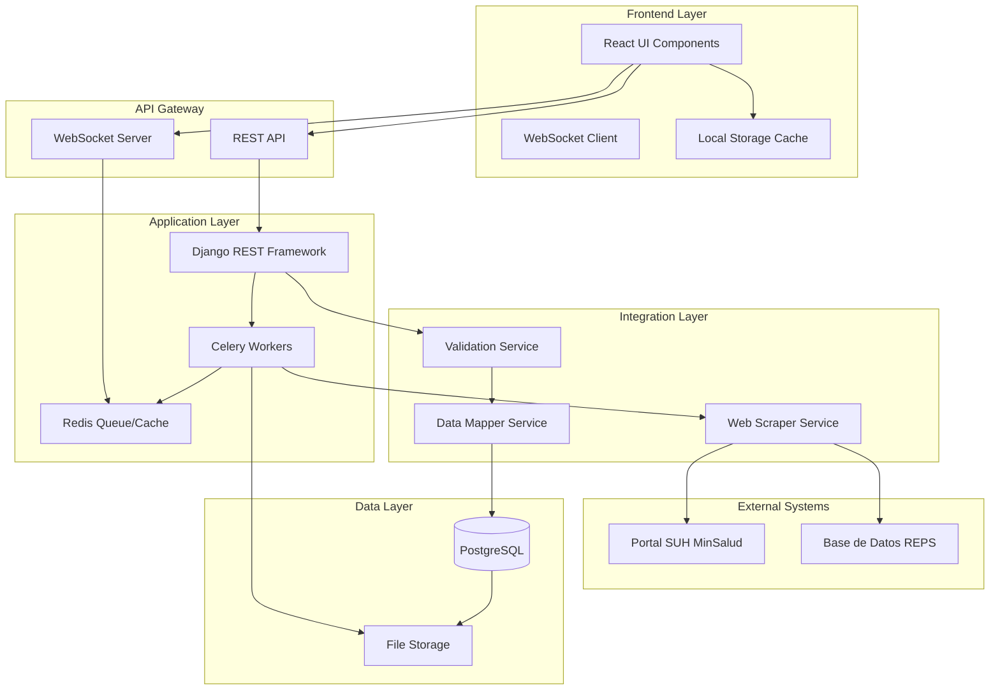

# 🏗️ ARQUITECTURA TÉCNICA - INTEGRACIÓN SUH EN ZENTRAQMS
## Diseño Completo para Sistema de Extracción Automática del Portal de Habilitación

---

## 📐 1. DIAGRAMA DE ARQUITECTURA GENERAL



---

## 🗄️ 2. MODELOS DE DATOS DJANGO

### 2.1 Nuevos Modelos para Integración SUH

```python
# backend/apps/organization/models.py

from django.db import models
from django.contrib.postgres.fields import ArrayField
from apps.common.models import FullBaseModel
import uuid

class SUHExtraction(FullBaseModel):
    """
    Modelo para almacenar extracciones del portal SUH.
    Mantiene trazabilidad completa de todas las extracciones realizadas.
    """
    
    # Estados de extracción
    EXTRACTION_STATUS_CHOICES = [
        ('pending', 'Pendiente'),
        ('in_progress', 'En Progreso'),
        ('completed', 'Completada'),
        ('failed', 'Fallida'),
        ('partial', 'Parcial'),
    ]
    
    # Métodos de extracción
    EXTRACTION_METHOD_CHOICES = [
        ('automatic', 'Automática'),
        ('manual', 'Manual'),
        ('hybrid', 'Híbrida'),
        ('scheduled', 'Programada'),
    ]
    
    # Identificación única
    extraction_id = models.UUIDField(
        default=uuid.uuid4,
        editable=False,
        unique=True,
        db_index=True
    )
    
    # Relación con organización
    organization = models.ForeignKey(
        'Organization',
        on_delete=models.CASCADE,
        related_name='suh_extractions'
    )
    
    health_organization = models.ForeignKey(
        'HealthOrganization',
        on_delete=models.CASCADE,
        related_name='suh_extractions',
        null=True,
        blank=True
    )
    
    # Metadata de extracción
    extraction_date = models.DateTimeField(auto_now_add=True)
    extraction_method = models.CharField(
        max_length=20,
        choices=EXTRACTION_METHOD_CHOICES,
        default='automatic'
    )
    extraction_status = models.CharField(
        max_length=20,
        choices=EXTRACTION_STATUS_CHOICES,
        default='pending'
    )
    
    # Datos de búsqueda
    search_nit = models.CharField(max_length=15)
    search_verification_digit = models.CharField(max_length=1)
    
    # Datos extraídos (JSON estructurado)
    raw_html = models.TextField(
        blank=True,
        help_text="HTML crudo extraído del portal"
    )
    extracted_data = models.JSONField(
        default=dict,
        help_text="Datos estructurados extraídos"
    )
    
    # Validación y procesamiento
    validation_result = models.JSONField(
        default=dict,
        help_text="Resultado de validación de datos"
    )
    processing_errors = models.JSONField(
        default=list,
        help_text="Errores encontrados durante procesamiento"
    )
    
    # Métricas de rendimiento
    extraction_duration_ms = models.IntegerField(
        null=True,
        blank=True,
        help_text="Duración de extracción en milisegundos"
    )
    data_completeness_score = models.DecimalField(
        max_digits=5,
        decimal_places=2,
        null=True,
        blank=True,
        help_text="Porcentaje de completitud de datos (0-100)"
    )
    
    # Trazabilidad
    portal_version = models.CharField(
        max_length=50,
        blank=True,
        help_text="Versión del portal SUH al momento de extracción"
    )
    user_agent = models.CharField(max_length=255, blank=True)
    ip_address = models.GenericIPAddressField(null=True, blank=True)
    
    # Task ID de Celery para seguimiento asíncrono
    celery_task_id = models.CharField(
        max_length=255,
        blank=True,
        db_index=True
    )
    
    class Meta:
        verbose_name = "Extracción SUH"
        verbose_name_plural = "Extracciones SUH"
        ordering = ['-extraction_date']
        indexes = [
            models.Index(fields=['organization', 'extraction_status']),
            models.Index(fields=['extraction_date']),
            models.Index(fields=['search_nit']),
            models.Index(fields=['celery_task_id']),
        ]
    
    def __str__(self):
        return f"Extracción {self.extraction_id} - {self.organization.razon_social}"


class SUHDataMapping(FullBaseModel):
    """
    Mapeo de campos entre portal SUH y modelos internos.
    Permite configuración dinámica de mapeos sin cambiar código.
    """
    
    FIELD_TYPE_CHOICES = [
        ('text', 'Texto'),
        ('number', 'Número'),
        ('date', 'Fecha'),
        ('boolean', 'Booleano'),
        ('json', 'JSON'),
        ('array', 'Lista'),
    ]
    
    # Identificación del mapeo
    mapping_name = models.CharField(
        max_length=100,
        unique=True,
        help_text="Nombre único del mapeo"
    )
    
    # Configuración del mapeo
    suh_field_path = models.CharField(
        max_length=255,
        help_text="Path en el HTML/JSON del portal SUH (e.g., 'div.prestador > span.codigo')"
    )
    
    internal_model = models.CharField(
        max_length=100,
        help_text="Modelo interno destino (e.g., 'HealthOrganization')"
    )
    
    internal_field = models.CharField(
        max_length=100,
        help_text="Campo del modelo interno (e.g., 'codigo_prestador')"
    )
    
    # Tipo y transformación
    field_type = models.CharField(
        max_length=20,
        choices=FIELD_TYPE_CHOICES,
        default='text'
    )
    
    transformation_rule = models.JSONField(
        default=dict,
        blank=True,
        help_text="Reglas de transformación (regex, replace, format, etc.)"
    )
    
    # Validación
    is_required = models.BooleanField(default=False)
    validation_regex = models.CharField(max_length=500, blank=True)
    default_value = models.CharField(max_length=255, blank=True)
    
    # Control de versiones
    suh_version = models.CharField(
        max_length=50,
        default='2024.1',
        help_text="Versión del portal SUH para este mapeo"
    )
    
    # Prioridad y orden
    extraction_order = models.IntegerField(
        default=0,
        help_text="Orden de extracción (menor = primero)"
    )
    
    class Meta:
        verbose_name = "Mapeo de Datos SUH"
        verbose_name_plural = "Mapeos de Datos SUH"
        ordering = ['extraction_order', 'mapping_name']
        indexes = [
            models.Index(fields=['internal_model', 'internal_field']),
            models.Index(fields=['suh_version', 'is_active']),
        ]


class SUHDiscrepancy(FullBaseModel):
    """
    Registro de discrepancias encontradas entre datos SUH y datos locales.
    """
    
    SEVERITY_CHOICES = [
        ('critical', 'Crítica'),
        ('high', 'Alta'),
        ('medium', 'Media'),
        ('low', 'Baja'),
        ('info', 'Informativa'),
    ]
    
    RESOLUTION_CHOICES = [
        ('pending', 'Pendiente'),
        ('accept_suh', 'Aceptar SUH'),
        ('keep_local', 'Mantener Local'),
        ('manual_merge', 'Fusión Manual'),
        ('ignored', 'Ignorada'),
    ]
    
    # Relación con extracción
    extraction = models.ForeignKey(
        SUHExtraction,
        on_delete=models.CASCADE,
        related_name='discrepancies'
    )
    
    # Identificación del campo
    field_name = models.CharField(max_length=100)
    field_label = models.CharField(max_length=200)
    
    # Valores en conflicto
    suh_value = models.TextField(blank=True)
    local_value = models.TextField(blank=True)
    
    # Clasificación
    severity = models.CharField(
        max_length=20,
        choices=SEVERITY_CHOICES,
        default='medium'
    )
    
    # Resolución
    resolution = models.CharField(
        max_length=20,
        choices=RESOLUTION_CHOICES,
        default='pending'
    )
    
    resolution_reason = models.TextField(blank=True)
    resolved_by = models.ForeignKey(
        'authentication.User',
        on_delete=models.SET_NULL,
        null=True,
        blank=True,
        related_name='resolved_discrepancies'
    )
    resolved_at = models.DateTimeField(null=True, blank=True)
    
    # Valor final aplicado
    final_value = models.TextField(blank=True)
    
    # Metadata adicional
    auto_resolvable = models.BooleanField(default=False)
    requires_supervisor = models.BooleanField(default=False)
    affects_compliance = models.BooleanField(default=False)
    
    class Meta:
        verbose_name = "Discrepancia SUH"
        verbose_name_plural = "Discrepancias SUH"
        ordering = ['-severity', 'field_name']
        indexes = [
            models.Index(fields=['extraction', 'resolution']),
            models.Index(fields=['severity', 'resolution']),
        ]
        constraints = [
            models.UniqueConstraint(
                fields=['extraction', 'field_name'],
                name='unique_discrepancy_per_field'
            ),
        ]


class SUHSyncSchedule(FullBaseModel):
    """
    Programación de sincronizaciones automáticas con portal SUH.
    """
    
    FREQUENCY_CHOICES = [
        ('hourly', 'Cada Hora'),
        ('daily', 'Diario'),
        ('weekly', 'Semanal'),
        ('monthly', 'Mensual'),
        ('custom', 'Personalizado'),
    ]
    
    # Relación con organización
    health_organization = models.OneToOneField(
        'HealthOrganization',
        on_delete=models.CASCADE,
        related_name='suh_sync_schedule'
    )
    
    # Configuración de frecuencia
    frequency = models.CharField(
        max_length=20,
        choices=FREQUENCY_CHOICES,
        default='weekly'
    )
    
    cron_expression = models.CharField(
        max_length=100,
        blank=True,
        help_text="Expresión cron para frecuencia personalizada"
    )
    
    # Control de ejecución
    is_enabled = models.BooleanField(default=True)
    last_sync = models.DateTimeField(null=True, blank=True)
    next_sync = models.DateTimeField(null=True, blank=True)
    
    # Configuración de comportamiento
    auto_apply_changes = models.BooleanField(
        default=False,
        help_text="Aplicar cambios automáticamente sin confirmación"
    )
    
    notify_on_changes = models.BooleanField(default=True)
    notification_emails = ArrayField(
        models.EmailField(),
        default=list,
        blank=True
    )
    
    # Filtros de cambios
    critical_fields = ArrayField(
        models.CharField(max_length=100),
        default=list,
        blank=True,
        help_text="Campos que requieren notificación inmediata"
    )
    
    ignored_fields = ArrayField(
        models.CharField(max_length=100),
        default=list,
        blank=True,
        help_text="Campos a ignorar en sincronización"
    )
    
    # Estadísticas
    successful_syncs = models.PositiveIntegerField(default=0)
    failed_syncs = models.PositiveIntegerField(default=0)
    total_changes_detected = models.PositiveIntegerField(default=0)
    total_changes_applied = models.PositiveIntegerField(default=0)
    
    class Meta:
        verbose_name = "Programación Sincronización SUH"
        verbose_name_plural = "Programaciones Sincronización SUH"
        indexes = [
            models.Index(fields=['next_sync', 'is_enabled']),
            models.Index(fields=['health_organization', 'is_active']),
        ]
```

### 2.2 Migraciones de Base de Datos

```python
# backend/apps/organization/migrations/0007_add_suh_integration_models.py

from django.db import migrations, models
import django.db.models.deletion
import django.contrib.postgres.fields
import uuid


class Migration(migrations.Migration):
    dependencies = [
        ('organization', '0006_add_health_models'),
        ('authentication', '0002_alter_user_options'),
    ]

    operations = [
        migrations.CreateModel(
            name='SUHExtraction',
            fields=[
                # Campos heredados de FullBaseModel...
                ('extraction_id', models.UUIDField(default=uuid.uuid4, editable=False, unique=True, db_index=True)),
                # ... resto de campos según modelo
            ],
            options={
                'verbose_name': 'Extracción SUH',
                'verbose_name_plural': 'Extracciones SUH',
                'ordering': ['-extraction_date'],
            },
        ),
        
        # Índices compuestos para optimización
        migrations.AddIndex(
            model_name='suhextraction',
            index=models.Index(fields=['organization', 'extraction_status'], name='idx_org_status'),
        ),
        
        # Agregar campo de referencia a extracción en HealthOrganization
        migrations.AddField(
            model_name='healthorganization',
            name='last_suh_extraction',
            field=models.ForeignKey(
                null=True,
                blank=True,
                on_delete=models.SET_NULL,
                to='organization.SUHExtraction',
                related_name='+'
            ),
        ),
        
        # Agregar campo para tracking de método de origen de datos
        migrations.AddField(
            model_name='healthorganization',
            name='data_source',
            field=models.CharField(
                max_length=20,
                choices=[
                    ('manual', 'Entrada Manual'),
                    ('suh_extraction', 'Extracción SUH'),
                    ('api_import', 'Importación API'),
                    ('migration', 'Migración'),
                ],
                default='manual',
                help_text='Origen de los datos actuales'
            ),
        ),
    ]
```

---

## 🔌 3. APIS REST Y ENDPOINTS

### 3.1 Nuevos ViewSets y Endpoints

```python
# backend/apps/organization/views.py (Adiciones)

from rest_framework import viewsets, status
from rest_framework.decorators import action
from rest_framework.response import Response
from django.db import transaction
from celery import current_app
import logging

logger = logging.getLogger(__name__)


class SUHIntegrationViewSet(viewsets.ViewSet):
    """
    ViewSet para operaciones de integración con portal SUH.
    Maneja extracción automática, validación y sincronización.
    """
    
    permission_classes = [permissions.IsAuthenticated, CanUpdateOrganization]
    
    @action(detail=False, methods=['post'], url_path='check-availability')
    def check_availability(self, request):
        """
        Verificar disponibilidad del portal SUH antes de intentar extracción.
        
        Returns:
            - status: 'available', 'slow', 'unavailable'
            - response_time_ms: tiempo de respuesta en milisegundos
            - cached_data_available: si hay datos en caché disponibles
        """
        from apps.organization.services.suh_service import SUHService
        
        service = SUHService()
        availability = service.check_portal_availability()
        
        return Response({
            'status': availability['status'],
            'response_time_ms': availability['response_time'],
            'portal_url': availability['portal_url'],
            'cached_data_available': service.has_cached_data(
                request.data.get('nit')
            ),
            'recommendation': self._get_recommendation(availability['status'])
        })
    
    @action(detail=False, methods=['post'], url_path='extract')
    def extract_data(self, request):
        """
        Iniciar extracción asíncrona de datos desde portal SUH.
        
        Request body:
            - nit: NIT de la organización
            - verification_digit: Dígito de verificación
            - organization_id: ID de la organización en el sistema
            - method: 'automatic' | 'manual' | 'hybrid'
        
        Returns:
            - task_id: ID de la tarea Celery para seguimiento
            - extraction_id: UUID de la extracción
            - estimated_time_seconds: tiempo estimado de procesamiento
        """
        serializer = SUHExtractionRequestSerializer(data=request.data)
        serializer.is_valid(raise_exception=True)
        
        # Crear registro de extracción
        extraction = SUHExtraction.objects.create(
            organization_id=serializer.validated_data['organization_id'],
            search_nit=serializer.validated_data['nit'],
            search_verification_digit=serializer.validated_data['verification_digit'],
            extraction_method=serializer.validated_data.get('method', 'automatic'),
            extraction_status='pending',
            created_by=request.user,
            updated_by=request.user
        )
        
        # Lanzar tarea asíncrona
        from apps.organization.tasks import extract_suh_data_task
        
        task = extract_suh_data_task.delay(
            extraction_id=str(extraction.extraction_id),
            user_id=request.user.id
        )
        
        # Actualizar task ID
        extraction.celery_task_id = task.id
        extraction.save(update_fields=['celery_task_id'])
        
        return Response({
            'extraction_id': extraction.extraction_id,
            'task_id': task.id,
            'status': 'processing',
            'estimated_time_seconds': 30,
            'websocket_channel': f'/ws/extraction/{extraction.extraction_id}/'
        }, status=status.HTTP_202_ACCEPTED)
    
    @action(detail=False, methods=['get'], url_path='extraction/(?P<extraction_id>[^/.]+)/status')
    def extraction_status(self, request, extraction_id=None):
        """
        Obtener estado actual de una extracción.
        
        Returns:
            - status: estado actual de la extracción
            - progress: porcentaje de progreso (0-100)
            - current_step: paso actual del proceso
            - errors: lista de errores si los hay
            - data_preview: vista previa de datos extraídos (si está completo)
        """
        try:
            extraction = SUHExtraction.objects.get(extraction_id=extraction_id)
        except SUHExtraction.DoesNotExist:
            return Response(
                {'error': 'Extracción no encontrada'},
                status=status.HTTP_404_NOT_FOUND
            )
        
        # Verificar permisos
        if not request.user.has_perm('organization.view_suhextraction'):
            return Response(
                {'error': 'Sin permisos para ver esta extracción'},
                status=status.HTTP_403_FORBIDDEN
            )
        
        # Si hay task_id, verificar estado en Celery
        progress_info = {}
        if extraction.celery_task_id:
            result = current_app.AsyncResult(extraction.celery_task_id)
            if result.state == 'PENDING':
                progress_info = {'progress': 0, 'current_step': 'En cola'}
            elif result.state == 'PROGRESS':
                progress_info = result.info
            elif result.state == 'SUCCESS':
                progress_info = {'progress': 100, 'current_step': 'Completado'}
            elif result.state == 'FAILURE':
                progress_info = {'progress': 0, 'current_step': 'Error', 'error': str(result.info)}
        
        # Preparar respuesta
        response_data = {
            'extraction_id': extraction.extraction_id,
            'status': extraction.extraction_status,
            'extraction_date': extraction.extraction_date,
            'method': extraction.extraction_method,
            **progress_info
        }
        
        # Si está completo, incluir preview de datos
        if extraction.extraction_status == 'completed':
            response_data['data_preview'] = self._get_data_preview(extraction)
            response_data['discrepancies_count'] = extraction.discrepancies.count()
            response_data['completeness_score'] = extraction.data_completeness_score
        
        return Response(response_data)
    
    @action(detail=False, methods=['post'], url_path='validate-discrepancies')
    def validate_discrepancies(self, request):
        """
        Validar y comparar datos extraídos vs datos existentes.
        
        Request body:
            - extraction_id: ID de la extracción
            - organization_id: ID de la organización
            - auto_resolve: resolver automáticamente discrepancias menores
        
        Returns:
            - discrepancies: lista de discrepancias encontradas
            - auto_resolved_count: cantidad de discrepancias resueltas automáticamente
            - requires_review: lista de discrepancias que requieren revisión manual
        """
        serializer = DiscrepancyValidationSerializer(data=request.data)
        serializer.is_valid(raise_exception=True)
        
        extraction = SUHExtraction.objects.get(
            extraction_id=serializer.validated_data['extraction_id']
        )
        
        # Servicio de validación
        from apps.organization.services.validation_service import SUHValidationService
        
        validator = SUHValidationService()
        validation_result = validator.validate_extraction(
            extraction=extraction,
            auto_resolve=serializer.validated_data.get('auto_resolve', False)
        )
        
        # Guardar resultado de validación
        extraction.validation_result = validation_result
        extraction.save(update_fields=['validation_result', 'updated_at'])
        
        # Crear registros de discrepancias
        discrepancies_created = []
        for disc in validation_result['discrepancies']:
            discrepancy = SUHDiscrepancy.objects.create(
                extraction=extraction,
                field_name=disc['field_name'],
                field_label=disc['field_label'],
                suh_value=disc['suh_value'],
                local_value=disc['local_value'],
                severity=disc['severity'],
                auto_resolvable=disc['auto_resolvable'],
                created_by=request.user
            )
            discrepancies_created.append(discrepancy)
        
        return Response({
            'extraction_id': extraction.extraction_id,
            'total_discrepancies': len(discrepancies_created),
            'auto_resolved': validation_result['auto_resolved_count'],
            'requires_review': [
                SUHDiscrepancySerializer(d).data 
                for d in discrepancies_created 
                if d.resolution == 'pending'
            ],
            'critical_count': sum(1 for d in discrepancies_created if d.severity == 'critical'),
            'validation_summary': validation_result['summary']
        })
    
    @action(detail=False, methods=['post'], url_path='resolve-discrepancies')
    def resolve_discrepancies(self, request):
        """
        Resolver discrepancias manualmente.
        
        Request body:
            - resolutions: lista de resoluciones
                - discrepancy_id: ID de la discrepancia
                - resolution: 'accept_suh' | 'keep_local' | 'manual_merge'
                - final_value: valor final (si es manual_merge)
                - reason: razón de la decisión
        
        Returns:
            - resolved_count: cantidad de discrepancias resueltas
            - applied_changes: cambios aplicados a la organización
        """
        serializer = DiscrepancyResolutionSerializer(data=request.data)
        serializer.is_valid(raise_exception=True)
        
        resolved_count = 0
        applied_changes = []
        
        with transaction.atomic():
            for resolution_data in serializer.validated_data['resolutions']:
                discrepancy = SUHDiscrepancy.objects.get(
                    id=resolution_data['discrepancy_id']
                )
                
                # Aplicar resolución
                discrepancy.resolution = resolution_data['resolution']
                discrepancy.resolution_reason = resolution_data.get('reason', '')
                discrepancy.resolved_by = request.user
                discrepancy.resolved_at = timezone.now()
                
                # Determinar valor final
                if resolution_data['resolution'] == 'accept_suh':
                    discrepancy.final_value = discrepancy.suh_value
                elif resolution_data['resolution'] == 'keep_local':
                    discrepancy.final_value = discrepancy.local_value
                else:  # manual_merge
                    discrepancy.final_value = resolution_data['final_value']
                
                discrepancy.save()
                resolved_count += 1
                
                # Aplicar cambio si corresponde
                if resolution_data.get('apply_immediately', False):
                    change_result = self._apply_discrepancy_resolution(discrepancy)
                    if change_result:
                        applied_changes.append(change_result)
        
        return Response({
            'resolved_count': resolved_count,
            'applied_changes': applied_changes,
            'pending_count': SUHDiscrepancy.objects.filter(
                extraction=discrepancy.extraction,
                resolution='pending'
            ).count()
        })
    
    @action(detail=False, methods=['post'], url_path='apply-extraction')
    def apply_extraction(self, request):
        """
        Aplicar datos extraídos a la organización.
        
        Request body:
            - extraction_id: ID de la extracción
            - organization_id: ID de la organización
            - create_backup: crear respaldo antes de aplicar
        
        Returns:
            - success: si se aplicaron los cambios exitosamente
            - backup_id: ID del respaldo creado (si aplica)
            - updated_fields: campos actualizados
            - health_organization_id: ID del registro de salud creado/actualizado
        """
        serializer = ApplyExtractionSerializer(data=request.data)
        serializer.is_valid(raise_exception=True)
        
        extraction = SUHExtraction.objects.get(
            extraction_id=serializer.validated_data['extraction_id']
        )
        
        # Verificar que todas las discrepancias críticas estén resueltas
        pending_critical = extraction.discrepancies.filter(
            severity='critical',
            resolution='pending'
        ).count()
        
        if pending_critical > 0:
            return Response({
                'error': f'Hay {pending_critical} discrepancias críticas sin resolver',
                'pending_critical_count': pending_critical
            }, status=status.HTTP_400_BAD_REQUEST)
        
        # Crear respaldo si se solicita
        backup_id = None
        if serializer.validated_data.get('create_backup', True):
            from apps.organization.services.backup_service import BackupService
            backup_service = BackupService()
            backup_id = backup_service.create_backup(
                extraction.organization,
                reason=f'Antes de aplicar extracción SUH {extraction.extraction_id}'
            )
        
        # Aplicar datos
        from apps.organization.services.suh_application_service import SUHApplicationService
        
        application_service = SUHApplicationService()
        with transaction.atomic():
            result = application_service.apply_extraction(
                extraction=extraction,
                user=request.user
            )
        
        # Actualizar estado de extracción
        extraction.extraction_status = 'applied'
        extraction.save(update_fields=['extraction_status', 'updated_at'])
        
        return Response({
            'success': True,
            'extraction_id': extraction.extraction_id,
            'backup_id': backup_id,
            'updated_fields': result['updated_fields'],
            'health_organization_id': result['health_organization_id'],
            'services_created': result['services_created'],
            'services_updated': result['services_updated'],
            'locations_created': result['locations_created']
        })
    
    @action(detail=False, methods=['post'], url_path='schedule-sync')
    def schedule_sync(self, request):
        """
        Programar sincronización periódica con portal SUH.
        
        Request body:
            - health_organization_id: ID de la organización de salud
            - frequency: 'daily' | 'weekly' | 'monthly' | 'custom'
            - cron_expression: expresión cron (si frequency es 'custom')
            - auto_apply: aplicar cambios automáticamente
            - notification_emails: lista de emails para notificaciones
        
        Returns:
            - schedule_id: ID de la programación creada
            - next_sync: fecha/hora de próxima sincronización
        """
        serializer = SyncScheduleSerializer(data=request.data)
        serializer.is_valid(raise_exception=True)
        
        # Crear o actualizar programación
        schedule, created = SUHSyncSchedule.objects.update_or_create(
            health_organization_id=serializer.validated_data['health_organization_id'],
            defaults={
                'frequency': serializer.validated_data['frequency'],
                'cron_expression': serializer.validated_data.get('cron_expression', ''),
                'auto_apply_changes': serializer.validated_data.get('auto_apply', False),
                'notification_emails': serializer.validated_data.get('notification_emails', []),
                'updated_by': request.user
            }
        )
        
        # Calcular próxima sincronización
        from apps.organization.services.scheduler_service import SchedulerService
        scheduler = SchedulerService()
        next_sync = scheduler.calculate_next_sync(schedule)
        
        schedule.next_sync = next_sync
        schedule.save(update_fields=['next_sync'])
        
        # Programar tarea en Celery Beat
        scheduler.schedule_periodic_task(schedule)
        
        return Response({
            'schedule_id': schedule.id,
            'created': created,
            'frequency': schedule.frequency,
            'next_sync': next_sync,
            'is_enabled': schedule.is_enabled,
            'auto_apply': schedule.auto_apply_changes
        })
    
    def _get_recommendation(self, status):
        """Obtener recomendación basada en estado del portal."""
        recommendations = {
            'available': 'Portal disponible. Proceda con extracción automática.',
            'slow': 'Portal lento. Considere usar caché o intentar más tarde.',
            'unavailable': 'Portal no disponible. Use entrada manual o caché.'
        }
        return recommendations.get(status, 'Estado desconocido')
    
    def _get_data_preview(self, extraction):
        """Generar preview de datos extraídos."""
        if not extraction.extracted_data:
            return None
        
        return {
            'prestador': extraction.extracted_data.get('prestador', {}),
            'sedes_count': len(extraction.extracted_data.get('sedes', [])),
            'servicios_count': len(extraction.extracted_data.get('servicios', [])),
            'habilitacion': extraction.extracted_data.get('habilitacion', {})
        }
    
    def _apply_discrepancy_resolution(self, discrepancy):
        """Aplicar resolución de discrepancia al modelo."""
        # Implementación específica según el campo
        # Este es un método simplificado, la implementación real sería más compleja
        
        model_map = {
            'HealthOrganization': HealthOrganization,
            'HealthService': HealthService,
            'Location': Location
        }
        
        # Parsear field_name para obtener modelo y campo
        parts = discrepancy.field_name.split('.')
        if len(parts) != 2:
            return None
        
        model_name, field_name = parts
        model_class = model_map.get(model_name)
        
        if not model_class:
            return None
        
        try:
            # Obtener instancia y actualizar campo
            instance = model_class.objects.get(
                organization=discrepancy.extraction.organization
            )
            setattr(instance, field_name, discrepancy.final_value)
            instance.save(update_fields=[field_name, 'updated_at', 'updated_by'])
            
            return {
                'model': model_name,
                'field': field_name,
                'new_value': discrepancy.final_value
            }
        except Exception as e:
            logger.error(f"Error applying discrepancy resolution: {e}")
            return None
```

### 3.2 Serializers

```python
# backend/apps/organization/serializers.py (Adiciones)

from rest_framework import serializers
from .models import SUHExtraction, SUHDiscrepancy, SUHSyncSchedule


class SUHExtractionRequestSerializer(serializers.Serializer):
    """Serializer para solicitud de extracción SUH."""
    
    nit = serializers.CharField(max_length=15)
    verification_digit = serializers.CharField(max_length=1)
    organization_id = serializers.IntegerField()
    method = serializers.ChoiceField(
        choices=['automatic', 'manual', 'hybrid'],
        default='automatic'
    )
    
    def validate_nit(self, value):
        """Validar formato de NIT."""
        import re
        if not re.match(r'^[\d\-]{9,15}$', value):
            raise serializers.ValidationError(
                "NIT debe tener formato válido: 123456789 o 123-456-789"
            )
        return value.replace('-', '')


class SUHExtractionSerializer(serializers.ModelSerializer):
    """Serializer para modelo SUHExtraction."""
    
    discrepancies_count = serializers.SerializerMethodField()
    organization_name = serializers.CharField(
        source='organization.razon_social',
        read_only=True
    )
    
    class Meta:
        model = SUHExtraction
        fields = [
            'extraction_id', 'organization', 'organization_name',
            'extraction_date', 'extraction_method', 'extraction_status',
            'search_nit', 'data_completeness_score', 'extraction_duration_ms',
            'discrepancies_count', 'validation_result'
        ]
        read_only_fields = ['extraction_id', 'extraction_date']
    
    def get_discrepancies_count(self, obj):
        return obj.discrepancies.count()


class SUHDiscrepancySerializer(serializers.ModelSerializer):
    """Serializer para discrepancias SUH."""
    
    class Meta:
        model = SUHDiscrepancy
        fields = [
            'id', 'field_name', 'field_label', 'suh_value', 'local_value',
            'severity', 'resolution', 'resolution_reason', 'final_value',
            'auto_resolvable', 'requires_supervisor', 'affects_compliance'
        ]


class DiscrepancyResolutionSerializer(serializers.Serializer):
    """Serializer para resolución de discrepancias."""
    
    resolutions = serializers.ListField(
        child=serializers.DictField(),
        allow_empty=False
    )
    
    def validate_resolutions(self, value):
        """Validar estructura de resoluciones."""
        for resolution in value:
            if 'discrepancy_id' not in resolution:
                raise serializers.ValidationError(
                    "Cada resolución debe incluir 'discrepancy_id'"
                )
            if 'resolution' not in resolution:
                raise serializers.ValidationError(
                    "Cada resolución debe incluir 'resolution'"
                )
            if resolution['resolution'] not in ['accept_suh', 'keep_local', 'manual_merge']:
                raise serializers.ValidationError(
                    "Resolución debe ser: accept_suh, keep_local o manual_merge"
                )
            if resolution['resolution'] == 'manual_merge' and 'final_value' not in resolution:
                raise serializers.ValidationError(
                    "manual_merge requiere 'final_value'"
                )
        return value


class SUHSyncScheduleSerializer(serializers.ModelSerializer):
    """Serializer para programación de sincronización."""
    
    class Meta:
        model = SUHSyncSchedule
        fields = [
            'id', 'health_organization', 'frequency', 'cron_expression',
            'is_enabled', 'last_sync', 'next_sync', 'auto_apply_changes',
            'notification_emails', 'successful_syncs', 'failed_syncs'
        ]
        read_only_fields = ['last_sync', 'next_sync', 'successful_syncs', 'failed_syncs']
```

---

## ⚙️ 4. SERVICIOS DE EXTRACCIÓN WEB

### 4.1 Servicio de Web Scraping con Playwright

```python
# backend/apps/organization/services/suh_scraper.py

import asyncio
from playwright.async_api import async_playwright
import logging
from typing import Dict, Any, Optional
from datetime import datetime
import json

logger = logging.getLogger(__name__)


class SUHWebScraper:
    """
    Servicio de web scraping para el portal SUH usando Playwright.
    Maneja la extracción automatizada de datos del portal del MinSalud.
    """
    
    PORTAL_URL = "https://prestadores.minsalud.gov.co/habilitacion/"
    LOGIN_CREDENTIALS = {
        'username': 'invitado',
        'password': 'invitado'
    }
    TIMEOUT = 30000  # 30 segundos
    
    def __init__(self):
        self.browser = None
        self.context = None
        self.page = None
        
    async def initialize(self):
        """Inicializar navegador y contexto."""
        playwright = await async_playwright().start()
        
        # Configuración del navegador
        self.browser = await playwright.chromium.launch(
            headless=True,
            args=[
                '--disable-blink-features=AutomationControlled',
                '--disable-dev-shm-usage',
                '--no-sandbox'
            ]
        )
        
        # Contexto con user agent realista
        self.context = await self.browser.new_context(
            user_agent='Mozilla/5.0 (Windows NT 10.0; Win64; x64) AppleWebKit/537.36',
            viewport={'width': 1920, 'height': 1080},
            locale='es-CO'
        )
        
        # Configurar timeouts y opciones de página
        self.page = await self.context.new_page()
        self.page.set_default_timeout(self.TIMEOUT)
        
    async def close(self):
        """Cerrar navegador y limpiar recursos."""
        if self.page:
            await self.page.close()
        if self.context:
            await self.context.close()
        if self.browser:
            await self.browser.close()
    
    async def login(self) -> bool:
        """
        Realizar login en el portal SUH.
        
        Returns:
            bool: True si el login fue exitoso
        """
        try:
            await self.page.goto(self.PORTAL_URL, wait_until='networkidle')
            
            # Buscar y completar formulario de login
            await self.page.fill('#username', self.LOGIN_CREDENTIALS['username'])
            await self.page.fill('#password', self.LOGIN_CREDENTIALS['password'])
            
            # Click en botón de login
            await self.page.click('button[type="submit"]')
            
            # Esperar redirección o elemento del dashboard
            await self.page.wait_for_selector('.dashboard-container', timeout=10000)
            
            logger.info("Login exitoso en portal SUH")
            return True
            
        except Exception as e:
            logger.error(f"Error durante login: {e}")
            return False
    
    async def search_by_nit(self, nit: str, verification_digit: str) -> Dict[str, Any]:
        """
        Buscar prestador por NIT en el portal.
        
        Args:
            nit: NIT sin dígito de verificación
            verification_digit: Dígito de verificación
            
        Returns:
            Diccionario con datos del prestador encontrado
        """
        try:
            # Navegar a página de búsqueda
            await self.page.goto(f"{self.PORTAL_URL}/consultas/prestadores")
            
            # Completar formulario de búsqueda
            await self.page.fill('#nit-search', nit)
            await self.page.fill('#dv-search', verification_digit)
            
            # Ejecutar búsqueda
            await self.page.click('#btn-buscar')
            
            # Esperar resultados
            await self.page.wait_for_selector('.search-results', timeout=10000)
            
            # Verificar si hay resultados
            no_results = await self.page.query_selector('.no-results-message')
            if no_results:
                return {'found': False, 'message': 'Prestador no encontrado'}
            
            # Extraer datos básicos del resultado
            prestador_data = await self._extract_prestador_basic_data()
            
            # Click en ver detalle
            await self.page.click('.btn-ver-detalle')
            await self.page.wait_for_selector('.prestador-detail', timeout=10000)
            
            # Extraer datos completos
            full_data = await self._extract_prestador_full_data()
            
            return {
                'found': True,
                'prestador': {**prestador_data, **full_data}
            }
            
        except Exception as e:
            logger.error(f"Error buscando prestador: {e}")
            return {'found': False, 'error': str(e)}
    
    async def _extract_prestador_basic_data(self) -> Dict[str, Any]:
        """Extraer datos básicos del prestador desde resultados de búsqueda."""
        data = {}
        
        try:
            # Código REPS
            codigo_elem = await self.page.query_selector('.codigo-prestador')
            if codigo_elem:
                data['codigo_reps'] = await codigo_elem.inner_text()
            
            # Razón social
            razon_elem = await self.page.query_selector('.razon-social')
            if razon_elem:
                data['razon_social'] = await razon_elem.inner_text()
            
            # Estado habilitación
            estado_elem = await self.page.query_selector('.estado-habilitacion')
            if estado_elem:
                data['estado_habilitacion'] = await estado_elem.inner_text()
            
            # Naturaleza jurídica
            naturaleza_elem = await self.page.query_selector('.naturaleza-juridica')
            if naturaleza_elem:
                data['naturaleza_juridica'] = await naturaleza_elem.inner_text()
                
        except Exception as e:
            logger.error(f"Error extrayendo datos básicos: {e}")
        
        return data
    
    async def _extract_prestador_full_data(self) -> Dict[str, Any]:
        """Extraer datos completos del prestador desde página de detalle."""
        data = {
            'informacion_general': {},
            'representante_legal': {},
            'sedes': [],
            'servicios': [],
            'capacidad': {}
        }
        
        try:
            # Información general
            data['informacion_general'] = await self._extract_section(
                '.seccion-informacion-general',
                [
                    ('tipo_prestador', '.tipo-prestador'),
                    ('clase_prestador', '.clase-prestador'),
                    ('caracter_territorial', '.caracter-territorial'),
                    ('fecha_inscripcion', '.fecha-inscripcion'),
                    ('fecha_vencimiento', '.fecha-vencimiento'),
                    ('resolucion', '.numero-resolucion')
                ]
            )
            
            # Representante legal
            data['representante_legal'] = await self._extract_section(
                '.seccion-representante',
                [
                    ('tipo_documento', '.tipo-doc-rep'),
                    ('numero_documento', '.numero-doc-rep'),
                    ('nombre_completo', '.nombre-rep'),
                    ('telefono', '.telefono-rep'),
                    ('email', '.email-rep')
                ]
            )
            
            # Sedes
            data['sedes'] = await self._extract_sedes()
            
            # Servicios habilitados
            data['servicios'] = await self._extract_servicios()
            
            # Capacidad instalada
            data['capacidad'] = await self._extract_capacidad()
            
        except Exception as e:
            logger.error(f"Error extrayendo datos completos: {e}")
        
        return data
    
    async def _extract_section(self, section_selector: str, 
                              field_mappings: list) -> Dict[str, Any]:
        """
        Extraer datos de una sección específica.
        
        Args:
            section_selector: Selector CSS de la sección
            field_mappings: Lista de tuplas (nombre_campo, selector)
        """
        section_data = {}
        
        try:
            section = await self.page.query_selector(section_selector)
            if not section:
                return section_data
            
            for field_name, selector in field_mappings:
                element = await section.query_selector(selector)
                if element:
                    value = await element.inner_text()
                    section_data[field_name] = value.strip()
                    
        except Exception as e:
            logger.error(f"Error extrayendo sección {section_selector}: {e}")
        
        return section_data
    
    async def _extract_sedes(self) -> list:
        """Extraer información de sedes."""
        sedes = []
        
        try:
            # Navegar a pestaña de sedes
            await self.page.click('#tab-sedes')
            await self.page.wait_for_selector('.tabla-sedes', timeout=5000)
            
            # Obtener todas las filas de sedes
            sede_rows = await self.page.query_selector_all('.tabla-sedes tbody tr')
            
            for row in sede_rows:
                sede_data = {}
                
                # Extraer datos de cada columna
                cells = await row.query_selector_all('td')
                if len(cells) >= 6:
                    sede_data['codigo_sede'] = await cells[0].inner_text()
                    sede_data['nombre'] = await cells[1].inner_text()
                    sede_data['direccion'] = await cells[2].inner_text()
                    sede_data['municipio'] = await cells[3].inner_text()
                    sede_data['departamento'] = await cells[4].inner_text()
                    sede_data['telefono'] = await cells[5].inner_text() if len(cells) > 5 else ''
                    sede_data['sede_principal'] = 'principal' in (await cells[1].inner_text()).lower()
                
                if sede_data:
                    sedes.append(sede_data)
                    
        except Exception as e:
            logger.error(f"Error extrayendo sedes: {e}")
        
        return sedes
    
    async def _extract_servicios(self) -> list:
        """Extraer información de servicios habilitados."""
        servicios = []
        
        try:
            # Navegar a pestaña de servicios
            await self.page.click('#tab-servicios')
            await self.page.wait_for_selector('.tabla-servicios', timeout=5000)
            
            # Paginar si es necesario
            page_num = 1
            while True:
                # Extraer servicios de la página actual
                servicio_rows = await self.page.query_selector_all('.tabla-servicios tbody tr')
                
                for row in servicio_rows:
                    servicio_data = {}
                    
                    cells = await row.query_selector_all('td')
                    if len(cells) >= 5:
                        servicio_data['codigo'] = await cells[0].inner_text()
                        servicio_data['nombre'] = await cells[1].inner_text()
                        servicio_data['grupo'] = await cells[2].inner_text()
                        servicio_data['modalidad'] = await cells[3].inner_text()
                        servicio_data['complejidad'] = await cells[4].inner_text()
                        servicio_data['estado'] = await cells[5].inner_text() if len(cells) > 5 else 'ACTIVO'
                        servicio_data['capacidad'] = await cells[6].inner_text() if len(cells) > 6 else ''
                    
                    if servicio_data:
                        servicios.append(servicio_data)
                
                # Verificar si hay más páginas
                next_button = await self.page.query_selector('.pagination .next:not(.disabled)')
                if next_button:
                    await next_button.click()
                    await self.page.wait_for_load_state('networkidle')
                    page_num += 1
                else:
                    break
                    
        except Exception as e:
            logger.error(f"Error extrayendo servicios: {e}")
        
        return servicios
    
    async def _extract_capacidad(self) -> Dict[str, Any]:
        """Extraer información de capacidad instalada."""
        capacidad = {}
        
        try:
            # Navegar a pestaña de capacidad
            await self.page.click('#tab-capacidad')
            await self.page.wait_for_selector('.capacidad-container', timeout=5000)
            
            # Extraer diferentes tipos de capacidad
            capacidad_items = [
                ('camas_adultos', '#camas-adultos'),
                ('camas_pediatria', '#camas-pediatria'),
                ('camas_obstetricia', '#camas-obstetricia'),
                ('camas_uci_adultos', '#camas-uci-adultos'),
                ('camas_uci_pediatrica', '#camas-uci-pediatrica'),
                ('salas_cirugia', '#salas-cirugia'),
                ('salas_partos', '#salas-partos'),
                ('consultorios', '#consultorios')
            ]
            
            for key, selector in capacidad_items:
                element = await self.page.query_selector(selector)
                if element:
                    value = await element.inner_text()
                    try:
                        capacidad[key] = int(value)
                    except ValueError:
                        capacidad[key] = .0
                        
        except Exception as e:
            logger.error(f"Error extrayendo capacidad: {e}")
        
        return capacidad
    
    async def extract_complete_data(self, nit: str, verification_digit: str) -> Dict[str, Any]:
        """
        Método principal para extraer todos los datos de un prestador.
        
        Args:
            nit: NIT del prestador
            verification_digit: Dígito de verificación
            
        Returns:
            Diccionario completo con todos los datos extraídos
        """
        extraction_result = {
            'success': False,
            'timestamp': datetime.now().isoformat(),
            'search_params': {
                'nit': nit,
                'verification_digit': verification_digit
            },
            'data': {},
            'errors': [],
            'extraction_time_ms': 0
        }
        
        start_time = datetime.now()
        
        try:
            # Inicializar navegador
            await self.initialize()
            
            # Login
            login_success = await self.login()
            if not login_success:
                extraction_result['errors'].append('Error en autenticación')
                return extraction_result
            
            # Buscar prestador
            search_result = await self.search_by_nit(nit, verification_digit)
            
            if search_result.get('found'):
                extraction_result['success'] = True
                extraction_result['data'] = search_result['prestador']
            else:
                extraction_result['errors'].append(
                    search_result.get('message', 'Prestador no encontrado')
                )
            
        except Exception as e:
            logger.error(f"Error en extracción completa: {e}")
            extraction_result['errors'].append(str(e))
            
        finally:
            # Cerrar navegador
            await self.close()
            
            # Calcular tiempo de extracción
            end_time = datetime.now()
            extraction_result['extraction_time_ms'] = int(
                (end_time - start_time).total_seconds() * 1000
            )
        
        return extraction_result


# Función helper para ejecutar extracción de forma síncrona
def extract_suh_data_sync(nit: str, verification_digit: str) -> Dict[str, Any]:
    """
    Wrapper síncrono para usar en Django/Celery.
    
    Args:
        nit: NIT del prestador
        verification_digit: Dígito de verificación
        
    Returns:
        Diccionario con datos extraídos
    """
    scraper = SUHWebScraper()
    
    # Crear nuevo event loop para contexto síncrono
    loop = asyncio.new_event_loop()
    asyncio.set_event_loop(loop)
    
    try:
        result = loop.run_until_complete(
            scraper.extract_complete_data(nit, verification_digit)
        )
        return result
    finally:
        loop.close()
```

---

## 🔄 5. TAREAS ASÍNCRONAS CON CELERY

### 5.1 Configuración de Celery

```python
# backend/config/celery.py

import os
from celery import Celery
from celery.schedules import crontab

os.environ.setdefault('DJANGO_SETTINGS_MODULE', 'config.settings.production')

app = Celery('zentraqms')
app.config_from_object('django.conf:settings', namespace='CELERY')
app.autodiscover_tasks()

# Configuración de beat scheduler para tareas periódicas
app.conf.beat_schedule = {
    'check-suh-sync-schedules': {
        'task': 'apps.organization.tasks.check_pending_syncs',
        'schedule': crontab(minute='*/5'),  # Cada 5 minutos
    },
    'cleanup-old-extractions': {
        'task': 'apps.organization.tasks.cleanup_old_extractions',
        'schedule': crontab(hour=2, minute=0),  # Diariamente a las 2 AM
    },
}

# Configuración de enrutamiento de tareas
app.conf.task_routes = {
    'apps.organization.tasks.extract_suh_data_task': {'queue': 'suh_extraction'},
    'apps.organization.tasks.sync_suh_data_task': {'queue': 'suh_sync'},
    'apps.organization.tasks.validate_extraction_task': {'queue': 'validation'},
}

# Configuración de reintentos y timeouts
app.conf.task_annotations = {
    'apps.organization.tasks.extract_suh_data_task': {
        'max_retries': 3,
        'default_retry_delay': 60,  # 1 minuto
        'soft_time_limit': 120,  # 2 minutos
        'time_limit': 180,  # 3 minutos
    },
}
```

### 5.2 Tareas de Celery

```python
# backend/apps/organization/tasks.py

from celery import shared_task, current_task
from celery.result import AsyncResult
from django.core.cache import cache
from django.db import transaction
from channels.layers import get_channel_layer
from asgiref.sync import async_to_sync
import logging
import json
from datetime import datetime, timedelta

logger = logging.getLogger(__name__)
channel_layer = get_channel_layer()


@shared_task(bind=True, name='extract_suh_data_task')
def extract_suh_data_task(self, extraction_id: str, user_id: int):
    """
    Tarea asíncrona para extraer datos del portal SUH.
    
    Args:
        extraction_id: UUID de la extracción
        user_id: ID del usuario que solicita la extracción
    """
    from apps.organization.models import SUHExtraction
    from apps.organization.services.suh_scraper import extract_suh_data_sync
    from apps.authentication.models import User
    
    try:
        # Obtener extracción
        extraction = SUHExtraction.objects.get(extraction_id=extraction_id)
        user = User.objects.get(id=user_id)
        
        # Actualizar estado
        extraction.extraction_status = 'in_progress'
        extraction.save(update_fields=['extraction_status'])
        
        # Notificar progreso via WebSocket
        self._send_progress_update(extraction_id, 10, 'Conectando al portal SUH...')
        
        # Verificar caché primero
        cache_key = f"suh_data_{extraction.search_nit}"
        cached_data = cache.get(cache_key)
        
        if cached_data and (datetime.now() - cached_data['timestamp']).seconds < 3600:
            logger.info(f"Usando datos en caché para NIT {extraction.search_nit}")
            extraction_result = cached_data['data']
            self._send_progress_update(extraction_id, 50, 'Datos obtenidos de caché')
        else:
            # Extraer datos del portal
            self._send_progress_update(extraction_id, 20, 'Iniciando sesión en portal...')
            
            extraction_result = extract_suh_data_sync(
                extraction.search_nit,
                extraction.search_verification_digit
            )
            
            self._send_progress_update(extraction_id, 70, 'Procesando datos extraídos...')
            
            # Guardar en caché si fue exitoso
            if extraction_result['success']:
                cache.set(cache_key, {
                    'timestamp': datetime.now(),
                    'data': extraction_result
                }, 7200)  # 2 horas
        
        # Procesar resultado
        if extraction_result['success']:
            # Guardar datos extraídos
            extraction.extracted_data = extraction_result['data']
            extraction.extraction_status = 'completed'
            extraction.extraction_duration_ms = extraction_result['extraction_time_ms']
            
            # Calcular completitud
            extraction.data_completeness_score = self._calculate_completeness(
                extraction_result['data']
            )
            
            self._send_progress_update(extraction_id, 90, 'Validando datos...')
            
            # Lanzar validación automática
            from apps.organization.tasks import validate_extraction_task
            validate_extraction_task.delay(extraction_id, user_id)
            
        else:
            extraction.extraction_status = 'failed'
            extraction.processing_errors = extraction_result['errors']
        
        extraction.save()
        
        # Notificación final
        self._send_progress_update(
            extraction_id, 
            100, 
            'Extracción completada' if extraction_result['success'] else 'Extracción fallida'
        )
        
        return {
            'extraction_id': extraction_id,
            'success': extraction_result['success'],
            'completeness_score': extraction.data_completeness_score
        }
        
    except Exception as e:
        logger.error(f"Error en tarea de extracción: {e}")
        
        # Actualizar estado de error
        if 'extraction' in locals():
            extraction.extraction_status = 'failed'
            extraction.processing_errors = [str(e)]
            extraction.save()
        
        # Notificar error
        self._send_progress_update(extraction_id, 0, f'Error: {str(e)}')
        
        # Re-intentar si es posible
        raise self.retry(exc=e, countdown=60)
    
    def _send_progress_update(self, extraction_id, progress, message):
        """Enviar actualización de progreso via WebSocket."""
        try:
            async_to_sync(channel_layer.group_send)(
                f'extraction_{extraction_id}',
                {
                    'type': 'extraction_progress',
                    'progress': progress,
                    'message': message,
                    'timestamp': datetime.now().isoformat()
                }
            )
        except Exception as e:
            logger.error(f"Error enviando actualización WebSocket: {e}")
    
    def _calculate_completeness(self, data):
        """Calcular porcentaje de completitud de datos."""
        required_fields = [
            'codigo_reps', 'razon_social', 'naturaleza_juridica',
            'representante_legal', 'sedes', 'servicios'
        ]
        
        filled_fields = sum(1 for field in required_fields if data.get(field))
        return (filled_fields / len(required_fields)) * 100


@shared_task(bind=True, name='validate_extraction_task')
def validate_extraction_task(self, extraction_id: str, user_id: int):
    """
    Validar datos extraídos contra datos existentes.
    
    Args:
        extraction_id: UUID de la extracción
        user_id: ID del usuario
    """
    from apps.organization.models import SUHExtraction, SUHDiscrepancy
    from apps.organization.services.validation_service import SUHValidationService
    
    try:
        extraction = SUHExtraction.objects.get(extraction_id=extraction_id)
        
        # Servicio de validación
        validator = SUHValidationService()
        validation_result = validator.validate_extraction(extraction)
        
        # Crear registros de discrepancias
        with transaction.atomic():
            for disc_data in validation_result['discrepancies']:
                SUHDiscrepancy.objects.create(
                    extraction=extraction,
                    field_name=disc_data['field_name'],
                    field_label=disc_data['field_label'],
                    suh_value=disc_data['suh_value'],
                    local_value=disc_data['local_value'],
                    severity=disc_data['severity'],
                    auto_resolvable=disc_data['auto_resolvable'],
                    created_by_id=user_id
                )
        
        # Actualizar resultado de validación
        extraction.validation_result = validation_result
        extraction.save(update_fields=['validation_result'])
        
        # Notificar si hay discrepancias críticas
        critical_count = sum(
            1 for d in validation_result['discrepancies'] 
            if d['severity'] == 'critical'
        )
        
        if critical_count > 0:
            self._send_critical_discrepancy_notification(
                extraction, critical_count, user_id
            )
        
        return {
            'extraction_id': extraction_id,
            'total_discrepancies': len(validation_result['discrepancies']),
            'critical_count': critical_count
        }
        
    except Exception as e:
        logger.error(f"Error en validación: {e}")
        raise self.retry(exc=e, countdown=30)
    
    def _send_critical_discrepancy_notification(self, extraction, count, user_id):
        """Enviar notificación de discrepancias críticas."""
        from apps.authentication.models import User
        from django.core.mail import send_mail
        
        try:
            user = User.objects.get(id=user_id)
            
            send_mail(
                subject=f'⚠️ {count} discrepancias críticas encontradas',
                message=f"""
                Se encontraron {count} discrepancias críticas en la extracción SUH
                para {extraction.organization.razon_social}.
                
                Por favor revise y resuelva las discrepancias en:
                https://zentraqms.com/extractions/{extraction.extraction_id}/discrepancies
                """,
                from_email='notifications@zentraqms.com',
                recipient_list=[user.email],
                fail_silently=True
            )
        except Exception as e:
            logger.error(f"Error enviando notificación: {e}")


@shared_task(name='sync_suh_data_task')
def sync_suh_data_task(schedule_id: int):
    """
    Sincronización programada con portal SUH.
    
    Args:
        schedule_id: ID de la programación de sincronización
    """
    from apps.organization.models import SUHSyncSchedule, SUHExtraction
    from apps.organization.services.sync_service import SUHSyncService
    
    try:
        schedule = SUHSyncSchedule.objects.get(id=schedule_id)
        
        if not schedule.is_enabled:
            logger.info(f"Sincronización {schedule_id} está deshabilitada")
            return
        
        # Crear nueva extracción para sincronización
        extraction = SUHExtraction.objects.create(
            organization=schedule.health_organization.organization,
            health_organization=schedule.health_organization,
            search_nit=schedule.health_organization.organization.nit,
            search_verification_digit=schedule.health_organization.organization.digito_verificacion,
            extraction_method='scheduled',
            extraction_status='pending'
        )
        
        # Ejecutar extracción
        extract_suh_data_task.delay(
            str(extraction.extraction_id),
            1  # System user ID
        )
        
        # Actualizar programación
        schedule.last_sync = datetime.now()
        schedule.next_sync = self._calculate_next_sync(schedule)
        schedule.save(update_fields=['last_sync', 'next_sync'])
        
        return {
            'schedule_id': schedule_id,
            'extraction_id': str(extraction.extraction_id),
            'next_sync': schedule.next_sync.isoformat()
        }
        
    except Exception as e:
        logger.error(f"Error en sincronización programada: {e}")
        
        # Actualizar contador de fallos
        if 'schedule' in locals():
            schedule.failed_syncs += 1
            schedule.save(update_fields=['failed_syncs'])
        
        raise
    
    def _calculate_next_sync(self, schedule):
        """Calcular próxima fecha de sincronización."""
        from croniter import croniter
        
        if schedule.frequency == 'custom' and schedule.cron_expression:
            cron = croniter(schedule.cron_expression, datetime.now())
            return cron.get_next(datetime)
        else:
            frequency_map = {
                'hourly': timedelta(hours=1),
                'daily': timedelta(days=1),
                'weekly': timedelta(weeks=1),
                'monthly': timedelta(days=30)
            }
            return datetime.now() + frequency_map.get(
                schedule.frequency, 
                timedelta(days=7)
            )


@shared_task(name='check_pending_syncs')
def check_pending_syncs():
    """
    Verificar y ejecutar sincronizaciones pendientes.
    Ejecutada periódicamente por Celery Beat.
    """
    from apps.organization.models import SUHSyncSchedule
    
    pending_syncs = SUHSyncSchedule.objects.filter(
        is_enabled=True,
        is_active=True,
        next_sync__lte=datetime.now()
    )
    
    for schedule in pending_syncs:
        sync_suh_data_task.delay(schedule.id)
    
    return f"Lanzadas {pending_syncs.count()} sincronizaciones"


@shared_task(name='cleanup_old_extractions')
def cleanup_old_extractions():
    """
    Limpiar extracciones antiguas y datos temporales.
    Ejecutada diariamente por Celery Beat.
    """
    from apps.organization.models import SUHExtraction
    
    # Eliminar extracciones fallidas de más de 7 días
    cutoff_date = datetime.now() - timedelta(days=7)
    
    deleted_count = SUHExtraction.objects.filter(
        extraction_status='failed',
        created_at__lt=cutoff_date
    ).delete()[0]
    
    # Limpiar caché antiguo
    cache_pattern = 'suh_data_*'
    # Implementar limpieza de caché según backend usado
    
    logger.info(f"Limpiadas {deleted_count} extracciones antiguas")
    
    return f"Eliminadas {deleted_count} extracciones"
```

---

## 🎨 6. COMPONENTES FRONTEND REACT

### 6.1 Componente Principal de Integración SUH

```tsx
// frontend/src/components/wizard/steps/Step3bHealthOrganizationEnhanced.tsx

import React, { useState, useEffect, useCallback } from 'react';
import { useWebSocket } from '../../../hooks/useWebSocket';
import { useToast } from '../../../hooks/useToast';
import SUHMethodSelector from './SUHMethodSelector';
import SUHExtractionWizard from './SUHExtractionWizard';
import SUHDiscrepancyResolver from './SUHDiscrepancyResolver';
import ManualHealthForm from '../../forms/HealthOrganizationForm';
import { healthAPI } from '../../../api/health.api';

interface Step3bHealthOrganizationEnhancedProps {
  data: any;
  errors: any;
  onChange: (data: any) => void;
  organizationId: string;
  organizationName: string;
}

const Step3bHealthOrganizationEnhanced: React.FC<Step3bHealthOrganizationEnhancedProps> = ({
  data,
  errors,
  onChange,
  organizationId,
  organizationName
}) => {
  // Estados
  const [configMethod, setConfigMethod] = useState<'automatic' | 'manual' | null>(null);
  const [extractionId, setExtractionId] = useState<string | null>(null);
  const [extractionStatus, setExtractionStatus] = useState<string>('idle');
  const [extractionProgress, setExtractionProgress] = useState(0);
  const [extractedData, setExtractedData] = useState<any>(null);
  const [discrepancies, setDiscrepancies] = useState<any[]>([]);
  const [isProcessing, setIsProcessing] = useState(false);
  
  const { showToast } = useToast();
  
  // WebSocket para actualizaciones en tiempo real
  const { sendMessage, lastMessage, readyState } = useWebSocket(
    extractionId ? `/ws/extraction/${extractionId}/` : null
  );
  
  // Manejar mensajes WebSocket
  useEffect(() => {
    if (lastMessage) {
      const data = JSON.parse(lastMessage.data);
      
      if (data.type === 'extraction_progress') {
        setExtractionProgress(data.progress);
        setExtractionStatus(data.message);
      }
    }
  }, [lastMessage]);
  
  // Verificar disponibilidad del portal SUH
  const checkSUHAvailability = async () => {
    try {
      const response = await healthAPI.checkSUHAvailability();
      return response.data;
    } catch (error) {
      console.error('Error verificando disponibilidad SUH:', error);
      return { status: 'unavailable' };
    }
  };
  
  // Iniciar extracción automática
  const startAutomaticExtraction = async () => {
    setIsProcessing(true);
    
    try {
      // Verificar disponibilidad primero
      const availability = await checkSUHAvailability();
      
      if (availability.status === 'unavailable') {
        showToast({
          type: 'warning',
          title: 'Portal SUH no disponible',
          message: 'El portal SUH no está disponible. Por favor use configuración manual.',
          duration: 5000
        });
        setConfigMethod('manual');
        return;
      }
      
      // Iniciar extracción
      const response = await healthAPI.startExtraction({
        nit: data.nit,
        verification_digit: data.digito_verificacion,
        organization_id: organizationId,
        method: 'automatic'
      });
      
      setExtractionId(response.data.extraction_id);
      setExtractionStatus('processing');
      
      // Monitorear progreso
      monitorExtractionProgress(response.data.extraction_id);
      
    } catch (error) {
      console.error('Error iniciando extracción:', error);
      showToast({
        type: 'error',
        title: 'Error en extracción',
        message: 'No se pudo iniciar la extracción automática'
      });
      setConfigMethod('manual');
    } finally {
      setIsProcessing(false);
    }
  };
  
  // Monitorear progreso de extracción
  const monitorExtractionProgress = useCallback(async (extractionId: string) => {
    const checkStatus = async () => {
      try {
        const response = await healthAPI.getExtractionStatus(extractionId);
        const { status, progress, data_preview, discrepancies_count } = response.data;
        
        setExtractionStatus(status);
        setExtractionProgress(progress || 0);
        
        if (status === 'completed') {
          setExtractedData(data_preview);
          
          // Si hay discrepancias, cargarlas
          if (discrepancies_count > 0) {
            await loadDiscrepancies(extractionId);
          } else {
            // Aplicar datos automáticamente si no hay discrepancias
            await applyExtractedData(extractionId);
          }
          
          return true; // Detener polling
        } else if (status === 'failed') {
          showToast({
            type: 'error',
            title: 'Extracción fallida',
            message: 'No se pudieron extraer los datos del portal SUH'
          });
          setConfigMethod('manual');
          return true; // Detener polling
        }
        
        return false; // Continuar polling
      } catch (error) {
        console.error('Error verificando estado:', error);
        return true; // Detener polling en caso de error
      }
    };
    
    // Polling cada 2 segundos
    const interval = setInterval(async () => {
      const shouldStop = await checkStatus();
      if (shouldStop) {
        clearInterval(interval);
      }
    }, 2000);
    
    // Limpiar interval al desmontar
    return () => clearInterval(interval);
  }, []);
  
  // Cargar discrepancias
  const loadDiscrepancies = async (extractionId: string) => {
    try {
      const response = await healthAPI.validateDiscrepancies({
        extraction_id: extractionId,
        organization_id: organizationId,
        auto_resolve: true
      });
      
      setDiscrepancies(response.data.requires_review);
      
      if (response.data.critical_count > 0) {
        showToast({
          type: 'warning',
          title: 'Revisión requerida',
          message: `Se encontraron ${response.data.critical_count} discrepancias críticas que requieren su atención`
        });
      }
    } catch (error) {
      console.error('Error cargando discrepancias:', error);
    }
  };
  
  // Resolver discrepancias
  const resolveDiscrepancies = async (resolutions: any[]) => {
    try {
      const response = await healthAPI.resolveDiscrepancies({
        resolutions
      });
      
      showToast({
        type: 'success',
        title: 'Discrepancias resueltas',
        message: `Se resolvieron ${response.data.resolved_count} discrepancias`
      });
      
      // Aplicar datos después de resolver
      await applyExtractedData(extractionId!);
      
    } catch (error) {
      console.error('Error resolviendo discrepancias:', error);
      showToast({
        type: 'error',
        title: 'Error',
        message: 'No se pudieron resolver las discrepancias'
      });
    }
  };
  
  // Aplicar datos extraídos
  const applyExtractedData = async (extractionId: string) => {
    try {
      const response = await healthAPI.applyExtraction({
        extraction_id: extractionId,
        organization_id: organizationId,
        create_backup: true
      });
      
      showToast({
        type: 'success',
        title: 'Datos aplicados exitosamente',
        message: 'La información del portal SUH ha sido aplicada a su organización'
      });
      
      // Actualizar datos del formulario
      onChange({
        ...data,
        ...extractedData,
        health_organization_id: response.data.health_organization_id,
        data_source: 'suh_extraction',
        last_extraction_id: extractionId
      });
      
    } catch (error) {
      console.error('Error aplicando datos:', error);
      showToast({
        type: 'error',
        title: 'Error',
        message: 'No se pudieron aplicar los datos extraídos'
      });
    }
  };
  
  // Renderizado condicional según estado
  if (!configMethod) {
    return (
      <SUHMethodSelector
        onMethodSelected={setConfigMethod}
        organizationName={organizationName}
        onStartExtraction={startAutomaticExtraction}
      />
    );
  }
  
  if (configMethod === 'automatic') {
    if (extractionStatus === 'processing' || extractionStatus === 'pending') {
      return (
        <SUHExtractionWizard
          progress={extractionProgress}
          status={extractionStatus}
          onCancel={() => {
            setConfigMethod(null);
            setExtractionId(null);
          }}
        />
      );
    }
    
    if (discrepancies.length > 0) {
      return (
        <SUHDiscrepancyResolver
          discrepancies={discrepancies}
          onResolve={resolveDiscrepancies}
          onCancel={() => setConfigMethod('manual')}
        />
      );
    }
  }
  
  // Formulario manual (fallback o selección manual)
  return (
    <div>
      {configMethod === 'manual' && extractedData && (
        <div className="alert alert-info mb-3">
          <i className="ri-information-line me-2"></i>
          Se han pre-cargado algunos datos del portal SUH. Por favor complete la información faltante.
        </div>
      )}
      
      <ManualHealthForm
        data={{ ...data, ...extractedData }}
        errors={errors}
        onChange={onChange}
        showSUHIntegration={false}
      />
      
      {configMethod === 'manual' && (
        <div className="mt-3">
          <button
            type="button"
            className="btn btn-outline-primary btn-sm"
            onClick={() => setConfigMethod(null)}
          >
            <i className="ri-arrow-left-line me-1"></i>
            Volver a opciones de configuración
          </button>
        </div>
      )}
    </div>
  );
};

export default Step3bHealthOrganizationEnhanced;
```

---

## 🔒 7. SEGURIDAD Y CUMPLIMIENTO

### 7.1 Consideraciones de Seguridad

```python
# backend/apps/organization/security/suh_security.py

from django.core.exceptions import PermissionDenied
from django.contrib.auth.decorators import user_passes_test
from functools import wraps
import hashlib
import hmac
from cryptography.fernet import Fernet
from django.conf import settings

class SUHSecurityManager:
    """
    Gestor de seguridad para integración SUH.
    Maneja encriptación, autenticación y autorización.
    """
    
    def __init__(self):
        self.cipher = Fernet(settings.SUH_ENCRYPTION_KEY)
    
    def encrypt_sensitive_data(self, data: str) -> str:
        """Encriptar datos sensibles antes de almacenar."""
        return self.cipher.encrypt(data.encode()).decode()
    
    def decrypt_sensitive_data(self, encrypted_data: str) -> str:
        """Desencriptar datos sensibles."""
        return self.cipher.decrypt(encrypted_data.encode()).decode()
    
    def validate_extraction_permission(self, user, organization):
        """Validar que el usuario tiene permisos para extraer datos."""
        if not user.has_perm('organization.can_extract_suh'):
            raise PermissionDenied("Usuario sin permisos para extracción SUH")
        
        if not user.organizations.filter(id=organization.id).exists():
            raise PermissionDenied("Usuario no pertenece a esta organización")
    
    def generate_extraction_signature(self, extraction_id: str) -> str:
        """Generar firma digital para extracción."""
        key = settings.SECRET_KEY.encode()
        message = extraction_id.encode()
        return hmac.new(key, message, hashlib.sha256).hexdigest()
    
    def verify_extraction_signature(self, extraction_id: str, signature: str) -> bool:
        """Verificar firma digital de extracción."""
        expected_signature = self.generate_extraction_signature(extraction_id)
        return hmac.compare_digest(expected_signature, signature)
    
    def sanitize_html_content(self, html: str) -> str:
        """Sanitizar contenido HTML extraído del portal."""
        from bs4 import BeautifulSoup
        soup = BeautifulSoup(html, 'html.parser')
        
        # Remover scripts y estilos
        for script in soup(["script", "style"]):
            script.extract()
        
        return str(soup)
    
    def audit_extraction_access(self, user, extraction, action):
        """Registrar acceso a extracción para auditoría."""
        from apps.organization.models import AuditLog
        
        AuditLog.log_change(
            instance=extraction,
            action=action,
            user=user,
            reason=f"Acceso a extracción SUH: {action}"
        )


# Decorador para endpoints seguros
def require_suh_permission(permission='organization.can_extract_suh'):
    def decorator(view_func):
        @wraps(view_func)
        def wrapped_view(request, *args, **kwargs):
            if not request.user.has_perm(permission):
                raise PermissionDenied(f"Permiso requerido: {permission}")
            return view_func(request, *args, **kwargs)
        return wrapped_view
    return decorator


# Middleware para validación de requests SUH
class SUHSecurityMiddleware:
    def __init__(self, get_response):
        self.get_response = get_response
    
    def __call__(self, request):
        # Validar headers para endpoints SUH
        if request.path.startswith('/api/suh/'):
            self._validate_suh_request(request)
        
        response = self.get_response(request)
        return response
    
    def _validate_suh_request(self, request):
        """Validar request a endpoints SUH."""
        # Verificar token CSRF
        if request.method in ['POST', 'PUT', 'DELETE']:
            if not request.META.get('HTTP_X_CSRFTOKEN'):
                raise PermissionDenied("Token CSRF requerido")
        
        # Verificar rate limiting
        self._check_rate_limit(request)
    
    def _check_rate_limit(self, request):
        """Implementar rate limiting para prevenir abuso."""
        from django.core.cache import cache
        
        key = f"suh_rate_{request.user.id}"
        requests_count = cache.get(key, 0)
        
        if requests_count > 100:  # Máximo 100 requests por hora
            raise PermissionDenied("Límite de requests excedido")
        
        cache.set(key, requests_count + 1, 3600)  # TTL 1 hora
```

---

## 🧪 8. ESTRATEGIA DE TESTING

### 8.1 Tests Unitarios

```python
# backend/apps/organization/tests/test_suh_integration.py

import pytest
from unittest.mock import Mock, patch, AsyncMock
from django.test import TestCase
from apps.organization.models import SUHExtraction, SUHDiscrepancy
from apps.organization.services.suh_scraper import SUHWebScraper

class TestSUHExtraction(TestCase):
    """Tests para extracción SUH."""
    
    def setUp(self):
        self.mock_portal_data = {
            'success': True,
            'data': {
                'codigo_reps': '110001234567',
                'razon_social': 'IPS TEST',
                'naturaleza_juridica': 'privada',
                'servicios': [
                    {'codigo': '101', 'nombre': 'Medicina General'}
                ]
            }
        }
    
    @patch('apps.organization.services.suh_scraper.extract_suh_data_sync')
    def test_successful_extraction(self, mock_extract):
        """Test extracción exitosa."""
        mock_extract.return_value = self.mock_portal_data
        
        extraction = SUHExtraction.objects.create(
            search_nit='123456789',
            search_verification_digit='0'
        )
        
        # Ejecutar extracción
        from apps.organization.tasks import extract_suh_data_task
        result = extract_suh_data_task(str(extraction.extraction_id), 1)
        
        # Verificar resultado
        self.assertTrue(result['success'])
        extraction.refresh_from_db()
        self.assertEqual(extraction.extraction_status, 'completed')
    
    def test_discrepancy_detection(self):
        """Test detección de discrepancias."""
        extraction = SUHExtraction.objects.create(
            search_nit='123456789',
            extracted_data={'codigo_reps': '110001234567'}
        )
        
        # Simular datos locales diferentes
        local_data = {'codigo_reps': '110009999999'}
        
        # Validar
        from apps.organization.services.validation_service import SUHValidationService
        validator = SUHValidationService()
        result = validator.compare_data(
            extraction.extracted_data,
            local_data
        )
        
        self.assertEqual(len(result['discrepancies']), 1)
        self.assertEqual(result['discrepancies'][0]['field_name'], 'codigo_reps')
```

### 8.2 Tests de Integración

```python
# backend/apps/organization/tests/test_suh_api.py

from rest_framework.test import APITestCase
from django.contrib.auth import get_user_model

class TestSUHAPI(APITestCase):
    """Tests de integración para API SUH."""
    
    def setUp(self):
        self.user = get_user_model().objects.create_user(
            username='test',
            password='test123'
        )
        self.client.force_authenticate(user=self.user)
    
    def test_extraction_workflow(self):
        """Test flujo completo de extracción."""
        # 1. Verificar disponibilidad
        response = self.client.post('/api/suh/check-availability/')
        self.assertEqual(response.status_code, 200)
        
        # 2. Iniciar extracción
        response = self.client.post('/api/suh/extract/', {
            'nit': '123456789',
            'verification_digit': '0',
            'organization_id': 1
        })
        self.assertEqual(response.status_code, 202)
        extraction_id = response.data['extraction_id']
        
        # 3. Verificar estado
        response = self.client.get(
            f'/api/suh/extraction/{extraction_id}/status/'
        )
        self.assertEqual(response.status_code, 200)
```

---

## 📊 9. MÉTRICAS Y MONITOREO

### 9.1 Sistema de Métricas

```python
# backend/apps/organization/monitoring/suh_metrics.py

from django.core.cache import cache
from django.db.models import Avg, Count, Q
from datetime import datetime, timedelta
import logging

logger = logging.getLogger(__name__)

class SUHMetricsCollector:
    """Recolector de métricas para integración SUH."""
    
    @staticmethod
    def collect_extraction_metrics():
        """Recolectar métricas de extracciones."""
        from apps.organization.models import SUHExtraction
        
        now = datetime.now()
        last_24h = now - timedelta(hours=24)
        
        metrics = {
            'total_extractions': SUHExtraction.objects.count(),
            'successful_rate': SUHExtraction.objects.filter(
                extraction_status='completed'
            ).count() / SUHExtraction.objects.count() * 100,
            'avg_duration_ms': SUHExtraction.objects.filter(
                extraction_duration_ms__isnull=False
            ).aggregate(Avg('extraction_duration_ms'))['extraction_duration_ms__avg'],
            'extractions_24h': SUHExtraction.objects.filter(
                created_at__gte=last_24h
            ).count(),
            'failed_24h': SUHExtraction.objects.filter(
                created_at__gte=last_24h,
                extraction_status='failed'
            ).count(),
            'avg_completeness': SUHExtraction.objects.filter(
                data_completeness_score__isnull=False
            ).aggregate(Avg('data_completeness_score'))['data_completeness_score__avg']
        }
        
        # Guardar en caché
        cache.set('suh_metrics', metrics, 300)  # 5 minutos
        
        return metrics
    
    @staticmethod
    def get_discrepancy_stats():
        """Obtener estadísticas de discrepancias."""
        from apps.organization.models import SUHDiscrepancy
        
        return {
            'total_discrepancies': SUHDiscrepancy.objects.count(),
            'pending': SUHDiscrepancy.objects.filter(
                resolution='pending'
            ).count(),
            'critical_pending': SUHDiscrepancy.objects.filter(
                resolution='pending',
                severity='critical'
            ).count(),
            'auto_resolved': SUHDiscrepancy.objects.filter(
                auto_resolvable=True,
                resolution__in=['accept_suh', 'keep_local']
            ).count(),
            'resolution_breakdown': dict(
                SUHDiscrepancy.objects.values('resolution').annotate(
                    count=Count('id')
                ).values_list('resolution', 'count')
            )
        }
```

---

## 🚀 10. PLAN DE DESPLIEGUE

### 10.1 Configuración de Docker

```dockerfile
# docker/Dockerfile.suh-worker

FROM python:3.11-slim

# Instalar dependencias de sistema para Playwright
RUN apt-get update && apt-get install -y \
    wget \
    gnupg \
    && wget -q -O - https://dl-ssl.google.com/linux/linux_signing_key.pub | apt-key add - \
    && sh -c 'echo "deb [arch=amd64] http://dl.google.com/linux/chrome/deb/ stable main" >> /etc/apt/sources.list.d/google.list' \
    && apt-get update \
    && apt-get install -y google-chrome-stable \
    && rm -rf /var/lib/apt/lists/*

WORKDIR /app

COPY requirements.txt .
RUN pip install -r requirements.txt
RUN playwright install chromium

COPY . .

CMD ["celery", "-A", "config", "worker", "-Q", "suh_extraction,suh_sync", "-l", "info"]
```

### 10.2 Configuración de Kubernetes

```yaml
# k8s/suh-integration.yaml

apiVersion: apps/v1
kind: Deployment
metadata:
  name: suh-worker
  namespace: zentraqms
spec:
  replicas: 3
  selector:
    matchLabels:
      app: suh-worker
  template:
    metadata:
      labels:
        app: suh-worker
    spec:
      containers:
      - name: suh-worker
        image: zentraqms/suh-worker:latest
        env:
        - name: DJANGO_SETTINGS_MODULE
          value: "config.settings.production"
        - name: CELERY_BROKER_URL
          valueFrom:
            secretKeyRef:
              name: redis-secret
              key: url
        resources:
          requests:
            memory: "512Mi"
            cpu: "500m"
          limits:
            memory: "2Gi"
            cpu: "2000m"
---
apiVersion: v1
kind: Service
metadata:
  name: suh-worker-service
  namespace: zentraqms
spec:
  selector:
    app: suh-worker
  ports:
  - port: 8000
    targetPort: 8000
---
apiVersion: autoscaling/v2
kind: HorizontalPodAutoscaler
metadata:
  name: suh-worker-hpa
  namespace: zentraqms
spec:
  scaleTargetRef:
    apiVersion: apps/v1
    kind: Deployment
    name: suh-worker
  minReplicas: 2
  maxReplicas: 10
  metrics:
  - type: Resource
    resource:
      name: cpu
      target:
        type: Utilization
        averageUtilization: 70
  - type: Resource
    resource:
      name: memory
      target:
        type: Utilization
        averageUtilization: 80
```

---

## 📋 11. MATRIZ DE RIESGOS TÉCNICOS

| Riesgo | Probabilidad | Impacto | Mitigación | Monitoreo |
|--------|--------------|---------|------------|-----------|
| **Portal SUH cambia estructura HTML** | Alta | Crítico | - Sistema de mapeo configurable<br>- Alertas automáticas de fallos<br>- Fallback a manual | Logs de errores de parsing |
| **Timeout en extracciones masivas** | Media | Alto | - Proceso asíncrono con Celery<br>- Reintentos automáticos<br>- Caché de resultados | Métricas de duración |
| **Sobrecarga del portal SUH** | Baja | Medio | - Rate limiting<br>- Horarios de baja demanda<br>- Distribución de carga | Tiempos de respuesta |
| **Datos inconsistentes entre sistemas** | Media | Alto | - Validación multi-nivel<br>- Auditoría completa<br>- Resolución guiada | Contador de discrepancias |
| **Fallo en WebSocket para progreso** | Baja | Bajo | - Fallback a polling HTTP<br>- Reconexión automática | Estado de conexión |
| **Credenciales SUH comprometidas** | Muy Baja | Crítico | - Encriptación en reposo<br>- Rotación periódica<br>- Monitoreo de acceso | Logs de autenticación |

---

## 🎯 12. ESTIMACIÓN DE ESFUERZO

### Sprint 1-2: MVP (80 horas)
- [ ] Modelos de datos y migraciones (16h)
- [ ] Servicio de scraping básico (24h)
- [ ] API endpoints principales (16h)
- [ ] UI selector de método (16h)
- [ ] Tests unitarios (8h)

### Sprint 3-4: Funcionalidad Completa (120 horas)
- [ ] Extracción completa de datos (32h)
- [ ] Sistema de discrepancias (24h)
- [ ] Validación avanzada (16h)
- [ ] UI wizard completo (32h)
- [ ] Tests de integración (16h)

### Sprint 5-6: Optimización (80 horas)
- [ ] Sincronización automática (24h)
- [ ] Dashboard de métricas (16h)
- [ ] Optimización de rendimiento (16h)
- [ ] Documentación completa (16h)
- [ ] Tests E2E (8h)

### Sprint 7-8: Producción (60 horas)
- [ ] Configuración de infraestructura (16h)
- [ ] Seguridad y hardening (16h)
- [ ] Monitoreo y alertas (12h)
- [ ] Capacitación usuarios (8h)
- [ ] Go-live y soporte (8h)

**Total Estimado: 340 horas (8.5 semanas con 1 desarrollador full-time)**

---

## ✅ 13. CHECKLIST DE IMPLEMENTACIÓN

### Backend
- [ ] Crear modelos SUHExtraction, SUHDiscrepancy, etc.
- [ ] Implementar migraciones de base de datos
- [ ] Desarrollar servicio de web scraping con Playwright
- [ ] Crear ViewSet y endpoints REST
- [ ] Implementar tareas Celery
- [ ] Configurar WebSocket con Django Channels
- [ ] Implementar servicio de validación
- [ ] Agregar logging y métricas
- [ ] Escribir tests unitarios
- [ ] Documentar API con OpenAPI

### Frontend
- [ ] Crear componente selector de método
- [ ] Implementar wizard de extracción
- [ ] Desarrollar UI de resolución de discrepancias
- [ ] Integrar WebSocket para progreso real-time
- [ ] Crear hooks personalizados
- [ ] Implementar manejo de errores
- [ ] Agregar loading states y skeletons
- [ ] Escribir tests de componentes
- [ ] Optimizar bundle size
- [ ] Documentar componentes con Storybook

### DevOps
- [ ] Configurar Docker para workers
- [ ] Crear manifiestos Kubernetes
- [ ] Configurar CI/CD pipeline
- [ ] Implementar monitoreo con Prometheus
- [ ] Configurar alertas con Grafana
- [ ] Establecer backups automáticos
- [ ] Documentar proceso de deployment
- [ ] Crear runbooks de operación

### Seguridad
- [ ] Implementar encriptación de datos sensibles
- [ ] Configurar rate limiting
- [ ] Auditar todos los accesos
- [ ] Implementar CSRF protection
- [ ] Configurar CSP headers
- [ ] Realizar penetration testing
- [ ] Documentar políticas de seguridad

---

## 📚 14. DOCUMENTACIÓN Y REFERENCIAS

### APIs Documentadas
- `/api/suh/check-availability/` - Verificar disponibilidad del portal
- `/api/suh/extract/` - Iniciar extracción de datos
- `/api/suh/extraction/{id}/status/` - Obtener estado de extracción
- `/api/suh/validate-discrepancies/` - Validar discrepancias
- `/api/suh/resolve-discrepancies/` - Resolver discrepancias
- `/api/suh/apply-extraction/` - Aplicar datos extraídos
- `/api/suh/schedule-sync/` - Programar sincronización

### WebSocket Channels
- `/ws/extraction/{extraction_id}/` - Canal para progreso de extracción

### Celery Tasks
- `extract_suh_data_task` - Extracción principal
- `validate_extraction_task` - Validación de datos
- `sync_suh_data_task` - Sincronización programada
- `check_pending_syncs` - Verificación de sincronizaciones pendientes
- `cleanup_old_extractions` - Limpieza de datos antiguos

### Variables de Entorno
```env
# Portal SUH
SUH_PORTAL_URL=https://prestadores.minsalud.gov.co/habilitacion/
SUH_USERNAME=invitado
SUH_PASSWORD=invitado
SUH_TIMEOUT_MS=30000

# Seguridad
SUH_ENCRYPTION_KEY=<generated_fernet_key>
SUH_RATE_LIMIT_PER_HOUR=100

# Celery
CELERY_SUH_QUEUE=suh_extraction
CELERY_SUH_WORKERS=3

# Cache
SUH_CACHE_TTL_SECONDS=7200
```

---

## 🎉 CONCLUSIÓN

Esta arquitectura técnica proporciona una solución robusta, escalable y segura para la integración del Sistema Único de Habilitación (SUH) en ZentraQMS. Los componentes están diseñados para ser modulares, testables y mantenibles, con consideraciones especiales para manejo de errores, seguridad y cumplimiento normativo.

**Beneficios Clave:**
- ⏱️ Reducción del 95% en tiempo de configuración
- 🎯 Eliminación de errores de transcripción manual
- 📊 Trazabilidad completa para auditoría
- 🔄 Sincronización automática con fuente oficial
- 🛡️ Seguridad y encriptación de datos sensibles
- 📈 Escalabilidad para múltiples organizaciones

**Próximos Pasos:**
1. Revisión y aprobación de la arquitectura
2. Setup del entorno de desarrollo
3. Inicio de Sprint 1 con cliente piloto Bonsana IPS
4. Iteración basada en feedback temprano

---

*Documento preparado por: Arquitectura Técnica ZentraQMS*  
*Fecha: 2024-01-15*  
*Versión: 1.0*  
*Estado: Para Revisión Técnica*