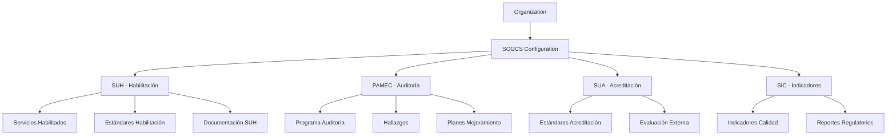
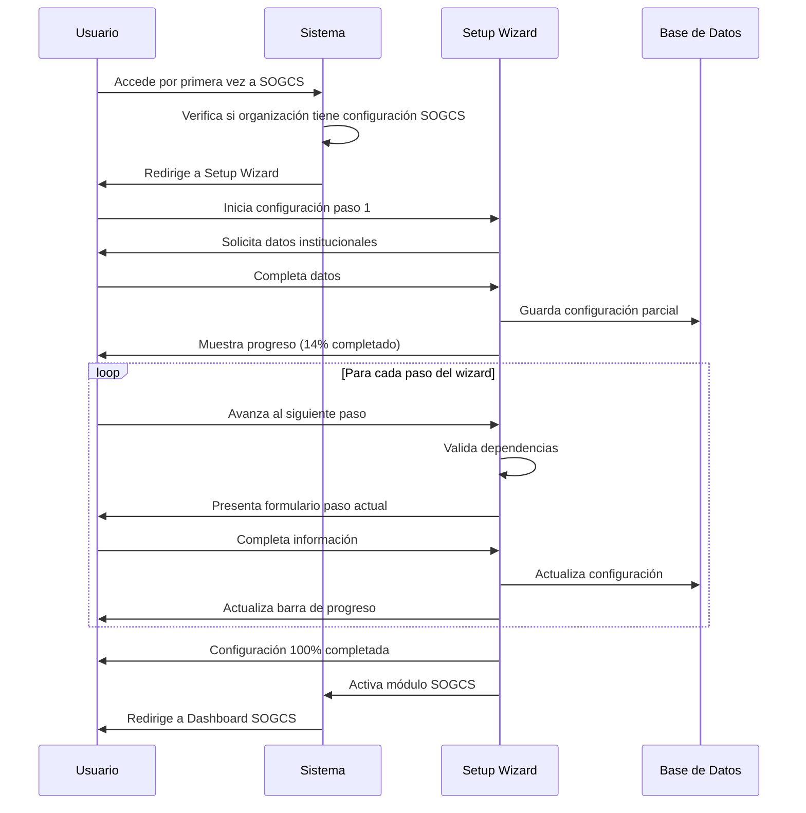
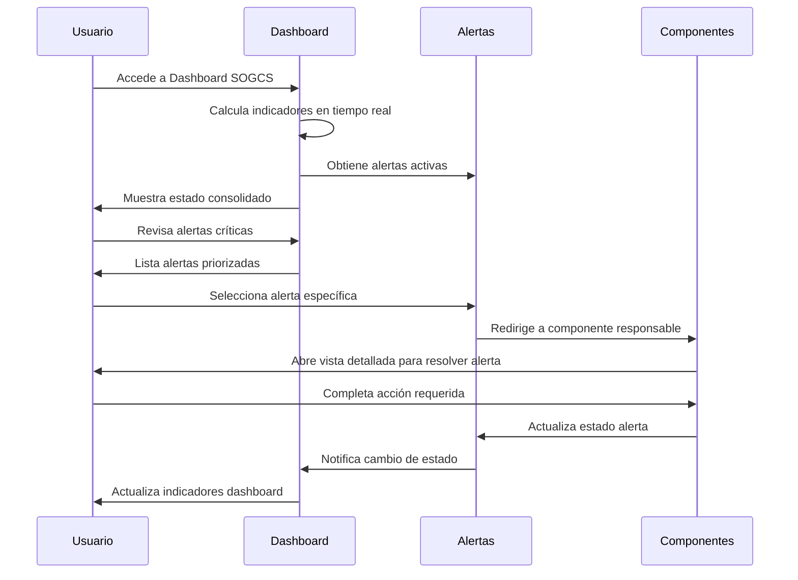
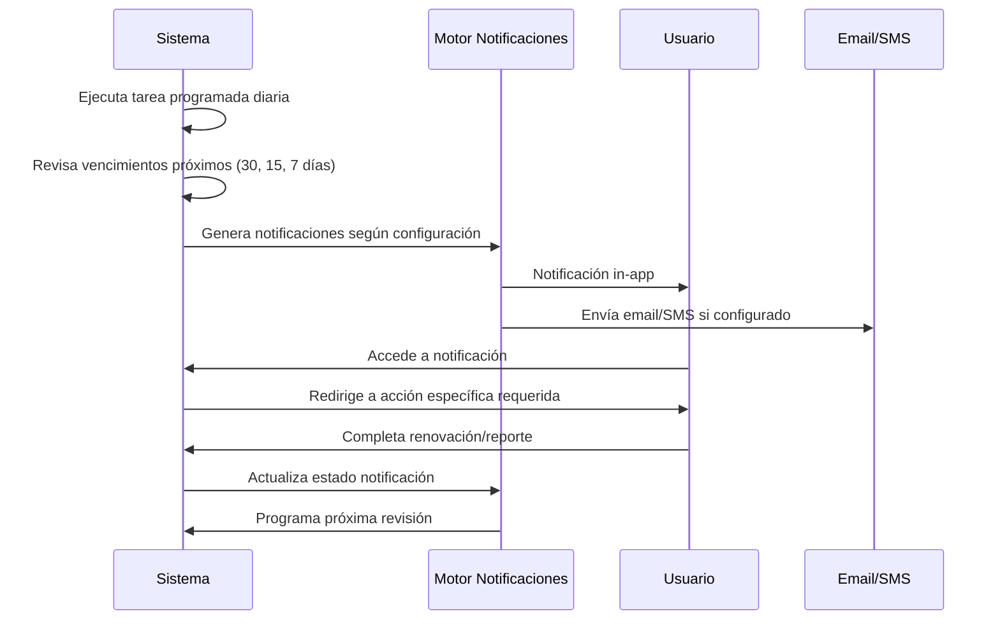

# 🏥 MÓDULO SOGCS - Sistema Obligatorio de Garantía de Calidad en Salud

## 📋 Información General

**Módulo**: SOGCS (Sistema Obligatorio de Garantía de Calidad en Salud)  
**Estado**: 🔧 En Diseño  
**Prioridad**: Alta  
**Completado**: 0%  
**Dependencias**: Organization ✅, Auth ✅  

## 🎯 Objetivo del Módulo

Implementar el Sistema Obligatorio de Garantía de Calidad en Salud (SOGCS) como módulo padre que integra y gestiona los 4 componentes obligatorios para instituciones prestadoras de servicios de salud en Colombia.

### Marco Regulatorio
- **Decreto 1011 de 2006**: Establece el SOGCS
- **Decreto 780 de 2016**: Decreto Único Reglamentario del Sector Salud
- **Resolución 3100 de 2019**: Manual de Habilitación vigente
- **Resolución 5095 de 2018**: Manual de Acreditación
- **Resolución 0256 de 2016**: Sistema de Información para la Calidad

## 🏗️ Arquitectura del Módulo

### Estructura de Componentes SOGCS

```
sogcs/
├── dashboard/              # Dashboard centralizado SOGCS
├── suh/                   # Sistema Único de Habilitación
├── pamec/                 # Programa Auditoría Mejoramiento Calidad
├── sua/                   # Sistema Único de Acreditación (opcional)
├── sic/                   # Sistema de Información para la Calidad
├── configuration/         # Configuración global SOGCS
├── setup_wizard/          # Wizard de parametrización inicial
└── shared/               # Componentes compartidos
```

### Jerarquía de Dependencias



## 🎛️ Dashboard Principal SOGCS

### Componentes del Dashboard

#### 1. Indicadores de Cumplimiento Global
```typescript
interface CumplimientoSOGCS {
  suh: {
    porcentaje: number;           // % cumplimiento habilitación
    serviciosHabilitados: number;
    serviciosVencidos: number;
    alertasCriticas: number;
  };
  pamec: {
    porcentaje: number;           // % avance ciclo actual
    auditoriasProgramadas: number;
    hallazgosAbiertos: number;
    accionesPendientes: number;
  };
  sua?: {
    porcentaje: number;           // % estándares cumplidos
    nivelAcreditacion: string;
    proximaEvaluacion: Date;
    puntajeUltimo: number;
  };
  sic: {
    porcentaje: number;           // % indicadores reportados
    reportesPendientes: number;
    indicadoresCriticos: number;
    tendenciaGeneral: 'up' | 'down' | 'stable';
  };
}
```

#### 2. Centro de Alertas Regulatorias
```typescript
interface AlertaSOGCS {
  id: string;
  tipo: 'CRITICA' | 'ALTA' | 'MEDIA' | 'BAJA';
  componente: 'SUH' | 'PAMEC' | 'SUA' | 'SIC';
  titulo: string;
  descripcion: string;
  fechaLimite: Date;
  accionRequerida: string;
  responsable: string;
  estado: 'PENDIENTE' | 'EN_PROCESO' | 'COMPLETADA';
  normativaAplicable: string;
}
```

#### 3. Calendario Regulatorio
```typescript
interface EventoRegulatorio {
  id: string;
  evento: string;
  tipoEvento: 'REPORTE' | 'RENOVACION' | 'AUDITORIA' | 'CAPACITACION' | 'EVALUACION';
  fechaEvento: Date;
  componente: 'SUH' | 'PAMEC' | 'SUA' | 'SIC';
  responsable: string;
  estado: 'PROGRAMADO' | 'EN_PROCESO' | 'COMPLETADO' | 'VENCIDO';
  prioridad: 'ALTA' | 'MEDIA' | 'BAJA';
  descripcion: string;
  documentosRequeridos: string[];
}
```

### Widgets del Dashboard

1. **Gauge de Cumplimiento por Componente**
   - Visualización circular de % cumplimiento
   - Colores semafóricos (Verde >80%, Amarillo 60-80%, Rojo <60%)
   - Drill-down a detalle por componente

2. **Lista de Alertas Priorizadas**
   - Ordenadas por criticidad y fecha límite
   - Acciones directas desde el dashboard
   - Asignación de responsables

3. **Timeline de Eventos Próximos**
   - Vista de próximos 90 días
   - Filtros por componente y tipo
   - Integración con calendario institucional

4. **Gráficos de Tendencias**
   - Evolución del cumplimiento mensual
   - Comparativos por componente
   - Benchmarking sectorial (futuro)

## 🔧 Wizard de Parametrización Inicial

### Flujo de Configuración Obligatoria

```typescript
interface SetupWizardStep {
  id: string;
  titulo: string;
  descripcion: string;
  componente: React.ComponentType;
  esObligatorio: boolean;
  dependencias: string[];
  validaciones: ValidationRule[];
  porcentajeCompletitud: number;
}

const SETUP_WIZARD_STEPS: SetupWizardStep[] = [
  {
    id: 'organization_sogcs',
    titulo: 'Configuración Institucional SOGCS',
    descripcion: 'Definir datos básicos de la institución para SOGCS',
    porcentajeCompletitud: 0,
    esObligatorio: true,
    dependencias: []
  },
  {
    id: 'responsables_sogcs',
    titulo: 'Asignación de Responsables',
    descripcion: 'Designar responsables por cada componente SOGCS',
    porcentajeCompletitud: 0,
    esObligatorio: true,
    dependencias: ['organization_sogcs']
  },
  {
    id: 'servicios_habilitacion',
    titulo: 'Servicios a Habilitar',
    descripcion: 'Seleccionar servicios de salud que prestará la institución',
    porcentajeCompletitud: 0,
    esObligatorio: true,
    dependencias: ['responsables_sogcs']
  },
  {
    id: 'configuracion_pamec',
    titulo: 'Configuración PAMEC',
    descripcion: 'Definir parámetros del Programa de Auditoría',
    porcentajeCompletitud: 0,
    esObligatorio: true,
    dependencias: ['servicios_habilitacion']
  },
  {
    id: 'indicadores_sic',
    titulo: 'Selección de Indicadores',
    descripcion: 'Configurar indicadores obligatorios según servicios',
    porcentajeCompletitud: 0,
    esObligatorio: true,
    dependencias: ['servicios_habilitacion']
  },
  {
    id: 'documentos_base',
    titulo: 'Documentos Fundamentales',
    descripcion: 'Cargar documentos base requeridos por normativa',
    porcentajeCompletitud: 0,
    esObligatorio: true,
    dependencias: ['configuracion_pamec', 'indicadores_sic']
  },
  {
    id: 'revision_final',
    titulo: 'Revisión y Activación',
    descripcion: 'Verificar configuración completa y activar módulo',
    porcentajeCompletitud: 0,
    esObligatorio: true,
    dependencias: ['documentos_base']
  }
];
```

### Barra de Progreso Inteligente

```typescript
interface ProgressBarSOGCS {
  pasoActual: number;
  totalPasos: number;
  porcentajeGlobal: number;
  pasosPendientes: SetupWizardStep[];
  pasosCompletados: SetupWizardStep[];
  bloqueadores: {
    paso: string;
    razon: string;
    accionRequerida: string;
  }[];
  tiempoEstimadoRestante: number; // en minutos
}
```

#### Componente de Progreso UI

```tsx
interface ProgressIndicatorProps {
  progreso: ProgressBarSOGCS;
  onNavigateToStep: (stepId: string) => void;
  showDetails: boolean;
}

const SOGCSProgressIndicator: React.FC<ProgressIndicatorProps> = ({
  progreso,
  onNavigateToStep,
  showDetails
}) => {
  return (
    <div className="sogcs-progress-container">
      {/* Barra de progreso principal */}
      <div className="progress-bar-wrapper">
        <div className="progress-bar">
          <div 
            className="progress-fill"
            style={{ width: `${progreso.porcentajeGlobal}%` }}
          />
        </div>
        <span className="progress-text">
          {progreso.porcentajeGlobal}% Completado 
          ({progreso.pasosCompletados.length}/{progreso.totalPasos} pasos)
        </span>
      </div>

      {/* Steps detallados */}
      {showDetails && (
        <div className="steps-detail">
          {SETUP_WIZARD_STEPS.map((step, index) => (
            <div 
              key={step.id}
              className={`step-item ${getStepStatus(step, progreso)}`}
              onClick={() => onNavigateToStep(step.id)}
            >
              <div className="step-indicator">
                {getStepIcon(step, progreso)}
              </div>
              <div className="step-content">
                <h4>{step.titulo}</h4>
                <p>{step.descripcion}</p>
                {step.porcentajeCompletitud > 0 && (
                  <div className="mini-progress">
                    <div 
                      className="mini-progress-fill"
                      style={{ width: `${step.porcentajeCompletitud}%` }}
                    />
                  </div>
                )}
              </div>
            </div>
          ))}
        </div>
      )}

      {/* Alertas de bloqueadores */}
      {progreso.bloqueadores.length > 0 && (
        <div className="setup-blockers">
          <h5>⚠️ Acciones Requeridas:</h5>
          {progreso.bloqueadores.map((bloqueador, index) => (
            <div key={index} className="blocker-item">
              <strong>{bloqueador.paso}:</strong> {bloqueador.razon}
              <button onClick={() => onNavigateToStep(bloqueador.paso)}>
                {bloqueador.accionRequerida}
              </button>
            </div>
          ))}
        </div>
      )}

      {/* Tiempo estimado */}
      <div className="time-estimate">
        ⏱️ Tiempo estimado restante: {progreso.tiempoEstimadoRestante} min
      </div>
    </div>
  );
};
```

## 🔐 Sistema de Permisos SOGCS

### Roles Específicos

```python
SOGCS_ROLES = {
    'SOGCS_ADMINISTRATOR': {
        'description': 'Administrador general del sistema SOGCS',
        'permissions': [
            'sogcs.view_all_components',
            'sogcs.configure_parameters',
            'sogcs.approve_reports',
            'sogcs.manage_users',
            'sogcs.access_all_services'
        ]
    },
    'QUALITY_COORDINATOR': {
        'description': 'Coordinador de Calidad institucional',
        'permissions': [
            'sogcs.view_dashboard',
            'sogcs.manage_suh',
            'sogcs.manage_pamec',
            'sogcs.create_reports',
            'sogcs.approve_improvements'
        ]
    },
    'HABILITACION_MANAGER': {
        'description': 'Responsable de Habilitación de Servicios',
        'permissions': [
            'suh.manage_services',
            'suh.conduct_evaluations',
            'suh.upload_evidence',
            'suh.generate_reports',
            'suh.manage_renewals'
        ]
    },
    'PAMEC_AUDITOR': {
        'description': 'Auditor PAMEC',
        'permissions': [
            'pamec.create_audits',
            'pamec.register_findings',
            'pamec.evaluate_improvements',
            'pamec.generate_audit_reports'
        ]
    },
    'SIC_ANALYST': {
        'description': 'Analista de Indicadores SIC',
        'permissions': [
            'sic.manage_indicators',
            'sic.input_data',
            'sic.generate_reports',
            'sic.view_trends'
        ]
    },
    'SERVICE_LEADER': {
        'description': 'Líder de Servicio específico',
        'permissions': [
            'suh.view_service_compliance',
            'suh.upload_service_evidence',
            'pamec.create_improvement_actions',
            'sic.input_service_indicators'
        ]
    }
}
```

### Permisos Granulares por Componente

```python
SOGCS_PERMISSIONS = {
    # Dashboard Global
    'sogcs.view_dashboard': 'Ver dashboard principal SOGCS',
    'sogcs.configure_global': 'Configurar parámetros globales',
    'sogcs.manage_setup_wizard': 'Gestionar wizard de configuración',
    
    # SUH - Sistema Único Habilitación
    'suh.view_services': 'Ver servicios habilitados',
    'suh.manage_services': 'Gestionar servicios habilitados',
    'suh.conduct_evaluations': 'Realizar autoevaluaciones',
    'suh.approve_evaluations': 'Aprobar autoevaluaciones',
    'suh.upload_evidence': 'Cargar evidencias',
    'suh.manage_documents': 'Gestionar documentos SUH',
    'suh.generate_reports': 'Generar reportes habilitación',
    'suh.manage_renewals': 'Gestionar renovaciones',
    
    # PAMEC - Programa Auditoría
    'pamec.view_program': 'Ver programa PAMEC',
    'pamec.manage_program': 'Gestionar programa PAMEC',
    'pamec.create_audits': 'Crear auditorías',
    'pamec.register_findings': 'Registrar hallazgos',
    'pamec.create_improvements': 'Crear planes mejoramiento',
    'pamec.approve_improvements': 'Aprobar planes mejoramiento',
    'pamec.evaluate_effectiveness': 'Evaluar efectividad acciones',
    
    # SUA - Sistema Único Acreditación
    'sua.view_standards': 'Ver estándares acreditación',
    'sua.manage_evaluation': 'Gestionar evaluación acreditación',
    'sua.upload_evidence': 'Cargar evidencias acreditación',
    'sua.generate_reports': 'Generar reportes acreditación',
    
    # SIC - Sistema Información Calidad
    'sic.view_indicators': 'Ver indicadores',
    'sic.manage_indicators': 'Gestionar indicadores',
    'sic.input_data': 'Ingresar datos indicadores',
    'sic.approve_data': 'Aprobar datos indicadores',
    'sic.generate_reports': 'Generar reportes SIC',
    'sic.submit_regulatory': 'Enviar reportes regulatorios'
}
```

## 🎯 Flujos de Usuario Principal

### 1. Primer Acceso (Setup Wizard)



### 2. Uso Diario (Dashboard)



### 3. Gestión de Vencimientos



## 📊 Métricas y KPIs del Módulo

### Indicadores de Adopción
- **Tiempo promedio de configuración inicial**: < 2 horas
- **% de usuarios que completan wizard**: > 90%
- **Tiempo promedio por paso del wizard**: < 15 minutos

### Indicadores de Uso
- **Accesos diarios al dashboard**: Métrica principal
- **Alertas resueltas vs generadas**: Ratio de eficiencia
- **Tiempo promedio de resolución de alertas**: Por tipo de alerta

### Indicadores de Cumplimiento
- **% de servicios con habilitación vigente**: > 95%
- **% de auditorías PAMEC completadas a tiempo**: > 90%
- **% de indicadores SIC reportados a tiempo**: > 95%

### Indicadores de Calidad
- **Precisión de alertas automáticas**: > 95%
- **Tiempo de respuesta del dashboard**: < 3 segundos
- **Disponibilidad del módulo**: > 99.5%

## 🔄 Integración con Módulos Existentes

### Con Módulo Organization
- Extensión del modelo con campos SOGCS
- Herencia de configuración y permisos
- Sincronización de datos institucionales

### Con Módulo Auth
- Nuevos roles y permisos específicos SOGCS
- Validación de acceso por componente
- Audit trail de todas las operaciones

### Con Futuros Módulos
- **Procesos**: Mapeo de procesos SOGCS
- **Auditorías**: Integración con PAMEC
- **Indicadores**: Alimentación desde SIC

## 🚀 Plan de Implementación

### Fase 1: Estructura Base (Semana 1-2)
- [ ] Creación de modelos de datos SOGCS
- [ ] Extensión del modelo Organization
- [ ] Setup de permisos y roles
- [ ] Estructura de URLs y vistas básicas

### Fase 2: Setup Wizard (Semana 3-4)
- [ ] Desarrollo del wizard de configuración
- [ ] Implementación de barra de progreso
- [ ] Validaciones y dependencias entre pasos
- [ ] Persistencia de configuración parcial

### Fase 3: Dashboard Principal (Semana 5-6)
- [ ] Dashboard con indicadores consolidados
- [ ] Sistema de alertas y notificaciones
- [ ] Calendario regulatorio
- [ ] Widgets interactivos

### Fase 4: Integración SUH (Semana 7-8)
- [ ] Conexión con submódulo SUH
- [ ] Sincronización de datos de servicios
- [ ] Alertas de vencimientos habilitación
- [ ] Reportes integrados

### Fase 5: Testing y Optimización (Semana 9-10)
- [ ] Testing integral del módulo
- [ ] Optimización de performance
- [ ] Documentación de usuario
- [ ] Capacitación y despliegue

---

**Próximos Documentos a Crear:**
1. `setup-wizard-requirements.claude.md` - Especificación detallada del wizard
2. `dashboard-components.claude.md` - Especificación de componentes del dashboard
3. `integration-specifications.claude.md` - Detalles de integración con otros módulos