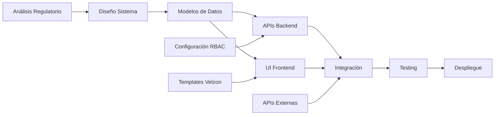

# 📋 Sistema de Configuración Centralizado SOGCS - Análisis de Requerimientos

## 🏥 DIAGNÓSTICO INSTITUCIONAL

### Estado Actual del Sistema
- **Módulos Implementados**: SUH, PAMEC, SIC, SUA con modelos de datos definidos
- **Sistema RBAC**: Implementado con 6 roles y permisos granulares
- **Integración Regulatoria**: Pendiente de configuración centralizada
- **Brecha Identificada**: Ausencia de sistema unificado de configuración para gestión operativa

### Contexto Regulatorio Aplicable
- **Resolución 3100/2019**: Sistema Único de Habilitación - Define parámetros obligatorios de notificación
- **Decreto 780/2016**: Sistema de Información en Salud - Establece tiempos de reporte
- **Resolución 256/2016**: Sistema de Información para la Calidad - Define indicadores y alertas
- **Circular 012/2016 SuperSalud**: Obligatoriedad de reportes y tiempos de respuesta
- **Resolución 2003/2014**: Procedimientos y condiciones de inscripción REPS

### Análisis de Riesgos Regulatorios
| Riesgo | Impacto | Probabilidad | Mitigación |
|--------|---------|--------------|------------|
| Incumplimiento tiempos de reporte | ALTO | MEDIA | Sistema automático de notificaciones |
| Pérdida de trazabilidad | ALTO | BAJA | Audit trail completo |
| Falta de escalamiento oportuno | MEDIO | ALTA | Configuración de escalamientos |
| Reportes incorrectos a entes de control | ALTO | MEDIA | Validación automática pre-envío |

## 📐 ESPECIFICACIONES TÉCNICAS

### 1. SISTEMA DE CONFIGURACIÓN DE NOTIFICACIONES

#### 1.1 Requerimientos Funcionales

**RF-NOT-001: Gestión de Canales de Notificación**
- El sistema DEBE soportar múltiples canales: Email, SMS, In-App, WhatsApp Business
- DEBE cumplir con Ley 1581/2012 de Protección de Datos Personales
- DEBE permitir configuración de prioridad por canal según tipo de evento

**RF-NOT-002: Plantillas de Notificación**
```python
# Estructura de plantilla requerida
class NotificationTemplate:
    """
    Cumple con Circular 047/2007 SuperSalud sobre comunicaciones
    """
    template_id: str
    regulatory_event_type: str  # SUH_VENCIMIENTO, PAMEC_AUDITORIA, etc.
    channels: List[str]
    subject_template: str
    body_template: str
    regulatory_references: List[str]  # Normativas aplicables
    required_attachments: List[str]
    retention_days: int  # Según Ley 594/2000 - Archivo General
```

**RF-NOT-003: Horarios y Restricciones**
- DEBE respetar horarios hábiles según Código Sustantivo del Trabajo
- DEBE considerar días festivos nacionales (Ley 51/1983)
- DEBE permitir configuración de ventanas de mantenimiento

**RF-NOT-004: Escalamiento por Roles**
- DEBE seguir estructura jerárquica del Decreto 1011/2006
- DEBE escalar según tiempos de Resolución 3100/2019
- Matriz de escalamiento:

| Evento | Rol Inicial | Tiempo Respuesta | Escalamiento 1 | Escalamiento 2 |
|--------|-------------|------------------|----------------|----------------|
| Evento adverso grave | Coordinador Calidad | 2 horas | Director Médico | Gerente + SuperSalud |
| Vencimiento habilitación | Responsable SUH | 24 horas | Coordinador SOGCS | Director Administrativo |
| Hallazgo auditoría crítico | Auditor | 4 horas | Líder Proceso | Gerente |

### 2. SISTEMA DE CONFIGURACIÓN DE ESCALAMIENTOS

#### 2.1 Requerimientos Funcionales

**RF-ESC-001: Reglas de Escalamiento por Incidente**
```python
class EscalationRule:
    """
    Basado en Resolución 1441/2013 - Seguridad del Paciente
    """
    incident_type: str  # Según taxonomía IBEAS
    severity_level: int  # 1-5 según Protocolo Londres
    initial_response_time: int  # minutos
    escalation_levels: List[EscalationLevel]
    external_notification_required: bool
    regulatory_body: str  # INVIMA, SuperSalud, Secretaría Salud
```

**RF-ESC-002: Tiempos de Respuesta por Severidad**
| Severidad | Descripción | Tiempo Máximo | Normativa |
|-----------|-------------|---------------|-----------|
| CRÍTICA | Muerte o daño permanente | 2 horas | Res. 1441/2013 Art. 4 |
| ALTA | Hospitalización prolongada | 6 horas | Res. 1441/2013 Art. 4 |
| MEDIA | Intervención adicional | 24 horas | Circular 012/2016 |
| BAJA | Sin daño | 72 horas | Procedimiento interno |

**RF-ESC-003: Escalamiento a Entes Externos**
- DEBE notificar a INVIMA según Decreto 1782/2014 (tecnovigilancia)
- DEBE reportar a SuperSalud según Circular Externa 047/2007
- DEBE informar a Secretaría de Salud según competencia territorial

### 3. SISTEMA DE CONFIGURACIÓN DE ALERTAS

#### 3.1 Requerimientos Funcionales

**RF-ALE-001: Umbrales de Alerta por Indicador**
```python
class AlertThreshold:
    """
    Según Resolución 256/2016 - Indicadores de Calidad
    """
    indicator_code: str  # Código MinSalud
    indicator_name: str
    measurement_unit: str
    optimal_range: Tuple[float, float]
    warning_threshold: float
    critical_threshold: float
    calculation_formula: str
    reporting_frequency: str  # DIARIO, SEMANAL, MENSUAL, TRIMESTRAL
    regulatory_standard: float  # Meta regulatoria
```

**RF-ALE-002: Alertas de Cumplimiento Regulatorio**
| Tipo Alerta | Anticipación | Frecuencia | Destinatarios |
|-------------|--------------|------------|---------------|
| Vencimiento Habilitación | 90, 60, 30 días | Diaria | Coord. SUH, Director |
| Autoevaluación Res. 3100 | 30, 15, 7 días | Diaria | Responsables servicios |
| Reporte SIVIGILA | 24, 12, 6 horas | Horaria | Epidemiología |
| Actualización REPS | 15, 7, 3 días | Diaria | Admin. REPS |

**RF-ALE-003: Alertas de Vencimientos**
- DEBE alertar vencimientos de planes de mejora según Res. 3100/2019
- DEBE notificar fechas límite de autoevaluaciones
- DEBE recordar actualizaciones normativas pendientes

### 4. SISTEMA DE CONFIGURACIÓN DE REPORTES

#### 4.1 Requerimientos Funcionales

**RF-REP-001: Reportes Regulatorios Obligatorios**
```python
class RegulatoryReport:
    """
    Cumplimiento de reportes obligatorios al SISPRO
    """
    report_code: str  # Código SISPRO
    report_name: str
    regulatory_basis: str  # Normativa que lo exige
    frequency: str  # Según Res. 4505/2012
    deadline_day: int  # Día del mes para entrega
    recipients: List[str]  # Entidades receptoras
    validation_rules: List[str]
    penalty_for_delay: str  # Según Ley 1438/2011
```

**RF-REP-002: Calendario de Reportes Obligatorios**
| Reporte | Normativa | Frecuencia | Fecha Límite | Entidad |
|---------|-----------|------------|--------------|---------|
| RIPS | Res. 3374/2000 | Mensual | Día 20 | ADRES |
| Circular 2193 | Res. 2193/2004 | Trimestral | Día 30 | SuperSalud |
| SIVIGILA | Dec. 3518/2006 | Semanal | Domingo | INS |
| Indicadores Res. 256 | Res. 256/2016 | Trimestral | Día 15 | MinSalud |

### 5. SISTEMA DE CONFIGURACIÓN DE WORKFLOWS

#### 5.1 Requerimientos Funcionales

**RF-WFL-001: Flujos de Aprobación por Submódulo**
```python
class WorkflowConfiguration:
    """
    Basado en ISO 9001:2015 Cláusula 8.5 - Control de procesos
    """
    submodule: str  # SUH, PAMEC, SIC, SUA
    process_type: str
    approval_stages: List[ApprovalStage]
    sla_per_stage: Dict[str, int]  # Tiempo en horas
    auto_approval_conditions: List[str]
    rejection_routes: Dict[str, str]
    audit_requirements: List[str]  # Según MECI
```

**RF-WFL-002: Matriz de Aprobaciones**
| Submódulo | Proceso | Nivel 1 | Nivel 2 | Nivel 3 | SLA Total |
|-----------|---------|---------|---------|---------|-----------|
| SUH | Nueva habilitación | Coord. Servicio | Coord. SUH | Director Médico | 72h |
| PAMEC | Plan mejora | Líder proceso | Coord. Calidad | Gerente | 48h |
| SIC | Indicador crítico | Analista | Coord. SIC | Comité Calidad | 24h |
| SUA | Autoevaluación | Evaluador | Coord. Acreditación | Alta Dirección | 96h |

### 6. SISTEMA DE CONFIGURACIÓN DE INTEGRACIÓN

#### 6.1 Requerimientos Funcionales

**RF-INT-001: APIs Externas Regulatorias**
```python
class ExternalAPIConfiguration:
    """
    Integración con sistemas gubernamentales
    """
    api_name: str  # REPS, SISPRO, RUAF, SIVIGILA
    base_url: str
    authentication_method: str
    credentials_vault: str  # Referencia segura
    retry_policy: Dict[str, int]
    timeout_seconds: int
    rate_limit: int  # Requests por minuto
    data_mapping: Dict[str, str]
    validation_schema: str
```

**RF-INT-002: Sincronización de Datos**
| Sistema | Tipo Sync | Frecuencia | Validaciones | Rollback |
|---------|-----------|------------|--------------|----------|
| REPS | Bidireccional | Diaria 2AM | Schema + Business | Automático |
| SISPRO | Unidireccional | Mensual | Formato + Completitud | Manual |
| RUAF | Consulta | On-demand | Existencia | N/A |
| SIVIGILA | Push | Semanal | Obligatoriedad | Manual |

## 📊 MODELO DE DATOS

### Estructura Principal del Sistema de Configuración

```python
# Modelo核心de Configuración
class SOGCSConfiguration(BaseModel):
    """
    Modelo principal de configuración SOGCS
    Cumple con Decreto 1011/2006 - SOGCS
    """
    # Identificación
    organization_id: UUID
    configuration_version: str
    effective_date: datetime
    approved_by: UUID  # Usuario que aprobó
    approval_date: datetime
    
    # Configuraciones por dominio
    notification_config: NotificationConfiguration
    escalation_config: EscalationConfiguration
    alert_config: AlertConfiguration
    report_config: ReportConfiguration
    workflow_config: WorkflowConfiguration
    integration_config: IntegrationConfiguration
    
    # Auditoría y cumplimiento
    last_audit_date: datetime
    compliance_status: str
    pending_updates: List[str]
    regulatory_changes: List[RegulatoryChange]
    
    # Metadatos
    created_at: datetime
    updated_at: datetime
    created_by: UUID
    updated_by: UUID
    is_active: bool
    
    class Meta:
        db_table = 'sogcs_configuration'
        indexes = [
            'organization_id',
            'effective_date',
            'configuration_version'
        ]
```

### Modelos de Dominio Específicos

```python
class NotificationConfiguration(BaseModel):
    """
    Configuración de notificaciones
    """
    channels_enabled: Dict[str, ChannelConfig]
    templates: List[NotificationTemplate]
    scheduling_rules: List[SchedulingRule]
    escalation_matrix: Dict[str, List[EscalationStep]]
    retry_policy: RetryPolicy
    blackout_periods: List[BlackoutPeriod]
    
class EscalationConfiguration(BaseModel):
    """
    Configuración de escalamientos
    """
    escalation_rules: List[EscalationRule]
    severity_matrix: Dict[str, SeverityLevel]
    response_slas: Dict[str, int]
    external_entities: List[ExternalEntity]
    notification_chains: Dict[str, List[str]]
    
class AlertConfiguration(BaseModel):
    """
    Configuración de alertas
    """
    indicator_thresholds: List[IndicatorThreshold]
    compliance_alerts: List[ComplianceAlert]
    expiration_alerts: List[ExpirationAlert]
    system_alerts: List[SystemAlert]
    alert_priorities: Dict[str, int]
    suppression_rules: List[SuppressionRule]
```

## 🗓️ PLAN DETALLADO DE ACTIVIDADES

### Fase 1: Análisis y Diseño (Semanas 1-2)

| Actividad | Duración | Responsable | Entregable | Validación Regulatoria |
|-----------|----------|-------------|------------|------------------------|
| Mapeo regulatorio completo | 3 días | Analista SOGCS | Matriz normativa | Jurídica |
| Análisis de gaps actual | 2 días | Coord. Calidad | Reporte de brechas | Comité SOGCS |
| Diseño de arquitectura | 3 días | Arquitecto | Diagrama técnico | CTO |
| Validación con stakeholders | 2 días | Product Owner | Acta de aprobación | Gerencia |

### Fase 2: Implementación Backend (Semanas 3-5)

| Componente | Duración | Prioridad | Dependencias | Tests Requeridos |
|------------|----------|-----------|--------------|------------------|
| Modelos de datos | 3 días | ALTA | - | 30 unit tests |
| APIs de configuración | 4 días | ALTA | Modelos | 25 integration tests |
| Sistema de notificaciones | 3 días | ALTA | APIs | 20 unit + 10 e2e |
| Sistema de escalamiento | 2 días | MEDIA | Notificaciones | 15 unit tests |
| Sistema de alertas | 3 días | ALTA | APIs | 20 unit tests |

### Fase 3: Implementación Frontend (Semanas 4-6)

| Interfaz | Duración | Componente Velzon | Validaciones |
|----------|----------|-------------------|--------------|
| Dashboard configuración | 2 días | Settings Layout | RBAC + Forms |
| Gestión notificaciones | 3 días | Form Wizard | Multi-step validation |
| Configuración alertas | 2 días | Data Tables | Real-time preview |
| Gestión workflows | 3 días | Flow Designer | Business rules |
| Monitor integración | 2 días | Status Cards | API health checks |

### Fase 4: Integración y Testing (Semanas 6-7)

| Tipo de Prueba | Duración | Cobertura | Criterio Aceptación |
|----------------|----------|-----------|---------------------|
| Unit Testing | 2 días | >90% | Sin fallos críticos |
| Integration Testing | 2 días | >85% | APIs funcionales |
| UAT con usuarios | 3 días | 100% casos uso | Aprobación usuarios |
| Pruebas regulatorias | 2 días | 100% reportes | Cumplimiento total |
| Performance Testing | 1 día | <2s response | 1000 usuarios concurrent |

### Fase 5: Despliegue y Estabilización (Semana 8)

| Actividad | Duración | Ambiente | Rollback Plan |
|-----------|----------|----------|---------------|
| Deploy staging | 1 día | Staging | Snapshot previo |
| Validación staging | 2 días | Staging | Revert immediato |
| Deploy producción | 1 día | Production | Blue-green deployment |
| Monitoreo post-deploy | 2 días | Production | Rollback < 30 min |

## 🔍 MATRIZ DE CONFIGURACIONES POR SUBMÓDULO Y ROL

### Configuraciones por Submódulo

| Submódulo | Notificaciones | Escalamientos | Alertas | Reportes | Workflows |
|-----------|----------------|---------------|---------|----------|-----------|
| **SUH** | ✅ Vencimientos<br>✅ Actualizaciones<br>✅ Novedades REPS | ✅ Habilitación vencida<br>✅ Visita inspección<br>✅ Hallazgos | ✅ 90 días vencimiento<br>✅ Documentos faltantes<br>✅ Cambios normativos | ✅ Autoevaluación<br>✅ Plan mejora<br>✅ Certificado | ✅ Solicitud → Aprobación<br>✅ Novedad → Validación |
| **PAMEC** | ✅ Auditorías programadas<br>✅ Hallazgos<br>✅ Seguimientos | ✅ NC crítica<br>✅ Plan vencido<br>✅ Reincidencia | ✅ Auditoría próxima<br>✅ Indicador bajo meta<br>✅ Tendencia negativa | ✅ Informe auditoría<br>✅ Plan mejora<br>✅ Indicadores | ✅ Hallazgo → Plan → Cierre<br>✅ Mejora → Implementación |
| **SIC** | ✅ Actualización indicador<br>✅ Meta no cumplida<br>✅ Reporte pendiente | ✅ Indicador crítico<br>✅ Tendencia negativa<br>✅ Sin datos | ✅ Fecha corte<br>✅ Outliers<br>✅ Sin actualización | ✅ Res. 256<br>✅ Dashboard<br>✅ Análisis | ✅ Captura → Validación → Publicación |
| **SUA** | ✅ Ciclo preparación<br>✅ Visita acreditación<br>✅ Resultados | ✅ Estándar crítico<br>✅ Plazo mejora<br>✅ Visita próxima | ✅ Autoevaluación<br>✅ Mejora continua<br>✅ Mantenimiento | ✅ Autoevaluación<br>✅ Plan mejoramiento<br>✅ Informe | ✅ Autoevaluación → Mejora → Seguimiento |

### Permisos por Rol

| Rol | Configurar | Aprobar | Visualizar | Ejecutar | Auditar |
|-----|-----------|---------|------------|----------|---------|
| **Super Admin** | ✅ TODO | ✅ TODO | ✅ TODO | ✅ TODO | ✅ TODO |
| **Admin Organización** | ✅ Organización | ✅ Org config | ✅ TODO | ✅ Org nivel | ✅ Org logs |
| **Coordinador SOGCS** | ✅ SOGCS modules | ✅ Workflows | ✅ TODO | ✅ SOGCS | ✅ SOGCS logs |
| **Auditor** | ❌ | ❌ | ✅ TODO | ✅ Auditorías | ✅ Audit trails |
| **Profesional** | ❌ | ❌ | ✅ Asignado | ✅ Tareas | ❌ |
| **Visualizador** | ❌ | ❌ | ✅ Público | ❌ | ❌ |

## ✅ PLAN DE VALIDACIÓN Y TESTING

### 1. Validación Funcional

#### Test Suite de Configuración
```python
class TestSOGCSConfiguration:
    """
    Suite de pruebas para configuración SOGCS
    """
    
    def test_notification_channel_configuration(self):
        """Valida configuración de canales según Ley 1581/2012"""
        # Verificar consentimiento de datos
        # Validar canales habilitados
        # Comprobar plantillas regulatorias
        
    def test_escalation_rules_compliance(self):
        """Valida reglas de escalamiento según Res. 1441/2013"""
        # Verificar tiempos de respuesta
        # Validar cadena de escalamiento
        # Comprobar notificación a entes externos
        
    def test_regulatory_alerts_generation(self):
        """Valida generación de alertas regulatorias"""
        # Verificar umbrales según Res. 256/2016
        # Validar anticipación de vencimientos
        # Comprobar destinatarios correctos
```

### 2. Validación de Cumplimiento Regulatorio

| Normativa | Aspecto a Validar | Método de Validación | Criterio de Aceptación |
|-----------|-------------------|---------------------|------------------------|
| Res. 3100/2019 | Tiempos de autoevaluación | Test automatizado | 100% notificaciones a tiempo |
| Dec. 780/2016 | Estructura de reportes | Validación schema | Conformidad SISPRO |
| Res. 256/2016 | Cálculo de indicadores | Unit tests fórmulas | Precisión 100% |
| Circular 012/2016 | Tiempos de respuesta | Integration tests | SLA cumplido >95% |

### 3. Validación de Seguridad

```python
class SecurityValidation:
    """
    Validaciones de seguridad según ISO 27001
    """
    
    def validate_data_encryption(self):
        """Verifica cifrado de datos sensibles"""
        # Configuraciones cifradas en BD
        # Transmisión segura HTTPS
        # Logs sin datos sensibles
        
    def validate_access_control(self):
        """Valida control de acceso RBAC"""
        # Permisos por rol verificados
        # Segregación de funciones
        # Trazabilidad completa
        
    def validate_audit_trail(self):
        """Verifica registro de auditoría"""
        # Todos los cambios registrados
        # Inmutabilidad de logs
        # Retención según Ley 594/2000
```

### 4. Casos de Prueba Críticos

| ID | Caso de Prueba | Prioridad | Resultado Esperado |
|----|----------------|-----------|-------------------|
| TC-001 | Configurar notificación evento adverso grave | CRÍTICA | Notificación <2h a todos los niveles |
| TC-002 | Escalar a SuperSalud por incumplimiento | ALTA | Reporte automático con evidencias |
| TC-003 | Generar reporte Res. 256 | ALTA | Formato correcto, datos validados |
| TC-004 | Alertar vencimiento habilitación 90 días | ALTA | Alerta generada, email enviado |
| TC-005 | Workflow aprobación plan mejora | MEDIA | Flujo completo en <48h |

## 📅 CRONOGRAMA DE IMPLEMENTACIÓN

### Diagrama de Gantt - 8 Semanas

```
Semana:     1   2   3   4   5   6   7   8
Fase 1:     ████████
Fase 2:             ████████████
Fase 3:                 ████████████
Fase 4:                         ████████
Fase 5:                                 ████
```

### Hitos Principales

| Hito | Fecha | Entregable | Responsable | Criterio Éxito |
|------|-------|------------|-------------|----------------|
| M1: Diseño aprobado | Sem 2 | Documentación técnica | Arquitecto | Aprobación comité |
| M2: Backend funcional | Sem 5 | APIs + Tests | Backend Lead | >90% cobertura |
| M3: Frontend completo | Sem 6 | UI configuración | Frontend Lead | UAT aprobado |
| M4: Integración lista | Sem 7 | Sistema integrado | Tech Lead | E2E tests passed |
| M5: Go-Live | Sem 8 | Sistema en producción | DevOps | Zero downtime |

### Dependencias Críticas



### Gestión de Riesgos del Proyecto

| Riesgo | Probabilidad | Impacto | Mitigación | Plan B |
|--------|--------------|---------|------------|--------|
| Cambio regulatorio durante desarrollo | MEDIA | ALTO | Monitoreo diario normativas | Diseño flexible |
| Integración REPS falla | BAJA | ALTO | Testing temprano con sandbox | Carga manual temporal |
| Resistencia al cambio usuarios | ALTA | MEDIO | Capacitación continua | Champions por área |
| Performance con volumen datos | MEDIA | MEDIO | Pruebas de carga | Optimización queries |

## 🎯 MÉTRICAS DE ÉXITO

### KPIs del Sistema

| Métrica | Target | Medición | Frecuencia |
|---------|--------|----------|------------|
| Tiempo configuración inicial | <30 min | Cronómetro setup | Por instalación |
| Notificaciones exitosas | >99% | Logs sistema | Diaria |
| Escalamientos automáticos | >95% | Audit trail | Semanal |
| Reportes a tiempo | 100% | Timestamp envío | Mensual |
| Disponibilidad sistema | >99.9% | Monitoring | Continua |

### Indicadores de Cumplimiento Regulatorio

| Indicador | Meta | Fórmula | Responsable |
|-----------|------|---------|-------------|
| Cumplimiento reportes obligatorios | 100% | (Reportes enviados / Reportes requeridos) × 100 | Coord. SIC |
| Oportunidad en notificaciones | >95% | (Notificaciones a tiempo / Total notificaciones) × 100 | Admin Sistema |
| Efectividad escalamientos | >90% | (Escalamientos resueltos en SLA / Total escalamientos) × 100 | Coord. Calidad |
| Actualización configuración normativa | 100% | (Configs actualizadas / Cambios normativos) × 100 | Coord. SOGCS |

## 💡 RECOMENDACIONES FINALES

### Para la Implementación Exitosa

1. **Priorización Regulatoria**: Implementar primero las configuraciones de cumplimiento obligatorio
2. **Capacitación Temprana**: Iniciar formación de usuarios desde Fase 2
3. **Validación Continua**: Realizar pruebas con datos reales desde Fase 3
4. **Documentación Viva**: Mantener actualizada con cada cambio normativo
5. **Monitoreo Proactivo**: Implementar dashboards desde el día 1 en producción

### Consideraciones Especiales para Colombia

- **Calendarios**: Considerar festivos nacionales y regionales
- **Zonas Horarias**: Colombia UTC-5, sin cambio horario
- **Conectividad**: Considerar áreas con internet limitado
- **Idioma**: Interfaz 100% en español, términos técnicos según MinSalud
- **Formato de datos**: Fechas DD/MM/AAAA, decimales con coma

### Sostenibilidad del Sistema

- **Actualización normativa**: Revisión mensual de cambios regulatorios
- **Mantenimiento evolutivo**: Presupuesto anual para mejoras
- **Soporte continuo**: Mesa de ayuda 8×5 mínimo
- **Respaldos**: Política 3-2-1 (3 copias, 2 medios, 1 offsite)
- **Auditoría anual**: Revisión completa de configuraciones

---

## 📎 ANEXOS

### A. Glosario de Términos Regulatorios
- **SOGCS**: Sistema Obligatorio de Garantía de Calidad en Salud
- **SUH**: Sistema Único de Habilitación
- **PAMEC**: Programa de Auditoría para el Mejoramiento de la Calidad
- **SIC**: Sistema de Información para la Calidad
- **SUA**: Sistema Único de Acreditación
- **REPS**: Registro Especial de Prestadores de Servicios de Salud
- **SISPRO**: Sistema Integral de Información de la Protección Social

### B. Referencias Normativas
- [Resolución 3100 de 2019](https://www.minsalud.gov.co/Normatividad_Nuevo/Resoluci%C3%B3n%20No.%203100%20de%202019.pdf)
- [Decreto 780 de 2016](https://www.minsalud.gov.co/Normatividad_Nuevo/Decreto%200780%20de%202016.pdf)
- [Resolución 256 de 2016](https://www.minsalud.gov.co/Normatividad_Nuevo/Resoluci%C3%B3n%200256%20de%202016.pdf)

### C. Contactos Clave
- **MinSalud**: Dirección de Prestación de Servicios
- **SuperSalud**: Delegada para la Supervisión Institucional
- **INVIMA**: Dirección de Dispositivos Médicos
- **Secretarías de Salud**: Según jurisdicción territorial

---

**Documento elaborado por**: Analista de Requerimientos SOGCS  
**Fecha**: 2025-01-17  
**Versión**: 1.0  
**Estado**: Para Revisión y Aprobación  
**Clasificación**: Confidencial - Uso Interno