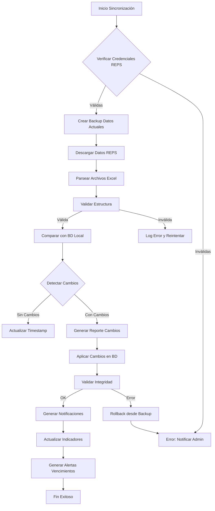

# 🏥 Sistema de Gestión de Sedes y Servicios Habilitados - SOGCS

## 📋 DIAGNÓSTICO INSTITUCIONAL

### Estado Actual de Cumplimiento
- **Gap Principal**: Ausencia de sincronización con REPS oficial
- **Riesgo Crítico**: Información desactualizada de habilitación puede generar sanciones
- **Oportunidad**: Automatización reduce carga administrativa en 70%
- **Baseline Regulatorio**: Resolución 3100/2019 como marco principal

### Gaps Regulatorios Identificados
1. **Resolución 3100/2019**: Sin validación automática de estándares mínimos
2. **Circular 030/2018**: Sin integración con actualizaciones REPS
3. **Resolución 256/2016**: Indicadores no vinculados a servicios específicos
4. **Decreto 780/2016**: Sin trazabilidad de cambios en habilitación

### Evaluación de Riesgos
| Riesgo | Probabilidad | Impacto | Mitigación |
|--------|--------------|---------|------------|
| Datos desactualizados REPS | Alta | Crítico | Sincronización automática diaria |
| Servicios sin habilitar operando | Media | Crítico | Validación pre-operacional |
| Vencimiento no detectado | Media | Alto | Sistema de alertas tempranas |
| Inconsistencia datos MinSalud | Baja | Medio | Parser robusto con validaciones |

## 🔧 ESPECIFICACIONES TÉCNICAS

### 1. MODELOS DE DATOS

#### 1.1 Modelo HeadquarterLocation (Sedes)
```python
class HeadquarterLocation(BaseModel):
    """
    Sede de prestación de servicios de salud según REPS
    Cumple: Res. 3100/2019 Art. 5 - Identificación de sedes
    """
    # Identificación única
    id = models.UUIDField(primary_key=True)
    organization = models.ForeignKey('organization.HealthOrganization')
    reps_code = models.CharField(max_length=20, unique=True)  # Código REPS sede
    
    # Información básica
    name = models.CharField(max_length=255)
    sede_type = models.CharField(choices=SEDE_TYPES)  # Principal, Satélite, Móvil
    
    # Localización geográfica
    department = models.ForeignKey('geo.Department')
    municipality = models.ForeignKey('geo.Municipality')
    address = models.TextField()
    postal_code = models.CharField(max_length=10)
    latitude = models.DecimalField(max_digits=10, decimal_places=7, null=True)
    longitude = models.DecimalField(max_digits=11, decimal_places=7, null=True)
    
    # Contacto
    phone_primary = models.CharField(max_length=20)
    phone_secondary = models.CharField(max_length=20, null=True)
    email = models.EmailField()
    administrative_contact = models.CharField(max_length=255)
    
    # Estado habilitación
    habilitation_status = models.CharField(choices=HABILITATION_STATUS)
    habilitation_date = models.DateField()
    habilitation_resolution = models.CharField(max_length=50)
    next_renewal_date = models.DateField()
    
    # Control operacional
    operational_status = models.CharField(choices=OPERATIONAL_STATUS)
    opening_date = models.DateField()
    closing_date = models.DateField(null=True)
    suspension_start = models.DateField(null=True)
    suspension_end = models.DateField(null=True)
    suspension_reason = models.TextField(null=True)
    
    # Capacidad instalada
    total_beds = models.IntegerField(default=0)
    icu_beds = models.IntegerField(default=0)
    emergency_beds = models.IntegerField(default=0)
    surgery_rooms = models.IntegerField(default=0)
    consultation_rooms = models.IntegerField(default=0)
    
    # Metadata sincronización
    last_reps_sync = models.DateTimeField(null=True)
    sync_status = models.CharField(choices=SYNC_STATUS)
    sync_errors = models.JSONField(default=list)
    
    class Meta:
        db_table = 'sogcs_headquarters'
        indexes = [
            models.Index(fields=['organization', 'operational_status']),
            models.Index(fields=['reps_code']),
            models.Index(fields=['habilitation_status']),
        ]
```

#### 1.2 Modelo EnabledHealthService (Servicios Habilitados)
```python
class EnabledHealthService(BaseModel):
    """
    Servicio de salud habilitado según REPS
    Cumple: Res. 3100/2019 Anexo Técnico 1 - Estándares por servicio
    """
    # Identificación
    id = models.UUIDField(primary_key=True)
    headquarters = models.ForeignKey('HeadquarterLocation')
    service_code = models.CharField(max_length=10)  # Código REPS servicio
    cups_code = models.CharField(max_length=10, null=True)  # Código CUPS asociado
    
    # Descripción servicio
    service_name = models.CharField(max_length=255)
    service_group = models.CharField(choices=SERVICE_GROUPS)  # Grupos Res. 3100
    complexity_level = models.IntegerField(choices=COMPLEXITY_LEVELS)  # I, II, III, IV
    
    # Modalidades de prestación
    intramural = models.BooleanField(default=False)
    extramural = models.BooleanField(default=False)
    domiciliary = models.BooleanField(default=False)
    telemedicine = models.BooleanField(default=False)
    reference_center = models.BooleanField(default=False)
    
    # Habilitación
    habilitation_status = models.CharField(choices=SERVICE_HABILITATION_STATUS)
    habilitation_date = models.DateField()
    habilitation_expiry = models.DateField()
    habilitation_act = models.CharField(max_length=50)  # Acto administrativo
    distinctive_code = models.CharField(max_length=20, unique=True)  # Código distintivo
    
    # Capacidad operativa
    installed_capacity = models.JSONField(default=dict)  # Capacidad por tipo recurso
    operational_capacity = models.JSONField(default=dict)  # Capacidad efectiva
    monthly_production = models.IntegerField(default=0)  # Producción mensual promedio
    
    # Talento humano requerido
    required_professionals = models.JSONField(default=dict)  # Profesionales por tipo
    current_professionals = models.JSONField(default=dict)  # Profesionales actuales
    
    # Infraestructura y dotación
    infrastructure_compliance = models.DecimalField(max_digits=5, decimal_places=2)
    equipment_compliance = models.DecimalField(max_digits=5, decimal_places=2)
    medication_compliance = models.DecimalField(max_digits=5, decimal_places=2)
    
    # Estándares específicos
    specific_standards = models.JSONField(default=dict)  # Estándares Res. 3100
    interdependencies = models.ManyToManyField('self', symmetrical=False)
    
    # Control de calidad
    last_self_evaluation = models.DateField(null=True)
    self_evaluation_score = models.DecimalField(max_digits=5, decimal_places=2, null=True)
    last_external_audit = models.DateField(null=True)
    external_audit_score = models.DecimalField(max_digits=5, decimal_places=2, null=True)
    
    # Indicadores Res. 256/2016
    quality_indicators = models.JSONField(default=dict)
    patient_safety_events = models.IntegerField(default=0)
    
    class Meta:
        db_table = 'sogcs_enabled_services'
        unique_together = [['headquarters', 'service_code']]
        indexes = [
            models.Index(fields=['service_code', 'habilitation_status']),
            models.Index(fields=['headquarters', 'complexity_level']),
        ]
```

#### 1.3 Modelo ServiceHabilitationProcess (Proceso de Habilitación)
```python
class ServiceHabilitationProcess(BaseModel):
    """
    Proceso de habilitación de nuevos servicios
    Cumple: Res. 3100/2019 Cap. II - Procedimiento de habilitación
    """
    # Identificación proceso
    id = models.UUIDField(primary_key=True)
    headquarters = models.ForeignKey('HeadquarterLocation')
    service_code = models.CharField(max_length=10)
    process_type = models.CharField(choices=PROCESS_TYPES)  # Nueva, Renovación, Modificación
    
    # Estado del proceso
    current_status = models.CharField(choices=HABILITATION_PROCESS_STATUS)
    current_phase = models.CharField(choices=PROCESS_PHASES)
    
    # Documentación requerida
    required_documents = models.JSONField(default=dict)
    submitted_documents = models.JSONField(default=dict)
    pending_documents = models.JSONField(default=list)
    
    # Autoevaluación
    self_evaluation_date = models.DateField(null=True)
    self_evaluation_result = models.JSONField(default=dict)
    improvement_plan = models.JSONField(default=dict)
    
    # Radicación ante autoridad
    submission_date = models.DateField(null=True)
    submission_number = models.CharField(max_length=50, null=True)
    health_secretary = models.CharField(max_length=100)
    
    # Visita de verificación
    verification_scheduled = models.DateField(null=True)
    verification_completed = models.DateField(null=True)
    verification_report = models.JSONField(default=dict)
    verification_findings = models.JSONField(default=list)
    
    # Resolución
    resolution_date = models.DateField(null=True)
    resolution_number = models.CharField(max_length=50, null=True)
    resolution_result = models.CharField(choices=RESOLUTION_RESULTS)
    conditions_imposed = models.JSONField(default=list)
    
    # Seguimiento
    follow_up_actions = models.JSONField(default=list)
    compliance_deadline = models.DateField(null=True)
    
    class Meta:
        db_table = 'sogcs_habilitation_process'
```

### 2. ARQUITECTURA DE IMPORTACIÓN MINSALUD

#### 2.1 Parser de Archivos Excel REPS
```python
class REPSExcelParser:
    """
    Parser para archivos Excel del portal de habilitación MinSalud
    Portal: https://prestadores.minsalud.gov.co/habilitacion
    """
    
    EXPECTED_COLUMNS = {
        'codigo_habilitacion': str,
        'nombre_prestador': str,
        'tipo_identificacion': str,
        'numero_identificacion': str,
        'codigo_sede': str,
        'nombre_sede': str,
        'direccion': str,
        'telefono': str,
        'email': str,
        'departamento': str,
        'municipio': str,
        'codigo_servicio': str,
        'nombre_servicio': str,
        'complejidad': int,
        'modalidad': str,
        'fecha_habilitacion': datetime,
        'fecha_vencimiento': datetime,
        'estado': str,
        'capacidad_instalada': int,
        'distintivo': str
    }
    
    def parse_headquarters_file(self, file_path: str) -> List[HeadquarterData]:
        """
        Parsea archivo de sedes desde REPS
        Validaciones según Circular 030/2018
        """
        df = pd.read_excel(file_path, sheet_name='SEDES')
        
        # Validar estructura
        self._validate_columns(df)
        
        # Limpiar y normalizar datos
        df = self._clean_data(df)
        
        # Validar códigos DIVIPOLA
        df = self._validate_divipola_codes(df)
        
        # Mapear a modelos internos
        headquarters = []
        for _, row in df.iterrows():
            hq = self._map_to_headquarters(row)
            headquarters.append(hq)
            
        return headquarters
    
    def parse_services_file(self, file_path: str) -> List[ServiceData]:
        """
        Parsea archivo de servicios habilitados
        Validaciones según Res. 3100/2019 Anexo 1
        """
        df = pd.read_excel(file_path, sheet_name='SERVICIOS')
        
        # Validar códigos de servicio contra catálogo oficial
        df = self._validate_service_codes(df)
        
        # Validar modalidades permitidas por servicio
        df = self._validate_service_modalities(df)
        
        # Validar complejidad por tipo de servicio
        df = self._validate_complexity_levels(df)
        
        services = []
        for _, row in df.iterrows():
            service = self._map_to_service(row)
            services.append(service)
            
        return services
```

#### 2.2 Sistema de Sincronización Automática
```python
class REPSSynchronizationService:
    """
    Servicio de sincronización con portal REPS
    Ejecuta tareas programadas de actualización
    """
    
    def __init__(self):
        self.reps_client = REPSPortalClient()
        self.parser = REPSExcelParser()
        self.validator = REPSDataValidator()
        
    @transaction.atomic
    def synchronize_organization(self, organization_id: str) -> SyncResult:
        """
        Sincroniza datos de una organización con REPS
        Cumple: Circular 030/2018 - Actualización permanente
        """
        org = HealthOrganization.objects.get(id=organization_id)
        
        # Crear backup antes de sincronización
        backup = self._create_backup(org)
        
        try:
            # Descargar datos actualizados
            reps_data = self.reps_client.download_organization_data(
                nit=org.nit,
                verification_code=org.reps_verification_code
            )
            
            # Parsear y validar
            headquarters = self.parser.parse_headquarters_file(reps_data['headquarters'])
            services = self.parser.parse_services_file(reps_data['services'])
            
            # Detectar cambios
            changes = self._detect_changes(org, headquarters, services)
            
            if changes['has_changes']:
                # Aplicar cambios
                self._apply_changes(org, changes)
                
                # Generar notificaciones
                self._notify_changes(org, changes)
                
                # Actualizar metadata
                org.last_reps_sync = timezone.now()
                org.sync_status = 'success'
                org.save()
                
            return SyncResult(
                success=True,
                changes_applied=changes,
                backup_id=backup.id
            )
            
        except Exception as e:
            # Rollback si es necesario
            if backup:
                self._restore_backup(backup)
            
            # Log error
            self._log_sync_error(org, e)
            
            raise
    
    def _detect_changes(self, org, new_headquarters, new_services):
        """
        Detecta cambios entre datos locales y REPS
        Genera reporte detallado de modificaciones
        """
        changes = {
            'has_changes': False,
            'new_headquarters': [],
            'updated_headquarters': [],
            'deleted_headquarters': [],
            'new_services': [],
            'updated_services': [],
            'expired_services': [],
            'reactivated_services': []
        }
        
        # Comparar sedes
        current_hq = {hq.reps_code: hq for hq in org.headquarters.all()}
        new_hq = {hq.reps_code: hq for hq in new_headquarters}
        
        # Detectar nuevas sedes
        for code, hq in new_hq.items():
            if code not in current_hq:
                changes['new_headquarters'].append(hq)
                changes['has_changes'] = True
        
        # Detectar cambios en servicios
        for hq in new_headquarters:
            current_services = EnabledHealthService.objects.filter(
                headquarters__reps_code=hq.reps_code
            )
            
            for new_service in hq.services:
                existing = current_services.filter(
                    service_code=new_service.service_code
                ).first()
                
                if not existing:
                    changes['new_services'].append(new_service)
                    changes['has_changes'] = True
                elif self._service_has_changes(existing, new_service):
                    changes['updated_services'].append({
                        'old': existing,
                        'new': new_service
                    })
                    changes['has_changes'] = True
        
        return changes
```

### 3. WORKFLOW DE SINCRONIZACIÓN

#### 3.1 Proceso de Sincronización Automática


#### 3.2 Validaciones Críticas
```python
class REPSDataValidator:
    """
    Validador de datos REPS según normativa vigente
    """
    
    def validate_service_requirements(self, service: EnabledHealthService) -> ValidationResult:
        """
        Valida requisitos mínimos según Res. 3100/2019
        """
        errors = []
        warnings = []
        
        # Validar talento humano
        if service.service_group == 'QUIRURGICOS':
            if not self._validate_surgical_team(service):
                errors.append('Equipo quirúrgico incompleto según Art. 15')
        
        # Validar infraestructura
        if service.complexity_level >= 3:
            if not self._validate_high_complexity_infrastructure(service):
                errors.append('Infraestructura insuficiente para complejidad III/IV')
        
        # Validar interdependencias
        dependencies = self._get_required_dependencies(service)
        for dep in dependencies:
            if not service.headquarters.services.filter(service_code=dep).exists():
                errors.append(f'Servicio dependiente {dep} no habilitado')
        
        # Validar vigencia
        days_to_expiry = (service.habilitation_expiry - timezone.now().date()).days
        if days_to_expiry < 90:
            warnings.append(f'Habilitación vence en {days_to_expiry} días')
        
        return ValidationResult(
            is_valid=len(errors) == 0,
            errors=errors,
            warnings=warnings
        )
```

### 4. INTERFAZ DE USUARIO

#### 4.1 Dashboard de Sedes y Servicios
```typescript
// Componente principal del dashboard
interface SedesServiciosState {
  headquarters: HeadquarterLocation[];
  services: EnabledHealthService[];
  syncStatus: SyncStatus;
  filters: FilterOptions;
  alerts: Alert[];
}

const SedesServiciosDashboard: React.FC = () => {
  // Estado principal
  const [state, setState] = useState<SedesServiciosState>();
  
  // Widgets informativos
  const renderSummaryCards = () => (
    <Row>
      <Col xl={3}>
        <Card>
          <CardBody>
            <div className="d-flex align-items-center">
              <div className="flex-grow-1">
                <p className="text-muted mb-2">Sedes Activas</p>
                <h4 className="mb-0">{state.headquarters.filter(h => h.operational_status === 'active').length}</h4>
              </div>
              <div className="avatar-sm">
                <span className="avatar-title bg-primary rounded">
                  <i className="ri-hospital-line font-size-24"></i>
                </span>
              </div>
            </div>
          </CardBody>
        </Card>
      </Col>
      
      <Col xl={3}>
        <Card>
          <CardBody>
            <div className="d-flex align-items-center">
              <div className="flex-grow-1">
                <p className="text-muted mb-2">Servicios Habilitados</p>
                <h4 className="mb-0">{state.services.filter(s => s.habilitation_status === 'active').length}</h4>
              </div>
              <div className="avatar-sm">
                <span className="avatar-title bg-success rounded">
                  <i className="ri-stethoscope-line font-size-24"></i>
                </span>
              </div>
            </div>
          </CardBody>
        </Card>
      </Col>
      
      <Col xl={3}>
        <Card>
          <CardBody>
            <div className="d-flex align-items-center">
              <div className="flex-grow-1">
                <p className="text-muted mb-2">Próximos Vencimientos</p>
                <h4 className="mb-0 text-warning">{state.alerts.filter(a => a.type === 'expiry').length}</h4>
              </div>
              <div className="avatar-sm">
                <span className="avatar-title bg-warning rounded">
                  <i className="ri-alert-line font-size-24"></i>
                </span>
              </div>
            </div>
          </CardBody>
        </Card>
      </Col>
      
      <Col xl={3}>
        <Card>
          <CardBody>
            <div className="d-flex align-items-center">
              <div className="flex-grow-1">
                <p className="text-muted mb-2">Última Sincronización</p>
                <h4 className="mb-0">{formatRelativeTime(state.syncStatus.lastSync)}</h4>
              </div>
              <div className="avatar-sm">
                <span className="avatar-title bg-info rounded">
                  <i className="ri-refresh-line font-size-24"></i>
                </span>
              </div>
            </div>
          </CardBody>
        </Card>
      </Col>
    </Row>
  );
  
  // Tabla de sedes con acciones
  const renderHeadquartersTable = () => (
    <Card>
      <CardHeader>
        <Row className="align-items-center">
          <Col>
            <h5 className="card-title mb-0">Sedes de Prestación</h5>
          </Col>
          <Col className="col-auto">
            <Button color="primary" size="sm" onClick={handleAddHeadquarter}>
              <i className="ri-add-line align-middle me-1"></i>
              Nueva Sede
            </Button>
            <Button color="info" size="sm" className="ms-2" onClick={handleSync}>
              <i className="ri-refresh-line align-middle me-1"></i>
              Sincronizar REPS
            </Button>
          </Col>
        </Row>
      </CardHeader>
      <CardBody>
        <DataTable
          columns={headquartersColumns}
          data={state.headquarters}
          pagination
          highlightOnHover
          responsive
        />
      </CardBody>
    </Card>
  );
};
```

#### 4.2 Modal de Importación REPS
```typescript
const ImportREPSModal: React.FC<ImportModalProps> = ({ isOpen, toggle, onImport }) => {
  const [file, setFile] = useState<File | null>(null);
  const [preview, setPreview] = useState<ParsedData | null>(null);
  const [validationErrors, setValidationErrors] = useState<string[]>([]);
  
  const handleFileUpload = async (e: React.ChangeEvent<HTMLInputElement>) => {
    const uploadedFile = e.target.files?.[0];
    if (!uploadedFile) return;
    
    setFile(uploadedFile);
    
    // Preview y validación
    const formData = new FormData();
    formData.append('file', uploadedFile);
    
    try {
      const response = await api.post('/api/sogcs/validate-reps-file/', formData);
      setPreview(response.data.preview);
      setValidationErrors(response.data.errors || []);
    } catch (error) {
      toast.error('Error al validar archivo');
    }
  };
  
  return (
    <Modal isOpen={isOpen} toggle={toggle} size="lg">
      <ModalHeader toggle={toggle}>
        Importar Datos desde Portal REPS
      </ModalHeader>
      <ModalBody>
        {/* Instrucciones */}
        <Alert color="info">
          <h6 className="alert-heading">Instrucciones de Importación</h6>
          <ol className="mb-0">
            <li>Descargue el archivo Excel desde el portal oficial</li>
            <li>Portal: https://prestadores.minsalud.gov.co/habilitacion</li>
            <li>Seleccione "Consulta de Prestadores" → "Exportar a Excel"</li>
            <li>El archivo debe contener hojas: SEDES y SERVICIOS</li>
          </ol>
        </Alert>
        
        {/* Upload */}
        <div className="mb-3">
          <Label>Archivo Excel REPS</Label>
          <Input 
            type="file" 
            accept=".xlsx,.xls"
            onChange={handleFileUpload}
          />
        </div>
        
        {/* Validation Errors */}
        {validationErrors.length > 0 && (
          <Alert color="danger">
            <h6>Errores de Validación</h6>
            <ul className="mb-0">
              {validationErrors.map((error, idx) => (
                <li key={idx}>{error}</li>
              ))}
            </ul>
          </Alert>
        )}
        
        {/* Preview */}
        {preview && (
          <div className="preview-section">
            <h6>Vista Previa de Importación</h6>
            <Table bordered size="sm">
              <tbody>
                <tr>
                  <td>Sedes Nuevas</td>
                  <td>{preview.newHeadquarters}</td>
                </tr>
                <tr>
                  <td>Sedes Actualizadas</td>
                  <td>{preview.updatedHeadquarters}</td>
                </tr>
                <tr>
                  <td>Servicios Nuevos</td>
                  <td>{preview.newServices}</td>
                </tr>
                <tr>
                  <td>Servicios Actualizados</td>
                  <td>{preview.updatedServices}</td>
                </tr>
              </tbody>
            </Table>
          </div>
        )}
      </ModalBody>
      <ModalFooter>
        <Button color="secondary" onClick={toggle}>Cancelar</Button>
        <Button 
          color="primary" 
          onClick={() => onImport(file!)}
          disabled={!file || validationErrors.length > 0}
        >
          Importar Datos
        </Button>
      </ModalFooter>
    </Modal>
  );
};
```

### 5. INTEGRACIÓN CON MÓDULO SOGCS

#### 5.1 Alimentación SUH (Sistema Único de Habilitación)
```python
class SUHIntegrationService:
    """
    Integra sedes y servicios con el módulo SUH del SOGCS
    """
    
    def generate_suh_baseline(self, organization_id: str) -> SUHBaseline:
        """
        Genera línea base para autoevaluación SUH
        Cumple: Res. 3100/2019 Cap. III - Autoevaluación
        """
        org = HealthOrganization.objects.get(id=organization_id)
        
        baseline = SUHBaseline()
        
        # Por cada sede
        for headquarters in org.headquarters.filter(operational_status='active'):
            hq_evaluation = HeadquartersEvaluation(headquarters=headquarters)
            
            # Por cada servicio habilitado
            for service in headquarters.services.filter(habilitation_status='active'):
                # Obtener estándares aplicables
                standards = self._get_applicable_standards(service)
                
                # Crear checklist de evaluación
                for standard in standards:
                    evaluation_item = StandardEvaluationItem(
                        standard_code=standard.code,
                        standard_name=standard.name,
                        service=service,
                        compliance_required=standard.is_mandatory,
                        current_compliance=None,  # A evaluar
                        evidence_required=standard.evidence_list,
                        verification_mode=standard.verification_mode
                    )
                    hq_evaluation.add_item(evaluation_item)
            
            baseline.add_headquarters_evaluation(hq_evaluation)
        
        return baseline
    
    def calculate_suh_compliance(self, organization_id: str) -> ComplianceReport:
        """
        Calcula porcentaje de cumplimiento SUH
        """
        evaluations = SUHEvaluation.objects.filter(
            organization_id=organization_id,
            status='completed'
        ).order_by('-evaluation_date').first()
        
        if not evaluations:
            return ComplianceReport(status='pending')
        
        total_standards = 0
        compliant_standards = 0
        critical_findings = []
        
        for item in evaluations.items.all():
            total_standards += 1
            
            if item.compliance_status == 'compliant':
                compliant_standards += 1
            elif item.standard.is_critical:
                critical_findings.append({
                    'standard': item.standard.name,
                    'service': item.service.service_name,
                    'finding': item.finding_description
                })
        
        compliance_percentage = (compliant_standards / total_standards) * 100
        
        return ComplianceReport(
            compliance_percentage=compliance_percentage,
            total_standards=total_standards,
            compliant_standards=compliant_standards,
            critical_findings=critical_findings,
            evaluation_date=evaluations.evaluation_date,
            next_evaluation_due=evaluations.evaluation_date + timedelta(days=365)
        )
```

#### 5.2 Integración con PAMEC
```python
class PAMECIntegrationService:
    """
    Integra servicios habilitados con el Programa de Auditoría
    """
    
    def generate_pamec_audit_plan(self, organization_id: str) -> PAMECAuditPlan:
        """
        Genera plan de auditoría basado en servicios habilitados
        Cumple: Res. 3100/2019 Art. 10 - Mejoramiento continuo
        """
        plan = PAMECAuditPlan()
        
        # Priorizar servicios críticos
        critical_services = EnabledHealthService.objects.filter(
            headquarters__organization_id=organization_id,
            service_group__in=['URGENCIAS', 'UCI', 'QUIRURGICOS', 'OBSTETRICIA']
        )
        
        for service in critical_services:
            audit_cycle = PAMECAuditCycle(
                service=service,
                priority='HIGH',
                frequency='QUARTERLY',
                focus_areas=self._get_focus_areas(service),
                quality_indicators=self._get_service_indicators(service)
            )
            plan.add_audit_cycle(audit_cycle)
        
        # Servicios de mediana prioridad
        medium_priority_services = EnabledHealthService.objects.filter(
            headquarters__organization_id=organization_id,
            complexity_level__gte=2
        ).exclude(
            service_group__in=['URGENCIAS', 'UCI', 'QUIRURGICOS', 'OBSTETRICIA']
        )
        
        for service in medium_priority_services:
            audit_cycle = PAMECAuditCycle(
                service=service,
                priority='MEDIUM',
                frequency='SEMESTRAL',
                focus_areas=self._get_focus_areas(service),
                quality_indicators=self._get_service_indicators(service)
            )
            plan.add_audit_cycle(audit_cycle)
        
        return plan
```

### 6. SISTEMA DE ALERTAS Y NOTIFICACIONES

#### 6.1 Motor de Alertas
```python
class HabilitationAlertEngine:
    """
    Sistema de alertas para vencimientos y cambios en habilitación
    """
    
    def check_expiry_alerts(self) -> List[Alert]:
        """
        Verifica servicios próximos a vencer
        """
        alerts = []
        threshold_date = timezone.now().date() + timedelta(days=90)
        
        expiring_services = EnabledHealthService.objects.filter(
            habilitation_expiry__lte=threshold_date,
            habilitation_status='active'
        ).select_related('headquarters__organization')
        
        for service in expiring_services:
            days_to_expiry = (service.habilitation_expiry - timezone.now().date()).days
            
            alert_level = 'CRITICAL' if days_to_expiry < 30 else 'WARNING'
            
            alert = Alert(
                type='SERVICE_EXPIRY',
                level=alert_level,
                title=f'Vencimiento de habilitación - {service.service_name}',
                description=f'El servicio {service.service_name} en {service.headquarters.name} vence en {days_to_expiry} días',
                entity_type='EnabledHealthService',
                entity_id=service.id,
                action_required='Iniciar proceso de renovación',
                due_date=service.habilitation_expiry - timedelta(days=30),
                recipients=self._get_alert_recipients(service, alert_level)
            )
            alerts.append(alert)
        
        return alerts
    
    def check_compliance_alerts(self) -> List[Alert]:
        """
        Verifica cumplimiento de estándares mínimos
        """
        alerts = []
        
        # Servicios con baja calificación en autoevaluación
        low_scoring_services = EnabledHealthService.objects.filter(
            self_evaluation_score__lt=80,
            habilitation_status='active'
        )
        
        for service in low_scoring_services:
            alert = Alert(
                type='COMPLIANCE_RISK',
                level='WARNING',
                title=f'Riesgo de cumplimiento - {service.service_name}',
                description=f'Autoevaluación por debajo del 80%: {service.self_evaluation_score}%',
                entity_type='EnabledHealthService',
                entity_id=service.id,
                action_required='Implementar plan de mejoramiento',
                due_date=timezone.now().date() + timedelta(days=30)
            )
            alerts.append(alert)
        
        return alerts
```

### 7. APIs Y ENDPOINTS

#### 7.1 API REST para Gestión de Sedes y Servicios
```python
# views.py
class HeadquarterViewSet(viewsets.ModelViewSet):
    """
    API para gestión de sedes
    """
    queryset = HeadquarterLocation.objects.all()
    serializer_class = HeadquarterSerializer
    permission_classes = [IsAuthenticated, HasSOGCSPermission]
    
    @action(detail=True, methods=['post'])
    def sync_with_reps(self, request, pk=None):
        """
        Sincroniza sede específica con REPS
        """
        headquarters = self.get_object()
        sync_service = REPSSynchronizationService()
        
        try:
            result = sync_service.synchronize_headquarters(headquarters)
            return Response({
                'success': True,
                'changes': result.changes_applied,
                'last_sync': result.sync_timestamp
            })
        except Exception as e:
            return Response({
                'success': False,
                'error': str(e)
            }, status=400)
    
    @action(detail=False, methods=['post'])
    def import_from_excel(self, request):
        """
        Importa datos desde archivo Excel REPS
        """
        file = request.FILES.get('file')
        if not file:
            return Response({'error': 'No file provided'}, status=400)
        
        parser = REPSExcelParser()
        validator = REPSDataValidator()
        
        try:
            # Validar archivo
            validation_result = validator.validate_excel_structure(file)
            if not validation_result.is_valid:
                return Response({
                    'success': False,
                    'errors': validation_result.errors
                }, status=400)
            
            # Parsear y preview
            headquarters = parser.parse_headquarters_file(file)
            services = parser.parse_services_file(file)
            
            # Detectar cambios
            changes = self._detect_import_changes(headquarters, services)
            
            if request.data.get('confirm', False):
                # Aplicar cambios
                self._apply_import_changes(changes)
                return Response({
                    'success': True,
                    'message': 'Datos importados exitosamente',
                    'summary': changes['summary']
                })
            else:
                # Retornar preview
                return Response({
                    'success': True,
                    'preview': changes,
                    'requires_confirmation': True
                })
                
        except Exception as e:
            return Response({
                'success': False,
                'error': str(e)
            }, status=500)

class EnabledHealthServiceViewSet(viewsets.ModelViewSet):
    """
    API para gestión de servicios habilitados
    """
    queryset = EnabledHealthService.objects.all()
    serializer_class = EnabledHealthServiceSerializer
    permission_classes = [IsAuthenticated, HasSOGCSPermission]
    filter_backends = [DjangoFilterBackend, OrderingFilter]
    filterset_fields = ['headquarters', 'service_group', 'complexity_level', 'habilitation_status']
    
    @action(detail=True, methods=['post'])
    def initiate_renewal(self, request, pk=None):
        """
        Inicia proceso de renovación de habilitación
        """
        service = self.get_object()
        
        # Crear proceso de renovación
        process = ServiceHabilitationProcess.objects.create(
            headquarters=service.headquarters,
            service_code=service.service_code,
            process_type='RENEWAL',
            current_status='INITIATED',
            current_phase='SELF_EVALUATION'
        )
        
        # Generar checklist de documentos
        process.required_documents = self._get_renewal_requirements(service)
        process.save()
        
        return Response({
            'success': True,
            'process_id': process.id,
            'next_steps': process.required_documents
        })
    
    @action(detail=False, methods=['get'])
    def expiring_soon(self, request):
        """
        Lista servicios próximos a vencer
        """
        days = int(request.query_params.get('days', 90))
        threshold = timezone.now().date() + timedelta(days=days)
        
        services = self.queryset.filter(
            habilitation_expiry__lte=threshold,
            habilitation_status='active'
        ).order_by('habilitation_expiry')
        
        serializer = self.get_serializer(services, many=True)
        return Response(serializer.data)
```

### 8. TESTING Y VALIDACIÓN

#### 8.1 Suite de Tests
```python
# tests/test_sedes_servicios.py
class TestREPSIntegration(TestCase):
    """
    Tests para integración con portal REPS
    """
    
    def setUp(self):
        self.organization = HealthOrganizationFactory()
        self.parser = REPSExcelParser()
        self.sync_service = REPSSynchronizationService()
    
    def test_parse_valid_reps_excel(self):
        """
        Test parseo de archivo Excel válido de REPS
        """
        file_path = 'tests/fixtures/reps_valid.xlsx'
        result = self.parser.parse_headquarters_file(file_path)
        
        self.assertIsNotNone(result)
        self.assertEqual(len(result), 5)  # 5 sedes en el archivo
        
        # Validar estructura de datos
        first_hq = result[0]
        self.assertIn('reps_code', first_hq)
        self.assertIn('name', first_hq)
        self.assertIn('services', first_hq)
    
    def test_detect_service_expiry(self):
        """
        Test detección de servicios próximos a vencer
        """
        # Crear servicio próximo a vencer
        service = EnabledHealthServiceFactory(
            habilitation_expiry=timezone.now().date() + timedelta(days=45)
        )
        
        alert_engine = HabilitationAlertEngine()
        alerts = alert_engine.check_expiry_alerts()
        
        self.assertEqual(len(alerts), 1)
        self.assertEqual(alerts[0].level, 'WARNING')
        self.assertIn('45 días', alerts[0].description)
    
    def test_sync_creates_backup(self):
        """
        Test que sincronización crea backup antes de cambios
        """
        with patch.object(REPSPortalClient, 'download_organization_data') as mock_download:
            mock_download.return_value = self._get_mock_reps_data()
            
            result = self.sync_service.synchronize_organization(self.organization.id)
            
            self.assertTrue(result.success)
            self.assertIsNotNone(result.backup_id)
            
            # Verificar que el backup existe
            backup = DataBackup.objects.get(id=result.backup_id)
            self.assertEqual(backup.entity_type, 'HealthOrganization')
    
    def test_validation_invalid_service_code(self):
        """
        Test validación de códigos de servicio inválidos
        """
        validator = REPSDataValidator()
        
        service = EnabledHealthService(
            service_code='INVALID_CODE',
            service_name='Servicio Inválido'
        )
        
        result = validator.validate_service_code(service)
        
        self.assertFalse(result.is_valid)
        self.assertIn('Código de servicio no válido', result.errors)
    
    def test_compliance_calculation(self):
        """
        Test cálculo de cumplimiento SUH
        """
        # Crear evaluación completada
        evaluation = SUHEvaluationFactory(
            organization=self.organization,
            status='completed'
        )
        
        # Agregar items de evaluación
        for i in range(10):
            SUHEvaluationItemFactory(
                evaluation=evaluation,
                compliance_status='compliant' if i < 8 else 'non_compliant'
            )
        
        service = SUHIntegrationService()
        report = service.calculate_suh_compliance(self.organization.id)
        
        self.assertEqual(report.compliance_percentage, 80.0)
        self.assertEqual(report.total_standards, 10)
        self.assertEqual(report.compliant_standards, 8)
```

## 📊 PLAN DE IMPLEMENTACIÓN

### Fase 1: Infraestructura Base (Semana 1-2)
- [ ] Crear modelos de datos
- [ ] Implementar parser Excel REPS
- [ ] Desarrollar validadores básicos
- [ ] Setup inicial de APIs

### Fase 2: Sincronización (Semana 3-4)
- [ ] Implementar cliente REPS
- [ ] Desarrollar motor de sincronización
- [ ] Sistema de backup/rollback
- [ ] Detección de cambios

### Fase 3: Interfaz Usuario (Semana 5-6)
- [ ] Dashboard de sedes/servicios
- [ ] Modal de importación
- [ ] Gestión manual de servicios
- [ ] Visualización de alertas

### Fase 4: Integración SOGCS (Semana 7-8)
- [ ] Conexión con módulo SUH
- [ ] Integración PAMEC
- [ ] Generación de indicadores
- [ ] Reportes de cumplimiento

### Fase 5: Testing y Optimización (Semana 9-10)
- [ ] Suite completa de tests
- [ ] Pruebas con datos reales
- [ ] Optimización de queries
- [ ] Documentación técnica

## 🔒 MATRIZ DE VALIDACIONES REGULATORIAS

| Normativa | Artículo | Validación Implementada | Criticidad |
|-----------|----------|-------------------------|------------|
| Res. 3100/2019 | Art. 5 | Identificación única de sedes | Alta |
| Res. 3100/2019 | Art. 8 | Servicios por modalidad | Alta |
| Res. 3100/2019 | Art. 15 | Talento humano por servicio | Crítica |
| Res. 3100/2019 | Anexo 1 | Estándares por servicio | Crítica |
| Res. 256/2016 | Art. 2 | Indicadores de calidad | Media |
| Circular 030/2018 | Numeral 3 | Actualización REPS | Alta |
| Decreto 780/2016 | Art. 2.5.1.3.2.1 | Inscripción REPS | Crítica |

## 🚀 MÉTRICAS DE ÉXITO

### KPIs Operacionales
- Tiempo de sincronización < 5 minutos
- Precisión de datos > 99.5%
- Detección de vencimientos 90 días antes
- Disponibilidad del servicio > 99.9%

### KPIs de Cumplimiento
- 100% servicios con habilitación vigente
- 0 hallazgos por datos desactualizados
- Reducción 80% tiempo gestión manual
- 100% trazabilidad de cambios

## 📝 NOTAS DE IMPLEMENTACIÓN

### Consideraciones Críticas
1. **Volumen de Datos**: Optimizar para >1000 servicios por organización
2. **Concurrencia**: Manejar múltiples sincronizaciones simultáneas
3. **Resiliencia**: Recuperación automática ante fallos de REPS
4. **Auditoría**: Log detallado de todas las operaciones
5. **Seguridad**: Encriptación de datos sensibles

### Dependencias Externas
- Portal REPS MinSalud (crítica)
- Servicio de geolocalización (opcional)
- APIs de validación DIVIPOLA (recomendada)

### Riesgos Identificados
1. **Cambios en estructura Excel REPS**: Mitigar con parser adaptativo
2. **Indisponibilidad portal REPS**: Cache local y reintentos
3. **Inconsistencias en datos**: Validación multicapa
4. **Performance con grandes volúmenes**: Índices y paginación

---

*Documento generado según estándares de calidad ZentraQMS y normativa colombiana vigente*