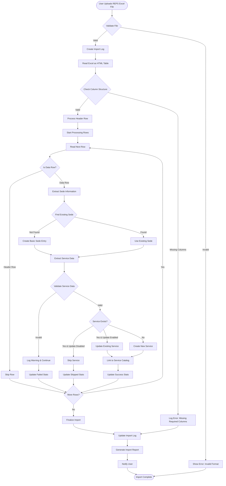

# Import Process Flowchart - REPS Services

## Overview
This document describes the complete import process for REPS health services from Excel files.

## Import Process Flow



## Detailed Process Steps

### 1. File Validation
```python
def validate_file(file):
    """
    Validates the uploaded file:
    - Check file extension (.xls, .xlsx, .html)
    - Check file size (max 10MB)
    - Check file is not empty
    - Verify it's readable as HTML table
    """
    if not file.name.lower().endswith(('.xls', '.xlsx', '.html')):
        raise ValidationError("Invalid file format")
    
    if file.size > 10 * 1024 * 1024:
        raise ValidationError("File too large")
    
    if file.size == 0:
        raise ValidationError("File is empty")
    
    return True
```

### 2. Column Structure Validation
Required columns for REPS services file:
- `numero_sede` - Headquarters number
- `sede_nombre` - Headquarters name
- `serv_codigo` - Service code
- `serv_nombre` - Service name
- `grse_codigo` - Service group code
- `grse_nombre` - Service group name
- `numero_distintivo` - Distinctive number (unique)
- `habilitado` - Enabled status

### 3. Data Processing Rules

#### Sede (Headquarters) Processing
```python
# Sede identification logic
sede_key = f"{organization.nit}-{row['numero_sede']}"

# Search existing sede
sede = HeadquarterLocation.objects.filter(
    organization=organization,
    reps_code__endswith=row['numero_sede']
).first()

if not sede:
    # Create minimal sede entry
    sede = HeadquarterLocation.objects.create(
        organization=organization,
        reps_code=sede_key,
        name=row['sede_nombre'],
        # ... minimal required fields
    )
```

#### Service Processing
```python
# Service unique identification
service_key = row['numero_distintivo']

# Check if service exists
existing = SedeHealthService.objects.filter(
    distinctive_number=service_key
).first()

if existing and update_enabled:
    # Update existing service
    existing.update_from_reps(row_data)
elif not existing:
    # Create new service
    SedeHealthService.objects.create(
        headquarters=sede,
        distinctive_number=service_key,
        service_code=row['serv_codigo'],
        # ... map all fields
    )
```

### 4. Field Mapping

#### Modality Mapping
```python
MODALITY_MAPPING = {
    'ambulatorio': ['SI', 'NO', 'SD'],
    'hospitalario': ['SI', 'NO', 'SD'],
    'unidad_movil': ['SI', 'NO', 'SD'],
    'domiciliario': ['SI', 'NO', 'SD'],
    'otras_extramural': ['SI', 'NO', 'SD']
}

# Normalize values
def normalize_si_no(value):
    if value in ['SI', 'SÍ', 'YES', 'S', '1', 'TRUE']:
        return 'SI'
    elif value in ['NO', 'N', '0', 'FALSE']:
        return 'NO'
    else:
        return 'SD'  # Sin Datos
```

#### Complexity Mapping
```python
def map_complexity(row):
    """
    Maps complexity from individual flags to consolidated level
    """
    if row['complejidad_alta'] == 'SI':
        return 'ALTA'
    elif row['complejidad_media'] == 'SI':
        return 'MEDIANA'
    elif row['complejidad_baja'] == 'SI':
        return 'BAJA'
    else:
        return 'SD'
```

#### Schedule Processing
```python
def process_schedule(row):
    """
    Extracts schedule information for each day
    """
    schedule = {}
    days = ['lunes', 'martes', 'miercoles', 'jueves', 
            'viernes', 'sabado', 'domingo']
    
    for day in days:
        key = f'horario_{day}'
        if key in row and row[key]:
            schedule[day] = row[key]
    
    return schedule
```

#### Specificities Processing
```python
def process_specificities(row):
    """
    Processes service specificities (columns 64-83)
    """
    specificities = {}
    
    specificity_columns = [
        'especificidad_oncologico',
        'especificidad_trasplante_osteomuscular',
        'especificidad_trasplante_piel',
        'especificidad_salud_mental',
        # ... all specificity columns
    ]
    
    for col in specificity_columns:
        if col in row and normalize_si_no(row[col]) == 'SI':
            specificities[col] = True
    
    return specificities
```

### 5. Error Handling

#### Error Categories
1. **Critical Errors** - Stop import
   - File cannot be read
   - No valid data found
   - Database connection issues

2. **Row Errors** - Skip row, continue import
   - Missing required fields
   - Invalid data format
   - Duplicate distinctive number

3. **Warnings** - Log but continue
   - Missing optional fields
   - Unknown values in categorical fields
   - Services without modalities

#### Error Logging
```python
class ImportErrorHandler:
    def __init__(self, import_log):
        self.import_log = import_log
        self.errors = []
        self.warnings = []
    
    def add_error(self, row_num, message):
        error = f"Row {row_num}: {message}"
        self.errors.append(error)
        self.import_log.failed_rows += 1
    
    def add_warning(self, row_num, message):
        warning = f"Row {row_num}: {message}"
        self.warnings.append(warning)
    
    def finalize(self):
        self.import_log.errors = self.errors
        self.import_log.warnings = self.warnings
        self.import_log.save()
```

### 6. Transaction Management

```python
from django.db import transaction

def import_services(file_path):
    """
    Import with transaction management
    """
    import_log = ServiceImportLog.objects.create(...)
    
    try:
        with transaction.atomic():
            # Process all rows
            for row in read_file(file_path):
                process_row(row)
            
            # If all successful, commit
            import_log.mark_as_completed()
    
    except Exception as e:
        # Rollback on error
        import_log.mark_as_failed(str(e))
        raise
```

### 7. Performance Optimization

#### Batch Processing
```python
def batch_process_services(services_data, batch_size=100):
    """
    Process services in batches for better performance
    """
    services_to_create = []
    services_to_update = []
    
    for data in services_data:
        if should_create(data):
            services_to_create.append(SedeHealthService(**data))
        else:
            services_to_update.append(data)
        
        # Batch create
        if len(services_to_create) >= batch_size:
            SedeHealthService.objects.bulk_create(services_to_create)
            services_to_create = []
    
    # Create remaining
    if services_to_create:
        SedeHealthService.objects.bulk_create(services_to_create)
    
    # Batch update
    for data in services_to_update:
        # Update logic
        pass
```

#### Caching
```python
class ServiceCatalogCache:
    """
    Cache service catalog to avoid repeated queries
    """
    def __init__(self):
        self._cache = {}
    
    def get_service(self, code):
        if code not in self._cache:
            self._cache[code] = HealthServiceCatalog.objects.filter(
                service_code=code
            ).first()
        return self._cache[code]
```

### 8. Import Report Generation

```python
def generate_import_report(import_log):
    """
    Generate detailed import report
    """
    report = {
        'summary': {
            'file': import_log.file_name,
            'date': import_log.created_at,
            'status': import_log.status,
            'duration': import_log.duration,
            'success_rate': import_log.success_rate
        },
        'statistics': {
            'total_rows': import_log.total_rows,
            'processed': import_log.processed_rows,
            'successful': import_log.successful_rows,
            'failed': import_log.failed_rows,
            'services_created': import_log.services_created,
            'services_updated': import_log.services_updated,
            'headquarters_created': import_log.headquarters_created
        },
        'errors': import_log.errors[:10],  # First 10 errors
        'warnings': import_log.warnings[:10]  # First 10 warnings
    }
    
    return report
```

## Import Status Tracking

### Status Flow
```
PENDING → PROCESSING → COMPLETED
                    ↓
                 FAILED
                    ↓
                 PARTIAL
```

### Status Definitions
- **PENDING**: File uploaded, waiting to process
- **PROCESSING**: Currently importing data
- **COMPLETED**: Import finished successfully
- **FAILED**: Import failed with critical error
- **PARTIAL**: Some rows imported, some failed

## Validation Rules

### Required Validations
1. **Distinctive Number Uniqueness**
   - Must be unique across all services
   - Format: DHSS#######

2. **Service Code Format**
   - Must be 3-4 digits
   - Must exist in service catalog (warning if not)

3. **Modality Consistency**
   - At least one modality must be active
   - Cannot have all modalities as 'NO'

4. **Date Validations**
   - Opening date format: YYYYMMDD
   - Closing date must be after opening date

5. **Complexity Validation**
   - Complexity flags must be consistent with level
   - If high_complexity='SI', level should be 'ALTA'

## Post-Import Actions

### 1. Service Catalog Linking
```python
def link_to_catalog(service):
    """
    Automatically link imported service to catalog
    """
    catalog_entry = HealthServiceCatalog.objects.filter(
        service_code=service.service_code
    ).first()
    
    if catalog_entry:
        service.service_catalog = catalog_entry
        service.save()
```

### 2. Notification System
```python
def notify_import_complete(import_log, user):
    """
    Send notifications after import
    """
    # Email notification
    if import_log.status == 'completed':
        send_email(
            to=user.email,
            subject='Importación REPS Completada',
            template='import_success.html',
            context={'log': import_log}
        )
    else:
        send_email(
            to=user.email,
            subject='Importación REPS con Errores',
            template='import_errors.html',
            context={'log': import_log}
        )
```

### 3. Audit Trail
```python
def create_audit_trail(import_log):
    """
    Create audit entries for imported services
    """
    AuditLog.objects.create(
        action='IMPORT_SERVICES',
        user=import_log.created_by,
        timestamp=import_log.completed_at,
        details={
            'file': import_log.file_name,
            'services_created': import_log.services_created,
            'services_updated': import_log.services_updated
        }
    )
```

## Error Recovery

### Partial Import Recovery
```python
def recover_partial_import(import_log):
    """
    Allow user to retry failed rows
    """
    failed_rows = import_log.get_failed_rows()
    
    # Create new import with only failed rows
    recovery_import = ServiceImportLog.objects.create(
        organization=import_log.organization,
        import_type='recovery',
        parent_import=import_log,
        # ... other fields
    )
    
    # Process only failed rows
    for row_data in failed_rows:
        try:
            process_row(row_data)
        except Exception as e:
            # Log error again
            pass
```

### Rollback Mechanism
```python
def rollback_import(import_log):
    """
    Rollback a completed import
    """
    # Find all services created in this import
    services = SedeHealthService.objects.filter(
        reps_import_date__gte=import_log.started_at,
        reps_import_date__lte=import_log.completed_at,
        created_by=import_log.created_by
    )
    
    # Soft delete or remove
    services.update(
        deleted_at=timezone.now(),
        deleted_by=import_log.created_by
    )
    
    # Update import log
    import_log.status = 'rolled_back'
    import_log.save()
```

## Best Practices

1. **Always validate file structure before processing**
2. **Use transactions for data integrity**
3. **Log all errors and warnings for debugging**
4. **Provide clear feedback to users**
5. **Allow partial imports to continue**
6. **Cache frequently accessed data**
7. **Process in batches for large files**
8. **Create comprehensive audit trails**
9. **Allow recovery from failures**
10. **Test with various file formats and sizes**