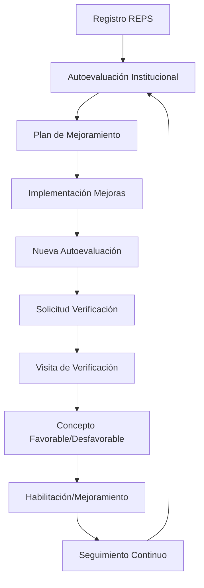
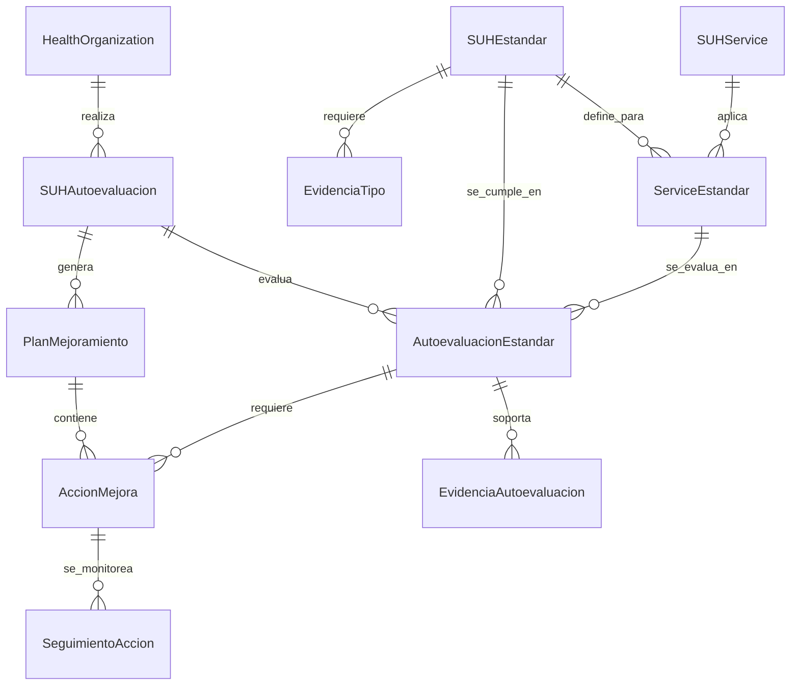
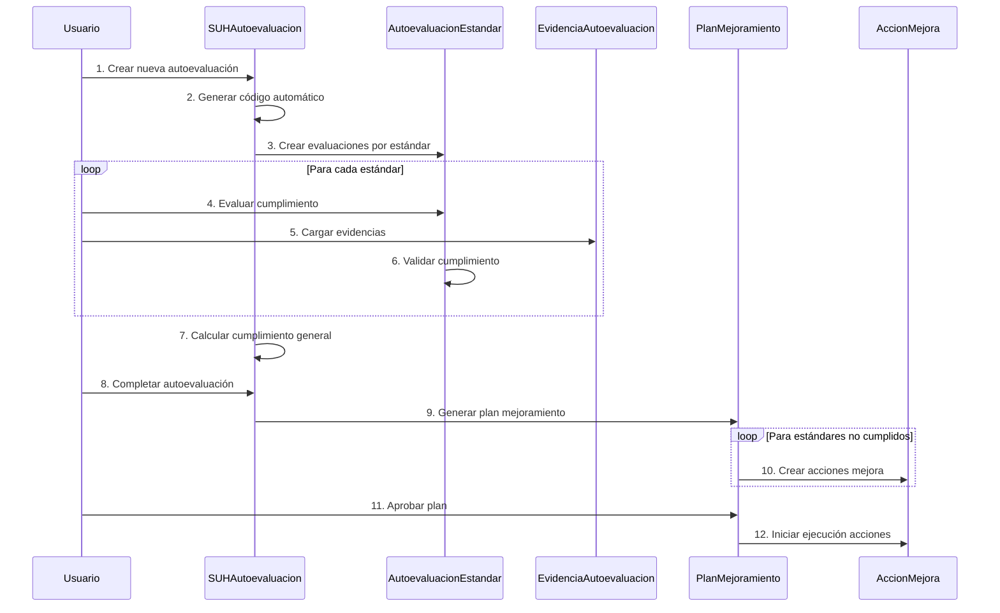

# 🏥 Modelos de Datos SUH - Sistema Único de Habilitación

## 📊 Información General

**Documento**: Modelos de Datos Específicos SUH  
**Versión**: 1.0  
**Fecha**: 2024  
**Autor**: QMS Software Architect  
**Estado**: ✅ Completo  

## 🎯 Objetivo

Definir los modelos de datos específicos para el submódulo SUH (Sistema Único de Habilitación), con énfasis especial en el proceso de **autoevaluación** como componente fundamental según la Resolución 3100/2019.

## 📋 Marco Regulatorio

### 🏛️ Base Normativa
- **Resolución 3100 de 2019**: Manual de Habilitación vigente
- **Decreto 780 de 2016**: Marco regulatorio general
- **Circular 012 de 2016**: Lineamientos de autoevaluación

### 🔄 Proceso SUH Completo



## 🏗️ Arquitectura de Modelos SUH

### 📊 Diagrama de Entidades Principales



## 📝 Modelos de Datos Detallados

### 1. Estándares de Habilitación (SUH)

```python
# apps/sogcs/models/suh_standards.py
"""
Modelos para gestión de estándares de habilitación SUH
"""

class SUHEstandar(FullBaseModel):
    """
    Estándares de habilitación según Resolución 3100/2019.
    Representa cada uno de los estándares que las instituciones deben cumplir.
    """
    
    # Grupos de estándares según Res. 3100/2019
    GRUPO_ESTANDAR_CHOICES = [
        ('TALENTO_HUMANO', _('Talento Humano')),
        ('INFRAESTRUCTURA', _('Infraestructura')),
        ('DOTACION', _('Dotación')),
        ('MEDICAMENTOS', _('Medicamentos y Dispositivos Médicos')),
        ('PROCESOS_PRIORITARIOS', _('Procesos Prioritarios')),
        ('HISTORIA_CLINICA', _('Historia Clínica')),
        ('INTERDEPENDENCIA', _('Interdependencia de Servicios')),
    ]
    
    TIPO_VERIFICACION_CHOICES = [
        ('DOCUMENTAL', _('Verificación Documental')),
        ('OBSERVACION', _('Observación Directa')),
        ('ENTREVISTA', _('Entrevista')),
        ('INSPECCION', _('Inspección Física')),
        ('MIXTO', _('Verificación Mixta')),
    ]
    
    NIVEL_CRITICIDAD_CHOICES = [
        ('CRITICO', _('Crítico')),
        ('IMPORTANTE', _('Importante')),
        ('BASICO', _('Básico')),
    ]
    
    # Identificación del estándar
    codigo_estandar = models.CharField(
        _('código estándar'),
        max_length=20,
        unique=True,
        help_text=_('Código único del estándar (ej: TH.1.1, INF.2.3)')
    )
    
    titulo_estandar = models.CharField(
        _('título del estándar'),
        max_length=300,
        help_text=_('Título completo del estándar según resolución')
    )
    
    grupo_estandar = models.CharField(
        _('grupo del estándar'),
        max_length=30,
        choices=GRUPO_ESTANDAR_CHOICES,
        help_text=_('Grupo al que pertenece el estándar')
    )
    
    # Contenido del estándar
    criterio_cumplimiento = models.TextField(
        _('criterio de cumplimiento'),
        help_text=_('Descripción detallada del criterio que debe cumplirse')
    )
    
    modo_verificacion = models.CharField(
        _('modo de verificación'),
        max_length=20,
        choices=TIPO_VERIFICACION_CHOICES,
        help_text=_('Forma como se verifica el cumplimiento del estándar')
    )
    
    nivel_criticidad = models.CharField(
        _('nivel de criticidad'),
        max_length=15,
        choices=NIVEL_CRITICIDAD_CHOICES,
        default='BASICO',
        help_text=_('Nivel de criticidad del estándar para la habilitación')
    )
    
    # Aplicabilidad
    aplica_todos_servicios = models.BooleanField(
        _('aplica a todos los servicios'),
        default=True,
        help_text=_('Si el estándar aplica a todos los servicios o solo específicos')
    )
    
    servicios_aplicables = models.ManyToManyField(
        'organization.HealthService',
        through='ServiceEstandar',
        related_name='estandares_aplicables',
        verbose_name=_('servicios aplicables'),
        blank=True
    )
    
    # Configuración de evaluación
    permite_cumplimiento_parcial = models.BooleanField(
        _('permite cumplimiento parcial'),
        default=False,
        help_text=_('Si el estándar permite evaluación gradual o es binario')
    )
    
    puntaje_minimo_cumplimiento = models.PositiveIntegerField(
        _('puntaje mínimo cumplimiento'),
        default=80,
        validators=[MinValueValidator(0), MaxValueValidator(100)],
        help_text=_('Puntaje mínimo requerido para considerar cumplido (si permite parcial)')
    )
    
    # Metadata normativa
    articulo_resolucion = models.CharField(
        _('artículo resolución'),
        max_length=50,
        help_text=_('Artículo específico de la resolución 3100/2019')
    )
    
    fecha_vigencia_desde = models.DateField(
        _('vigente desde'),
        help_text=_('Fecha desde la cual el estándar está vigente')
    )
    
    fecha_vigencia_hasta = models.DateField(
        _('vigente hasta'),
        null=True,
        blank=True,
        help_text=_('Fecha hasta la cual el estándar estará vigente (opcional)')
    )
    
    # Información adicional
    observaciones_aplicacion = models.TextField(
        _('observaciones de aplicación'),
        blank=True,
        help_text=_('Observaciones sobre la aplicación del estándar')
    )
    
    ejemplos_cumplimiento = models.JSONField(
        _('ejemplos de cumplimiento'),
        default=list,
        help_text=_('Ejemplos prácticos de cómo cumplir el estándar')
    )
    
    ejemplos_incumplimiento = models.JSONField(
        _('ejemplos de incumplimiento'),
        default=list,
        help_text=_('Ejemplos de situaciones que NO cumplen el estándar')
    )
    
    class Meta:
        verbose_name = _('estándar SUH')
        verbose_name_plural = _('estándares SUH')
        ordering = ['grupo_estandar', 'codigo_estandar']
        indexes = [
            models.Index(fields=['codigo_estandar']),
            models.Index(fields=['grupo_estandar', 'nivel_criticidad']),
            models.Index(fields=['aplica_todos_servicios']),
            models.Index(fields=['fecha_vigencia_desde', 'fecha_vigencia_hasta']),
        ]
    
    def __str__(self):
        return f"{self.codigo_estandar} - {self.titulo_estandar}"
    
    @property
    def esta_vigente(self):
        """Verifica si el estándar está vigente en la fecha actual."""
        today = timezone.now().date()
        if today < self.fecha_vigencia_desde:
            return False
        if self.fecha_vigencia_hasta and today > self.fecha_vigencia_hasta:
            return False
        return True
    
    def get_servicios_aplicables_count(self):
        """Retorna cantidad de servicios a los que aplica."""
        if self.aplica_todos_servicios:
            from apps.organization.models import HealthService
            return HealthService.objects.count()
        return self.servicios_aplicables.count()
    
    def clean(self):
        """Validaciones del modelo."""
        super().clean()
        
        # Validar fechas de vigencia
        if self.fecha_vigencia_hasta and self.fecha_vigencia_hasta <= self.fecha_vigencia_desde:
            raise ValidationError({
                'fecha_vigencia_hasta': _('La fecha fin debe ser posterior a la fecha inicio.')
            })


class ServiceEstandar(FullBaseModel):
    """
    Relación entre servicios de salud y estándares aplicables.
    Define qué estándares aplican a cada servicio específico.
    """
    
    service = models.ForeignKey(
        'organization.HealthService',
        on_delete=models.CASCADE,
        related_name='service_estandares',
        verbose_name=_('servicio de salud')
    )
    
    estandar = models.ForeignKey(
        SUHEstandar,
        on_delete=models.CASCADE,
        related_name='estandar_services',
        verbose_name=_('estándar SUH')
    )
    
    # Configuración específica del estándar para este servicio
    es_obligatorio = models.BooleanField(
        _('es obligatorio'),
        default=True,
        help_text=_('Si el estándar es obligatorio para este servicio')
    )
    
    criticidad_servicio = models.CharField(
        _('criticidad específica'),
        max_length=15,
        choices=SUHEstandar.NIVEL_CRITICIDAD_CHOICES,
        help_text=_('Nivel de criticidad específico para este servicio')
    )
    
    observaciones_aplicacion = models.TextField(
        _('observaciones aplicación'),
        blank=True,
        help_text=_('Observaciones sobre cómo aplica el estándar a este servicio')
    )
    
    fecha_aplicacion_desde = models.DateField(
        _('aplicable desde'),
        help_text=_('Fecha desde la cual el estándar aplica a este servicio')
    )
    
    class Meta:
        verbose_name = _('estándar por servicio')
        verbose_name_plural = _('estándares por servicio')
        unique_together = ['service', 'estandar']
        indexes = [
            models.Index(fields=['service', 'es_obligatorio']),
            models.Index(fields=['criticidad_servicio']),
        ]
    
    def __str__(self):
        return f"{self.service.nombre_servicio} - {self.estandar.codigo_estandar}"


class EvidenciaTipo(FullBaseModel):
    """
    Tipos de evidencias requeridas para demostrar cumplimiento de estándares.
    """
    
    CATEGORIA_EVIDENCIA_CHOICES = [
        ('DOCUMENTAL', _('Evidencia Documental')),
        ('FISICA', _('Evidencia Física')),
        ('TESTIMONIAL', _('Evidencia Testimonial')),
        ('DIGITAL', _('Evidencia Digital')),
        ('FOTOGRAFICA', _('Evidencia Fotográfica')),
    ]
    
    estandar = models.ForeignKey(
        SUHEstandar,
        on_delete=models.CASCADE,
        related_name='tipos_evidencia',
        verbose_name=_('estándar')
    )
    
    nombre_evidencia = models.CharField(
        _('nombre evidencia'),
        max_length=200,
        help_text=_('Nombre descriptivo del tipo de evidencia')
    )
    
    categoria = models.CharField(
        _('categoría'),
        max_length=20,
        choices=CATEGORIA_EVIDENCIA_CHOICES,
        help_text=_('Categoría de la evidencia')
    )
    
    descripcion = models.TextField(
        _('descripción'),
        help_text=_('Descripción detallada de qué debe contener la evidencia')
    )
    
    es_obligatoria = models.BooleanField(
        _('es obligatoria'),
        default=True,
        help_text=_('Si la evidencia es obligatoria para demostrar cumplimiento')
    )
    
    formato_requerido = models.CharField(
        _('formato requerido'),
        max_length=100,
        blank=True,
        help_text=_('Formato específico requerido (PDF, imagen, etc.)')
    )
    
    ejemplos_evidencia = models.JSONField(
        _('ejemplos evidencia'),
        default=list,
        help_text=_('Ejemplos de evidencias válidas')
    )
    
    class Meta:
        verbose_name = _('tipo de evidencia')
        verbose_name_plural = _('tipos de evidencia')
        ordering = ['estandar', 'nombre_evidencia']
        indexes = [
            models.Index(fields=['estandar', 'es_obligatoria']),
            models.Index(fields=['categoria']),
        ]
    
    def __str__(self):
        return f"{self.estandar.codigo_estandar} - {self.nombre_evidencia}"
```

### 2. Sistema de Autoevaluación SUH

```python
# apps/sogcs/models/suh_autoevaluacion.py
"""
Modelos para el sistema de autoevaluación SUH
"""

class SUHAutoevaluacion(FullBaseModel):
    """
    Proceso de autoevaluación institucional según Resolución 3100/2019.
    Representa cada ciclo de autoevaluación realizado por la institución.
    """
    
    ESTADO_AUTOEVALUACION_CHOICES = [
        ('INICIADA', _('Iniciada')),
        ('EN_PROGRESO', _('En Progreso')),
        ('COMPLETADA', _('Completada')),
        ('REVISADA', _('Revisada')),
        ('APROBADA', _('Aprobada')),
        ('RECHAZADA', _('Rechazada')),
        ('ARCHIVADA', _('Archivada')),
    ]
    
    TIPO_AUTOEVALUACION_CHOICES = [
        ('INICIAL', _('Autoevaluación Inicial')),
        ('PERIODICA', _('Autoevaluación Periódica')),
        ('SEGUIMIENTO', _('Autoevaluación de Seguimiento')),
        ('PRE_VERIFICACION', _('Pre-verificación')),
        ('POST_VERIFICACION', _('Post-verificación')),
    ]
    
    # Identificación
    health_organization = models.ForeignKey(
        'organization.HealthOrganization',
        on_delete=models.CASCADE,
        related_name='autoevaluaciones_suh',
        verbose_name=_('organización de salud')
    )
    
    codigo_autoevaluacion = models.CharField(
        _('código autoevaluación'),
        max_length=50,
        unique=True,
        help_text=_('Código único identificatorio de la autoevaluación')
    )
    
    # Configuración de la autoevaluación
    tipo_autoevaluacion = models.CharField(
        _('tipo autoevaluación'),
        max_length=20,
        choices=TIPO_AUTOEVALUACION_CHOICES,
        help_text=_('Tipo de autoevaluación realizada')
    )
    
    estado = models.CharField(
        _('estado'),
        max_length=20,
        choices=ESTADO_AUTOEVALUACION_CHOICES,
        default='INICIADA',
        help_text=_('Estado actual de la autoevaluación')
    )
    
    # Fechas del proceso
    fecha_inicio = models.DateTimeField(
        _('fecha inicio'),
        help_text=_('Fecha y hora de inicio de la autoevaluación')
    )
    
    fecha_limite = models.DateField(
        _('fecha límite'),
        help_text=_('Fecha límite para completar la autoevaluación')
    )
    
    fecha_completada = models.DateTimeField(
        _('fecha completada'),
        null=True,
        blank=True,
        help_text=_('Fecha y hora de finalización de la autoevaluación')
    )
    
    # Responsables
    coordinador_autoevaluacion = models.ForeignKey(
        settings.AUTH_USER_MODEL,
        on_delete=models.SET_NULL,
        null=True,
        related_name='autoevaluaciones_coordinadas',
        verbose_name=_('coordinador autoevaluación'),
        help_text=_('Usuario responsable de coordinar la autoevaluación')
    )
    
    equipo_evaluador = models.ManyToManyField(
        settings.AUTH_USER_MODEL,
        through='EquipoAutoevaluacion',
        related_name='autoevaluaciones_participadas',
        verbose_name=_('equipo evaluador'),
        blank=True
    )
    
    # Alcance de la autoevaluación
    servicios_evaluados = models.ManyToManyField(
        'organization.HealthService',
        related_name='autoevaluaciones',
        verbose_name=_('servicios evaluados'),
        help_text=_('Servicios incluidos en esta autoevaluación')
    )
    
    sedes_evaluadas = models.ManyToManyField(
        'organization.SedePrestadora',
        related_name='autoevaluaciones',
        verbose_name=_('sedes evaluadas'),
        help_text=_('Sedes incluidas en esta autoevaluación')
    )
    
    # Metodología
    metodologia_utilizada = models.TextField(
        _('metodología utilizada'),
        help_text=_('Descripción de la metodología utilizada para la autoevaluación')
    )
    
    criterios_priorizacion = models.JSONField(
        _('criterios de priorización'),
        default=dict,
        help_text=_('Criterios utilizados para priorizar estándares o áreas')
    )
    
    # Resultados generales
    total_estandares_evaluados = models.PositiveIntegerField(
        _('total estándares evaluados'),
        default=0,
        help_text=_('Cantidad total de estándares evaluados')
    )
    
    estandares_cumplidos = models.PositiveIntegerField(
        _('estándares cumplidos'),
        default=0,
        help_text=_('Cantidad de estándares que cumplen')
    )
    
    estandares_parcialmente_cumplidos = models.PositiveIntegerField(
        _('estándares parcialmente cumplidos'),
        default=0,
        help_text=_('Cantidad de estándares con cumplimiento parcial')
    )
    
    estandares_no_cumplidos = models.PositiveIntegerField(
        _('estándares no cumplidos'),
        default=0,
        help_text=_('Cantidad de estándares que no cumplen')
    )
    
    porcentaje_cumplimiento_general = models.DecimalField(
        _('porcentaje cumplimiento general'),
        max_digits=5,
        decimal_places=2,
        default=0,
        validators=[MinValueValidator(0), MaxValueValidator(100)],
        help_text=_('Porcentaje general de cumplimiento de la autoevaluación')
    )
    
    # Análisis por grupos
    cumplimiento_por_grupo = models.JSONField(
        _('cumplimiento por grupo'),
        default=dict,
        help_text=_('Porcentajes de cumplimiento por grupo de estándares')
    )
    
    # Hallazgos y observaciones
    fortalezas_identificadas = models.TextField(
        _('fortalezas identificadas'),
        blank=True,
        help_text=_('Principales fortalezas identificadas en la autoevaluación')
    )
    
    oportunidades_mejora = models.TextField(
        _('oportunidades de mejora'),
        blank=True,
        help_text=_('Principales oportunidades de mejora identificadas')
    )
    
    riesgos_identificados = models.TextField(
        _('riesgos identificados'),
        blank=True,
        help_text=_('Riesgos identificados que pueden afectar la habilitación')
    )
    
    recomendaciones_generales = models.TextField(
        _('recomendaciones generales'),
        blank=True,
        help_text=_('Recomendaciones generales para mejorar el cumplimiento')
    )
    
    # Archivos y documentos
    informe_ejecutivo = models.FileField(
        _('informe ejecutivo'),
        upload_to='autoevaluaciones/informes/',
        null=True,
        blank=True,
        help_text=_('Informe ejecutivo de la autoevaluación')
    )
    
    informe_detallado = models.FileField(
        _('informe detallado'),
        upload_to='autoevaluaciones/informes/',
        null=True,
        blank=True,
        help_text=_('Informe detallado con todos los hallazgos')
    )
    
    # Configuración de notificaciones
    notificar_vencimientos = models.BooleanField(
        _('notificar vencimientos'),
        default=True,
        help_text=_('Enviar notificaciones de vencimientos de fecha límite')
    )
    
    emails_notificacion = models.JSONField(
        _('emails notificación'),
        default=list,
        help_text=_('Lista de emails para notificaciones de esta autoevaluación')
    )
    
    class Meta:
        verbose_name = _('autoevaluación SUH')
        verbose_name_plural = _('autoevaluaciones SUH')
        ordering = ['-fecha_inicio']
        indexes = [
            models.Index(fields=['health_organization', 'estado']),
            models.Index(fields=['tipo_autoevaluacion', 'fecha_inicio']),
            models.Index(fields=['coordinador_autoevaluacion']),
            models.Index(fields=['fecha_limite']),
            models.Index(fields=['porcentaje_cumplimiento_general']),
        ]
    
    def __str__(self):
        return f"{self.codigo_autoevaluacion} - {self.health_organization.organization.razon_social}"
    
    def save(self, *args, **kwargs):
        """Override save para generar código automático."""
        if not self.codigo_autoevaluacion:
            self.codigo_autoevaluacion = self.generar_codigo_autoevaluacion()
        super().save(*args, **kwargs)
    
    def generar_codigo_autoevaluacion(self):
        """Genera código único para la autoevaluación."""
        from datetime import datetime
        año_actual = datetime.now().year
        codigo_org = self.health_organization.codigo_prestador[:4]
        
        # Contar autoevaluaciones del año para la organización
        count = SUHAutoevaluacion.objects.filter(
            health_organization=self.health_organization,
            fecha_inicio__year=año_actual
        ).count() + 1
        
        return f"AE-{código_org}-{año_actual}-{count:03d}"
    
    @property
    def esta_vencida(self):
        """Verifica si la autoevaluación está vencida."""
        return timezone.now().date() > self.fecha_limite and self.estado not in ['COMPLETADA', 'APROBADA']
    
    @property
    def dias_para_vencimiento(self):
        """Días restantes para el vencimiento."""
        if self.estado in ['COMPLETADA', 'APROBADA']:
            return None
        
        delta = self.fecha_limite - timezone.now().date()
        return delta.days if delta.days >= 0 else 0
    
    @property
    def porcentaje_avance(self):
        """Calcula el porcentaje de avance de la autoevaluación."""
        if self.total_estandares_evaluados == 0:
            return 0
        
        evaluados = self.evaluaciones_estandares.count()
        return round((evaluados / self.total_estandares_evaluados) * 100, 2)
    
    def calcular_cumplimiento(self):
        """Recalcula los porcentajes de cumplimiento."""
        evaluaciones = self.evaluaciones_estandares.all()
        
        total = evaluaciones.count()
        cumplidos = evaluaciones.filter(estado_cumplimiento='CUMPLE').count()
        parciales = evaluaciones.filter(estado_cumplimiento='CUMPLE_PARCIAL').count()
        no_cumplidos = evaluaciones.filter(estado_cumplimiento='NO_CUMPLE').count()
        
        # Actualizar contadores
        self.total_estandares_evaluados = total
        self.estandares_cumplidos = cumplidos
        self.estandares_parcialmente_cumplidos = parciales
        self.estandares_no_cumplidos = no_cumplidos
        
        # Calcular porcentaje general (parciales valen 50%)
        if total > 0:
            puntos_totales = cumplidos + (parciales * 0.5)
            self.porcentaje_cumplimiento_general = round((puntos_totales / total) * 100, 2)
        else:
            self.porcentaje_cumplimiento_general = 0
        
        # Calcular por grupos
        self.cumplimiento_por_grupo = self._calcular_cumplimiento_por_grupo()
        
        self.save(update_fields=[
            'total_estandares_evaluados',
            'estandares_cumplidos', 
            'estandares_parcialmente_cumplidos',
            'estandares_no_cumplidos',
            'porcentaje_cumplimiento_general',
            'cumplimiento_por_grupo'
        ])
    
    def _calcular_cumplimiento_por_grupo(self):
        """Calcula cumplimiento por grupo de estándares."""
        from django.db.models import Count, Q
        
        grupos = self.evaluaciones_estandares.values('estandar__grupo_estandar').annotate(
            total=Count('id'),
            cumplidos=Count('id', filter=Q(estado_cumplimiento='CUMPLE')),
            parciales=Count('id', filter=Q(estado_cumplimiento='CUMPLE_PARCIAL'))
        )
        
        resultado = {}
        for grupo in grupos:
            nombre_grupo = grupo['estandar__grupo_estandar']
            total = grupo['total']
            cumplidos = grupo['cumplidos']
            parciales = grupo['parciales']
            
            if total > 0:
                puntos = cumplidos + (parciales * 0.5)
                porcentaje = round((puntos / total) * 100, 2)
                resultado[nombre_grupo] = {
                    'total': total,
                    'cumplidos': cumplidos,
                    'parciales': parciales,
                    'porcentaje': porcentaje
                }
        
        return resultado
    
    def puede_completarse(self):
        """Verifica si la autoevaluación puede marcarse como completada."""
        # Todos los estándares deben estar evaluados
        pendientes = self.evaluaciones_estandares.filter(
            estado_cumplimiento='PENDIENTE'
        ).count()
        
        return pendientes == 0
    
    def completar_autoevaluacion(self, usuario=None):
        """Marca la autoevaluación como completada."""
        if not self.puede_completarse():
            raise ValidationError(_('No se puede completar: hay estándares pendientes de evaluar.'))
        
        self.estado = 'COMPLETADA'
        self.fecha_completada = timezone.now()
        if usuario:
            self.updated_by = usuario
        
        self.save(update_fields=['estado', 'fecha_completada', 'updated_by'])
        
        # Generar plan de mejoramiento automáticamente
        self.generar_plan_mejoramiento()
    
    def generar_plan_mejoramiento(self):
        """Genera automáticamente un plan de mejoramiento basado en los hallazgos."""
        estandares_no_cumplidos = self.evaluaciones_estandares.filter(
            estado_cumplimiento__in=['NO_CUMPLE', 'CUMPLE_PARCIAL']
        )
        
        if estandares_no_cumplidos.exists():
            plan = PlanMejoramiento.objects.create(
                autoevaluacion=self,
                estado='BORRADOR',
                fecha_elaboracion=timezone.now().date(),
                responsable_elaboracion=self.coordinador_autoevaluacion
            )
            
            # Crear acciones automáticas para estándares críticos no cumplidos
            for evaluacion in estandares_no_cumplidos.filter(
                estandar__nivel_criticidad='CRITICO'
            ):
                AccionMejora.objects.create(
                    plan_mejoramiento=plan,
                    estandar_relacionado=evaluacion.estandar,
                    descripcion_hallazgo=evaluacion.observaciones or 'Estándar crítico no cumplido',
                    accion_propuesta=f'Implementar cumplimiento de {evaluacion.estandar.titulo_estandar}',
                    prioridad='ALTA',
                    responsable=self.coordinador_autoevaluacion,
                    fecha_limite=self.fecha_limite + timezone.timedelta(days=90)
                )
            
            return plan
        
        return None


class EquipoAutoevaluacion(FullBaseModel):
    """
    Miembros del equipo evaluador para una autoevaluación específica.
    """
    
    ROL_EQUIPO_CHOICES = [
        ('COORDINADOR', _('Coordinador')),
        ('EVALUADOR_SENIOR', _('Evaluador Senior')),
        ('EVALUADOR', _('Evaluador')),
        ('ESPECIALISTA', _('Especialista Técnico')),
        ('OBSERVADOR', _('Observador')),
    ]
    
    autoevaluacion = models.ForeignKey(
        SUHAutoevaluacion,
        on_delete=models.CASCADE,
        related_name='equipo_miembros',
        verbose_name=_('autoevaluación')
    )
    
    usuario = models.ForeignKey(
        settings.AUTH_USER_MODEL,
        on_delete=models.CASCADE,
        verbose_name=_('usuario')
    )
    
    rol_equipo = models.CharField(
        _('rol en el equipo'),
        max_length=20,
        choices=ROL_EQUIPO_CHOICES,
        help_text=_('Rol específico del usuario en esta autoevaluación')
    )
    
    areas_responsabilidad = models.JSONField(
        _('áreas de responsabilidad'),
        default=list,
        help_text=_('Grupos de estándares o áreas específicas asignadas')
    )
    
    fecha_asignacion = models.DateTimeField(
        _('fecha asignación'),
        auto_now_add=True
    )
    
    activo = models.BooleanField(
        _('activo'),
        default=True,
        help_text=_('Si el miembro está activo en el equipo')
    )
    
    observaciones = models.TextField(
        _('observaciones'),
        blank=True,
        help_text=_('Observaciones sobre la participación del miembro')
    )
    
    class Meta:
        verbose_name = _('miembro equipo autoevaluación')
        verbose_name_plural = _('miembros equipo autoevaluación')
        unique_together = ['autoevaluacion', 'usuario']
        indexes = [
            models.Index(fields=['autoevaluacion', 'rol_equipo']),
            models.Index(fields=['usuario', 'activo']),
        ]
    
    def __str__(self):
        return f"{self.usuario.get_full_name()} - {self.get_rol_equipo_display()}"


class AutoevaluacionEstandar(FullBaseModel):
    """
    Evaluación específica de un estándar dentro de una autoevaluación.
    Representa el resultado de evaluar un estándar particular.
    """
    
    ESTADO_CUMPLIMIENTO_CHOICES = [
        ('PENDIENTE', _('Pendiente de Evaluar')),
        ('CUMPLE', _('Cumple Completamente')),
        ('CUMPLE_PARCIAL', _('Cumple Parcialmente')),
        ('NO_CUMPLE', _('No Cumple')),
        ('NO_APLICA', _('No Aplica')),
        ('EN_REVISION', _('En Revisión')),
    ]
    
    autoevaluacion = models.ForeignKey(
        SUHAutoevaluacion,
        on_delete=models.CASCADE,
        related_name='evaluaciones_estandares',
        verbose_name=_('autoevaluación')
    )
    
    estandar = models.ForeignKey(
        SUHEstandar,
        on_delete=models.CASCADE,
        related_name='evaluaciones',
        verbose_name=_('estándar')
    )
    
    # Resultado de la evaluación
    estado_cumplimiento = models.CharField(
        _('estado cumplimiento'),
        max_length=20,
        choices=ESTADO_CUMPLIMIENTO_CHOICES,
        default='PENDIENTE',
        help_text=_('Estado del cumplimiento del estándar')
    )
    
    puntaje_cumplimiento = models.DecimalField(
        _('puntaje cumplimiento'),
        max_digits=5,
        decimal_places=2,
        null=True,
        blank=True,
        validators=[MinValueValidator(0), MaxValueValidator(100)],
        help_text=_('Puntaje numérico de cumplimiento (para estándares que permiten evaluación gradual)')
    )
    
    # Proceso de evaluación
    fecha_evaluacion = models.DateTimeField(
        _('fecha evaluación'),
        help_text=_('Fecha y hora en que se realizó la evaluación')
    )
    
    evaluador = models.ForeignKey(
        settings.AUTH_USER_MODEL,
        on_delete=models.SET_NULL,
        null=True,
        related_name='evaluaciones_realizadas',
        verbose_name=_('evaluador'),
        help_text=_('Usuario que realizó la evaluación')
    )
    
    metodo_verificacion_utilizado = models.CharField(
        _('método verificación utilizado'),
        max_length=200,
        help_text=_('Método específico utilizado para verificar el cumplimiento')
    )
    
    # Análisis detallado
    aspectos_cumplidos = models.TextField(
        _('aspectos cumplidos'),
        blank=True,
        help_text=_('Descripción de los aspectos que sí cumplen el estándar')
    )
    
    aspectos_no_cumplidos = models.TextField(
        _('aspectos no cumplidos'),
        blank=True,
        help_text=_('Descripción de los aspectos que no cumplen el estándar')
    )
    
    observaciones = models.TextField(
        _('observaciones'),
        blank=True,
        help_text=_('Observaciones adicionales sobre la evaluación')
    )
    
    recomendaciones = models.TextField(
        _('recomendaciones'),
        blank=True,
        help_text=_('Recomendaciones específicas para mejorar el cumplimiento')
    )
    
    # Información de riesgo
    nivel_riesgo_identificado = models.CharField(
        _('nivel de riesgo'),
        max_length=10,
        choices=[
            ('BAJO', _('Bajo')),
            ('MEDIO', _('Medio')),
            ('ALTO', _('Alto')),
            ('CRITICO', _('Crítico')),
        ],
        null=True,
        blank=True,
        help_text=_('Nivel de riesgo asociado al incumplimiento')
    )
    
    impacto_potencial = models.TextField(
        _('impacto potencial'),
        blank=True,
        help_text=_('Descripción del impacto potencial del incumplimiento')
    )
    
    # Revisión y aprobación
    requiere_revision = models.BooleanField(
        _('requiere revisión'),
        default=False,
        help_text=_('Si la evaluación requiere revisión adicional')
    )
    
    revisado_por = models.ForeignKey(
        settings.AUTH_USER_MODEL,
        on_delete=models.SET_NULL,
        null=True,
        blank=True,
        related_name='evaluaciones_revisadas',
        verbose_name=_('revisado por')
    )
    
    fecha_revision = models.DateTimeField(
        _('fecha revisión'),
        null=True,
        blank=True
    )
    
    comentarios_revision = models.TextField(
        _('comentarios revisión'),
        blank=True,
        help_text=_('Comentarios del revisor')
    )
    
    class Meta:
        verbose_name = _('evaluación de estándar')
        verbose_name_plural = _('evaluaciones de estándares')
        unique_together = ['autoevaluacion', 'estandar']
        ordering = ['estandar__grupo_estandar', 'estandar__codigo_estandar']
        indexes = [
            models.Index(fields=['autoevaluacion', 'estado_cumplimiento']),
            models.Index(fields=['estandar', 'fecha_evaluacion']),
            models.Index(fields=['evaluador']),
            models.Index(fields=['nivel_riesgo_identificado']),
            models.Index(fields=['requiere_revision']),
        ]
    
    def __str__(self):
        return f"{self.autoevaluacion.codigo_autoevaluacion} - {self.estandar.codigo_estandar}"
    
    @property
    def cumple_minimo_requerido(self):
        """Verifica si cumple el puntaje mínimo requerido."""
        if self.estado_cumplimiento == 'CUMPLE':
            return True
        elif self.estado_cumplimiento == 'CUMPLE_PARCIAL' and self.puntaje_cumplimiento:
            return self.puntaje_cumplimiento >= self.estandar.puntaje_minimo_cumplimiento
        return False
    
    @property
    def es_critico_no_cumplido(self):
        """Verifica si es un estándar crítico que no cumple."""
        return (
            self.estandar.nivel_criticidad == 'CRITICO' and 
            self.estado_cumplimiento in ['NO_CUMPLE', 'CUMPLE_PARCIAL'] and
            not self.cumple_minimo_requerido
        )
    
    def marcar_para_revision(self, motivo=""):
        """Marca la evaluación para revisión."""
        self.requiere_revision = True
        if motivo:
            self.comentarios_revision = motivo
        self.save(update_fields=['requiere_revision', 'comentarios_revision'])
    
    def aprobar_evaluacion(self, revisor, comentarios=""):
        """Aprueba la evaluación después de revisión."""
        self.requiere_revision = False
        self.revisado_por = revisor
        self.fecha_revision = timezone.now()
        self.comentarios_revision = comentarios
        self.save(update_fields=[
            'requiere_revision', 'revisado_por', 
            'fecha_revision', 'comentarios_revision'
        ])
    
    def clean(self):
        """Validaciones del modelo."""
        super().clean()
        
        # Validar puntaje solo si el estándar permite cumplimiento parcial
        if self.puntaje_cumplimiento is not None:
            if not self.estandar.permite_cumplimiento_parcial:
                raise ValidationError({
                    'puntaje_cumplimiento': _('Este estándar no permite evaluación con puntaje.')
                })
        
        # Validar coherencia entre estado y puntaje
        if self.estado_cumplimiento == 'CUMPLE_PARCIAL' and not self.puntaje_cumplimiento:
            if self.estandar.permite_cumplimiento_parcial:
                raise ValidationError({
                    'puntaje_cumplimiento': _('Debe especificar puntaje para cumplimiento parcial.')
                })


class EvidenciaAutoevaluacion(FullBaseModel):
    """
    Evidencias cargadas para soportar la evaluación de estándares.
    """
    
    ESTADO_EVIDENCIA_CHOICES = [
        ('PENDIENTE', _('Pendiente de Revisión')),
        ('VALIDA', _('Válida')),
        ('INVALIDA', _('Inválida')),
        ('INCOMPLETA', _('Incompleta')),
        ('RECHAZADA', _('Rechazada')),
    ]
    
    evaluacion_estandar = models.ForeignKey(
        AutoevaluacionEstandar,
        on_delete=models.CASCADE,
        related_name='evidencias',
        verbose_name=_('evaluación estándar')
    )
    
    tipo_evidencia = models.ForeignKey(
        EvidenciaTipo,
        on_delete=models.CASCADE,
        related_name='evidencias_cargadas',
        verbose_name=_('tipo evidencia')
    )
    
    # Archivo o información de la evidencia
    archivo_evidencia = models.FileField(
        _('archivo evidencia'),
        upload_to='autoevaluaciones/evidencias/',
        null=True,
        blank=True,
        help_text=_('Archivo digital de la evidencia')
    )
    
    descripcion_evidencia = models.TextField(
        _('descripción evidencia'),
        help_text=_('Descripción detallada de la evidencia proporcionada')
    )
    
    ubicacion_fisica = models.CharField(
        _('ubicación física'),
        max_length=200,
        blank=True,
        help_text=_('Ubicación física de la evidencia (si aplica)')
    )
    
    # Estado y validación
    estado_evidencia = models.CharField(
        _('estado evidencia'),
        max_length=20,
        choices=ESTADO_EVIDENCIA_CHOICES,
        default='PENDIENTE',
        help_text=_('Estado de validación de la evidencia')
    )
    
    fecha_carga = models.DateTimeField(
        _('fecha carga'),
        auto_now_add=True
    )
    
    cargado_por = models.ForeignKey(
        settings.AUTH_USER_MODEL,
        on_delete=models.SET_NULL,
        null=True,
        related_name='evidencias_cargadas',
        verbose_name=_('cargado por')
    )
    
    # Validación
    validado_por = models.ForeignKey(
        settings.AUTH_USER_MODEL,
        on_delete=models.SET_NULL,
        null=True,
        blank=True,
        related_name='evidencias_validadas',
        verbose_name=_('validado por')
    )
    
    fecha_validacion = models.DateTimeField(
        _('fecha validación'),
        null=True,
        blank=True
    )
    
    comentarios_validacion = models.TextField(
        _('comentarios validación'),
        blank=True,
        help_text=_('Comentarios sobre la validación de la evidencia')
    )
    
    class Meta:
        verbose_name = _('evidencia autoevaluación')
        verbose_name_plural = _('evidencias autoevaluación')
        ordering = ['-fecha_carga']
        indexes = [
            models.Index(fields=['evaluacion_estandar', 'estado_evidencia']),
            models.Index(fields=['tipo_evidencia']),
            models.Index(fields=['cargado_por']),
            models.Index(fields=['fecha_carga']),
        ]
    
    def __str__(self):
        return f"{self.evaluacion_estandar} - {self.tipo_evidencia.nombre_evidencia}"
    
    def validar_evidencia(self, validador, es_valida, comentarios=""):
        """Valida la evidencia."""
        self.estado_evidencia = 'VALIDA' if es_valida else 'INVALIDA'
        self.validado_por = validador
        self.fecha_validacion = timezone.now()
        self.comentarios_validacion = comentarios
        self.save(update_fields=[
            'estado_evidencia', 'validado_por', 
            'fecha_validacion', 'comentarios_validacion'
        ])
    
    @property
    def es_evidencia_digital(self):
        """Verifica si es evidencia digital (tiene archivo)."""
        return bool(self.archivo_evidencia)
    
    def clean(self):
        """Validaciones del modelo."""
        super().clean()
        
        # Verificar que el tipo de evidencia corresponda al estándar
        if self.tipo_evidencia.estandar != self.evaluacion_estandar.estandar:
            raise ValidationError({
                'tipo_evidencia': _('El tipo de evidencia no corresponde al estándar evaluado.')
            })
```

### 3. Planes de Mejoramiento

```python
# apps/sogcs/models/suh_mejoramiento.py
"""
Modelos para planes de mejoramiento derivados de autoevaluaciones SUH
"""

class PlanMejoramiento(FullBaseModel):
    """
    Plan de mejoramiento generado a partir de una autoevaluación SUH.
    """
    
    ESTADO_PLAN_CHOICES = [
        ('BORRADOR', _('Borrador')),
        ('EN_REVISION', _('En Revisión')),
        ('APROBADO', _('Aprobado')),
        ('EN_EJECUCION', _('En Ejecución')),
        ('COMPLETADO', _('Completado')),
        ('SUSPENDIDO', _('Suspendido')),
        ('CANCELADO', _('Cancelado')),
    ]
    
    autoevaluacion = models.OneToOneField(
        SUHAutoevaluacion,
        on_delete=models.CASCADE,
        related_name='plan_mejoramiento',
        verbose_name=_('autoevaluación')
    )
    
    # Identificación
    codigo_plan = models.CharField(
        _('código plan'),
        max_length=50,
        unique=True,
        help_text=_('Código único del plan de mejoramiento')
    )
    
    nombre_plan = models.CharField(
        _('nombre plan'),
        max_length=300,
        help_text=_('Nombre descriptivo del plan de mejoramiento')
    )
    
    # Estado y fechas
    estado = models.CharField(
        _('estado'),
        max_length=20,
        choices=ESTADO_PLAN_CHOICES,
        default='BORRADOR'
    )
    
    fecha_elaboracion = models.DateField(
        _('fecha elaboración'),
        help_text=_('Fecha de elaboración del plan')
    )
    
    fecha_aprobacion = models.DateField(
        _('fecha aprobación'),
        null=True,
        blank=True
    )
    
    fecha_inicio_ejecucion = models.DateField(
        _('fecha inicio ejecución'),
        null=True,
        blank=True
    )
    
    fecha_limite_cumplimiento = models.DateField(
        _('fecha límite cumplimiento'),
        help_text=_('Fecha límite para completar todas las acciones')
    )
    
    # Responsables
    responsable_elaboracion = models.ForeignKey(
        settings.AUTH_USER_MODEL,
        on_delete=models.SET_NULL,
        null=True,
        related_name='planes_elaborados',
        verbose_name=_('responsable elaboración')
    )
    
    aprobado_por = models.ForeignKey(
        settings.AUTH_USER_MODEL,
        on_delete=models.SET_NULL,
        null=True,
        blank=True,
        related_name='planes_aprobados',
        verbose_name=_('aprobado por')
    )
    
    responsable_seguimiento = models.ForeignKey(
        settings.AUTH_USER_MODEL,
        on_delete=models.SET_NULL,
        null=True,
        related_name='planes_seguimiento',
        verbose_name=_('responsable seguimiento')
    )
    
    # Análisis del plan
    objetivo_general = models.TextField(
        _('objetivo general'),
        help_text=_('Objetivo general del plan de mejoramiento')
    )
    
    objetivos_especificos = models.JSONField(
        _('objetivos específicos'),
        default=list,
        help_text=_('Lista de objetivos específicos del plan')
    )
    
    alcance_plan = models.TextField(
        _('alcance del plan'),
        help_text=_('Descripción del alcance del plan de mejoramiento')
    )
    
    # Métricas y seguimiento
    total_acciones = models.PositiveIntegerField(
        _('total acciones'),
        default=0,
        help_text=_('Número total de acciones del plan')
    )
    
    acciones_completadas = models.PositiveIntegerField(
        _('acciones completadas'),
        default=0,
        help_text=_('Número de acciones completadas')
    )
    
    porcentaje_avance = models.DecimalField(
        _('porcentaje avance'),
        max_digits=5,
        decimal_places=2,
        default=0,
        validators=[MinValueValidator(0), MaxValueValidator(100)]
    )
    
    # Recursos
    presupuesto_estimado = models.DecimalField(
        _('presupuesto estimado'),
        max_digits=15,
        decimal_places=2,
        null=True,
        blank=True,
        help_text=_('Presupuesto estimado para ejecutar el plan')
    )
    
    recursos_humanos = models.JSONField(
        _('recursos humanos'),
        default=list,
        help_text=_('Recursos humanos necesarios para el plan')
    )
    
    recursos_tecnicos = models.JSONField(
        _('recursos técnicos'),
        default=list,
        help_text=_('Recursos técnicos necesarios para el plan')
    )
    
    # Documentos
    documento_plan = models.FileField(
        _('documento plan'),
        upload_to='planes_mejoramiento/documentos/',
        null=True,
        blank=True,
        help_text=_('Documento formal del plan de mejoramiento')
    )
    
    class Meta:
        verbose_name = _('plan de mejoramiento')
        verbose_name_plural = _('planes de mejoramiento')
        ordering = ['-fecha_elaboracion']
        indexes = [
            models.Index(fields=['autoevaluacion']),
            models.Index(fields=['estado', 'fecha_limite_cumplimiento']),
            models.Index(fields=['responsable_seguimiento']),
        ]
    
    def __str__(self):
        return f"{self.codigo_plan} - {self.nombre_plan}"
    
    def save(self, *args, **kwargs):
        """Override save para generar código automático."""
        if not self.codigo_plan:
            self.codigo_plan = self.generar_codigo_plan()
        super().save(*args, **kwargs)
    
    def generar_codigo_plan(self):
        """Genera código único para el plan."""
        codigo_ae = self.autoevaluacion.codigo_autoevaluacion
        return f"PM-{codigo_ae}"
    
    def calcular_avance(self):
        """Recalcula el porcentaje de avance del plan."""
        total = self.acciones.count()
        completadas = self.acciones.filter(estado='COMPLETADA').count()
        
        self.total_acciones = total
        self.acciones_completadas = completadas
        
        if total > 0:
            self.porcentaje_avance = round((completadas / total) * 100, 2)
        else:
            self.porcentaje_avance = 0
        
        self.save(update_fields=[
            'total_acciones', 'acciones_completadas', 'porcentaje_avance'
        ])
    
    def aprobar_plan(self, aprobador):
        """Aprueba el plan de mejoramiento."""
        self.estado = 'APROBADO'
        self.aprobado_por = aprobador
        self.fecha_aprobacion = timezone.now().date()
        self.save(update_fields=['estado', 'aprobado_por', 'fecha_aprobacion'])
    
    def iniciar_ejecucion(self):
        """Inicia la ejecución del plan."""
        if self.estado != 'APROBADO':
            raise ValidationError(_('El plan debe estar aprobado para iniciar ejecución.'))
        
        self.estado = 'EN_EJECUCION'
        self.fecha_inicio_ejecucion = timezone.now().date()
        self.save(update_fields=['estado', 'fecha_inicio_ejecucion'])


class AccionMejora(FullBaseModel):
    """
    Acciones específicas de mejoramiento dentro de un plan.
    """
    
    ESTADO_ACCION_CHOICES = [
        ('PLANIFICADA', _('Planificada')),
        ('EN_PROGRESO', _('En Progreso')),
        ('COMPLETADA', _('Completada')),
        ('RETRASADA', _('Retrasada')),
        ('SUSPENDIDA', _('Suspendida')),
        ('CANCELADA', _('Cancelada')),
    ]
    
    PRIORIDAD_CHOICES = [
        ('BAJA', _('Baja')),
        ('MEDIA', _('Media')),
        ('ALTA', _('Alta')),
        ('CRITICA', _('Crítica')),
    ]
    
    plan_mejoramiento = models.ForeignKey(
        PlanMejoramiento,
        on_delete=models.CASCADE,
        related_name='acciones',
        verbose_name=_('plan mejoramiento')
    )
    
    estandar_relacionado = models.ForeignKey(
        SUHEstandar,
        on_delete=models.CASCADE,
        related_name='acciones_mejora',
        verbose_name=_('estándar relacionado')
    )
    
    # Identificación
    numero_accion = models.PositiveIntegerField(
        _('número acción'),
        help_text=_('Número secuencial de la acción dentro del plan')
    )
    
    titulo_accion = models.CharField(
        _('título acción'),
        max_length=300,
        help_text=_('Título descriptivo de la acción')
    )
    
    # Descripción del problema y solución
    descripcion_hallazgo = models.TextField(
        _('descripción hallazgo'),
        help_text=_('Descripción del hallazgo o problema identificado')
    )
    
    causa_raiz = models.TextField(
        _('causa raíz'),
        blank=True,
        help_text=_('Análisis de la causa raíz del problema')
    )
    
    accion_propuesta = models.TextField(
        _('acción propuesta'),
        help_text=_('Descripción detallada de la acción a implementar')
    )
    
    # Planificación
    estado = models.CharField(
        _('estado'),
        max_length=20,
        choices=ESTADO_ACCION_CHOICES,
        default='PLANIFICADA'
    )
    
    prioridad = models.CharField(
        _('prioridad'),
        max_length=10,
        choices=PRIORIDAD_CHOICES,
        default='MEDIA'
    )
    
    fecha_inicio_planificada = models.DateField(
        _('fecha inicio planificada'),
        help_text=_('Fecha planificada para iniciar la acción')
    )
    
    fecha_limite = models.DateField(
        _('fecha límite'),
        help_text=_('Fecha límite para completar la acción')
    )
    
    fecha_completacion = models.DateField(
        _('fecha completación'),
        null=True,
        blank=True,
        help_text=_('Fecha real de completación de la acción')
    )
    
    # Responsabilidades
    responsable = models.ForeignKey(
        settings.AUTH_USER_MODEL,
        on_delete=models.SET_NULL,
        null=True,
        related_name='acciones_responsables',
        verbose_name=_('responsable')
    )
    
    equipo_apoyo = models.ManyToManyField(
        settings.AUTH_USER_MODEL,
        through='EquipoAccionMejora',
        related_name='acciones_apoyo',
        verbose_name=_('equipo de apoyo'),
        blank=True
    )
    
    # Recursos y métricas
    costo_estimado = models.DecimalField(
        _('costo estimado'),
        max_digits=12,
        decimal_places=2,
        null=True,
        blank=True,
        help_text=_('Costo estimado para implementar la acción')
    )
    
    indicador_seguimiento = models.CharField(
        _('indicador seguimiento'),
        max_length=200,
        help_text=_('Indicador para medir el avance de la acción')
    )
    
    meta_indicador = models.CharField(
        _('meta indicador'),
        max_length=100,
        help_text=_('Meta esperada del indicador')
    )
    
    valor_actual_indicador = models.CharField(
        _('valor actual indicador'),
        max_length=100,
        blank=True,
        help_text=_('Valor actual del indicador')
    )
    
    # Verificación de efectividad
    metodo_verificacion = models.TextField(
        _('método verificación'),
        help_text=_('Método para verificar la efectividad de la acción')
    )
    
    evidencias_cumplimiento = models.JSONField(
        _('evidencias cumplimiento'),
        default=list,
        help_text=_('Lista de evidencias que demuestran el cumplimiento')
    )
    
    efectividad_comprobada = models.BooleanField(
        _('efectividad comprobada'),
        default=False,
        help_text=_('Si se ha comprobado la efectividad de la acción')
    )
    
    observaciones = models.TextField(
        _('observaciones'),
        blank=True,
        help_text=_('Observaciones adicionales sobre la acción')
    )
    
    class Meta:
        verbose_name = _('acción de mejora')
        verbose_name_plural = _('acciones de mejora')
        unique_together = ['plan_mejoramiento', 'numero_accion']
        ordering = ['plan_mejoramiento', 'numero_accion']
        indexes = [
            models.Index(fields=['plan_mejoramiento', 'estado']),
            models.Index(fields=['responsable', 'fecha_limite']),
            models.Index(fields=['prioridad', 'estado']),
            models.Index(fields=['fecha_limite']),
        ]
    
    def __str__(self):
        return f"{self.plan_mejoramiento.codigo_plan} - Acción {self.numero_accion}"
    
    @property
    def esta_retrasada(self):
        """Verifica si la acción está retrasada."""
        if self.estado in ['COMPLETADA', 'CANCELADA']:
            return False
        return timezone.now().date() > self.fecha_limite
    
    @property
    def dias_restantes(self):
        """Calcula días restantes para completar la acción."""
        if self.estado in ['COMPLETADA', 'CANCELADA']:
            return None
        
        delta = self.fecha_limite - timezone.now().date()
        return delta.days
    
    def completar_accion(self, evidencias=None, observaciones=""):
        """Marca la acción como completada."""
        self.estado = 'COMPLETADA'
        self.fecha_completacion = timezone.now().date()
        
        if evidencias:
            self.evidencias_cumplimiento = evidencias
        
        if observaciones:
            self.observaciones = observaciones
        
        self.save(update_fields=[
            'estado', 'fecha_completacion', 
            'evidencias_cumplimiento', 'observaciones'
        ])
        
        # Actualizar avance del plan
        self.plan_mejoramiento.calcular_avance()
    
    def verificar_efectividad(self, es_efectiva, observaciones=""):
        """Verifica la efectividad de la acción implementada."""
        self.efectividad_comprobada = es_efectiva
        if observaciones:
            self.observaciones = observaciones
        
        self.save(update_fields=['efectividad_comprobada', 'observaciones'])
    
    def save(self, *args, **kwargs):
        """Override save para asignar número secuencial."""
        if not self.numero_accion:
            # Asignar próximo número disponible
            max_numero = AccionMejora.objects.filter(
                plan_mejoramiento=self.plan_mejoramiento
            ).aggregate(max_numero=models.Max('numero_accion'))['max_numero']
            
            self.numero_accion = (max_numero or 0) + 1
        
        super().save(*args, **kwargs)


class EquipoAccionMejora(FullBaseModel):
    """
    Miembros del equipo de apoyo para una acción de mejora.
    """
    
    accion = models.ForeignKey(
        AccionMejora,
        on_delete=models.CASCADE,
        related_name='equipo_miembros'
    )
    
    usuario = models.ForeignKey(
        settings.AUTH_USER_MODEL,
        on_delete=models.CASCADE
    )
    
    rol_equipo = models.CharField(
        _('rol en equipo'),
        max_length=100,
        help_text=_('Rol específico del miembro en esta acción')
    )
    
    fecha_asignacion = models.DateTimeField(auto_now_add=True)
    
    activo = models.BooleanField(default=True)
    
    class Meta:
        unique_together = ['accion', 'usuario']
        indexes = [
            models.Index(fields=['accion', 'activo']),
        ]


class SeguimientoAccion(FullBaseModel):
    """
    Seguimiento periódico de acciones de mejora.
    """
    
    accion = models.ForeignKey(
        AccionMejora,
        on_delete=models.CASCADE,
        related_name='seguimientos'
    )
    
    fecha_seguimiento = models.DateField(
        _('fecha seguimiento'),
        help_text=_('Fecha del seguimiento')
    )
    
    porcentaje_avance = models.DecimalField(
        _('porcentaje avance'),
        max_digits=5,
        decimal_places=2,
        validators=[MinValueValidator(0), MaxValueValidator(100)]
    )
    
    actividades_realizadas = models.TextField(
        _('actividades realizadas'),
        help_text=_('Descripción de actividades realizadas en el período')
    )
    
    dificultades_encontradas = models.TextField(
        _('dificultades encontradas'),
        blank=True,
        help_text=_('Dificultades o obstáculos encontrados')
    )
    
    proximas_actividades = models.TextField(
        _('próximas actividades'),
        help_text=_('Actividades planificadas para el próximo período')
    )
    
    requiere_ajustes = models.BooleanField(
        _('requiere ajustes'),
        default=False,
        help_text=_('Si la acción requiere ajustes en su planificación')
    )
    
    ajustes_propuestos = models.TextField(
        _('ajustes propuestos'),
        blank=True,
        help_text=_('Ajustes propuestos si son necesarios')
    )
    
    realizado_por = models.ForeignKey(
        settings.AUTH_USER_MODEL,
        on_delete=models.SET_NULL,
        null=True,
        related_name='seguimientos_realizados'
    )
    
    class Meta:
        verbose_name = _('seguimiento acción')
        verbose_name_plural = _('seguimientos acciones')
        ordering = ['-fecha_seguimiento']
        indexes = [
            models.Index(fields=['accion', 'fecha_seguimiento']),
            models.Index(fields=['realizado_por']),
        ]
    
    def __str__(self):
        return f"Seguimiento {self.accion} - {self.fecha_seguimiento}"
```

## 🔄 Flujo Completo de Autoevaluación SUH

### 📋 Proceso Paso a Paso



## 📊 Cronograma de Implementación

### 📅 Fase 1: Modelos Base (Semana 1)
- [ ] Crear SUHEstandar y ServiceEstandar
- [ ] Implementar EvidenciaTipo
- [ ] Configurar migraciones y índices
- [ ] Tests unitarios básicos

### 📅 Fase 2: Sistema de Autoevaluación (Semana 2)
- [ ] Implementar SUHAutoevaluacion
- [ ] Crear AutoevaluacionEstandar
- [ ] Desarrollar EvidenciaAutoevaluacion
- [ ] Lógica de cálculo de cumplimiento

### 📅 Fase 3: Planes de Mejoramiento (Semana 3)
- [ ] Implementar PlanMejoramiento
- [ ] Crear AccionMejora y seguimiento
- [ ] Workflows de aprobación
- [ ] Notificaciones automáticas

### 📅 Fase 4: Integración y Testing (Semana 4)
- [ ] Integración con HealthOrganization
- [ ] Tests de integración completos
- [ ] Validación de performance
- [ ] Documentación final

## ✅ Criterios de Aceptación

1. **✅ Proceso completo de autoevaluación** funcional
2. **✅ Cálculo automático** de porcentajes de cumplimiento  
3. **✅ Generación automática** de planes de mejoramiento
4. **✅ Gestión de evidencias** por estándar
5. **✅ Workflow de aprobación** y seguimiento
6. **✅ Notificaciones** de vencimientos y alertas
7. **✅ Reportes** ejecutivos y detallados
8. **✅ Integración** con módulo Organization existente

Este diseño coloca la **autoevaluación como el proceso central** del SUH, tal como establece la normativa colombiana, y proporciona un sistema completo para gestionar todo el ciclo de habilitación de servicios de salud.