# 🏗️ Arquitectura Técnica - Módulo SOGCS

## 📊 Información General

**Documento**: Arquitectura Técnica Completa SOGCS  
**Versión**: 1.0  
**Fecha**: 2024  
**Autor**: QMS Software Architect  
**Estado**: ✅ Completo  

## 🎯 Arquitectura General

### Stack Tecnológico
- **Backend**: Django 5.0 + DRF 3.15 + PostgreSQL 15
- **Frontend**: React 19 + TypeScript 5.3 + Vite 5.0  
- **UI Framework**: Velzon 4.4.1 (Licencia comercial)
- **Cache**: Redis (recomendado)
- **Seguridad**: JWT + RBAC + Audit Trail

### Diagrama de Arquitectura de Alto Nivel

```mermaid
graph TB
    subgraph "Frontend - React 19 + Velzon"
        UI[Dashboard SOGCS]
        SUH[Módulo SUH]
        PAMEC[Módulo PAMEC]
        SUA[Módulo SUA]
        SIC[Módulo SIC]
        WIZARD[Setup Wizard]
    end
    
    subgraph "Backend - Django 5.0 + DRF"
        API[API Gateway]
        AUTH[Authentication]
        PERMS[Permissions RBAC]
        MODELS[Modelos SOGCS]
        CACHE[Cache Layer]
    end
    
    subgraph "Base de Datos - PostgreSQL 15"
        ORG[Organizations]
        SOGCS_DATA[Datos SOGCS]
        AUDIT[Audit Logs]
    end
    
    subgraph "Integraciones Externas"
        REPS[Sistema REPS]
        SISPRO[SISPRO]
        EMAIL[Notificaciones]
    end
    
    UI --> API
    SUH --> API  
    PAMEC --> API
    SUA --> API
    SIC --> API
    WIZARD --> API
    
    API --> AUTH
    API --> PERMS
    API --> MODELS
    API --> CACHE
    
    MODELS --> SOGCS_DATA
    AUTH --> ORG
    PERMS --> AUDIT
    
    API --> REPS
    API --> SISPRO
    API --> EMAIL
```



## 📊 1. ARQUITECTURA DE DATOS

### 1.1 Diagrama de Entidad-Relación


### 1.2 Modelos Principales

#### 1.2.1 Configuración SOGCS Base

```python
class SOGCSConfiguration(FullBaseModel):
    """
    Configuración principal del SOGCS para una organización.
    Gestiona los 4 componentes según Decreto 1011/2006.
    """
    
    organization = models.OneToOneField(
        Organization,
        on_delete=models.CASCADE,
        related_name='sogcs_config'
    )
    
    # Estados de componentes
    suh_enabled = models.BooleanField(default=True)  # Sistema Único Habilitación
    pamec_enabled = models.BooleanField(default=True)  # Programa Auditoría
    sui_enabled = models.BooleanField(default=True)  # Sistema Información
    sua_enabled = models.BooleanField(default=True)  # Sistema Acreditación
    
    # Métricas de cumplimiento
    compliance_level = models.DecimalField(
        max_digits=5, decimal_places=2, default=0
    )
    
    # Configuración específica
    config_data = models.JSONField(default=dict)
    
    # Fechas críticas
    implementation_date = models.DateField(null=True, blank=True)
    last_evaluation_date = models.DateTimeField(null=True, blank=True)
    next_evaluation_date = models.DateTimeField(null=True, blank=True)
    
    # Responsables
    quality_coordinator = models.ForeignKey(
        User, on_delete=models.SET_NULL, null=True, blank=True
    )
    
    class Meta:
        db_table = 'sogcs_configuration'
        indexes = [
            models.Index(fields=['organization', 'is_active']),
            models.Index(fields=['compliance_level']),
        ]
```

#### 1.2.2 Servicios SUH

```python
class SUHService(FullBaseModel):
    """
    Servicios de salud habilitados según REPS.
    """
    
    SERVICE_TYPES = [
        ('CONSULTATION', 'Consulta Externa'),
        ('HOSPITALIZATION', 'Hospitalización'),
        ('SURGERY', 'Cirugía'),
        ('URGENCY', 'Urgencias'),
        ('ICU', 'UCI'),
        ('DIAGNOSTIC', 'Apoyo Diagnóstico'),
        ('THERAPEUTIC', 'Apoyo Terapéutico'),
    ]
    
    STATUS_CHOICES = [
        ('ACTIVE', 'Activo'),
        ('INACTIVE', 'Inactivo'),
        ('SUSPENDED', 'Suspendido'),
        ('IN_PROCESS', 'En Proceso'),
    ]
    
    sogcs_config = models.ForeignKey(
        SOGCSConfiguration,
        on_delete=models.CASCADE,
        related_name='suh_services'
    )
    
    # Identificación REPS
    reps_code = models.CharField(max_length=20, unique=True)
    service_code = models.CharField(max_length=10)
    service_name = models.CharField(max_length=200)
    service_type = models.CharField(max_length=20, choices=SERVICE_TYPES)
    
    # Estado y habilitación
    status = models.CharField(max_length=20, choices=STATUS_CHOICES)
    is_enabled = models.BooleanField(default=False)
    authorization_date = models.DateField(null=True, blank=True)
    expiration_date = models.DateField(null=True, blank=True)
    
    # Capacidad
    installed_capacity = models.IntegerField(default=0)
    active_capacity = models.IntegerField(default=0)
    
    class Meta:
        db_table = 'suh_service'
        indexes = [
            models.Index(fields=['reps_code']),
            models.Index(fields=['service_type', 'status']),
        ]
```

#### 1.2.3 Estándares de Calidad

```python
class QualityStandard(FullBaseModel):
    """
    Estándares de calidad según Resolución 3100/2019.
    """
    
    DOMAIN_CHOICES = [
        ('TALENTO_HUMANO', 'Talento Humano'),
        ('INFRAESTRUCTURA', 'Infraestructura'),
        ('DOTACION', 'Dotación'),
        ('MEDICAMENTOS', 'Medicamentos y Dispositivos'),
        ('PROCESOS', 'Procesos Prioritarios'),
        ('HISTORIA_CLINICA', 'Historia Clínica'),
        ('INTERDEPENDENCIA', 'Interdependencia'),
    ]
    
    sogcs_config = models.ForeignKey(
        SOGCSConfiguration,
        on_delete=models.CASCADE,
        related_name='quality_standards'
    )
    
    standard_code = models.CharField(max_length=20)
    standard_name = models.CharField(max_length=200)
    domain = models.CharField(max_length=50, choices=DOMAIN_CHOICES)
    description = models.TextField()
    
    # Configuración de evaluación
    is_mandatory = models.BooleanField(default=True)
    min_compliance_score = models.IntegerField(default=80)
    compliance_criteria = models.JSONField(default=list)
    
    class Meta:
        db_table = 'sogcs_quality_standard'
        indexes = [
            models.Index(fields=['domain', 'standard_code']),
        ]
```

#### 1.2.4 Programa de Auditoría (PAMEC)

```python
class AuditProgram(FullBaseModel):
    """
    Programa de Auditoría para el Mejoramiento de la Calidad.
    """
    
    PROGRAM_STATUS = [
        ('PLANNING', 'En Planificación'),
        ('APPROVED', 'Aprobado'),
        ('IN_EXECUTION', 'En Ejecución'),
        ('COMPLETED', 'Completado'),
    ]
    
    sogcs_config = models.ForeignKey(
        SOGCSConfiguration,
        on_delete=models.CASCADE,
        related_name='audit_programs'
    )
    
    year = models.IntegerField()
    name = models.CharField(max_length=200)
    status = models.CharField(max_length=20, choices=PROGRAM_STATUS)
    
    # Configuración del programa
    objectives = models.JSONField(default=list)
    scope = models.TextField()
    methodology = models.TextField()
    
    # Aprobación
    approval_date = models.DateField(null=True, blank=True)
    approved_by = models.ForeignKey(
        User, on_delete=models.SET_NULL, null=True, blank=True
    )
    
    class Meta:
        db_table = 'sogcs_audit_program'
        constraints = [
            models.UniqueConstraint(
                fields=['sogcs_config', 'year'],
                name='unique_audit_program_per_year'
            )
        ]
```

### 1.3 Migraciones y Índices

```python
# backend/apps/sogcs/migrations/0001_initial.py
"""
Migración inicial para crear todas las tablas SOGCS
"""

from django.db import migrations, models
import django.db.models.deletion

class Migration(migrations.Migration):
    
    initial = True
    
    dependencies = [
        ('organization', '0003_health_organization'),
        ('authentication', '0002_user_roles'),
    ]
    
    operations = [
        # Crear tabla de configuración SOGCS
        migrations.CreateModel(
            name='SOGCSConfiguration',
            fields=[
                ('id', models.BigAutoField(primary_key=True)),
                ('created_at', models.DateTimeField(auto_now_add=True)),
                ('updated_at', models.DateTimeField(auto_now=True)),
                ('is_active', models.BooleanField(default=True)),
                
                # Configuración de componentes
                ('suh_enabled', models.BooleanField(default=True)),
                ('pamec_enabled', models.BooleanField(default=True)),
                ('sui_enabled', models.BooleanField(default=True)),
                ('sua_enabled', models.BooleanField(default=True)),
                
                # Métricas
                ('compliance_level', models.DecimalField(
                    max_digits=5, decimal_places=2, default=0
                )),
                
                # Configuración adicional
                ('config_data', models.JSONField(default=dict)),
                
                # Fechas
                ('implementation_date', models.DateField(null=True, blank=True)),
                ('last_evaluation_date', models.DateTimeField(null=True, blank=True)),
                ('next_evaluation_date', models.DateTimeField(null=True, blank=True)),
                
                # Relaciones
                ('organization', models.OneToOneField(
                    'organization.Organization',
                    on_delete=models.CASCADE,
                    related_name='sogcs_config'
                )),
                ('quality_coordinator', models.ForeignKey(
                    'authentication.User',
                    on_delete=models.SET_NULL,
                    null=True, blank=True
                )),
            ],
            options={
                'db_table': 'sogcs_configuration',
                'verbose_name': 'Configuración SOGCS',
            },
        ),
        
        # Índices para optimización
        migrations.RunSQL(
            "CREATE INDEX idx_sogcs_config_org_active ON sogcs_configuration(organization_id, is_active);"
        ),
        migrations.RunSQL(
            "CREATE INDEX idx_sogcs_config_compliance ON sogcs_configuration(compliance_level);"
        ),
        
        # Más modelos...
    ]
```

## 📡 2. ARQUITECTURA DE APIs

### 2.1 Estructura de URLs

```python
# backend/apps/sogcs/urls.py
"""
URLs del módulo SOGCS con estructura RESTful
"""

from django.urls import path, include
from rest_framework.routers import DefaultRouter
from .views import (
    SOGCSConfigurationViewSet,
    SUHServiceViewSet,
    QualityStandardViewSet,
    AuditProgramViewSet,
    SOGCSDashboardView,
)

router = DefaultRouter()
router.register(r'configurations', SOGCSConfigurationViewSet)
router.register(r'suh-services', SUHServiceViewSet)
router.register(r'quality-standards', QualityStandardViewSet)
router.register(r'audit-programs', AuditProgramViewSet)

urlpatterns = [
    path('', include(router.urls)),
    
    # Dashboard y reportes
    path('dashboard/', SOGCSDashboardView.as_view(), name='sogcs-dashboard'),
    
    # Endpoints específicos SUH
    path('suh-services/<int:pk>/validate-reps/', 
         SUHServiceViewSet.as_view({'post': 'validate_reps'})),
    path('suh-services/bulk-import/', 
         SUHServiceViewSet.as_view({'post': 'bulk_import'})),
    
    # Endpoints de auditoría
    path('audit-programs/<int:pk>/approve/', 
         AuditProgramViewSet.as_view({'post': 'approve'})),
    
    # Reportes
    path('reports/compliance/', 
         SOGCSDashboardView.as_view({'get': 'compliance_report'})),
]
```

### 2.2 ViewSets Principales

```python
# backend/apps/sogcs/views.py
"""
Views del módulo SOGCS con permisos y validaciones
"""

from rest_framework import viewsets, permissions, status
from rest_framework.decorators import action
from rest_framework.response import Response
from django.db import transaction
from .models import SOGCSConfiguration, SUHService
from .serializers import SOGCSConfigurationSerializer, SUHServiceSerializer
from .permissions import SOGCSPermissions

class SOGCSConfigurationViewSet(viewsets.ModelViewSet):
    """
    ViewSet para configuraciones SOGCS
    """
    
    serializer_class = SOGCSConfigurationSerializer
    permission_classes = [SOGCSPermissions]
    
    def get_queryset(self):
        user = self.request.user
        if user.is_superuser:
            return SOGCSConfiguration.objects.all()
        
        # Filtrar por organizaciones del usuario
        return SOGCSConfiguration.objects.filter(
            organization__in=user.organizations.all()
        )
    
    @action(detail=True, methods=['post'])
    def calculate_compliance(self, request, pk=None):
        """
        Recalcula el cumplimiento de la configuración
        """
        config = self.get_object()
        new_compliance = config.calculate_compliance()
        
        return Response({
            'compliance_level': new_compliance,
            'message': 'Cumplimiento recalculado exitosamente'
        })
    
    @action(detail=True, methods=['get'])
    def compliance_summary(self, request, pk=None):
        """
        Resumen detallado de cumplimiento
        """
        config = self.get_object()
        
        summary = {
            'suh': {
                'enabled': config.suh_enabled,
                'compliance': config.calculate_suh_compliance() if config.suh_enabled else None,
                'services_count': config.suh_services.filter(status='ACTIVE').count()
            },
            'pamec': {
                'enabled': config.pamec_enabled,
                'compliance': config.calculate_pamec_compliance() if config.pamec_enabled else None,
                'programs_count': config.audit_programs.count()
            },
            # Agregar otros componentes...
        }
        
        return Response(summary)


class SUHServiceViewSet(viewsets.ModelViewSet):
    """
    ViewSet para servicios SUH
    """
    
    serializer_class = SUHServiceSerializer
    permission_classes = [SOGCSPermissions]
    filterset_fields = ['service_type', 'status', 'is_enabled']
    search_fields = ['service_name', 'reps_code']
    ordering_fields = ['service_name', 'authorization_date']
    
    def get_queryset(self):
        user = self.request.user
        return SUHService.objects.filter(
            sogcs_config__organization__in=user.organizations.all()
        )
    
    @action(detail=True, methods=['post'])
    def validate_reps(self, request, pk=None):
        """
        Valida el servicio contra el sistema REPS
        """
        service = self.get_object()
        
        # Simular validación REPS (implementar integración real)
        validation_result = {
            'valid': True,
            'reps_status': 'ACTIVE',
            'last_check': '2024-01-15',
            'issues': []
        }
        
        if validation_result['valid']:
            service.status = 'ACTIVE'
            service.save()
        
        return Response(validation_result)
    
    @action(detail=False, methods=['post'])
    def bulk_import(self, request):
        """
        Importación masiva de servicios desde archivo
        """
        file = request.FILES.get('file')
        if not file:
            return Response(
                {'error': 'Archivo requerido'}, 
                status=status.HTTP_400_BAD_REQUEST
            )
        
        # Procesar archivo (CSV/Excel)
        try:
            with transaction.atomic():
                services_created = self._process_import_file(file)
                
            return Response({
                'message': f'{services_created} servicios importados exitosamente',
                'count': services_created
            })
        except Exception as e:
            return Response(
                {'error': str(e)}, 
                status=status.HTTP_400_BAD_REQUEST
            )
    
    def _process_import_file(self, file):
        """
        Procesa archivo de importación
        """
        import pandas as pd
        
        df = pd.read_excel(file) if file.name.endswith('.xlsx') else pd.read_csv(file)
        services_created = 0
        
        for _, row in df.iterrows():
            # Validar y crear servicio
            service_data = {
                'reps_code': row['codigo_reps'],
                'service_name': row['nombre_servicio'],
                'service_type': row['tipo_servicio'],
                # Mapear más campos...
            }
            
            service = SUHService.objects.create(**service_data)
            services_created += 1
        
        return services_created
```

### 2.3 Serializers con Validaciones

```python
# backend/apps/sogcs/serializers.py
"""
Serializers con validaciones de negocio
"""

from rest_framework import serializers
from django.db import transaction
from .models import SOGCSConfiguration, SUHService

class SOGCSConfigurationSerializer(serializers.ModelSerializer):
    """
    Serializer para configuración SOGCS
    """
    
    organization_name = serializers.CharField(source='organization.name', read_only=True)
    compliance_summary = serializers.SerializerMethodField()
    active_services_count = serializers.SerializerMethodField()
    
    class Meta:
        model = SOGCSConfiguration
        fields = '__all__'
        read_only_fields = ('compliance_level', 'created_at', 'updated_at')
    
    def get_compliance_summary(self, obj):
        """Resumen de cumplimiento por componente"""
        return {
            'suh': obj.calculate_suh_compliance() if obj.suh_enabled else None,
            'pamec': obj.calculate_pamec_compliance() if obj.pamec_enabled else None,
            'overall': obj.compliance_level
        }
    
    def get_active_services_count(self, obj):
        """Cantidad de servicios activos"""
        return obj.suh_services.filter(status='ACTIVE').count()
    
    def validate(self, attrs):
        """Validaciones cruzadas"""
        if not any([
            attrs.get('suh_enabled', True),
            attrs.get('pamec_enabled', True),
            attrs.get('sui_enabled', True),
            attrs.get('sua_enabled', True)
        ]):
            raise serializers.ValidationError(
                "Debe habilitar al menos un componente SOGCS"
            )
        return attrs
    
    @transaction.atomic
    def create(self, validated_data):
        """Crea configuración con inicialización"""
        instance = super().create(validated_data)
        self._initialize_components(instance)
        return instance
    
    def _initialize_components(self, config):
        """Inicializa componentes habilitados"""
        if config.suh_enabled:
            self._create_default_standards(config)
        if config.pamec_enabled:
            self._create_audit_program(config)


class SUHServiceSerializer(serializers.ModelSerializer):
    """
    Serializer para servicios SUH
    """
    
    authorization_status = serializers.SerializerMethodField()
    capacity_utilization = serializers.SerializerMethodField()
    
    class Meta:
        model = SUHService
        fields = '__all__'
    
    def get_authorization_status(self, obj):
        """Estado de autorización actual"""
        if obj.expiration_date:
            from datetime import date
            days_to_expire = (obj.expiration_date - date.today()).days
            return {
                'expires_in_days': days_to_expire,
                'status': 'CRITICAL' if days_to_expire < 30 else 'ACTIVE'
            }
        return None
    
    def get_capacity_utilization(self, obj):
        """Porcentaje de utilización"""
        if obj.installed_capacity > 0:
            return round((obj.active_capacity / obj.installed_capacity) * 100, 2)
        return 0
    
    def validate_reps_code(self, value):
        """Valida formato de código REPS"""
        if not value or len(value) < 5:
            raise serializers.ValidationError(
                "El código REPS debe tener al menos 5 caracteres"
            )
        return value.upper()
```

## 🎨 3. ARQUITECTURA FRONTEND

### 3.1 Estructura de Componentes

```typescript
// frontend/src/modules/sogcs/types/index.ts
/**
 * Tipos TypeScript para el módulo SOGCS
 */

export interface SOGCSConfiguration {
  id: number;
  organization: number;
  organizationName: string;
  suhEnabled: boolean;
  pamecEnabled: boolean;
  suiEnabled: boolean;
  suaEnabled: boolean;
  complianceLevel: number;
  implementationDate?: string;
  qualityCoordinator?: number;
  complianceSummary?: {
    suh: number | null;
    pamec: number | null;
    overall: number;
  };
  activeServicesCount: number;
}

export interface SUHService {
  id: number;
  sogcsConfig: number;
  repsCode: string;
  serviceName: string;
  serviceType: ServiceType;
  status: ServiceStatus;
  isEnabled: boolean;
  authorizationDate?: string;
  expirationDate?: string;
  installedCapacity: number;
  activeCapacity: number;
  authorizationStatus?: {
    expiresInDays: number;
    status: 'ACTIVE' | 'CRITICAL';
  };
  capacityUtilization: number;
}

export type ServiceType = 
  | 'CONSULTATION' 
  | 'HOSPITALIZATION' 
  | 'SURGERY' 
  | 'URGENCY' 
  | 'ICU'
  | 'DIAGNOSTIC' 
  | 'THERAPEUTIC';

export type ServiceStatus = 
  | 'ACTIVE' 
  | 'INACTIVE' 
  | 'SUSPENDED' 
  | 'IN_PROCESS';
```

### 3.2 Hook de Datos SOGCS

```typescript
// frontend/src/modules/sogcs/hooks/useSOGCSData.ts
/**
 * Hook personalizado para gestión de datos SOGCS
 */

import { useState, useEffect } from 'react';
import { useQuery, useMutation, useQueryClient } from '@tanstack/react-query';
import { sogcsApi } from '../services/api';
import { SOGCSConfiguration, SUHService } from '../types';

export const useSOGCSData = () => {
  const queryClient = useQueryClient();
  
  // Configuración SOGCS
  const {
    data: configuration,
    loading: configLoading,
    error: configError
  } = useQuery({
    queryKey: ['sogcs-config'],
    queryFn: sogcsApi.getConfiguration,
    staleTime: 5 * 60 * 1000, // 5 minutos
  });

  // Servicios SUH
  const {
    data: services,
    loading: servicesLoading
  } = useQuery({
    queryKey: ['suh-services'],
    queryFn: sogcsApi.getServices,
    enabled: !!configuration?.suhEnabled,
  });

  // Métricas del dashboard
  const {
    data: metrics,
    loading: metricsLoading
  } = useQuery({
    queryKey: ['sogcs-metrics'],
    queryFn: sogcsApi.getDashboardMetrics,
    refetchInterval: 30000, // Actualizar cada 30 segundos
  });

  // Mutación para actualizar configuración
  const updateConfigMutation = useMutation({
    mutationFn: sogcsApi.updateConfiguration,
    onSuccess: () => {
      queryClient.invalidateQueries({ queryKey: ['sogcs-config'] });
      queryClient.invalidateQueries({ queryKey: ['sogcs-metrics'] });
    },
  });

  // Mutación para validar REPS
  const validateREPSMutation = useMutation({
    mutationFn: sogcsApi.validateServiceREPS,
    onSuccess: () => {
      queryClient.invalidateQueries({ queryKey: ['suh-services'] });
    },
  });

  const refreshData = () => {
    queryClient.invalidateQueries({ queryKey: ['sogcs-config'] });
    queryClient.invalidateQueries({ queryKey: ['suh-services'] });
    queryClient.invalidateQueries({ queryKey: ['sogcs-metrics'] });
  };

  return {
    configuration,
    services,
    metrics,
    loading: configLoading || servicesLoading || metricsLoading,
    error: configError,
    updateConfiguration: updateConfigMutation.mutate,
    validateREPS: validateREPSMutation.mutate,
    refreshData,
  };
};
```

### 3.3 Componente Dashboard Principal

```tsx
// frontend/src/modules/sogcs/components/Dashboard/SOGCSDashboard.tsx
/**
 * Dashboard principal integrado con Velzon 4.4.1
 */

import React, { useState } from 'react';
import { 
  Container, 
  Row, 
  Col, 
  Card, 
  CardBody, 
  CardHeader,
  Progress,
  Badge 
} from 'reactstrap';
import CountUp from 'react-countup';
import { Line, Doughnut } from 'react-chartjs-2';

// Velzon Components
import BreadCrumb from '../../../../components/Common/BreadCrumb';

// Custom Hooks
import { useSOGCSData } from '../../hooks/useSOGCSData';

// Types
import { SOGCSConfiguration } from '../../types';

const SOGCSDashboard: React.FC = () => {
  const { configuration, metrics, loading, error } = useSOGCSData();
  
  if (loading) return <div>Cargando...</div>;
  if (error) return <div>Error: {error.message}</div>;

  // Datos para gráfico de cumplimiento
  const complianceData = {
    labels: ['SUH', 'PAMEC', 'SUI', 'SUA'],
    datasets: [{
      data: [
        metrics?.suhCompliance || 0,
        metrics?.pamecCompliance || 0,
        metrics?.suiCompliance || 0,
        metrics?.suaCompliance || 0
      ],
      backgroundColor: [
        '#4099ff',
        '#2eca6a',
        '#fbbc04',
        '#ef4444'
      ]
    }]
  };

  return (
    <div className="page-content">
      <Container fluid>
        <BreadCrumb 
          title="Dashboard SOGCS" 
          pageTitle="Sistema de Garantía de Calidad" 
        />

        {/* Cards de métricas principales */}
        <Row>
          <Col xl={3} md={6}>
            <Card className="card-animate">
              <CardBody>
                <div className="d-flex align-items-center">
                  <div className="flex-grow-1 overflow-hidden">
                    <p className="text-uppercase fw-medium text-muted text-truncate mb-0">
                      Cumplimiento SOGCS
                    </p>
                  </div>
                  <div className="flex-shrink-0">
                    <Badge 
                      color={configuration?.complianceLevel >= 80 ? 'success' : 'warning'}
                      className="fs-12"
                    >
                      {configuration?.complianceLevel >= 80 ? 'Bueno' : 'Mejorar'}
                    </Badge>
                  </div>
                </div>
                <div className="d-flex align-items-end justify-content-between mt-4">
                  <div>
                    <h4 className="fs-22 fw-semibold ff-secondary mb-4">
                      <CountUp
                        start={0}
                        end={configuration?.complianceLevel || 0}
                        decimals={1}
                        suffix="%"
                        duration={2}
                      />
                    </h4>
                  </div>
                  <div className="avatar-sm flex-shrink-0">
                    <span className="avatar-title bg-success-subtle rounded fs-3">
                      <i className="bx bx-check-shield text-success"></i>
                    </span>
                  </div>
                </div>
              </CardBody>
            </Card>
          </Col>

          <Col xl={3} md={6}>
            <Card className="card-animate">
              <CardBody>
                <div className="d-flex align-items-center">
                  <div className="flex-grow-1 overflow-hidden">
                    <p className="text-uppercase fw-medium text-muted text-truncate mb-0">
                      Servicios Habilitados
                    </p>
                  </div>
                </div>
                <div className="d-flex align-items-end justify-content-between mt-4">
                  <div>
                    <h4 className="fs-22 fw-semibold ff-secondary mb-4">
                      <CountUp
                        start={0}
                        end={configuration?.activeServicesCount || 0}
                        duration={2}
                      />
                    </h4>
                  </div>
                  <div className="avatar-sm flex-shrink-0">
                    <span className="avatar-title bg-info-subtle rounded fs-3">
                      <i className="bx bx-building-house text-info"></i>
                    </span>
                  </div>
                </div>
              </CardBody>
            </Card>
          </Col>

          {/* Más cards... */}
        </Row>

        {/* Gráficos de cumplimiento */}
        <Row>
          <Col lg={6}>
            <Card>
              <CardHeader>
                <h5 className="card-title mb-0">
                  Cumplimiento por Componente SOGCS
                </h5>
              </CardHeader>
              <CardBody>
                <Doughnut 
                  data={complianceData}
                  options={{
                    responsive: true,
                    plugins: {
                      legend: {
                        position: 'bottom'
                      }
                    }
                  }}
                />
              </CardBody>
            </Card>
          </Col>

          <Col lg={6}>
            <Card>
              <CardHeader>
                <h5 className="card-title mb-0">
                  Progreso de Implementación
                </h5>
              </CardHeader>
              <CardBody>
                <div className="progress-stacked progress-sm">
                  <div 
                    className="progress-bar bg-success" 
                    style={{ width: `${metrics?.suhProgress || 0}%` }}
                  ></div>
                  <div 
                    className="progress-bar bg-warning" 
                    style={{ width: `${metrics?.pamecProgress || 0}%` }}
                  ></div>
                  <div 
                    className="progress-bar bg-info" 
                    style={{ width: `${metrics?.suiProgress || 0}%` }}
                  ></div>
                  <div 
                    className="progress-bar bg-danger" 
                    style={{ width: `${metrics?.suaProgress || 0}%` }}
                  ></div>
                </div>
                
                <div className="mt-3">
                  <div className="d-flex justify-content-between mb-2">
                    <span>SUH - Habilitación</span>
                    <span>{metrics?.suhProgress || 0}%</span>
                  </div>
                  <div className="d-flex justify-content-between mb-2">
                    <span>PAMEC - Auditoría</span>
                    <span>{metrics?.pamecProgress || 0}%</span>
                  </div>
                  <div className="d-flex justify-content-between mb-2">
                    <span>SUI - Información</span>
                    <span>{metrics?.suiProgress || 0}%</span>
                  </div>
                  <div className="d-flex justify-content-between">
                    <span>SUA - Acreditación</span>
                    <span>{metrics?.suaProgress || 0}%</span>
                  </div>
                </div>
              </CardBody>
            </Card>
          </Col>
        </Row>
      </Container>
    </div>
  );
};

export default SOGCSDashboard;
```

## 🔒 4. ARQUITECTURA DE SEGURIDAD

### 4.1 Sistema de Permisos RBAC

```python
# backend/apps/sogcs/permissions.py
"""
Sistema de permisos granular para SOGCS
"""

from rest_framework import permissions
from django.contrib.auth.models import Permission
from django.contrib.contenttypes.models import ContentType

class SOGCSPermissions:
    """
    Definición de permisos específicos SOGCS
    """
    
    PERMISSIONS = [
        # Configuración SOGCS
        ('view_sogcs_configuration', 'Ver configuración SOGCS'),
        ('change_sogcs_configuration', 'Modificar configuración SOGCS'),
        ('manage_sogcs_setup', 'Gestionar configuración inicial SOGCS'),
        
        # SUH - Sistema Único Habilitación
        ('view_suh_service', 'Ver servicios SUH'),
        ('add_suh_service', 'Agregar servicios SUH'),
        ('change_suh_service', 'Modificar servicios SUH'),
        ('delete_suh_service', 'Eliminar servicios SUH'),
        ('approve_suh_service', 'Aprobar servicios SUH'),
        ('validate_reps', 'Validar con REPS'),
        
        # PAMEC - Programa Auditoría
        ('view_audit_program', 'Ver programas de auditoría'),
        ('create_audit_program', 'Crear programas de auditoría'),
        ('approve_audit_program', 'Aprobar programas de auditoría'),
        ('execute_audit', 'Ejecutar auditorías'),
        ('manage_findings', 'Gestionar hallazgos'),
        
        # Estándares de Calidad
        ('view_quality_standard', 'Ver estándares de calidad'),
        ('evaluate_standard', 'Evaluar estándares'),
        ('approve_evaluation', 'Aprobar evaluaciones'),
        
        # Reportes y Exportación
        ('generate_reports', 'Generar reportes'),
        ('export_data', 'Exportar datos'),
        ('view_dashboard', 'Ver dashboard SOGCS'),
    ]
    
    @classmethod
    def create_permissions(cls):
        """
        Crea los permisos personalizados SOGCS
        """
        content_type = ContentType.objects.get_for_model(
            cls, for_concrete_model=False
        )
        
        for codename, name in cls.PERMISSIONS:
            Permission.objects.get_or_create(
                codename=codename,
                name=name,
                content_type=content_type,
            )

class SOGCSPermissionMixin(permissions.BasePermission):
    """
    Mixin de permisos para vistas SOGCS
    """
    
    def has_permission(self, request, view):
        if not request.user.is_authenticated:
            return False
        
        if request.user.is_superuser:
            return True
        
        # Mapear acción a permiso requerido
        action_permissions = {
            'list': 'view',
            'retrieve': 'view',
            'create': 'add',
            'update': 'change',
            'partial_update': 'change',
            'destroy': 'delete',
        }
        
        action = view.action
        permission_type = action_permissions.get(action, action)
        
        required_permission = f'{permission_type}_{view.basename}'
        
        return request.user.has_perm(f'sogcs.{required_permission}')
    
    def has_object_permission(self, request, view, obj):
        # Verificar pertenencia a la organización
        if hasattr(obj, 'sogcs_config'):
            org = obj.sogcs_config.organization
        elif hasattr(obj, 'organization'):
            org = obj.organization
        else:
            return True
        
        return request.user.organizations.filter(id=org.id).exists()
```

### 4.2 Audit Trail

```python
# backend/apps/sogcs/audit.py
"""
Sistema de trazabilidad completo
"""

from django.db import models
from django.contrib.contenttypes.models import ContentType
from django.contrib.contenttypes.fields import GenericForeignKey
from apps.common.models import BaseModel
import json

class SOGCSAuditLog(BaseModel):
    """
    Log de auditoría para todas las operaciones SOGCS
    """
    
    ACTION_CHOICES = [
        ('CREATE', 'Creación'),
        ('UPDATE', 'Actualización'),
        ('DELETE', 'Eliminación'),
        ('APPROVE', 'Aprobación'),
        ('VALIDATE', 'Validación'),
        ('EXPORT', 'Exportación'),
    ]
    
    user = models.ForeignKey(
        'authentication.User',
        on_delete=models.SET_NULL,
        null=True
    )
    
    action = models.CharField(max_length=20, choices=ACTION_CHOICES)
    
    # Objeto afectado
    content_type = models.ForeignKey(ContentType, on_delete=models.CASCADE)
    object_id = models.PositiveIntegerField()
    content_object = GenericForeignKey('content_type', 'object_id')
    
    # Detalles
    description = models.TextField()
    previous_data = models.JSONField(null=True, blank=True)
    new_data = models.JSONField(null=True, blank=True)
    
    # Metadatos de request
    ip_address = models.GenericIPAddressField(null=True, blank=True)
    user_agent = models.CharField(max_length=255, blank=True)
    
    timestamp = models.DateTimeField(auto_now_add=True)
    
    class Meta:
        db_table = 'sogcs_audit_log'
        indexes = [
            models.Index(fields=['user', 'action', 'timestamp']),
            models.Index(fields=['content_type', 'object_id']),
        ]
    
    @classmethod
    def log_action(cls, user, action, obj, description, **kwargs):
        """
        Registra una acción en el audit log
        """
        return cls.objects.create(
            user=user,
            action=action,
            content_type=ContentType.objects.get_for_model(obj),
            object_id=obj.pk,
            description=description,
            **kwargs
        )
```

## 🚀 5. OPTIMIZACIÓN Y PERFORMANCE

### 5.1 Sistema de Cache

```python
# backend/apps/sogcs/cache.py
"""
Sistema de cache optimizado para SOGCS
"""

from django.core.cache import cache
from django.conf import settings
import hashlib
import json

class SOGCSCache:
    """
    Gestor de cache específico para SOGCS
    """
    
    # TTL por tipo de dato
    TTL_CONFIG = 3600  # 1 hora
    TTL_SERVICES = 1800  # 30 minutos
    TTL_METRICS = 300  # 5 minutos
    
    @classmethod
    def get_or_set(cls, key, callable_fn, ttl=None):
        """
        Obtiene del cache o ejecuta función y cachea
        """
        cached = cache.get(key)
        if cached is None:
            cached = callable_fn()
            cache.set(key, cached, ttl or cls.TTL_CONFIG)
        return cached
    
    @classmethod
    def invalidate_pattern(cls, pattern):
        """
        Invalida claves que coincidan con patrón
        """
        # Implementar según backend de cache
        if hasattr(cache, 'delete_pattern'):
            cache.delete_pattern(f'*{pattern}*')
    
    # Claves específicas
    @classmethod
    def config_key(cls, org_id):
        return f'sogcs:config:{org_id}'
    
    @classmethod
    def services_key(cls, config_id):
        return f'sogcs:services:{config_id}'
    
    @classmethod
    def metrics_key(cls, config_id):
        return f'sogcs:metrics:{config_id}'
```

### 5.2 Optimizaciones de Consultas

```python
# backend/apps/sogcs/querysets.py
"""
QuerySets optimizados para SOGCS
"""

from django.db import models

class SOGCSConfigurationQuerySet(models.QuerySet):
    """
    QuerySet optimizado para configuraciones SOGCS
    """
    
    def with_related(self):
        """
        Incluye relaciones frecuentemente accedidas
        """
        return self.select_related(
            'organization',
            'quality_coordinator'
        ).prefetch_related(
            'suh_services',
            'quality_standards',
            'audit_programs'
        )
    
    def active(self):
        """
        Filtro para configuraciones activas
        """
        return self.filter(is_active=True)
    
    def with_compliance_summary(self):
        """
        Incluye resumen de cumplimiento calculado
        """
        return self.annotate(
            active_services=models.Count(
                'suh_services',
                filter=models.Q(suh_services__status='ACTIVE')
            ),
            total_standards=models.Count('quality_standards'),
            compliant_standards=models.Count(
                'quality_standards__compliance_evaluations',
                filter=models.Q(
                    quality_standards__compliance_evaluations__status='COMPLIANT'
                )
            )
        )

class SUHServiceQuerySet(models.QuerySet):
    """
    QuerySet optimizado para servicios SUH
    """
    
    def active(self):
        return self.filter(status='ACTIVE', is_enabled=True)
    
    def expiring_soon(self, days=30):
        """
        Servicios que vencen en X días
        """
        from datetime import date, timedelta
        cutoff_date = date.today() + timedelta(days=days)
        return self.filter(
            expiration_date__lte=cutoff_date,
            expiration_date__gte=date.today()
        )
    
    def with_authorization_status(self):
        """
        Incluye estado de autorización calculado
        """
        from datetime import date
        return self.annotate(
            days_to_expire=models.Case(
                models.When(
                    expiration_date__isnull=False,
                    then=models.F('expiration_date') - date.today()
                ),
                default=None,
                output_field=models.IntegerField()
            )
        )
```

## 📝 6. CONCLUSIÓN

Esta arquitectura técnica completa para el módulo SOGCS proporciona:

### ✅ Características Implementadas:

1. **Modelos de Datos Robustos**
   - Todas las entidades SOGCS según normativa colombiana
   - Relaciones optimizadas con índices de performance
   - Validaciones de integridad de datos

2. **APIs RESTful Completas**
   - Endpoints para todos los componentes SOGCS
   - Serializers con validaciones de negocio
   - Sistema de permisos granular

3. **Frontend Integrado con Velzon**
   - Componentes React con TypeScript
   - Dashboard interactivo con métricas en tiempo real
   - Hooks personalizados para gestión de estado

4. **Seguridad Robusta**
   - Permisos RBAC específicos para SOGCS
   - Audit trail completo de operaciones
   - Validación de pertenencia organizacional

5. **Optimización de Performance**
   - Sistema de cache inteligente
   - QuerySets optimizados
   - Lazy loading de datos relacionados

### 🚀 Próximos Pasos:

1. **Implementación por Fases**
   - Fase 1: Modelos base y APIs core
   - Fase 2: Frontend y dashboard
   - Fase 3: Integraciones externas
   - Fase 4: Optimizaciones y testing

2. **Testing Integral**
   - Tests unitarios para modelos y APIs
   - Tests de integración entre componentes
   - Tests E2E del flujo completo

3. **Documentación**
   - Documentación técnica de APIs
   - Guías de usuario final
   - Manual de administración

Esta arquitectura está lista para implementación y cumple con todos los requisitos normativos del SOGCS colombiano, manteniendo escalabilidad y mantenibilidad del código.